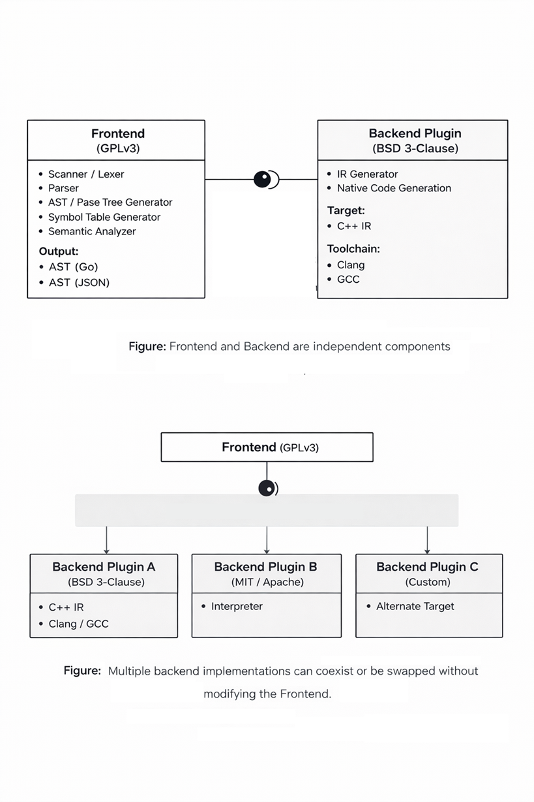
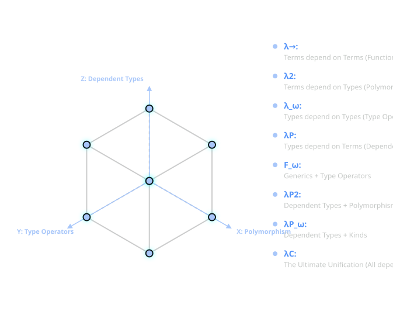

<p align="center">
  
</p>


<a id="folang"></a>
[Foλang](https://github.com/samkrao/folang) is a general-purpose programming language designed to be **expressive, consistent, and extensible**, merging functional fluency with object-centric abstractions.


## Normative Status

This document is the authoritative and normative definition of the FoLang programming language.

All FoLang syntax, semantics, type-system rules, name-resolution rules, execution behavior, and other language requirements are defined by this document.

Every addition, correction, clarification, modification, or extension to the FoLang language must be recorded in this document before it becomes part of the language.

A compiler or other language implementation may use any internal architecture, parser, intermediate representation, runtime, or backend. However, to be identified as a conforming FoLang implementation, its externally observable behavior must adhere to the requirements defined in this document.

When an implementation conflicts with this specification, the specification governs unless the discrepancy is formally accepted and incorporated as a specification revision.

Implementation-specific extensions must be clearly identified as extensions and must not be represented as standard FoLang features unless they have been incorporated into this specification.

### Grammar, Semantics, and Examples

The lexical and syntactic grammar defined by this specification is the authoritative definition of the FoLang source forms accepted by the current language profile. Normative semantic rules define the meaning of those forms and any additional validity constraints that are checked after parsing.

Examples are **illustrative only**. The presence or absence of an example does not enable, disable, reserve, or otherwise modify a grammar production, token, declaration form, operator, or semantic rule. Likewise, an inventory or explanatory table does not create new source syntax unless the specification explicitly defines the corresponding grammar or identifies the spelling as an explicitly reserved future form.

For parser and grammar generation, the governing classification is therefore deterministic:

```text
active lexical/syntactic grammar
    -> accepted and parsed according to the applicable grammar rules

explicitly identified reserved/future form
    -> recognized as language-owned where its reserved spelling is defined
    -> rejected with an unsupported-feature diagnostic in the current profile

all other source text
    -> ordinary lexical or syntax error when it does not match the active grammar
```

### Language Evolution and Compatibility

The alpha period permits experimentation, consolidation, implementation, renaming, syntax changes, and removal. Before version 1.0, a proposed structural feature becomes part of the active language only when a specification revision explicitly incorporates it into the current lexical/syntactic grammar and defines its applicable normative semantics. A proposed or future feature that is mentioned only descriptively does not become active grammar.

Nothing is carried into version 1.0 as implicitly reserved or unsupported merely because it appeared in an example, table, inventory, or design discussion. A spelling is reserved while unsupported only when this specification explicitly identifies that spelling or form as reserved/future syntax.

At version 1.0, the **structural FoLang language surface** closes permanently. After version 1.0, no later major or minor release introduces new core grammar forms, hard/contextual keywords, declaration kinds, operator spellings or fixities, or built-in `@co.*` metadata-form names. Existing structural constructs retain the externally observable semantics defined by the 1.0 specification, except for corrections that restore already-stated intent.

The standard-package rule is narrower and separate. After version 1.0, the `co.*` **package/subpackage hierarchy** is frozen, while ordinary declarations inside those existing packages may evolve through later language-provided `.folenc` artifacts that expose the standard package contexts. Adding or updating an ordinary type, unit-level function, method, module, algorithm, data structure, or other declaration inside an existing package is package-API evolution and does not create new grammar or a new package path.

FoLang remains extensible after 1.0 through extension mechanisms already defined by the 1.0 language, including third-party libraries, user-defined annotations and decorators, macros, custom operators, native integration, including FFI, dynamic-runtime facilities, backend integration points, and other explicitly defined extension mechanisms. Frontend, backend, runtime, optimizer, intermediate representation, diagnostics, compilation strategy, memory management, code generation, performance, and hardware support may evolve provided externally observable FoLang semantics remain conforming.

A post-1.0 correction may fix an implementation/specification discrepancy or remove an internal contradiction when doing so restores the already-stated intent of an existing feature. A correction does not introduce a new grammar form, keyword, declaration kind, operator grammar, metadata-form name, or previously unavailable structural capability.


***


## Lexical Profile and Statement Termination

The consolidated FoLang EBNF referenced by [Appendix A](#appendix-a---complete-folang-ebnf-grammar) is the formal lexical and syntactic grammar. The rules below state the source-level constraints that are useful to programmers and parser implementations without duplicating the complete EBNF in this document.

### Source Encoding and Identifiers

FoLang source text is UTF-8. A U+FEFF byte-order mark is permitted only as the first code point of a source file; U+FEFF anywhere else is an error.

Ordinary FoLang identifiers are ASCII-only. An identifier begins with an ASCII letter, may continue with ASCII letters or decimal digits, and may contain `_` only between two non-empty alphanumeric segments. An identifier cannot begin or end with `_`, cannot contain consecutive underscores, and cannot be the single spelling `_`. The single `_` is a contextual language token whose meanings are defined by the applicable wildcard/discard, filename-derived declaration, parameterized-type-placeholder, and refinement-predicate rules.

After its character sequence is recognized, an ordinary identifier is checked against the reserved-word table. Hard-reserved words are emitted as reserved tokens rather than identifiers. Contextual keywords such as `self` and `forall` are reclassified only in their defined parser contexts.

Examples:

```text
name        valid
myVar2      valid
v1_hr       valid
a_b_c       valid

123hr       invalid: identifier cannot begin with a digit
_x          invalid: identifier cannot begin with underscore
_1          invalid: identifier cannot begin with underscore
a_          invalid: trailing underscore
a__b        invalid: consecutive underscores
_           contextual token, not an ordinary identifier
```

Control labels use a separate apostrophe-prefixed lexical form such as
`'outer`. They are not ordinary identifiers. `'outer:` declares a structured
control label and `'outer` references it; see [Labels and Named Blocks](#labels-and-named-blocks).
A character literal remains distinct because it has a closing apostrophe, for
example `'c'`.

### Numeric Literals

FoLang supports the integer and floating literal families defined by the consolidated EBNF. Numeric digit separators are not part of the current profile, so forms such as `1'000`, `0x1'a`, and `0b1011'0010` are invalid.

A numeric sign is not part of an ordinary numeric literal token. In expressions, unary `+` or `-` is parsed as a prefix operator. Pattern syntax separately permits a leading `+` or `-` before an integer or floating literal.

Integer literals support binary, octal, decimal, and hexadecimal forms together with the suffixes admitted by the grammar. Floating literals support decimal and hexadecimal forms. A radix-point form requires at least one digit on each side of the point: `1.0` and `0.10` are valid, while `1.` and `.10` are invalid. Scientific notation without a radix point, such as `1e5`, remains valid. A backend-conditional floating suffix is accepted only when the selected backend/compiler contract supports the corresponding representation.

### Comments, Whitespace, and Line Breaks

FoLang supports `//` line comments and non-nesting `/* ... */` block comments. A line comment ends before the next CR or LF terminator. A block comment ends at the first following `*/`; an inner `/*` does not nest.

Comments are recognized before ordinary symbolic-run scanning. Spaces, horizontal tabs, form-feed characters, line breaks, and comments are token separators and are discarded between tokens. A line break never terminates a FoLang statement; FoLang has no automatic semicolon insertion.

### Statement and Expression Termination

FoLang uses explicit termination:

```text
simple statement or expression statement    -> terminated by ;
direct block/body                            -> terminated by its closing }
braced expression/literal                    -> } closes the expression, then ; closes its statement
```

A semicolon is required after simple declarations, assignments, compound assignments, calls used as statements, `this.return` statements, expression-bodied function-pattern clauses, object/collection construction expressions used in a statement, generic instantiation declarations, literal expression statements, forward declarations, and other simple declaration forms.

A direct declaration body, function/method body, or block-bodied function-pattern clause terminates at its closing `}` and must not be followed by `;`.

A braced **expression** is different from a direct block/body. Object construction and typed map/collection values still require the enclosing statement's semicolon:

```folang
emp := Employee{id: 1, name: "Rao"};
this.return Employee{id: 1};
cfg := co.core.Map->(key=co.lang.string, val=co.lang.int){"a": 1, "b": 2};
```

Built-in directives, annotations, pragmas, and decorators are self-delimiting metadata applications and do not acquire a trailing semicolon merely because they appear on their own source line.

***

## Design Overview

<p align="center">
  
</p>


FoLang follows a deliberately different approach from conventional programming language designs.
The system is structured to ensure **clear separation of concerns**, **license isolation**, and **extensibility through well-defined integration boundaries**.

***

## Compiler and Backend 

### 1. Frontend

The Frontend is responsible for source-level analysis and semantic processing of FoLang programs.

#### Frontend Components

- Scanner / Lexer
- Parser
- AST / Parse Tree Generator
- Symbol Table Generator
- Installed Standard-Package Loader
- `.folenc` Artifact and Symbol Loader
- Semantic Analyzer

#### Implementation

- Implemented in **Go**
- Uses Go structures internally for AST, symbol-table, and semantic processing.
- The externally consumable frontend output is serialized according to the selected backend's interchange contract.
- The frontend writes that artifact beneath the reserved project-root `build/` domain.
- The backend-supplied contract identifies the supported FoLang/plugin protocol version, HIR schema version, and wire format.
- The backend installs/provides this interchange-contract file in the same installation directory as the FoLang compiler executable.
- The frontend reads that installed backend contract to determine the interchange representation required by the selected backend.
- Canonical `build/` presence, ownership, and source-discovery rules are defined in [Project Layout](#project-layout).

#### License

- **GNU General Public License v3 (GPLv3)**

***

### 2. Backend

The Backend is responsible for transforming validated frontend output into executable artifacts.


> **The default backend must be downloaded or built separately. It is not bundled with the frontend binary.**

#### Backend Components

- Intermediate Representation (IR) Generator
- Native Binary Executable Generation

#### Implementation
    
A backend may be implemented in any language. It consumes the validated frontend artifact from the project-root `build/` directory. The artifact encoding is selected by the backend-supplied interchange contract.

During backend installation, that interchange-contract file is placed in the same installation directory as the FoLang compiler executable. The frontend reads the installed contract to determine the compatible FoLang/plugin protocol version, HIR schema version, and wire format required by the selected backend. The exact artifact basename and format-specific schema/version may therefore vary by backend contract, but the artifact location is always beneath `<project-root>/build/`.

#### Runtime-operation handlers

Backend-neutral HIR may contain a resolved runtime-operation identifier originating from an exported standard declaration marked with `@co.dap.implementation`. The identifier states the required semantic operation, not its target-language spelling or implementation. Each backend owns an internal mapping from supported `co.runtime.operation.*` identifiers to backend handlers.

```text
co.runtime.operation.out.println
    -> reference C++ HIR backend handler
    -> generated call to the reference runtime implementation
```

The reference C++ HIR backend may generate a call to a function declared in a separately maintained C++ header and implemented in a separately compiled C++ source/runtime library. Other backends may lower the same operation to different runtime calls, VM instructions, imports, or target-specific code. Backend headers, implementation filenames, source fragments, and native symbol spellings do not appear in the backend-independent FoLang declaration.

The backend interchange contract must identify the runtime-operation contract version or otherwise provide an equivalent compatibility check. Before code generation, the selected backend must reject any required operation for which it has no compatible handler. A backend handler is selected by the resolved operation ID carried in HIR, not by appending arbitrary target-language text obtained from source annotations.

#### Default / Reference Backend

The default FoLang backend is also the **reference backend implementation**. Its purpose is to provide an executable, inspectable example of how the FoLang specification can be implemented and to give backend implementers a concrete behavioural baseline for conformance testing.

The written FoLang specification remains normative. The reference backend demonstrates the required externally observable semantics, but its internal algorithms, allocation strategy, memory-management choices, data structures, optimization level, and performance characteristics are not themselves language requirements unless this specification explicitly says otherwise. If an implementation defect in the reference backend conflicts with the written specification, the written specification takes precedence.

A third-party backend may use a completely different runtime architecture or memory model and may optimize semantics differently, provided that FoLang programs observe behaviour conforming to this specification. Backend implementations may validate their behaviour against the reference backend and the FoLang conformance tests where applicable.

- Backend orchestration is implemented in **Go**
- Code generation target is **C++**
- Uses **Clang** or **GCC** to generate native binaries from generated C++ IR

#### License 

**Third-party backends may use their own licensing terms and implementation choices.** The default backend uses the following license.
**Default backend is not part of the complete compiler binary and is separate**; it must be downloaded or built separately.

- **BSD 3-Clause License**
***

#### Frontend Output Contract


#### Installed Backend Interchange Contract

The selected backend supplies this contract to tell the frontend which FoLang/plugin protocol, HIR schema, and wire format it accepts. During backend installation, the contract file is placed in the same installation directory as the FoLang compiler executable. The frontend reads it from that installation location. The default backend uses the same mechanism.

```json
{
  "protocol":           "folang-plugin/1.0",
  "hir_schema":         "folang-hir/1",
  "wire":               "protobuf",
  "runtime_operations": "folang-runtime-operations/1"
}
```


The frontend has one fixed **location** contract and a backend-selected **encoding** contract:

```text
<project-root>/build/
    └── <frontend-artifact>    encoding/version selected by backend contract
```

Rules:

- the frontend/backend interchange artifact is written beneath the reserved root-level `build/` domain;
- the selected backend supplies the supported protocol version, HIR schema version, and wire format through its installed interchange-contract file;
- that contract file resides in the same installation directory as the FoLang compiler executable;
- `wire="protobuf"` in the example above means that particular backend contract requests Protocol Buffers; another supported backend contract may request a different compatible wire format/version;
- `runtime_operations` identifies the backend-neutral runtime-operation contract understood by the selected backend;
- backends consume the validated frontend artifact from `build/`;
- canonical filesystem rules for `build/` are defined only in [Project Layout](#project-layout).

***

### Licensing Summary

| Layer    |  Responsibility                           | Implementation                    | License      |
|----------|------------------------------------------|-----------------------------------|--------------|
| Frontend | Parsing and semantic analysis            | Go                                | GPLv3        |
| Backend (default) | IR processing and native code generation | Go (orchestration) + C++ (target) | BSD 3-Clause |


> The copyrightable material in the [FoLang Language Definition and Documentation](#folang-definition-and-documentation-license), including its syntax, grammar, and semantic-rule descriptions, is licensed separately under [CC BY 4.0](https://creativecommons.org/licenses/by/4.0/).
***

### 3. Capability Security Model

FoLang's compiler ships with all language features compiled in but **native capabilities are disabled by default**. The compiler has no hardcoded keys — capability configuration happens entirely at install time. This moves authorization from source code (developer-controlled) to the compiler installation (organization-controlled).

***

#### Capability Domains and Install-Time Gates

| Domain | Features | Default State |
|---|---|---|
| `application` | Ordinary FoLang language/application capabilities, including macros, templates, concurrency/control abstractions, `co.net`, `co.core`, `co.encoding`, `co.crypto`, etc. | ✅ enabled |
| `dynamicvmrt` | application capabilities plus the defined dynamic-runtime / `co.meta` facilities | explicit source capability domain; toolchain policy may restrict availability |
| `native` | Raw pointers/references/addresses, pointer arithmetic, `@co.dap.native`, `co.native`, `co.sys.unsafe`, MMIO, heap allocators, low-level platform/runtime implementation, `co.sys.ffi`, extern declarations/types, foreign symbols, calling conventions, linkage, C/native ABI work, and ABI-compatible `cstruct` values | 🔒 disabled by default — requires install-time configuration |

`packaged` is an exposure model using application capabilities, not a separate privileged capability domain.

***

## Quick Start

### Hello World

```folang
// src/appl.fol — fixed application entry file, no annotation needed
co.out.println("Hello FoLang!");
```

Or with an alias for shorter form:

```folang
@co.ddap.alias(co.out, as="out")

out.println("Hello FoLang!");
```

## Variables

```folang
// typed
name co.lang.string = "Rao";
age  co.lang.int    = 30;

// inferred from value — := errors if already declared
name := "Rao";
age  := 30;

// define, infer, and assign if not defined; otherwise assign a new value
name ?= "Kumar";
```

`co.lang.string` and `co.lang.int` are built-in data types. For more information, see [Builtin Data Types](#builtin-data-types).

`=`, `:=`, and `?=` are built-in operators. For more information, see [Builtin Operators](#builtin-operators).

## Constants and Immutability

FoLang separates two properties that are often confused. One is about *when* a
value is known. The other is about *whether* it can change.

```folang
// compile-time constant — value known while compiling, substitutable
@co.dap.const SIZE co.lang.int = 1024;

// immutable binding — cannot be reassigned, value need not be known early
@co.dap.final startedAt co.lang.int = co.sys.now();
```

| Annotation | Guarantees | Value known at compile time | Usable as an index |
|---|---|---|---|
| `@co.dap.const` | value is fixed and known while compiling | ✅ | ✅ |
| `@co.dap.final` | binding cannot be reassigned | ❌ not required | ❌ |

Every `@co.dap.const` is also immutable. The reverse does not hold: a
`@co.dap.final` binding may be initialised from a function call, a file, or
user input, so the compiler cannot substitute a literal for it.

`@co.dap.final` is the declaration-site form of the immutable object kind
described in the object mutation policy. `makeImmutable` applies the same
property to a value at run time.

Outside a declaration whose signature binds a dependent index parameter, only
`@co.dap.const` may supply a named array size or dependent type index. A
signature-bound index name is permitted symbolically even when its concrete value is
supplied by the caller. See [Dependent Type Index Rules](#dependent-type-index-rules).

## Single Source Application File 

FoLang developers can create a complete executable program in one source file. A **single-source application** is an application whose entry file contains the complete program and does not depend on user package source files.

A single-source application file and an application entry file are the same fixed structural source, `src/appl.fol`, and use the same entry-file grammar, context, and restrictions. A project is a single-source application when `src/appl.fol` contains the complete program and there are no application package directories below `src/`. This section presents the allowed constructs, so a developer can start programming without first reading the complete specification.

> For the single-source application layout, see [Project Layout](#project-layout).

#### Allowed Constructs

The application file may contain:

- built-in directives that are valid for an entry file; directives occupy the entry-file metadata preamble and cannot appear inside any declaration or block
- built-in `@co.pdap.*` pragmas; `src/appl.fol` is the only FoLang source location in which pragmas are permitted
- package and library imports
- import aliases declared with `as=`
- file-local aliases for `co.*` paths declared with `@co.ddap.alias`
- type aliases and ADTs declared with `co.lang.type`
- parameterized `co.lang.type` constructors such as `Option(T) co.lang.type = co.lang.variants(Some(T), None())`
- new types declared with `co.lang.newtype`
- opaque types declared with `co.lang.opaquetype`
- dependent-type aliases and dependent-type usages that do not declare an ordinary or type-level function
- refinement-type declarations
- subtype declarations
- supertype declarations
- non-capturing entry-local function-pattern groups
- capturing entry-local `let` function-pattern groups
- variable declarations, initialization, assignment, and mutation
- calls to built-in methods and functions
- calls to imported package and library APIs
- ordinary expressions
- comprehensions
- ternary expressions
- conditions and loops
- containment operations such as `contains`
- iterators such as `each`
- pattern matching and destructuring

```appl.fol

  a co.lang.int = 10;
  b co.lang.int = 20;

  co.out.println( a + b);

```
***
> `co` is a reserved word in FoLang. For more information, see [Reserved Words](#reserved-words).

> `co` is the built-in root package in FoLang. For more information, see [Builtin Packages](#builtin-packages).

> `a + b` is an expression in FoLang.

> For the expression rules, see [Expressions](#expressions).

#### Built-in and Imported Names

All `co.*` paths are always available.

A developer may use the complete built-in path:

```folang
co.out.println("Hello");
co.core.List.of(1, 2, 3);
```

A developer may optionally create a file-local alias:

```folang
@co.ddap.alias(co.out, as="out")
@co.ddap.alias(co.core.List, as="list")

out.println("Hello");
values := list.of(1, 2, 3);
```

Creating an alias does not hide the complete `co.*` name; both forms remain valid in that file.

Third-party packages, user packages, and libraries are not automatically available. They must be imported using `@co.ddap.import`. When `as=` is present, the imported API is accessed through that alias. When `as=` is omitted, the complete imported package or library path must be used.

```folang
@co.ddap.import(package="hr.employee", as="emp")
first := emp.EmployeeService.find(1001);

@co.ddap.import(package="finance.payroll")
second := finance.payroll.calculate(request);
```

A developer must import a package before using it.

> `@co.ddap.import` and `@co.ddap.alias` are built-in directives. For more information, see [Built-in Directives](#built-in-directives).

> For more information about FoLang imports, see [Import Details](#imports). 

> `println` is a built-in method on the `co.out` object.

### Variable Kinds

FoLang supports several variable kinds for different purposes. Their availability is context-dependent; a developer cannot use every variable kind in every location. 
For the contexts in which each kind is supported, see [Variable Kind Support](#variable-kinds-support). 

### Simple Variable Declaration

```folang
someVar co.lang.int;
someString co.lang.string;
```

### With Initialization

```folang
someBool co.lang.bool = co.const.true;
someInt co.lang.int = 42;
```

### With Type Inference

```folang
someVal := "Hello, World!";
someNum := 3.14;   // if not defined, define and initialize; else throws error
someR ?= "Kamesh"; // if not defined, define and initialize; else reassign
```

### Alpha Character and String Literals

The alpha release accepts only the basic literal subset:

```folang
message := "hello";
letter := 'A';
```

A string is unprefixed, remains on one source line, and cannot contain a
backslash or an embedded double quote. A character literal contains exactly
one non-backslash character.

Encoding prefixes, escaped characters, raw strings, and universal character
names are reserved for a later release. The scanner recognizes the complete
spelling and reports an unsupported-feature error instead of tokenizing it as
several unrelated expressions. For example, all of these are rejected:

```folang
x := "quoted: \"text\"";
x := '\n';
x := u8"hello";
x := R"(raw text)";
x := '\N{LATIN CAPITAL LETTER A}';
```

### Pointer Declaration

```folang
somePtr    co.lang.int->(*);
someDblPtr co.lang.int->(**);
someDeepPtr co.lang.int->(*****);
```

The number of consecutive `*` characters is the pointer degree. Any positive
degree is permitted; `*` and `**` above are common examples, not a maximum.

### Array Declaration

```folang
someArray       co.lang.int->([5]); // single dimension
someDblArray    co.lang.int->([2,3]); // multi dimension
someJaggedArray co.lang.int->([2][3]); // jagged
someVLArray     co.lang.int->([...]); // variable length
someZeroLA      co.lang.int->([0]); //zero length array
someZeroDimA    co.lang.int->([.]); // zero-dimensional array
```

### Array Declaration with Initialization

```folang
someInitializedArray    co.lang.int->([3])  = [1, 2, 3];
someInitializedArray1   co.lang.int->([])   = [1, 2, 3];
someInitializedDblArray co.lang.int->([,])  = [[1, 2], [3, 4]];
```

### Reference Declaration

```folang
someRef       co.lang.int->(&);    // reference
someLValueRef co.lang.int->(&&);   // LValue reference
someHpRef     co.lang.int->(~);    // heap allocated reference
someAddr      co.lang.int->(@);    // address
someThunk     co.lang.int->(^);    // thunk
someSlice     co.lang.int->([:]);  // slice
```

### Range Declaration

```folang
// Typed range variable declaration
someRange co.lang.int->(..);

// Inferred range declarations
rangeI := 1 .. 10;      // [1, 10]   ExcludeStart=false, ExcludeEnd=false
rangeS := 0 <.. 5;      // (0, 5]    ExcludeStart=true,  ExcludeEnd=false
rangeL := 0 ..< 100;    // [0, 100)  ExcludeStart=false, ExcludeEnd=true
rangeB := 0 <..< 100;   // (0, 100)  ExcludeStart=true,  ExcludeEnd=true
rangeE := .. 100;      // open lower bound  (_, 100]
rangeF := 1 ..;        // open upper bound  [1, _)
```

### Auto and Dynamic Variable Declaration

```folang
someAutoVar    co.lang.auto    = "Hello"; // type inferred from value; initialization required
someDynamicVar co.lang.dynamic;           // dynamic typing
```
### Lazy

```folang
@co.dap.lazy
x = add(1, 2);  // evaluating/using x invokes add(1, 2); until then the right-hand function is not invoked
```

### Bind Variables

`$[1-9][0-9]*`

Bind variables are available in function-chaining expressions. At each chained call,
`$1`, `$2`, `$3`, ... denote the return components of the **immediately preceding
function invocation**, in declared return order. If the preceding function returns one
value, only `$1` is available for that step; if it returns multiple values, `$1` through
`$N` correspond to those return values. `$0` is not a bind variable.

```folang
dosomething(a co.lang.int, b co.lang.int)->(co.lang.int)
    =>> somePack.someMethod(a)
    =>> someOthPack.someOtherMeth($1, b);

// If previous() returns (A, B, C), the next chained call may consume
// those return components as $1, $2, and $3 respectively.
previous()
    =>> consume($1, $2, $3);
```

### Discard / Wildcard Variable

`_`

`_` is contextual rather than an ordinary identifier. In discard/wildcard positions it
means "ignore this binding or match position." It is also used as the
filename-derived primary-declaration placeholder and as an unnamed type-parameter
slot in parameterized-type forms such as `F(_)`. In the predicate of a
`co.lang.refinementType` declaration, `_` instead denotes the candidate value of the
base type being tested. See [Refinement Types](#refinement-types).

### Comma and Grouping

```folang
// Comma
x co.lang.int = 10, y co.lang.string = "Hello", z co.lang.bool = co.const.true;

// Grouping
(x co.lang.int = 10, y co.lang.string = "Hello", z co.lang.bool = co.const.true);

// Tuple/grouping expression
pair := (x, y);
```

A comma inside a parenthesized expression or grouped declaration must introduce
another expression or declarator. Therefore `(x,)`, `(x, y,)`, and
`(x co.lang.int = 10,)` are invalid. Collection literals have their own rules
and may permit a trailing comma where their production says so. Record patterns
also require another field after every comma; `Employee{id: value,}` is invalid.

***

## Fat Pointers

```folang
x co.lang.int->(*, kind="", meta={});

co.lang.int->(*, meta={});

y co.lang.int->(*, meta={len:co.lang.usize, vtab:somepkg.VTable->(*)});

z co.lang.int->(*,kind=region, meta={});
```

```
Pointer
├── base_type: T
├── kind: <FatKind>
│    ├── thin
│    ├── slice
│    ├── relative
│    ├── trait
│    ├── buffer
│    ├── view
│    ├── opaque
│    ├── custom
|    ├── mem
|    ├── nullptr
|    ├── sptr
|    ├── uptr
|    ├── ptrdiff
|    ├── usize
|    ├── ssize
│    └── (region)  ← optional syntactic sugar
└── meta:
     ├── region: heap | stack | global | numa(N) | mmio | constant | …
     ├── len, cap, vtab, bits, endian, …
```

### Pointers for address manipulation

```folang
y co.lang.word->(repr=intptr);
z co.lang.word->(sign=unsigned, repr=uintptr);
p co.lang.word->(repr=ptrdiff);
n co.lang.word->(sign=unsigned, repr=usize);
m co.lang.word->(repr=isize);
o co.lang.void->(repr=nullptr);
```

### Relative Pointers

```folang
z co.lang.int->(*,kind=relative, meta={});
```
***

**Note** Other than normal variable declaration rest have restrictions

## Conditions, Loops and Iterators

### Conditions

`then` is the one-shot conditional branch verb. Its argument may be a block or an ordinary value/expression. `otherwise(condition)` always introduces another Boolean condition; a conditionless `otherwise` form does not exist. `default(result)` is the optional terminal fallback and may likewise receive a block or value.

```folang
(boolean truth).then({
}).otherwise(boolean truth).then({
}).default({
});

//conditionEg1.unit.fol

_ co.lang.unit = {

    someFun()->()={

        x := co.const.true;

        x.then({

        }).default({

        });
    }

    someOtherFun()->()={

        (co.const.true).then({  //parenthesis mandatory

        }).default({

        });
    }

    someOtherFun1()->()={
        x co.lang.bool =co.const.true;
        (x).then({   // parentheses optional

        }).default({

        });

    }

    someOtherDiffFun1()->()={

        x co.lang.int=10;
        y := 30;

        (x > y).then({     // parentheses around (x > y) are mandatory

        }).otherwise(x < y).then({

        }).default({

        });
    }
}


```

### Loops

`loop` is the repeated-execution verb and always has exactly one loop condition and one loop body. Unlike `then`, a `loop(...)` form cannot participate in an `otherwise(condition)` chain, and `default(...)` cannot follow a loop. When the loop condition is false, whether on the first test or after one or more iterations, the loop simply terminates.

To choose between different looping behaviours, first use a `then` / `otherwise(condition)` / `default` selection chain and place the required ordinary loop inside the selected block. The selection chain chooses a behaviour; each nested `loop(...)` then performs repetition using only its own condition.

```folang
(boolean truth).loop({
});


//loopsEg1.unit.fol

_ co.lang.unit = {

    someFun()->()={

        x := co.const.true;

        x.loop({
        });
    }

    someOtherFun()->()={

        (co.const.true).loop({  //parenthesis mandatory
        });
    }

    someOtherFun1()->()={
        x co.lang.bool =co.const.true;
        (x).loop({   // parentheses optional
        });

    }

    someOtherDiffFun1()->()={

        x co.lang.int=10;
        y := 30;

        (x > y).loop({     // parentheses around (x > y) are mandatory
        });
    }
}

```
```folang
//loopsEg2.unit.fol

_ co.lang.unit = {

    someFun()->()={

        x := co.const.true;
        v := 0;
        x.loop({
            (v == 10).then({
                this.break;
            });
            v += 1;
        });
    }

    someOtherFun()->()={
        v := 20;
        (co.const.true).loop({  //parenthesis mandatory
            (v == 30).then({
                this.continue;
            });
            v += 5;
        });
    }

    
}

```

***

### Combining Conditions and Loops

A loop does not become a branch verb inside an `otherwise(condition)` chain and has no `default(...)` fallback of its own. When a program must choose between different looping behaviours, the selection is expressed separately with `then` / `otherwise(condition)` / `default`, and each selected block may contain its own ordinary single-condition loop.

```folang
(first condition).then({
    (first loop condition).loop({
        ...
    });
}).otherwise(second condition).then({
    (second loop condition).loop({
        ...
    });
}).default({
    ...
});
```


### Ternary Operator

The ternary/value form uses the same `then` / `otherwise(condition)` / `default` selection vocabulary as block conditionals. Only the branch arguments differ: a value-producing chain supplies values or expressions instead of statement blocks.

```folang
s = (boolean truth).then(some var/value).default(some val/var);
s = (boolean truth).then(some var/val).otherwise(boolean truth).then(some var/val).default(some var/val);

//TernaryExample.unit.fol

_ co.lang.unit = {

    someFunction()->()={

        s := (co.const.true).then(20).default(10);
        y co.lang.int;
        z co.lang.int=20;
        y ?= (co.const.true).then(20).default(z);


    }

    someOtherFunction()->()={

        k co.lang.int=10;
        p co.lang.int =20;
        s ?= (k>10).then(30).otherwise(k<10).then(p).default(10);

    }
}

```

#### Parenthesizing the chain head

A conditional or ternary selection chain is a sequence of postfix method calls using
`.then(...)`, `.otherwise(condition)`, and optional terminal `.default(...)`.
A loop uses the same postfix-call style but is a single-condition repetition form:
`.loop(...)` cannot be followed by `.otherwise(condition)` or `.default(...)`.

These calls always carry their own call parentheses, whatever the argument is.
Nothing about the argument changes that.

`otherwise` always has the form `.otherwise(condition)` and therefore never acts as a terminal else marker. The terminal fallback is `.default(...)`; its argument may be a block or a value/expression according to the applicable form.

The only place a choice exists is the **head**: the subject before the first
`.then(...)` or `.loop(...)` call. The head must already be a complete postfix
expression that cannot absorb the following control verb.

| Chain head | Parentheses | Why |
|---|---|---|
| `x` | optional | an identifier is already a complete postfix expression |
| `arr[0]`, `f()` | optional | index and call suffixes are postfix too |
| `co.const.true`, `myPkg.flag` | **required** | a qualified name would absorb `.then` as a further segment, giving `co.const.true.then` |
| `x > y` | **required** | `.then` binds tighter than `>`, so `x > y.then({...})` groups as `x > (y.then({...}))` |

A qualified name needs parentheses whether it names a literal or an identifier,
so `myPkg.flag` is the same case as `co.const.true`.

```folang
x.then({ ... });                                       // head is an identifier
(co.const.true).then({ ... });                         // head is a qualified name
(x > y).then({ ... }).otherwise(x < y).then({ ... });    // head is an expression
(k > 10).then(30).otherwise(k < 10).then(p).default(10);
```

In the last two lines the parentheses after `.otherwise` are its call
parentheses, not an application of this rule.


### Iterating Arrays / Lists / Maps / Ranges

`each` is itself the element-iteration operation. It does not produce a value
that must subsequently be passed to `loop`, and `.loop(...)` must not follow an
`each(...)` call.

The explicit-binding form takes the index/key binding, the value binding, and
the per-element action directly. The action may be a block or any ordinary
expression valid in that position. A callable may also be supplied directly as
the sole callback argument; the callable receives the receiver's defined
iteration tuple. A lambda is a callable callback and is permitted directly in
this collection-operation context.

```folang
arr co.lang.int->([5]) = [6,7,8,9,10];

// block action
arr.each(idx, val, {
    co.out.print(idx);
    co.out.print(" :: ");
    co.out.println(val);
});

arr.each(_, val, {
    co.out.println(val);
});

// expression action — evaluated once for each element
arr.each(_, val, co.out.println(val));

// direct callable callback — receives the receiver's iteration tuple
arr.each(printItem);

// direct lambda callback
arr.each(|idx, val| => co.out.println(val));
```

The explicit-binding form establishes its bindings separately for every
iteration and evaluates its action exactly once for that element. The action is
therefore the body of `each`; `each` never participates in a `then`,
`otherwise`, `default`, or `loop` chain. In the single-argument callback form,
the argument must resolve to a callable compatible with the receiver's
iteration tuple.

### Array / List / Map / Range — Contains Element

```folang
arr co.lang.int->([5]) = [35,57,96,81,31];
k co.lang.int = 31;
arr.contains(k).then({
    co.out.println(k);
}).default({
    co.out.println("Not Found");
});
```

### Comprehensions

```folang


k := (1 .. 10).filter(|x| => x % 2 == 0).map(|x| => x * x);

result := for (x <- co.core.List->(co.lang.int)[1,2,3]).yield(x * 2);         // co.core.List->(co.lang.int)[2, 4, 6]
result := for (x <- co.core.Set->(co.lang.int)(1,2,3)).yield(x * 2);          // co.core.Set->(co.lang.int)(2, 4, 6)
result := for (x <- Some(5)).yield(x * 2);             // Some(10)
result := for (x <- fetchData()).yield(x.process());   // Future

ages := co.core.Map->(key=co.lang.string, val=co.lang.int){"A":30,"B":40,"c":66,"e":88};
upper := for ((name, age) <- ages).yield(name.toUpperCase, age);
```

***
### Pattern Matching

```folang
x co.lang.int = 10;

x.match.case(n: n > 10 => { n = n+100; "GT" }).case( n: n < 10 => "LT").default("EQ");
x.match.case(n: n > 10 => { n = n+100; "GT" }).case( n: n < 10 => "LT").case(_=>"EQ");
x.match(co.pattern.Type).case(co.lang.int => ...).case(co.lang.float => ...);
x.match(co.pattern.Value).case(0 => ...).case(1 => ...);
x.match(co.pattern.Instance).case(xx.CAT => ...).case(xx.DOG => ...).default("Animal");
x.match(co.pattern.Object).case(xx.Ball => "Ball").case(xx.CAT => "CAT").default("Unknown");
x.match(co.pattern.Shape).case(Point{x, y} => ...).default(...);

x.match(co.pattern.Any).case(co.lang.int => ...).case(co.lang.float => ...).case(0 => ...).default( ...);

x.match(PositiveEvenMatcher).case(0 => "Neither even nor odd").case(2 => "First Even Prime").default(...);
```

A match chain contains one or more `.case(...)` arms followed by at most one
terminal `.default(...)` arm. `.otherwise` is not a match arm; it always introduces
another Boolean condition in conditional `then` chains. Loops do not participate in `otherwise(condition)` chains. `default` is the common terminal
fallback vocabulary for Boolean selection and match/case selection. A case or default
result may itself be a ternary then expression, and that nested expression may consequently
contain `.default(...)`.

For value dispatch, `match().case(...).default(...)` is also FoLang's generalized analogue of a traditional `switch` / `case` / `default` construct; match cases additionally support the pattern, type, object, and custom-matcher forms defined by this specification.


#### Matcher Selection

FoLang distinguishes automatic matcher selection from explicit matcher selection by whether `.match` receives an argument:

```folang
value.match.case(...).default(...);      // automatic/default matcher selection
value.match().case(...).default(...);    // same: no matcher argument
value.match(co.pattern.Type).case(...);  // explicit matcher
value.match(PositiveEvenMatcher).case(...).default(...); // explicit custom matcher
```

`.match` and `.match()` are equivalent no-argument forms. When `.match(matcher)` supplies an expression, that expression explicitly identifies the matcher. A user-defined matcher follows the ordinary matcher declaration, import, and name-resolution rules.

> `_` is a special discard/wildcard variable. In a call it is permitted only as
> the first, index/key binding of the explicit receiver-qualified `.each` form,
> as in `items.each(_, value, { ... })`. Transparent grouping around the member
> callee, for example `(items.each)(_, value, { ... })`, does not change this
> rule. The value binding and the iteration-action argument of `each` cannot be
> discarded, and `contains(_)` and `containsVal(_)`
> are invalid because containment must compare a real value. Patterns and the
> filename-derived declaration-name form, parameterized-type placeholder forms such as
> `F(_)`, and refinement-type predicates give `_` their own explicitly described
> meanings. In a refinement predicate, `_` denotes the candidate value being tested;
> it is not a general expression identifier.

> `PositiveEvenMatcher` is a custom matcher. For more information about defining custom matchers, see [Custom Matcher](#matchers).

### Type Declarations

```folang
// Alias
x co.lang.type = co.lang.int;

// New
x co.lang.newtype = co.lang.int;

// Opaque
EmpIdType co.lang.opaquetype = co.lang.int;
DeptIdType co.lang.opaquetype = co.lang.int;

empId EmpIdType = 10;          // valid: base representation is accepted when constructing EmpIdType
deptId DeptIdType = 20;        // valid

empId = deptId;                // invalid: distinct opaque types are not assignment-compatible
empId2 EmpIdType = empId;      // valid: same opaque type

x co.lang.int = empId;         // invalid: an opaque value does not implicitly become its base type


// ADT (tagged union)
y co.lang.type = co.lang.int | co.lang.char;

// Proper subtypes of Employee; Employee itself is excluded.
// Employee is a class.
empSubType co.lang.subtype = somePackage.Employee;

// PermanentEmployee inherits Employee.
permanentEmp empSubType = PermanentEmployee{};      // valid: proper subtype

// ContractualEmployee inherits Employee.
contractualEmp empSubType = ContractualEmployee{};  // valid: proper subtype

dancerEmp empSubType = DashingDancer{};            // compiler error: not a subtype of Employee
baseEmp   empSubType = Employee{};                  // compiler error: Employee itself is excluded

// To accept Employee itself together with all proper subtypes:
empPlusType co.lang.type = empSubType | Employee;

// Proper supertypes of Toyota; Toyota itself is excluded.
superToyota co.lang.supertype = somePackage.Toyota;

// somePackage.Toyota extends somePackage.Car extends somePackage.FourWheeler extends somePackage.Vehicle

toyota  superToyota = somePackage.Toyota{};        // compiler error: Toyota itself is excluded
car     superToyota = somePackage.Car{};           // valid
four    superToyota = somePackage.FourWheeler{};   // valid
vehicle superToyota = somePackage.Vehicle{};       // valid
truck   superToyota = somePackage.Truck{};         // compiler error: not a supertype of Toyota

// To accept Toyota itself together with all proper supertypes:
superToyotaPlus co.lang.type = superToyota | somePackage.Toyota;


// Refinement type
positiveInt co.lang.refinementType = (co.lang.int).where(_ > 0);

percentage co.lang.refinementType =
    (co.lang.int).where(_ >= 0 && _ <= 100);

evenInt co.lang.refinementType =
    (co.lang.int).where(_ % 2 == 0);

nonEmptyString co.lang.refinementType =
    (co.lang.string).where(_.length > 0);

// Inside a refinement predicate, _ denotes the candidate value of the base type.

```

> For the normative refinement-type rules, see [Refinement Types](#refinement-types).

For `co.lang.opaquetype`, the declared base type supplies the representation accepted
where opaque-type construction permits it, but the resulting opaque type has distinct
type identity. Distinct opaque types are not assignment-compatible merely because they
share the same base type, and an opaque value is not implicitly assignable back to its
base type. Thus `x co.lang.int = empId;` is invalid when `empId` has type `EmpIdType`.

#### `co.lang.subtype` and `co.lang.supertype`

`co.lang.subtype` and `co.lang.supertype` define type sets for these two declaration
kinds only. Their semantics do not define or replace inheritance, interface, generic,
object-model, variance, or other assignability rules elsewhere in FoLang; those
facilities retain their own independently defined semantics.

A declaration of the form:

```folang
TSub co.lang.subtype = BaseType;
```

defines a type whose admissible values have concrete types that are **proper
transitive subtypes** of `BaseType`. `BaseType` itself is excluded. Direct and indirect
subtypes are included, while unrelated types are excluded.

To admit `BaseType` itself together with those proper subtypes, form an explicit union:

```folang
TSubPlusBase co.lang.type = TSub | BaseType;
```

A declaration of the form:

```folang
TSuper co.lang.supertype = BaseType;
```

defines a type whose admissible values have concrete types that are **proper
transitive supertypes** of `BaseType`. `BaseType` itself is excluded. Direct and
indirect supertypes are included, while unrelated types are excluded.

To admit `BaseType` itself together with those proper supertypes, form an explicit
union:

```folang
TSuperPlusBase co.lang.type = TSuper | BaseType;
```


### Canonical Object and Collection Construction

A user-defined object/struct/class value is constructed with an explicit type followed immediately by a braced field initializer:

```folang
b := B{age: 25.0};
emp := Employee{name: "Rao", id: 1};
point := Point{x: 10.0, y: 20.0};
```

Object field initializers use `:` between the field name and value and `,` between fields. `=` is not an object-field initializer binder. There is no untyped UDT object literal; an object value must name its type. Thus `Employee{name: "Rao"}` is valid, while `{name: "Rao"}` is not an Employee construction.

Built-in collection construction follows exactly the two current-alpha forms defined in [Generics](#generics):

```folang
// declared generic collection type; constructor does not repeat the arrow tail
x co.core.List->(co.lang.string) = co.core.List["A","B","C"];
y co.core.Set->(co.lang.int) = co.core.Set(1,2,3);
map co.core.Map->(key=co.lang.string, val=co.lang.int) = co.core.Map{"A":1,"B":2};

// type-deduced declaration; constructor supplies its generic arguments explicitly
x := co.core.List->(co.lang.string)["A","B","C"];
y := co.core.Set->(co.lang.int)(1,2,3);
map := co.core.Map->(key=co.lang.string, val=co.lang.int){"A":1,"B":2};
```

There is no third collection-constructor inference form. An untyped `{ ... }` map literal is not a FoLang value. An array literal such as `[1,2,3]` remains an untyped simple literal and needs no type prefix.

Without an explicit arrow tail, `Type{...}`, `Type[...]`, and `Type(...)` are interpreted contextually. A supported collection type may use its registered collection body form where the surrounding typed declaration already supplies the generic arguments; otherwise these spellings retain their ordinary object-construction, index, or call meanings. An explicit `Type->(...)` generic instantiation removes that overlap before the following collection body is parsed.

Only `co.core.List`, `co.core.Set`, and `co.core.Map` have current-alpha collection-constructor body forms. Other built-in collection names do not inherit those body forms unless the specification explicitly defines them.


***

### Let Bindings

```folang
y co.lang.int = let({x = 10}).in({x + 1});
y co.lang.int = let({$ = 10}).in({$ + 1});  // $ refers to the value being defined

x co.lang.int = (x + 1).where(x = 10);
x co.lang.int = ($ + 1).where($ = 10);

offset := 100;

let adjust(0) = offset;
let adjust(n) = n + offset;
```

> `$` is a special identifier usable in ordinary `let` binding expressions for recursive or self-referential expressions.
>
> Ordinary `let` value-binding expressions remain available in language contexts that permit them, but they are forbidden directly in the application entry file. In the entry file, `let` is reserved exclusively for a named function-pattern group that captures at least one surrounding runtime binding. It cannot introduce an anonymous function, a general closure value, or a curried function.

***

### Function Pattern

```folang

Option(T) co.lang.type = co.lang.variants(Some(T), None());

f(Some(x)) => { this.return x + 1; }
f(None())  => { this.return 0; }

// desugars to:
f(v Option(co.lang.int))->(co.lang.int) = {
    this.return v.match()
        .case(x: Some(x) => x + 1)
        .case(_: None() => 0);
}
```

`=>` introduces a bare function-pattern clause. `=>>` is the distinct function-delegation operator, while `==>>` is the closure/curry expression; neither introduces a function pattern.

Function-pattern groups are permitted in the application entry file as restricted entry-local dispatch helpers. A bare group cannot capture surrounding runtime variables. A `let` function-pattern group must capture at least one already initialized entry-file runtime binding and is the only entry-file construct that permits such capture. Neither form permits ordinary function declarations, anonymous functions, general closure values, currying, partial application, or escape as a function value.

> For more information about `let` and function patterns, see [Function Pattern](#function-pattern).

> A single-source application file is useful for testing FoLang and becoming familiar with the language.
> Real-world applications normally contain more than a single source file. They use abstraction, encapsulation, inheritance, polymorphism, and other language features, and they often depend on external packages and libraries to establish clear boundaries. At minimum, such applications require the following structural features:

   1. [package source files](#package-source-files) under [packages](#package-in-detail)
   2. [Entry File](#application-entry-file)
   3. [Libraries](#libraries) and [Project Layout](#project-layout)
   4. [imports](#imports)

Foλang supports many features for developing enterprise applications. The following list should be read together with the language [intent](#folang) and [FoLang Philosophy — Uniform Object Model](#folang-philosophy-uniform-object-model).

Complete feature list:

   1. [Project Layout](#project-layout)
   2. [Packages](#packages)
   3. [UDT](#udt-user-defined-data-types)
   4. [Functions](#functions)
   5. [Units](#units)
   6. [Imports](#imports)
   7. [Macros](#macros)
   8. [Templates](#templates)
   9. [Annotations and Decorators](#annotations-and-decorators)
  10. [Type Classes](#type-classes)
  11. [Types](#types)
  12. [Generics](#generics)
  13. [Matchers](#matchers)
  14. [Lambdas](#lambda)
  15. [Execution Models and Control Abstractions](#execution-models-and-control-abstractions)
  16. [Extensions](#extension-methods)
  17. [Native code and foreign interop](#native-code-and-foreign-interop-native-capability)
  18. [Indexers](#indexer)
  19. [Refinement Types](#refinement-types)
  20. [Predicate Types](#predicate-types)
  21. [Dependent Types and Type-Level Functions](#dependent-types)
  22. [Dynamic Runtime](#dynamic-runtime-dynamicvmrt-capability)
  23. [Local/Nested Types and Functions](#local-andor-nested-types-and-functions)
  24. [Libraries](#libraries)
  25. [Components](#components)
  26. [Packaged Component](#packaged-component)
  27. [Operators](#operators)
  28. [Runtime-Operation Declarations](#runtime-operation-declarations)
  29. [Forward / Extern Declarations](#forward-extern-declarations)
  30. [Labels and Named Blocks](#labels-and-named-blocks)
  31. [Reflections](#reflections)
  32. [Comprehensions](#comprehensions)

***

In FoLang, file-backed primary declarations use their own `<Name>.fol` files. Package functions and non-UDT type declarations are grouped in any number of `*.unit.fol` files, while struct-associated behavior is placed in `<StructName>.comp.unit.fol`. These are all [package source files](#package-source-files).
The following sections begin with the canonical project layout and package model before moving to UDTs and functions.


## Project Layout

This section is the **single canonical definition of FoLang project filesystem structure**. It defines the project-root domains, their allowed direct contents, structural source files, component slots, package roots, and artifact locations. Later sections describe application, library, component, packaged/export, operator, import, and compilation semantics without redefining these filesystem rules; they link back here when structural context is needed.

### Compilation Invocation

The compiler is invoked with the project root:

```text
folangcc <project-root>
```

The basename of the canonical project-root directory is the logical project name and the default output basename.

### Root Domains

A FoLang project uses four standardized root domains:

```text
<project-root>/
├── src/          <- mandatory primary project source
├── components/   <- optional project-owned isolated/specialized source
├── lib/          <- optional developer-managed compiled dependencies
└── build/        <- compiler-managed generated output
```

These names are compiler-defined filesystem domains. They are not packages and never contribute package-name components.

| Root domain | Presence | Allowed direct content | Not allowed |
|---|---|---|---|
| `src/` | mandatory, non-empty | exactly one primary surface (`appl.fol` or `component.fol`) plus package directories | both primary surfaces, no primary surface, any other direct file |
| `components/` | executable application: optional; projected application library: optional only as `components/operators/`; every other standalone library: forbidden | application component kinds listed below, or the single `operators/` exception for a projected application library | unknown immediate child, empty component root, or any component tree forbidden by the project kind |
| `lib/` | mandatory and non-empty for ordinary projects | direct `co.folenc` plus zero or more direct `<name>.folenc` compiled dependency artifacts | missing/duplicate `co.folenc`, FoLang source files, or non-`.folenc` project content |
| `build/` | compiler-managed | generated frontend/backend artifacts | source/package discovery input |

If `components/` is unused, it is omitted rather than created empty. `lib/` remains present for `co.folenc` even when the project has no other compiled dependency. `build/` may be absent before compilation; the compiler creates/manages it as needed. The compiler's own bootstrap build of `co.folenc` is the sole exception to the ordinary requirement that `lib/co.folenc` already exist.

### `src/` — Primary Project Source

`src/` contains exactly one primary project surface:

```text
src/appl.fol
```

or:

```text
src/component.fol
```

The two are mutually exclusive:

- `src/appl.fol` classifies the project as an executable application;
- `src/component.fol` classifies the project as a standalone distributable component project;
- both present -> compile-time project-layout error;
- neither present -> compile-time project-layout error.

No other file may occur directly in `src/`. Every other direct entry under `src/` must be a non-empty package directory containing valid FoLang package source. Ordinary project package dot paths begin below `src/`.

Every `src/component.fol` contains exactly one `_ co.lang.component = { ... }` structural declaration. The source then selects one of two mutually exclusive standalone exposure models:

1. **projected library** — `@co.dap.library` annotates the component declaration. Omitted `type` means `application`; explicit projected kinds are `application`, `dynamicvmrt`, and `native`;
2. **packaged library** — no `@co.dap.library` is present, and the component body contains the applicable `@co.dap.export(packages={...})` selector. Selected `src/` package contexts are the distributable open-package surface.

`native` and `dynamicvmrt` standalone libraries are always projected and therefore require `@co.dap.library(type=...)`; they cannot use the packaged exposure model. Standalone libraries do not use project-local components as a library-composition mechanism: reusable dependencies belong in `lib/` and are consumed as standalone libraries. The sole structural exception is a projected **application** library, which may contain exactly one optional project-local component kind, `components/operators/`, because custom operator syntax must be registered while compiling that library's own source. A projected application library may not contain `components/application/`, `components/native/`, `components/dynamicvmrt/`, or `components/packaged/`. Standalone packaged, `native`, and `dynamicvmrt` libraries must not contain a `components/` tree at all. Restricted library forms may still overload FoLang-owned built-in or pre-declared operators, but they cannot create new operator spellings. Detailed standalone semantics are defined in [Libraries](#libraries) and [Operators](#operators).

### `components/` — Project-Owned Components

For an **executable application**, `components/` contains project-owned implementation domains that are parsed and compiled as part of that application. A project-local component is **not a library** and never produces an independent `.folenc` artifact. Its immediate folder determines its component kind before `component.fol` is parsed, so no file below `components/` uses `@co.dap.library` to identify itself.

The full component-kind set below is valid only for an executable application. A standalone projected application library has only the separate `components/operators/` exception described above; every other standalone library has no `components/` tree.

For an executable application, only these immediate child directories are valid:

```text
components/
├── application/
├── native/
├── dynamicvmrt/
├── packaged/
└── operators/
```

Every component-kind directory contains exactly one direct structural source file named `component.fol`, and every such file contains exactly one `_ co.lang.component = { ... }` declaration. No alternative direct component-surface filename is valid.

| Component path | Kind supplied by folder | `component.fol` role | Descendant package directories |
|---|---|---|---|
| `components/application/` | `application` | projected ordinary-application API surface | allowed; private to component |
| `components/native/` | `native` | projected native/foreign-interop API surface | allowed; private to component |
| `components/dynamicvmrt/` | `dynamicvmrt` | projected dynamic-runtime API surface | allowed; private to component |
| `components/packaged/` | `packaged` | selective application-package export surface | allowed; **all descendant packages are private by default; explicitly selected contexts are exposed only to the executable application's primary `src/` graph and never to peer components** |
| `components/operators/` | `operators` | project-local custom-operator declaration surface | **not allowed** |

Every descendant package below a component kind that permits package directories is **private to that component by default**. The `components/` tree is not an ordinary package-import root, and physical presence below it never makes a package directly importable or otherwise accessible from the owning application/project.

For projected component kinds (`application`, `native`, and `dynamicvmrt`), descendant packages remain private implementation source. Only the owning primary `src/` domain may consume APIs published by that component's `component.fol` surface; a peer project-local component may not import or reference that surface. For `components/packaged/`, descendant packages are likewise private by default; `@co.dap.export(...)` in `components/packaged/component.fol` is the only mechanism that promotes selected package contexts into the executable application's primary `src/` open package graph. Those selected contexts are **application-facing only**: no other project-local component (`application`, `native`, `dynamicvmrt`, `operators`, or another component context) may import, qualify, reference, or otherwise consume them. Every unselected packaged-component package remains private and cannot be referenced from outside that component. The operator component permits no descendant package directories and contributes syntax metadata only to the permitted owning primary `src/` domain; no source under `components/<kind>/` receives that custom operator table.

A component can affect its owner only through its `component.fol` surface:

```text
projected component API
    -> exposed through the component surface; implementation packages remain private

packaged component export selector
    -> only explicitly selected descendant packages leave component privacy
       and join the executable application's primary src/ open package graph
    -> never enters any peer component's package/import graph

operator component
    -> declared custom operator spellings enter the permitted owning operator table
```

Executable-application project-local components are **peer-isolated**. Dependency flow is one-way from the executable application's primary `src/` domain toward component surfaces:

```text
executable application primary src/
    -> components/application surface
    -> components/native surface
    -> components/dynamicvmrt surface
    -> selected components/packaged package contexts (application src only)

components/<kind>/
    -X-> components/<other-kind>/
```

No project-local component may import, qualify, reference, or transitively acquire another project-local component surface. A component may consume a standalone **projected** library through its published `library=` surface when the ordinary capability/type-boundary rules permit it, but it may not consume a standalone packaged library because packaged artifacts expose no safe projected API. This component restriction does not create a pairwise dependency-direction matrix between independently built standalone **projected** libraries.

The exact projected-component semantics are defined in [Components](#components), packaged selection in [Packaged Component](#packaged-component), and operator declaration rules in [Operators](#operators). The operator component is additionally isolated from every executable-application project-local component: its custom spellings are available only to the executable application's ordinary primary `src/` domain, or to the projected application library's ordinary primary `src/` domain under that library's sole `components/operators/` exception; they are never available to source under another `components/<kind>/` domain.

### Installed Standard-Package Artifact

The compiler distribution installs the language-provided exported standard package at the fixed toolchain-relative location:

```text
<install-root>/
├── bin/
│   └── folcc
└── stdlib/
    └── co.folenc
```

The command environment, normally `PATH`, selects which `folcc` executable runs. The running compiler then obtains its own executable path through the host operating system, resolves symbolic links to the real executable, derives `<install-root>` as the parent of its `bin/` directory, and loads `<install-root>/stdlib/co.folenc`. It must not derive this location from the current working directory, `argv[0]` text alone, a project file, a manifest, or a separately required environment variable.

The frontend must locate, validate, and deserialize this installed `co.folenc` before parsing any project source under `src/` or `components/`. This early load establishes the reserved `co` package root, standard type/member signatures, and runtime-operation metadata needed by later parsing and semantic analysis. Failure to locate, read, validate, or deserialize the installed artifact is a compiler-installation error and stops compilation.

The standard artifact is loaded directly from the installation and is never copied into the project. A project-local artifact named `lib/co.folenc`, or any project dependency claiming the reserved standard-package identity, is a compile-time error; project content cannot shadow or replace the installed `co.*` packages.

### `lib/` — Compiled Dependencies

`lib/` contains only developer-managed compiled FoLang dependency artifacts. It is omitted when the project has no third-party compiled dependency:

```text
lib/
├── first.folenc
├── second.folenc
└── ...
```

A `.folenc` is not FoLang source and is never passed through the source parser. After the installed standard package has been loaded, the frontend validates and deserializes each project dependency's stored library/package metadata, canonical symbol tables and contexts, type hierarchy, applicable overload-family information, applicable runtime-operation markers, and applicable AST/HIR information before dependent project-source parsing. Under the standalone-library topology rules, one artifact has one primary exposure model: a projected library surface **or** packaged/open package contexts.

Developers manage only these third-party `.folenc` dependencies. No project artifact may claim the reserved standard-package identity.

A projected `.folenc` preserves its internal library boundary and may be consumed by another library/application through its published surface. A packaged `.folenc` instead contributes explicitly exported open package contexts and may be consumed only by an executable application's primary open graph; libraries and project-local components cannot import those packaged contexts.

### `build/` — Generated Output

`build/` is compiler-managed generated output. It is never a package, component, dependency, or source-discovery root. The compiler may create it when absent and may replace or update generated contents according to the selected backend interchange contract.

### Canonical Full Layout

The following full tree is the **executable-application** layout. Optional component kinds are simply absent when unused. Standalone libraries use the restricted layouts stated immediately after the tree.

```text
<project-root>/
├── src/
│   ├── appl.fol                         <- executable application project
│   │       OR
│   ├── component.fol                    <- standalone distributable component project
│   └── <package directories>/
│
├── components/
│   ├── application/
│   │   ├── component.fol
│   │   └── <private package directories>/
│   ├── native/
│   │   ├── component.fol
│   │   └── <private package directories>/
│   ├── dynamicvmrt/
│   │   ├── component.fol
│   │   └── <private package directories>/
│   ├── packaged/
│   │   ├── component.fol
│   │   └── <export package directories>/
│   └── operators/
│       └── component.fol
│
├── lib/                                  <- optional third-party compiled dependencies
│   ├── <name>.folenc
│   └── ...
│
└── build/
    └── <compiler-generated artifacts>
```

The tree above is illustrative for an executable application: it uses `src/appl.fol`, not `src/component.fol`, and optional directories must not be created empty.

Standalone-library layouts are stricter:

```text
projected application library
├── src/component.fol
├── src/<package directories>/
├── components/operators/        optional; the only permitted component
├── lib/                         optional projected-library dependencies
└── build/

packaged | native | dynamicvmrt standalone library
├── src/component.fol
├── src/<package directories>/
├── lib/                         optional projected-library dependencies
└── build/
```

For the second group, `components/` is forbidden. A packaged standalone library also cannot consume another packaged standalone library; its reusable dependencies must be projected libraries available through `lib/`.

### Project Identity and Output

The project-root basename supplies project/artifact identity; structural filenames do not supply the project name.

```text
/projects/payroll/
└── src/appl.fol

project kind     = application
project name     = payroll
output basename  = payroll
```

```text
/libraries/hrlib/
└── src/component.fol

project kind               = standalone component/library producer
project name                = hrlib
compiled artifact           = hrlib.folenc
```

For an application, the backend/platform determines the executable convention. A standalone `src/component.fol` project produces `<project-name>.folenc`.

### Structural Source Filenames

| Filename | Canonical structural location | Meaning | Package file? |
|---|---|---|---|
| `appl.fol` | direct child of application `src/` | application entry surface; the only source location permitted to contain `@co.pdap.*` pragmas | no |
| `component.fol` | direct child of standalone producer `src/` | standalone projected-library or packaged-library surface | no |
| `component.fol` | direct child of standardized `components/<kind>/` | project-owned component surface; kind comes from folder | no |
| `<Name>.fol` | package directory | file-backed primary declaration | yes |
| `<Fragment>.unit.fol` | package directory | ordinary package unit | yes |
| `<StructName>.comp.unit.fol` | package directory | struct companion unit | yes |

Detailed package-file grammar belongs to [Package Source Files](#package-source-files); this table defines only structural placement.

### Common Source Parsing Rule

FoLang source under `src/` and `components/` uses the same lexical and syntactic parser. Filesystem placement supplies the semantic source mode: ordinary/project source under `src/` and component source under `components/`. `lib/*.folenc` loading is artifact deserialization, not source parsing.

## Packages

### Package Identity

For canonical filesystem ownership and reserved root-domain rules, see [Project Layout](#project-layout).

Ordinary project packages are directories below `src/`; their dot paths are relative to `src/`:

```text
/appl/src/hr/           -> package "hr"
/appl/src/hr/employee/  -> package "hr.employee"
/appl/src/auth/         -> package "auth"
```

The project root and `src/` are not packages. Structural surfaces such as `src/appl.fol`, `src/component.fol`, and `components/<kind>/component.fol` are not package source files.

All descendant packages below `components/application/`, `components/native/`, `components/dynamicvmrt/`, and `components/packaged/` are component-private by default. Projected-component packages remain inaccessible outside their component and are represented externally only through APIs published by `component.fol`. Packaged-component packages remain equally private unless their package contexts are explicitly selected by `components/packaged/component.fol`; only those selected contexts enter the executable application's primary `src/` open package graph. They are not inserted into any peer component's package graph. The operator component creates no package namespace.

### Multi-File Packages

Multiple `.fol` files in the same package directory automatically belong to that package:

```text
src/hr/employee/
├── Employee.fol      -> hr.employee
├── EmpService.fol    -> hr.employee
└── EmpValidator.fol  -> hr.employee
```

***

## Package Names and Import Aliases

FoLang package identity is derived directly from the physical directory path below the applicable package root. There is no source-level package declaration, package-metadata file, or logical package-name override.

For example:

```text
/appl/src/hr/empl/Employee.fol
    -> package hr.empl
    -> declaration hr.empl.Employee
```

The canonical import therefore uses the folder-derived package path:

```folang
@co.ddap.import(package="hr.empl", as="emp")
```

`as=` is optional and creates only a file-local import alias. It does not rename the package, change its canonical identity, or alter package resolution. With the alias above, `Employee` may be referenced as `emp.Employee`; without an alias, the complete imported package path is used according to the ordinary import rules.

If the canonical package name must change from `hr.empl` to `hr.emp`, the directory itself must be renamed from `src/hr/empl/` to `src/hr/emp/`. The filesystem and package namespace therefore cannot diverge.

FoLang defines no `co.lang.package` declaration kind and no reserved `package.fol` metadata form. A file named `package.fol`, if otherwise legal, has no structural package meaning and is classified by the ordinary `<Name>.fol` filename rule.

***

## UDT (User defined Data types)

FoLang provides the following user-defined data declaration kinds:

1. cstructs
2. structs
3. unions
4. enums
5. classes
6. modules
7. interfaces
8. signatures

Each ordinary file-backed primary declaration is placed in its own `<Name>.fol` file. The declaration name is never repeated in source; `_` occupies the declaration-name position and the compiler derives the name from the filename.

For canonical declaration-usage rules for structs, cstructs, unions, enums,
classes, interfaces, and related primary declarations, see
[Unused Symbols, Liveness, and Reachability](#unused-symbols-liveness-and-reachability).

> For more information about UDTs, see [Built In Kinds](#builtin-kinds).

***

### Struct Declaration

```folang
// Employee.fol
_ co.lang.struct = {
    id   co.lang.int;
    name co.lang.string;
}
```

> More about structs: [`Structs in detail`](#structs).

***

### C-Struct Declaration

`co.lang.cstruct` is a C-like value type: it is passed by value, has a simple memory layout, and is safe to cross supported ABI boundaries.

```folang
// Point.fol
_ co.lang.cstruct = {
    x co.lang.int;
    y co.lang.int;
}
```

```folang
// Rect.fol
_ co.lang.cstruct = {
    origin Point;
    width  co.lang.int;
    height co.lang.int;
}
```

***

### Enum Declaration

`co.lang.enum` declares an enumerated UDT whose body lists the permitted named variants.

```folang
// Status.fol
_ co.lang.enum = {
    Active,
    Inactive
}
```

***

### Union Declaration

```folang
// NumberOrText.fol
_ co.lang.union = {
    intValue co.lang.int;
    strValue co.lang.string;
}
```

***

### Class Declaration

```folang
// Employee.fol
_ co.lang.class = {
    getEmployeeDetails()->(Employee) = empmodule.getEmployeeDetails;

    getEmployeeInfo()->(Employee) =>> empmodule.getEmployeeDetails();
    // delegating — internally redirecting the call to module function
}

// $1, $2, $3 ... are return components of the immediately previous chained function
//Emp.fol
_ co.lang.class = {
    dosomething(a co.lang.int, b co.lang.int)->(co.lang.int)=>>somePack.someMethod(a)=>>someOthPack.someOtherMeth($1, b);
}
```

> More about classes: [`Classes in detail`](#classes).

For the canonical class usage rule, including the distinction between
developer-authored methods and interface-required methods, see
[Unused Symbols, Liveness, and Reachability](#unused-symbols-liveness-and-reachability).

***


### Interface vs Signature

```folang
// EmployeeContract.fol
_ co.lang.signature = {
    ...
}
```

> More about signatures: [`signatures in detail`](#signatures).

```folang
// EmployeeApi.fol
_ co.lang.interface = {
    ...
}
```

> More about interfaces: [`interfaces in detail`](#interfaces).

***

### Module Declaration

```folang
// Employee.fol
_ co.lang.struct = {
    ...
}
```

```folang
// EmployeeModule.fol
_ co.lang.signature = {
    ...
}
```

```folang
// EmployeeModImpl.fol
@co.dap.module(signature=EmployeeModule)
_ co.lang.module->(
    signature=EmployeeModule,
    matches=EmployeeModule
) = {
    ...
}
```

> More about modules: [`Modules in detail`](#modules).

***

## Extension Declarations

A `co.lang.extension` is a reusable collection of fully implemented methods that adds behavior to one explicitly selected class **without creating a subclass or changing the target class's nominal type identity or inheritance hierarchy**. The extension chooses its target through the mandatory `fortype` argument; the target class does not adopt the extension through `@co.dap.oops`.

```folang
// EmployeeExtension.fol

_ co.lang.extension->(fortype=somePkg.Employee) = {

    @co.dap.instance
    someFun()->() = {
        co.out.println(this.someName);
    }

    @co.dap.class
    someOtherFun()->() = {
        co.out.println(self.clsVariable);
    }
}
```

`fortype=somePkg.Employee` fixes `somePkg.Employee` as the extension target while the extension is compiled. Therefore receiver-dependent references are resolved against that target rather than deferred to a later class-adoption step:

```text
@co.dap.instance method
    this -> instance of fortype

@co.dap.class method
    self -> class/type context of fortype
```

An extension contributes callable behavior only. It does **not**:

- create a new nominal type;
- establish an `is-a` or subtype relationship;
- alter the target's inheritance hierarchy;
- make the target inherit extension state; or
- change subtype, substitution, overload, or virtual-dispatch relationships merely because the extension exists.

This distinction is intentional. A developer who only needs additional behavior should not have to introduce a subclass, because subclassing carries nominal subtype and substitution semantics in addition to method inheritance and can therefore express a different domain meaning. For example, adding `toCsv()` to `Employee` does not imply that a separate `CsvEmployee` subtype exists. An extension can contribute that behavior directly while `Employee` remains the same type.

Extensions are also useful when the target class is owned by another package/library or when separately maintained behavior should remain outside the original class source. If behavior is naturally owned by a class and the developer chooses to place it directly in that class, an extension is unnecessary; the language does not require extension declarations merely for source organization.


***

## Traits

// EmployeeTrait.fol

```folang
_ co.lang.trait={

    @co.dap.abstract
    someFunction()->();

    somerealFun()->()={
        co.out.println("Doing real work" );
    }

}
```
> A trait is interface-like but may provide default function implementations. A trait carries no instance state.

> A class participating in the `@co.dap.oops` model includes a trait by listing it in the annotation's `traits=[...]` field.

> A consuming class must implement every abstract function that remains unsatisfied.


***

## Mixins

//EmployeeMixin.fol

```folang

_ co.lang.mixin={

    someNum co.lang.int;

    someFun1()->()={
        co.out.println(someNum);
    }

    @co.dap.abstract
    someotherFun()->();

    @co.dap.virtual
    someVirtFun()->()={
        ...
    }


}
```

> A mixin is the dedicated abstract-class-like composition form; it avoids declaring an ordinary class merely to mark it abstract.

> A mixin may contain state, abstract methods, fully implemented methods, and virtual methods where the mixin rules permit them.

> A class incorporates a mixin by listing it in the `mixins=[...]` field of `@co.dap.oops`, implements its abstract methods, and may override its virtual methods.


***

FoLang has no abstract-class declaration. A mixin supplies the corresponding
stateful abstract-composition capability through fields, abstract methods,
concrete methods, and virtual methods. A trait supplies stateless behavioral
composition and may provide default method implementations that interfaces do
not provide.

`@co.dap.abstract` and `@co.dap.virtual` are permitted only on methods declared
by traits or mixins. `@co.dap.override` is permitted only on methods declared
by classes, traits, or mixins, and only when the method resolves an applicable
inherited or composed method with a compatible normalized signature.

***

## Units

A unit is a stateless source container. A package may contain any number of ordinary unit files, and all their members are consolidated directly into the package namespace.

```text
arithmetic.unit.fol
conversion.unit.fol
optional.unit.fol
```

Each ordinary unit file contains:

```folang
_ co.lang.unit = {
    ...
}
```

The filename is organizational only. It does not create a unit symbol or another qualification level. For package `math`, a function `abs` declared in any ordinary unit is accessed as `math.abs(...)`, not `math.Arithmetic.abs(...)`.

A companion unit uses the reserved filename form `<StructName>.comp.unit.fol`. Its members attach to the matching same-package struct:

```text
Employee.fol
Employee.comp.unit.fol
```

Only `co.lang.struct` supports a companion unit. See [`Units in detail`](#units-in-detail) and [Struct Companion Units](#struct-companion-units).

## Matchers

### Custom Matcher

```folang
// PositiveEvenMatcher.fol
@co.dap.matcher
_ co.lang.matcher->(type=co.lang.int) = {
    matchCase(
        value   co.lang.int,
        pattern co.lang.untyped
    )->(co.lang.int, co.lang.MatchBindings) = {
        // user logic
        // 0 = no match, >0 = match
    }
}
```

A matcher declaration supports exactly one matched-subject type, specified by `type=`. It must declare exactly one protocol function named `matchCase`; overloading `matchCase` inside a matcher is not permitted. A matcher for another subject type must be declared as a separate `<Name>.fol` primary declaration.

At compile time, the compiler resolves the type named by `type=` and the type of the first `matchCase` parameter. The two resolved types must be equivalent. Type aliases are compared after alias resolution. The second parameter must have type `co.lang.untyped`, and the result must be exactly `(co.lang.int, co.lang.MatchBindings)`.

```folang
// InvalidMatcher.fol
_ co.lang.matcher->(type=co.lang.int) = {
    matchCase(
        value   co.lang.string,
        pattern co.lang.untyped
    )->(co.lang.int, co.lang.MatchBindings) = {
        ...
    }
    // compiler error: declared matcher type and first parameter type differ
}
```

The parameter names themselves are not significant; their order and resolved types define the protocol shape.

Matcher liveness is defined in [Unused Symbols, Liveness, and Reachability](#unused-symbols-liveness-and-reachability).

***
<a id="comprehensions"></a>

## Comprehensions 
//comprehensionseg1.unit.fol
```folang

_ co.lang.unit = {
    someFun()->() = {
        k := (1 .. 10).filter(|x| => x % 2 == 0).map(|x| => x * x);

        result := for (x <- co.core.List->(co.lang.int)[1,2,3]).yield(x * 2);          // co.core.List->(co.lang.int)[2, 4, 6]
        result := for (x <- co.core.Set->(co.lang.int)(1,2,3)).yield(x * 2);           // co.core.Set->(co.lang.int)(2, 4, 6)
        result := for (x <- Some(5)).yield(x * 2);              // Some(10)
        result := for (x <- fetchData()).yield(x.process());    // Future

        ages := co.core.Map->(key=co.lang.string, val=co.lang.int){"A":30,"B":40,"c":66,"e":88};
        upper := for ((name, age) <- ages).yield(name.toUpperCase, age);
    }
}
```

### Comprehension Semantics

A FoLang comprehension is a source-driven transformation. Its canonical form is:

```folang
result := for (pattern <- source).yield(resultExpression);
```

The core comprehension syntax defines the binding and transformation structure; the source type defines the source-specific comprehension behaviour. The syntax does not implicitly convert every source to a `List`, and an arbitrary value does not become a valid comprehension source merely because it appears to the right of `<-`. A source is valid only when it is a FoLang iterable, `Some(T)`, or `Future(T)`. No other non-iterable source category can acquire comprehension capability through extensions, ordinary package APIs, operators, or similarly named methods.

#### Permitted Comprehension Sources

FoLang comprehensions intentionally accept only the following source categories:

1. **Any FoLang iterable**, including standard iterable forms such as arrays, lists, sets, maps/dictionaries, and ranges.
2. **`Some(T)`**.
3. **`Future(T)`**.

This set is closed. Comprehension support is **not** an open extension mechanism. No other non-iterable source category participates in `for ... yield`.

For iterable sources, the comprehension consumes the values exposed by the source's ordinary iteration semantics. The precise traversal order, entry shape, duplicate behaviour, and result-container behaviour remain those defined for that iterable type.

`Some(T)` and `Future(T)` are the only permitted non-iterable comprehension sources. They do not become iterable; instead, `for ... yield` applies their language-defined transformation semantics.

For example:

```folang
for (x <- co.core.List->(co.lang.int)[1,2,3]).yield(x * 2);   // valid: iterable
for (x <- 1 .. 10).yield(x * 2);       // valid: iterable range
for ((k, v) <- valuesMap).yield(k, v);  // valid: iterable map/dictionary
for (x <- Some(5)).yield(x * 2);        // valid: permitted non-iterable source
for (x <- someFuture).yield(f(x));      // valid: permitted non-iterable source
```

A struct, class, module, or other UDT that is **not iterable** is not a valid comprehension source. Defining `map`, `each`, extensions, operators, or similarly named functions does not make such a type comprehension-capable.

```folang
emp Employee = ...;

for (x <- emp).yield(x.salary + 1000); // compiler error if Employee is not iterable
```

A user-defined type may therefore appear as a comprehension source only when it participates in FoLang's ordinary iterable model. It cannot define a new non-iterable comprehension meaning comparable to `Some(T)` or `Future(T)`.

The parts of the form have the following meanings:

- `source` is the value being traversed or transformed;
- `pattern` introduces the comprehension-local binding or destructuring pattern for each value produced by the source;
- `<-` associates that binding pattern with the source;
- `.yield(...)` supplies the result expression evaluated for each participating source value according to that source type's comprehension semantics.

Bindings introduced by `pattern` are local to that comprehension. They are visible in the corresponding `yield` expression and do not introduce names into the enclosing scope. A destructuring pattern, such as `(name, age)`, introduces each successful component binding in the same comprehension-local scope.

The result shape is source-defined rather than selected by a universal core-language conversion rule. The examples above establish the following current forms:

```text
co.core.List->(A)   --yield B--> co.core.List->(B)
co.core.Set->(A)    --yield B--> co.core.Set->(B)
Some(A)   --yield B--> Some(B)
Future(A) --yield B--> Future(B)
```

For example:

```folang
result := for (x <- co.core.List->(co.lang.int)[1,2,3]).yield(x * 2);
// co.core.List->(co.lang.int)[2, 4, 6]

result := for (x <- co.core.Set->(co.lang.int)(1,2,3)).yield(x * 2);
// co.core.Set->(co.lang.int)(2, 4, 6)

result := for (x <- Some(5)).yield(x * 2);
// Some(10)

result := for (x <- fetchData()).yield(x.process());
// Future
```

The `Map` form demonstrates source destructuring and pair production:

```folang
ages := co.core.Map->(key=co.lang.string, val=co.lang.int){"A":30,"B":40,"c":66,"e":88};
upper := for ((name, age) <- ages).yield(name.toUpperCase, age);
```

Here `(name, age)` destructures the source entry for the current comprehension step. The result-container rules, duplicate-key behaviour, ordering, and other map-specific properties are those defined by the applicable `Map` API rather than by the core `for ... yield` grammar.

Source-specific semantics also govern cardinality, emptiness, deferred execution, failure propagation, ordering, duplicate handling, and similar behaviour. Thus the `Some` and `Future` forms preserve the source abstraction shown by their examples, while the precise empty/failure/scheduling behaviour belongs to the corresponding type's defined API semantics. The comprehension syntax itself does not introduce implicit blocking, concurrency, retries, or error suppression.

The current core `for (pattern <- source).yield(...)` form does not define an inline filter clause. Filtering is expressed separately through the source's supported operations, for example:

```folang
k := (1 .. 10)
    .filter(|x| => x % 2 == 0)
    .map(|x| => x * x);
```

If a later source-specific comprehension form defines filtering, its filter conditions are evaluated before its result expression as required by the general evaluation-order rules. No filter is implied by the core `for ... yield` syntax shown above.

A comprehension does not imply parallel or concurrent traversal. Execution is sequential unless the selected source semantics or an explicitly requested FoLang execution model states otherwise.

***

## Extension Methods

Extension functions may be declared in an ordinary package unit:

```folang
// string_extension.unit.fol
_ co.lang.unit = {

    @co.dap.extension(fortype=co.lang.string, what=extends)
    upperCase()->(co.lang.string) = {
        this.return this.upper();
    }

    @co.dap.extension(fortype=[co.lang.string], what=overrides)
    equals(str co.lang.string)->(co.lang.bool) = {
        this.return this == str;
    }
}
```

Because ordinary unit filenames create no symbol, extension activation identifies the contributing package, not the unit file.

For the current package, omit `from`:

```folang
@co.ddap.use(methods=[equals, upperCase])
k.upperCase();
```

For another package, use its alias or complete package path:

```folang
@co.ddap.import(package="text.util", as="tu")

@co.ddap.use(from="tu", methods=[upperCase])
@co.ddap.use(from="text.util", methods=[upperCase])
```

See [Activating Instance Methods](#activating-instance-methods) for activation of typeclass instances.


`@co.dap.extension(fortype=..., what=...)` on a unit function is distinct from a [`co.lang.extension`](#extension-declarations) declaration. The function-level form attaches an individual function to a supported existing target type and therefore identifies its receiver owner in the annotation. The declaration-level `co.lang.extension->(fortype=Class)` form groups reusable implemented methods for one explicit class target.

`@co.dap.extension` may be combined with `@co.dap.operator` when an operator implementation is contributed to an existing type. In that combination, `@co.dap.operator` classifies the callable as an operator overload and `@co.dap.extension` supplies the existing target/owner. The operator declaration itself is never generic: attaching `@co.dap.generic` to the same declaration is a compile-time error.

When the extension target is a generic type declaration, operator ownership is associated with the target's canonical declaration identity, such as `List` or `Set`, rather than with a new operator-level generic parameter. For an operator extension, `fortype=` therefore identifies that canonical target declaration; it does not declare or infer the target's element/type arguments for the operator. Different instantiations of the same generic owner remain instances of that same operator-owning type.

Neither extension mechanism creates a subtype merely to obtain additional methods or operators. In particular, class extension behavior does not require subclassing and therefore does not introduce an accidental `is-a` relationship, substitution contract, or inheritance-hierarchy change.

Modules and other declaration kinds do not acquire class-extension semantics merely by using these forms. An overriding extension method cannot override a method sealed with `@co.dap.sealed`.

***
## Reflections

The `co.meta` reflection form shown below is a dynamic-runtime facility and is valid only inside a `dynamicvmrt` capability domain; it does not grant `co.meta` access to ordinary application or packaged code.

```folang
@co.dap.reflection(enable=true, package="co.meta")

x co.lang.int = 10;
x.reflect().getType();   //co.lang.int
x.reflect().getValue();  //10;
x.reflect().getKind();   // value
```

***

## Type Classes
## Monads, Applicatives, Functors, Monoids and Transformers

> `@co.dap.typeclass(kind=...)` is the single annotation for all typeclass definitions. `kind` specifies the algebraic structure — `Functor`, `Applicative`, `Monad`, `Monoid`, `Transformer`, or any user-defined kind. Instances of any typeclass always use `co.lang.instance`.

Typeclass and instance liveness is defined in [Unused Symbols, Liveness, and Reachability](#unused-symbols-liveness-and-reachability).

In a file-backed typeclass declaration, `_` is the filename-derived declaration-name placeholder and the following parenthesized clause declares the typeclass parameters. They are separate grammar components, so the canonical spelling includes a space: `_ (F(_))`, not `_(F(_))`. A parameter such as `T` denotes an ordinary type, while `F(_)` denotes a unary parameterized type and `G(_, _)` denotes a binary parameterized type. Otherwise-unbound type variables introduced in an operation signature, such as `A` and `B`, are implicitly universally quantified within that operation.

Typeclass contracts use abstract parameterized-type application notation such as `F(A)` and `G(B)`. `F(_)` and `G(_)` declare the required parameterized-type shapes; `F(A)` and `G(B)` apply those abstract parameters to ordinary type arguments. When an instance binds such a parameter to a concrete parameterized type, the implementation uses that concrete type's normal FoLang application syntax. For example, `type=co.core.List` binds `F=co.core.List`, so abstract `F(A)` specializes to `co.core.List->(A)` and `F(B)` specializes to `co.core.List->(B)`. The parenthesized `F(A)` form is reserved for application of an abstract parameterized-type variable in the typeclass contract; it does not introduce an alternate concrete spelling for built-in collection types.

### Functor

```folang
//Functor.fol
@co.dap.typeclass(kind=Functor)
_ (F(_)) co.lang.typeclass = {
    map(value F(A), f (A)->B) -> (F(B));
}

// ListFunctor.fol
_ co.lang.instance->(for=Functor, type=co.core.List) = {
    map(value co.core.List->(A), f (A)->B)->(co.core.List->(B)) = {
        result := co.core.List->(B)[];
        value.each(_, item, { result.append(f(item)) });
        this.return result;
    }
}
```

For this instance, the binding is explicit: `F = co.core.List`. Therefore the abstract contract occurrences `F(A)` and `F(B)` specialize to `co.core.List->(A)` and `co.core.List->(B)` in the instance signature. `A` and `B` remain the element/result type variables supplied by the operation signature; they are not part of the `type=` binding.

### Applicative

```folang
//Applicative.fol
@co.dap.typeclass(kind=Applicative)
_ (F(_)) co.lang.typeclass = {
    pure(x A) -> (F(A));
    apply(fab F(A->B), fa F(A)) -> (F(B));
}

// OptionApplicative.fol
_ co.lang.instance->(for=Applicative, type=Option) = {
    pure(x A)->(Option(A)) = { this.return Some(x); }
    apply(fab Option(A->B), fa Option(A))->(Option(B)) = {
        this.return (fab, fa)
            .match
            .case((Some(f), Some(x)) => Some(f(x)))
            .default(None());
    }
}
```

### Monad

```folang
//Monad.fol
@co.dap.typeclass(kind=Monad)
_ (F(_)) co.lang.typeclass = {
    pure(x A) -> (F(A));
    flatMap(fa F(A), f (A)->F(B)) -> (F(B));
}

// OptionMonad.fol
_ co.lang.instance->(for=Monad, type=Option) = {
    pure(x A)->(Option(A)) = { this.return Some(x); }
    flatMap(fa Option(A), f (A)->Option(B))->(Option(B)) = {
        this.return fa.match().case(Some(x) => f(x)).default(None);
    }
}
```

### Monoid

```folang
//Monoid.fol
@co.dap.typeclass(kind=Monoid)
_ (T) co.lang.typeclass = {
    empty() -> (T);
    combine(a T, b T) -> (T);
}

// IntMonoid.fol
_ co.lang.instance->(for=Monoid, type=co.lang.int) = {
    empty()->(co.lang.int) = { this.return 0; }
    combine(a co.lang.int, b co.lang.int)->(co.lang.int) = { this.return a + b; }
}
```

### Transformer

```folang
//Transformer.fol
@co.dap.typeclass(kind=Transformer)
_ (F(_), G(_)) co.lang.typeclass = {
    map(value F(A), f (A)->B) -> (G(B));
}

// ListToSetTransformer.fol
_ co.lang.instance->(for=Transformer, types=[co.core.List, co.core.Set]) = {
    map(value co.core.List->(A), f (A)->B)->(co.core.Set->(B)) = {
        result := co.core.Set->(B)();
        value.each(_, item, { result.insert(f(item)) });
        this.return result;
    }
}
```

***


### Using an Instance

An instance is selected **by name**. There is no implicit search.

```folang
@co.ddap.import(package="abc.tc", as="tc")

xs co.core.List->(co.lang.int) = co.core.List[1, 2, 3];
double(x co.lang.int)->(co.lang.int) = { this.return x * 2; }

ys := tc.ListFunctor.map(xs, double);
```

`map` takes the container as its first argument, exactly as the typeclass
declares it. The call names `ListFunctor`, so the compiler resolves it the same
way it resolves any other imported declaration.

FoLang does **not** search visible packages for an instance that happens to
match a type. A typeclass is a contract, an instance is a named implementation
of that contract, and the caller names the one it means. Nothing is inferred,
so an unresolved call reports a name the developer actually wrote rather than a
failed search they never saw.

> Method syntax such as `xs.map(f)` is unrelated to typeclasses. It calls an
> associated function declared in a companion unit for the type. Companion
> units live in the type's own package, so method calls are unambiguous by
> construction. A companion function and a typeclass instance may both be
> named `map`; they are different declarations and are reached differently.

### Activating Instance Methods

An instance may also be **activated**, which makes its functions callable as
methods on the receiver. Activation uses the same directive that activates
extensions.

```folang
@co.ddap.import(package="abc.tc", as="tc")
@co.ddap.use(from="tc.ListFunctor", methods=[map, reduce])

ys := xs.map(double);        // resolves to tc.ListFunctor.map(xs, double)
```

Activation is explicit and file-scoped. `@co.ddap.use` is a directive and therefore appears only in the source-file metadata preamble. Importing a package does **not**
activate anything in it, so adding an import can never change how an existing
call resolves.

#### `methods` and `from`

`methods` selects the functions to activate.

For extension functions contributed by ordinary package units:

- omit `from` to select the current package
- use an imported package alias to select another package
- use the complete package path when no alias exists

```folang
@co.ddap.use(methods=[upperCase])               // current package
@co.ddap.use(from="tu", methods=[upperCase])   // imported package alias
@co.ddap.use(from="text.util", methods=[upperCase]) // complete package path
```

Ordinary unit filenames are not accepted by `from`, because they do not create symbols.

For a typeclass instance, `from` continues to name the instance declaration:

```folang
@co.ddap.use(from="tc.ListFunctor", methods=[map, reduce])
```

Listing names is optional. Omit `methods` to activate every eligible method from the selected package or instance; provide it to activate a subset. Conflict detection remains receiver-aware and file-scoped.

#### How a method call resolves

For `xs.map(f)`, where `xs` has ordinary concrete type `co.core.List->(A)`:

1. a class method or companion-unit function on `co.core.List`
2. an activated extension for `co.core.List`
3. an activated instance function whose typeclass declares `map` with the
   receiver as its first parameter
4. otherwise, an error

The first match wins. A type's own declarations therefore always take
precedence over anything activated into scope, and no activation can silently
replace behaviour the type already defines.

Within one source file a given method name may be activated at most once for a given
receiver type. Activating `map` for `co.core.List` from two sources is an error at the
second `@co.ddap.use`, which names both. The conflict is reported where the
activation is written, never at a distant call site.

The parser's built-in-method classification is only a lookup candidate. If the
frontend recognizes a control-chain shape before receiver-aware lookup, it
must retain the complete original member/call chain. A receiver-owned,
companion, extension, or activated-instance declaration that wins the order
above restores/remains the ordinary method call represented by that chain. An
early dedicated control-flow node is therefore only a lowering candidate and
becomes final only when the built-in meaning wins.

Activation never affects generic code. A function polymorphic over a typeclass
takes the instance as an ordinary parameter and calls it by name.

### A Typeclass Is a Type

A typeclass may be used wherever a type is expected. Its values are its
instances. This is the same relationship a signature has to a module:

```folang
mm EmployeeModule = EmployeeModImpl;     // signature as type, module as value
f  Functor(co.core.List) = tc.ListFunctor; // typeclass as type, instance as value
```

An instance is therefore an ordinary first-class value. It can be held in a
variable, stored in a collection, returned from a function, and chosen at run
time.

```folang
inst := (useCache).then(cachedFunctor).default(plainFunctor);
result := inst.map(xs, transform);
```

Nothing about an instance is special to the compiler, which is why FoLang needs
no instance resolution algorithm and no coherence rules.

### Writing Code Generic Over a Typeclass

Activation makes `xs.map(f)` work for a **known** container. Code that must work
for **any** container cannot activate anything, because the container type is
not known until the caller supplies it. Such code takes the instance as an
ordinary parameter.

```folang
@co.dap.generic(types=[{name=F}, {name=A}, {name=B}])
mapAll(inst Functor(F), value F(A), fn (A)->B)->(F(B)) = {
    this.return inst.map(value, fn);
}
```

| Parameter | What it is |
|---|---|
| `F` | the parameterized type — `co.core.List`, `Option`, `Tree` |
| `inst` | the instance, an implementation of `Functor` for `F` |
| `value` | the container itself, an ordinary value |

The caller supplies the instance:

```folang
ys   := mapAll(tc.ListFunctor,   xs,  double);
opt2 := mapAll(tc.OptionFunctor, opt, double);
```

The function never learns what `F` is. It knows only that `inst` provides `map`,
which is the whole contract. One definition therefore serves every container
that has a `Functor` instance.

> A type is never "a Functor" in FoLang. `co.core.List` does not become a Functor; an
> instance implements Functor operations *for* `co.core.List`, and the list stays a
> plain list. The Functor-ness lives entirely in `inst`.

#### When a wrapper is worth writing

`mapAll` above forwards directly to `inst.map`, so it adds nothing a caller
could not write themselves. A wrapper earns its place when it does more than
forward — when it combines several typeclass operations, adds logic, or fixes
some parameters and leaves others open.

```folang
@co.dap.generic(types=[{name=F}])
doubleAll(inst Functor(F), value F(co.lang.int))->(F(co.lang.int)) = {
    this.return inst.map(value, (x co.lang.int)->(co.lang.int){
        this.return x * 2;
    });
}
```

This one fixes the element type and the operation, so it says something a bare
`inst.map` call does not.

### Where an Instance Is Declared

An instance is declared in **the package that defines the typeclass**, or in
**the package that defines the type**. That exact package, not a sub-package.

```folang
abc.tc.ListFunctor      for=Functor, type=co.core.List      // OK  typeclass's package
myapp.ab.TreeFunctor     for=Functor, type=myapp.ab.Tree     // OK  type's package
other.util.ListFunctor   for=Functor, type=co.core.List      // ERR neither is theirs
```

A typeclass is an ordinary declaration and may live in any package; `abc.tc`
above is a user package, not a built-in one. Sub-packages are distinct
packages, so an instance for `myapp.ab.Tree` belongs in `myapp.ab`, not in
`myapp` or `myapp.ab.instances`. This matches the rule for companion units,
which also sit in their type's own package. Because a package spans every `.fol` file in its folder, each instance still gets its own `<InstanceName>.fol` file and uses `_ co.lang.instance` in source.

The rule is permissive on both sides on purpose. Requiring the typeclass's
package alone would make a typeclass usable only by its own author, since
nobody could implement it for their own types. Requiring the type's package
alone would stop a library from shipping instances for common built-in types.

**For library authors.** If you define a type and want it usable with someone
else's typeclass, declare the instance in your package. If you define a
typeclass, you may ship instances for types you do not own, including built-in
ones — `IntMonoid` above sits beside `Monoid`, which is exactly this case. If
you need an instance for a typeclass and a type you both do not own, wrap the
type in a `co.lang.newtype` you do own and declare the instance for the wrapper.

This placement rule is semantic, not syntactic. A misplaced instance parses
correctly and is reported during name resolution, so the diagnostic can name
the typeclass, the type, and the two packages in which the instance would have
been legal.

***


## Labels and Named Blocks

FoLang labels are **lexical structured-control targets**. They are not ordinary
variables, values, package symbols, named blocks, or raw instruction addresses,
and they do not introduce a `goto` facility.

A label uses an apostrophe-prefixed identifier. The same lexical form is used
both when declaring the label and when referring to it:

```text
'outer:     label declaration
'outer      label reference
```

The `:` belongs to the declaration syntax; it is not part of the label name.

### Labeled Block

```folang
'outer: {
    // statements

    (someCondition).then({
        this.break 'outer;
    });
}
```

`this.break 'outer;` exits the nearest enclosing structured control region whose
label is `'outer`. A labeled block is therefore a structured outward-exit target,
not a program-counter destination.

An unlabeled:

```folang
this.break;
```

retains its ordinary nearest-breakable-control meaning.

### Labeled Loop

A loop statement may also be labeled:

```folang
'outer: (condition).loop({
    ...
});
```

A labeled `break` may exit that loop:

```folang
'outer: (condition).loop({
    (done).then({
        this.break 'outer;
    });
});
```

A labeled `continue` may target an enclosing **labeled loop**:

```folang
'outer: (condition).loop({
    ...
    (retry).then({
        this.continue 'outer;
    });
    ...
});
```

`this.continue 'label;` is invalid when the resolved label denotes a plain
labeled block rather than a loop, because a block has no next iteration.

Unlabeled:

```folang
this.continue;
```

retains its ordinary nearest-loop meaning.

### Label Resolution

Labels use a dedicated lexical/control namespace.

```text
'label
```

is not looked up as an ordinary variable, function, type, package, or named
block. A label reference resolves only to an enclosing active labeled structured
control region. It cannot refer forward to a later unrelated statement, escape
its labeled region as a first-class value, or target an arbitrary source
location.

When nested active regions reuse the same label spelling, the innermost
enclosing matching label is selected. Code outside the labeled region cannot
refer back into that region.

Labels therefore provide structured control only:

```text
allowed:
    this.break 'label;
    this.continue 'label;     // only when label denotes a loop

not introduced:
    goto 'label;
    arbitrary jump into a block
    arbitrary jump across initialization/scope boundaries
```

### Label Lexing and Character Literals

The apostrophe form is lexically distinct from FoLang character literals:

```folang
'c'         // character literal
'outer      // label identifier/reference
'outer:     // label declaration prefix
```

A character literal has both opening and closing apostrophes. A label identifier
has one leading apostrophe followed by an ordinary identifier and no closing
apostrophe. The lexer recognizes the complete form deterministically; the
apostrophe used by a label is not an operator.

### Anonymous Blocks

An ordinary anonymous block remains unchanged:

```folang
{
    // statements
}
```

### Named Blocks

A named `co.lang.block` is distinct from a control label. It is an ordinary
named declaration/value according to the block rules:

```folang
labelBlock co.lang.block = {
}

labelBlock.expand();
```

The two forms therefore have different purposes:

```text
'outer: { ... }                 structured control label
labelBlock co.lang.block = {...} named block declaration/value
```

Blocks have their own variable scope and context. A variable declared outside a
block remains accessible inside the block unless it is shadowed. A block may
declare a variable with the same name and either the same or a different type;
that declaration shadows the outer binding and is scoped only to the block.

Blocks cannot appear outside functions or methods. Inner executable blocks are
prohibited directly inside classes, structs, typeclasses, modules, and other
non-function/non-method declarations; such usage is a compile-time error.

```folang
somefun(a co.lang.int, b co.lang.int)->(co.lang.int) = {

    some_other co.lang.float = 20.1f;

    {
        some_other co.lang.char = 'c';
        co.out.println(some_other);   // prints c
    }

    co.out.println(some_other);       // prints 20.1

    {
        some_other co.lang.float = 11.1f;
        co.out.println(some_other);   // prints 11.1f
    }

    co.out.println(some_other);       // still prints 20.1f

    {
        some_other = some_other + 1.1f;
        co.out.println(some_other);   // prints 21.2
    }

    co.out.println(some_other);       // prints 21.2
}
```

***


## imports

FoLang supports package imports, standalone projected-library imports, and executable-application project-local component imports. `component=` is deliberately **executable-application-primary-`src/` only** and never appears in standalone-library source or source under `components/<kind>/`. Standalone packaged-library exports are likewise executable-application-open-graph inputs rather than general library dependencies. Import targets must be available in the prepared compilation environment before semantic resolution consumes them.

An import declaration makes the target context available for name resolution; import liveness and zero-use validation are defined in [Unused Symbols, Liveness, and Reachability](#unused-symbols-liveness-and-reachability).

### 1. Package Import

Use `package=` for ordinary/open package contexts. A package may come from:

```text
the current project's src/ package tree
selected package source under components/packaged/ (executable application primary `src/` only)
a packaged/exported package context reconstructed from a loaded `lib/*.folenc` artifact (executable application primary `src/` only)
the language-provided co.* package artifact
```

Example:

```folang
@co.ddap.import(package="hr.employee", as="emp")

e := emp.getEmployee(1);
co.out.println(e.name);
```

Conceptual resolution:

```text
package="hr.employee"
    -> exactly one matching open package context from the prepared package index
```

The package path must resolve uniquely. Multiple providers of the same package path are an ambiguity error. A `.folenc` filename never becomes an implicit package-name prefix.

Project-local descendant source under `components/application/`, `components/native/`, or `components/dynamicvmrt/` is not an open package root and cannot be imported with `package=`. Packages explicitly selected by `components/packaged/component.fol` enter **only the executable application's primary `src/` package index**. They are deliberately absent from the package indexes used while parsing or resolving every project-local component, so no peer component can import them with `package=`, reach them by qualification, or acquire them indirectly through another component surface.

### 2. Component Import

Use `component=` only from an **executable application's primary `src/` domain** to consume a same-owner projected component surface:

```folang
@co.ddap.import(component="native", as="native")
```

Resolution:

```text
component="native"
    -> <project-root>/components/native/component.fol
    -> projected component surface context
```

The permitted `component=` values are:

```text
application
native
dynamicvmrt
```

Those values are fixed component identities. Their matching `components/<kind>/` folder determines capability context. The component is not a standalone library and does not produce an independent artifact.

`component=` is an **executable-application-root-to-component composition mechanism**, not a library dependency mechanism and not a component-to-component dependency mechanism. It is invalid in every `src/component.fol` standalone library project and anywhere under `components/application/`, `components/native/`, `components/dynamicvmrt/`, `components/packaged/`, or `components/operators/`. Full qualification, aliases, re-export tricks, or transitive resolution cannot bypass this rule.

For projected components:

- the resolved surface is the fixed `components/<kind>/component.fol`;
- the surface uses `_ co.lang.component` and no `@co.dap.library`;
- only declarations exposed through that surface are visible to the owning open source graph;
- implementation packages below the component root remain private to that component compilation domain.

`components/packaged/` is consumed through ordinary `package=` imports **only by executable application code in the primary `src/` domain** after selection because it contributes application-open package contexts rather than a projected API namespace. No project-local component may consume those selected package contexts. `components/operators/` is compilation infrastructure and is never imported.

These restrictions are enforced by **separate component/package-resolution environments**. Preparing an executable application's primary `src/` domain makes same-owner projected component surfaces addressable through `component=`; preparing any standalone library or any `components/<kind>/` domain makes **no project-local projected component surface addressable through `component=`**. The executable application's primary `src/` package index additionally receives package contexts explicitly selected by `components/packaged/`; component and library package indexes do not. A component/library therefore cannot obtain a forbidden component or packaged context by aliasing, full qualification, transitive lookup, or re-export.

This peer-component prohibition does not impose a pairwise architectural matrix on standalone **projected** libraries. Code inside an executable-application component may import an independently built projected library with `library=` when normal visibility, capability, boundary-type, liveness, and cycle rules are satisfied. The compiler does not reject such a projected-library dependency merely because of the architectural direction between projected libraries. A standalone packaged library is different: it has no safe projected surface, so its exported package contexts are not importable by another library or by a project-local component; they may join only an executable application's primary open graph.

### 3. Standalone Projected Library Import

Use `library=` for the projected library surface of a prebuilt `.folenc` artifact in `lib/`:

```folang
@co.ddap.import(library="hrlib", as="hr")
```

Resolution:

```text
library="hrlib"
    -> <project-root>/lib/hrlib.folenc
    -> reconstructed projected component/library surface context
```

The source used to build the `.folenc` is not reparsed. The artifact loader reconstructs canonical symbol/context metadata and applicable AST information before source parsing begins.

A standalone packaged `.folenc` contains the package contexts selected by its producer rather than a projected `library=` surface. Those selected contexts are consumed with ordinary `package=` imports **only by an executable application's primary `src/` open graph**. A standalone library or project-local component attempting to import a packaged-library context is a compiler error.

***

## Import Directive Fields

| Field | Required | Meaning |
|---|---|---|
| `package` | exactly one of `package`, `library`, or `component` | logical open-package dot path resolved from the prepared package index |
| `library` | exactly one of `package`, `library`, or `component` | logical standalone projected-library identity resolved from `lib/<name>.folenc` |
| `component` | exactly one of `package`, `library`, or `component` | standardized same-owner projected component identity: `application`, `native`, or `dynamicvmrt` |
| `as` | optional | local alias; valid FoLang identifier; when omitted, the complete imported package/library/component identity is used |

Notes:

- `package`, `library`, and `component` are mutually exclusive; exactly one must be supplied;
- `as` is optional;
- dots are not allowed in `as`;
- component identities and canonical paths are defined in [Project Layout](#project-layout);
- packaged-component and packaged-library contexts are addressed through `package=`;
- the operator component is not imported;
- a packaged `.folenc` provides open package contexts only; it has no projected `library=` surface and is consumable only by an executable application's primary open graph.

Examples:

```folang
@co.ddap.import(package="hr.employee", as="emp")
em emp.Employee;

@co.ddap.import(package="hr.employee")
em hr.employee.Employee;

@co.ddap.import(component="native", as="native")
native.someSurfaceFunction();

@co.ddap.import(library="hrlib", as="hr")
hr.someSurfaceFunction();
```

### Valid `as` Values

```text
as="hr"       ✅
as="v1_hr"    ✅
as="v1.hr"    ❌
as="123hr"    ❌
```

***

#### Cycles

Compiler error if any dependency cycle exists through effective package, component-surface, or standalone-library dependencies. A written but unused import is not an effective edge and is handled by the unused-import rules.

### Symbol Resolution

#### Resolution Order

For symbols without a prefix:

1. current package symbol table
2. parent package chain upward
3. error if not found

For symbols with an alias prefix:

1. current package imported-context map
2. parent package chain imported-context maps
3. error if not found

For imports declared **without `as`**:

1. use the full imported package path directly
2. resolve it through imported-context lookup using that full path
3. error if not found

#### Example Context Graph

```text
pp1 (grandparent package)
    ├── SymbolTable
    ├── ImportedContexts
    └── ChildCtxs

p1 (parent package)
    ├── Parent -> &pp1
    ├── SymbolTable
    ├── ImportedContexts
    └── ChildCtxs

c1 (current package)
    ├── Parent -> &p1
    ├── SymbolTable
    ├── ImportedContexts
    └── ChildCtxs
```

#### Resolution Examples

```text
lookup "OwnType"
    -> current symbol table

lookup "ParentType"
    -> parent chain

lookup "hr.Employee"
    -> imported-context lookup for alias "hr"

lookup "hr.employee.Employee"
    -> imported-context lookup for full imported package path when no alias exists

lookup "unknown.Type"
    -> imported-context lookup fails -> compiler error
```

***


## Package in detail

Package identity and multi-file membership are defined in [Packages](#packages). Canonical project, component, library, and artifact placement is defined only in [Project Layout](#project-layout). This section continues with package visibility and access semantics.

### Package Access Rules


Four access levels control visibility across package boundaries:

| Annotation | Same Package | Parent | Sub-Package | Unrelated | Entry / Surface |
|---|---|---|---|---|---|
| `@co.dap.public` | ✅ | ✅ | ✅ | ✅ | ✅ |
| `@co.dap.package` | ✅ | ✅ | ✅ | ❌ | ❌ |
| `@co.dap.protected` | ✅ | ❌ | ✅ | ❌ | ❌ |
| `@co.dap.private` | ✅ | ❌ | ❌ | ❌ | ❌ |

Meaning:

- `@co.dap.public` -> visible everywhere
- `@co.dap.package` -> visible across the package family
- `@co.dap.protected` -> visible downward into subpackages only
- `@co.dap.private` -> visible only inside the declaring package

Example:

```folang
// hr/employee-access.unit.fol — package "hr"

_ co.lang.unit = {

    @co.dap.public
    getEmployee(id co.lang.int)->(Employee) = { ... }     // anyone can call

    @co.dap.package
    validateId(id co.lang.int)->(co.lang.bool) = { ... }  // hr package family

    @co.dap.protected
    baseQuery()->(co.lang.string) = { ... }               // visible to subpackages

    @co.dap.private
    normalizeId(id co.lang.int)->(co.lang.int) = { ... }  // private declaration
}
```

***
## `co.*` Paths and Aliases

### `co.*` Is Always Available

The FoLang distribution provides the standard `co.*` package tree through `<install-root>/stdlib/co.folenc`. The command environment selects `folcc`; the running compiler resolves its real executable location, derives the installation root, and loads this artifact directly before parsing project source. The frontend makes the `co` root implicitly available, so source code never imports standard `co.*` packages through `@co.ddap.import`. The artifact is neither copied into the project nor managed as a third-party dependency.

Implicit availability changes package discovery only. Once loaded, declarations supplied by `co.*` packages use ordinary package, symbol, type, member, visibility, extension, and overload resolution in the same way as declarations reconstructed from exported package contexts in another `.folenc` artifact.

```folang
co.out.println("hello");
co.in.readln();
x co.lang.int = 42;
```

Being **in scope** does not automatically mean **permitted in every context**.

A package rule, capability domain, projected boundary, or other compiler restriction may still forbid use of a particular `co.*` facility. In such cases the name is still known to the compiler, but its use is rejected at compile time.

### `@co.ddap.alias`

Use aliases only to shorten `co.*` paths.

```folang
@co.ddap.alias(co.out, as="out")
@co.ddap.alias(co.core.list, as="list")
@co.ddap.alias(co.encoding, as="enc")

out.println("hello");
list.of(1, 2, 3);
enc.json.serialize(data);

// full form still works alongside
co.out.println("world");
```

Rules:

- target must be a `co.*` path
- alias must be a valid identifier
- alias scope is file-local
- aliasing user packages is not allowed; use `as=` in `@co.ddap.import`
- duplicate aliases in the same file are compiler errors
- when no alias is declared, the complete `co.*` path is used
- declaring an alias does not disable or hide the complete `co.*` path
***

## Package Source Files

A package folder may contain three ordinary source-file categories. The fixed project surfaces `src/appl.fol` and `src/component.fol` are not ordinary package-source files and are invalid inside a package. Likewise, every direct `components/<kind>/component.fol` surface is a structural component file and is invalid inside an ordinary package. The compiler classifies ordinary package files from
filenames before parsing, using the longest recognized suffix first:

```text
<Name>.comp.unit.fol  -> companion unit
<Fragment>.unit.fol   -> ordinary package unit
<Name>.fol            -> file-backed primary declaration
```

A filename ending in `.comp.unit.fol` is recognized before the ordinary `.unit.fol` suffix and is never classified as an ordinary unit file. Structural project/component filenames are validated by [Project Layout](#project-layout) before ordinary package-file classification.

### File-Backed Primary Declarations

A primary declaration file has the form `<Name>.fol` and contains exactly one primary top-level declaration. The source must use `_` in the declaration-name position:

```folang
// Employee.fol
_ co.lang.struct = {
    id   co.lang.int;
    name co.lang.string;
}
```

The compiler derives the declaration name `Employee` from the filename. An explicit primary name is invalid:

```folang
// Employee.fol
Employee co.lang.struct = { ... }
// compiler error: file-backed primary declarations must use `_`
```

This rule applies to ordinary file-backed declarations that use a `<name> co.lang.<kind>` primary form, including classes, structs, cstructs, enums, unions, interfaces, signatures, modules, instances, matchers, objects, and other ordinary package-owned declaration kinds. `co.lang.component` is not an ordinary `<Name>.fol` primary. It is valid only as the single structural declaration in `src/component.fol` or `components/<kind>/component.fol`, as defined in [Project Layout](#project-layout), [Libraries](#libraries), and [Components](#components).

The following declaration forms are stated exceptions and keep an explicit name in the head, because filename derivation cannot express what they need:

| Form | Why |
|---|---|
| surface `struct`/`cstruct` declarations inside a projected `_ co.lang.component` | one projected component surface may carry several boundary declarations |
| `co.lang.data` algebraic data type | the head names the variants |
| parameterized `co.lang.type` | a filename cannot carry `(T)` |
| type declarations in `src/appl.fol` | the entry file is not filename-backed as an ordinary package-owned declaration |

File-level directives, imports, and aliases occupy the source file's top-level metadata region and do not count as additional primary declarations. A directive is never part of the following declaration merely because it appears immediately before that declaration. Annotations and decorators are different: they may attach to declarations at the locations permitted by their own rules.

FoLang permits the following top-level declaration kinds across ordinary package source files and their reserved special source forms:

1. struct
2. cstruct
3. class
4. trait
5. mixin
6. extension
7. module
8. signature
9. interface
10. enum
11. union
12. typeclass
13. instance
14. matcher
15. annotation or object declaration
16. component declaration in its reserved structural surface
17. unit declaration

Ordinary package-source placement is:

- filename-backed primary declarations use `<Name>.fol`;
- ordinary units use `<Fragment>.unit.fol`;
- companion units use `<StructName>.comp.unit.fol`.

`src/appl.fol`, `src/component.fol`, and `components/<kind>/component.fol` are structural project/component surfaces rather than ordinary package-source forms. Their canonical locations and allowed structural forms are defined once in [Project Layout](#project-layout).

A package source file is invalid when it contains multiple unrelated primary declarations or places a unit declaration outside a recognized unit filename. Structural-surface placement errors are validated according to [Project Layout](#project-layout).

Package-level functions and non-UDT type declarations belong inside ordinary unit files.

### Filename Canonicalization

Filename-derived declaration identity is independent of filesystem case sensitivity. The compiler normalizes and case-folds the filename stem to construct the duplicate-detection and lookup key:

```text
canonical file key = caseFold(normalize(filename stem))
```

`normalize` is the same derivation that produces the declaration name, so the key
is the case fold of that name. Two stems therefore share a key exactly when they
are case variants of one derived declaration, which is the property a
duplicate-detection key has to have.

The language-level declaration is then represented using FoLang's canonical declaration spelling. Therefore:

```text
employee.fol
Employee.fol
EMPLOYEE.fol
```

all denote the canonical declaration name `Employee`. They conflict rather than declaring separate types, even on a case-sensitive filesystem.

The same rule applies to companion owners:

```text
employee.comp.unit.fol -> companion of Employee
```

Underscores are word boundaries in the stem rather than part of its identity, so
they do not survive normalization:

```text
employee_service.fol   -> EmployeeService
EmployeeService.fol    -> EmployeeService
employeeService.fol    -> EmployeeService
employeeservice.fol    -> Employeeservice
```

All four share one key and therefore conflict. The last derives a different
declaration name, because a single-case segment carries no word boundary to
recover, but it is a case variant of `EmployeeService.fol`, which this section
already requires to conflict; conflict is transitive across the whole set.

This rule is specific to filename-derived primary declarations and companion-owner identity; it does not make every FoLang identifier case-insensitive. The compiler must not rely on operating-system filename comparison.

The filename stem must form a valid FoLang declaration identifier after normalization. Case variants and canonically equivalent spellings produce the same package-index key.

### Ordinary Package Units

An ordinary package-unit file has the form `<Fragment>.unit.fol`:

```folang
// arithmetic.unit.fol
_ co.lang.unit = {
    abs(value co.lang.int)->(co.lang.int) = {
        ...
    }
}
```

The fragment name is organizational only. It does not create a public `Arithmetic` symbol. All ordinary unit members in the package are merged into one package namespace:

```text
math/
├── arithmetic.unit.fol
├── comparison.unit.fol
└── optional.unit.fol
```

```folang
math.abs(-10);
math.max(10, 20);
value math.Option(co.lang.int);
```

The following qualification is invalid:

```folang
math.Arithmetic.abs(-10); // compiler error
```

Any number of ordinary unit files may exist in one package. During package indexing, the compiler shallow-parses their declarations, merges their members with filename-derived primary declarations, and reports duplicate names or duplicate function signatures according to FoLang overload rules.

### Companion Unit Files

A companion unit has the form `<StructName>.comp.unit.fol` and must contain `_ co.lang.unit`. The canonical owner name comes from the filename, not from the source body.

```text
Employee.fol
Employee.comp.unit.fol
```

The compiler can detect the following before parsing either body:

- duplicate primary declarations after filename canonicalization
- duplicate companion files for the same canonical owner
- an orphan companion file for which no same-package primary declaration exists

After the owner header is known, the compiler also verifies that the owner is a `co.lang.struct`. Other primary declaration kinds cannot own companion units.

### Package Indexing Levels

```text
Level 1: filename and package indexing
    classify primary, ordinary-unit, and companion-unit files
    canonicalize primary names and companion owners
    detect duplicate primary files
    detect duplicate or orphan companion files
    shallow-parse ordinary units
    merge ordinary-unit members into the package namespace
    report package-namespace conflicts

Level 2: companion validation
    parse companion declarations
    validate explicit receivers against the filename-derived owner
    merge companion members into the owner's companion namespace
    report duplicate companion members and receiver mismatches

Level 3: full semantic resolution
    resolve declaration bodies, expressions, calls, patterns, and types
```

This organization lets an imported source package build most of its symbol index cheaply before full parsing. Compiled packages may store the same index as metadata so imports need no source parsing.

## Application Entry File

For the canonical application project structure and root-domain rules, see [Project Layout](#project-layout). The application-specific structural slice is simply:

```text
src/
├── appl.fol
└── <package directories>/
```

The application entry file is the fixed **special executable source form** `src/appl.fol`. It is not a package, does not create an importable namespace, and is not subject to the ordinary package-file rule requiring exactly one primary declaration.

The compiler creates a dedicated **entry-file context** for it:

```text
ApplicationEntryContext
├── file directives, imports, and aliases
├── entry-local non-structural type declarations
├── non-capturing function-pattern groups
├── capturing `let` function-pattern groups
└── executable statements and expressions
```

Everything declared directly in this context is private to the entry file. Entry-local symbols cannot be imported, exported, or referenced by package or library source files.

#### Allowed Entry-File Constructs

The application entry file uses exactly the same grammar and allowed-construct rules described in [Single Source Application File](#single-source-application-file). The earlier section provides the developer-facing overview; this section defines the entry file's formal context, privacy, and dependency direction.

#### Entry-Local Function Patterns

Function-pattern groups are allowed as a special entry-file construct even though ordinary function declarations are forbidden. FoLang provides two entry-file forms with the same pattern-dispatch model but different capture semantics.

#### Entry-File Dependency Direction

The entry file may depend on packages and libraries, but packages and libraries may never depend on the entry context:

```text
application entry file
    ↓ uses
packages and libraries
```

This allows the entry file to coordinate application startup while preserving package and library independence.

***


## Packaged Component

For canonical component placement, allowed descendant directories, and the `component.fol` structural form, see [Project Layout](#project-layout).

### Purpose

The packaged component is a component-private package domain with **selective application-package publication**. Every descendant package begins private to `components/packaged/`. Its `component.fol` may explicitly select package contexts that are permitted to leave that private domain and participate directly in the executable application's primary `src/` open package/type graph. This publication is one-way toward the application: selected contexts are never made visible to any peer project-local component. It introduces no projected API adapter, snapshot boundary, or separate type identity for packages that are exported.

Its structural position is:

```text
components/packaged/
├── component.fol
└── <package directories>/
```

The filesystem constraints are defined only in [Project Layout](#project-layout). This section defines selection and open-package semantics.

### Packaged Selector Surface

`components/packaged/component.fol` contains exactly one `_ co.lang.component` structural declaration. It does **not** use `@co.dap.library` because a project-local component is not a library. Inside this special component body, `@co.dap.export(...)` is a component-surface metadata entry applying to the containing `_ co.lang.component`; it does not annotate a following declaration:

```folang
// components/packaged/component.fol
_ co.lang.component = {
    @co.dap.export(
        packages={
            hr.employee={recurse=true},
            text.format={recurse=true}
        }
    )
}
```

The `packages` map names package contexts relative to the `components/packaged/` component root. Selection changes **package-context accessibility**, not the visibility of declarations inside the selected package:

- every descendant package is private to the packaged component before selection;
- `recurse=false` exports exactly the named package context;
- `recurse=true` exports the named package context and every descendant package context;
- every selected package path must exist;
- duplicate or overlapping selections normalize to one selected package context;
- selected package names are preserved exactly;
- an unselected package remains component-private even when another package in the same subtree is exported, unless that package is covered by an applicable recursive selection;
- an unselected package cannot be imported, reached through a fully qualified package name, or otherwise referenced from outside `components/packaged/`;
- a selected package is visible only from the executable application's primary `src/` domain; every other project-local component is treated as outside the publication target and cannot import, qualify, reference, or otherwise consume it.

Exporting a package context does not widen declaration visibility. A private declaration remains private, a protected declaration remains protected, and ordinary subtype, extension, typeclass, ownership, overload, and visibility rules continue to be determined by the declarations themselves.

### Open Package Semantics

Only a package context explicitly selected by the packaged surface participates as an ordinary open package context **for the executable application's primary `src/` domain**. Unselected packaged-component packages remain outside this graph, and peer components never receive selected packaged contexts:

```text
src package
selected components/packaged package
packaged package context reconstructed from lib/*.folenc
language-provided co.* package context
        |
        v
ordinary package / symbol / member / overload resolution
```

Executable application source under the primary `src/` domain imports a selected package through the ordinary package form:

```folang
@co.ddap.import(package="hr.employee", as="emp")
```

It never imports the `packaged` component itself. Source under any `components/<kind>/` domain cannot perform this import; its package-resolution environment does not contain the selected packaged-component contexts.

### Packaging into `.folenc`

A project-local packaged component does not produce an independent artifact.

For an executable application project, only package contexts explicitly selected by `components/packaged/component.fol` become project-owned open source contexts in the application's **primary `src/` compilation graph**. The frontend does not add those contexts to any project-local component's package index. Unselected descendant packages remain component-private implementation source.

A standalone projected **application** library cannot contain `components/packaged/` or any other project-local component except its optional `components/operators/`. It therefore produces a purely projected `.folenc` surface. Reusable implementation dependencies for that library come from `lib/`, not from project-local components.

Standalone `native` and `dynamicvmrt` libraries likewise have no `components/` tree and remain isolated projected domains.

A standalone packaged library selects `src/` package contexts from its own `src/component.fol`; see [Libraries](#libraries). It has no `components/` tree at all, cannot create project-local custom operator spellings, and may only overload built-in or language-predeclared operators according to the ordinary operator rules.

### Application-Wide Semantic Participation

Packaged/open source is intentionally integrated rather than isolated **only after explicit export selection and only into the executable application's primary `src/` graph**. Once a selected package context enters that application graph, its accessible types, inheritance relations, overload families, and applicable AST participate in application-wide semantics. The same context is not injected into any peer component's semantic graph. Unselected packaged-component packages remain private and do not enter the application-wide dispatch/type universe. Therefore application-wide semantic directives that operate on the open application graph, including `@co.ddap.dynamicdispatch(true)`, apply to participating declarations and overload call sites from exported packaged contexts. See [Dynamic Multi Dispatch](#dynamic-multi-dispatch).

### Interaction with Operators

Packaging does not export or consume a project-local parser operator table. A packaged library or packaged component may overload built-in or language-predeclared operators according to the ordinary operator ownership rules, but it cannot create a new operator spelling. In an executable application project, packages selected from `components/packaged/` also **cannot use custom operator spellings declared by the owning application's `components/operators/`**, even after those packages are exported into the application's open package graph. Custom operator syntax is available only to the owning application's ordinary `src/` source domain.

Custom operator creation and application-only consumption are governed exclusively by [Operators](#operators).

## Libraries

A standalone distributable producer uses the canonical structure defined in [Project Layout](#project-layout). Its fixed primary surface is `src/component.fol`.

### Standalone Structure

```text
<project-root>/
└── src/
    ├── component.fol
    └── <package directories>/
```

`components/`, `lib/`, and `build/`, when applicable, follow [Project Layout](#project-layout).

### Common Structural Container

Every standalone `src/component.fol` contains exactly one:

```folang
_ co.lang.component = {
    ...
}
```

`co.lang.component` is the structural surface/container. It does not by itself say whether the produced artifact exposes a projected library API or open package contexts. That exposure model is determined as follows.

### Projected Library Form

A projected standalone library annotates the component declaration with `@co.dap.library`:

```folang
@co.dap.library
_ co.lang.component = {
    // projected application APIs
}
```

Omitting `type` means `application`. The explicit equivalent is:

```folang
@co.dap.library(type=application)
_ co.lang.component = {
    // projected application APIs
}
```

Other legal projected kinds are:

```folang
@co.dap.library(type=dynamicvmrt)
@co.dap.library(type=native)
```

Each annotation applies to the single `_ co.lang.component` declaration in `src/component.fol`. The resulting `<project-name>.folenc` exposes that projected surface through `@co.ddap.import(library="...")`. `@co.dap.library` is valid for this standalone `src/component.fol` projected form only; it is invalid on ordinary package-owned declarations and on every project-local `components/<kind>/component.fol` surface.

`native` and `dynamicvmrt` are always projected. Their internal packages cannot be exposed directly as packaged/open packages; consumers reach them only through the declared projected surface. A projected `application` library may contain **only** the optional `components/operators/` exception; it may not contain any other project-local component kind. Standalone `native` and `dynamicvmrt` libraries have no `components/` tree. They cannot create new operator spellings, though they may provide legal overloads for FoLang-owned built-in or pre-declared operators.

### Packaged Library Form

A packaged standalone library has no `@co.dap.library` annotation. Its component body contains the packaged export selector. In this structural context `@co.dap.export(...)` applies to the containing `_ co.lang.component` and is not waiting for a following declaration: The package-selector form of `@co.dap.export(...)` is valid only in packaged `src/component.fol` and `components/packaged/component.fol` structural contexts.

```folang
// src/component.fol
_ co.lang.component = {
    @co.dap.export(
        packages={
            hr.employee={recurse=true},
            text.format={recurse=true}
        }
    )
}
```

All `src/` packages of a packaged standalone library are producer-private until selected by the `@co.dap.export(...)` entry in `src/component.fol`. Selected package paths are relative to `src/`; only those selected package contexts become intentional distributable roots of the resulting `<project-name>.folenc`. Because this form has no projected/safe API surface, those contexts are consumable through `@co.ddap.import(package="...")` **only by an executable application's primary open graph**. Standalone libraries and project-local components may not import them. Every unselected `src/` package remains producer-private and is retained only as internal implementation when required by reachable exported code.

A packaged library uses ordinary application-language capabilities. If it needs native/foreign-interop or dynamic-runtime functionality, it must consume those capabilities through projected native or dynamic-runtime library/component surfaces rather than acquiring those capabilities itself.

A packaged standalone library has **no `components/` tree**. Consequently it cannot declare new project-local operator spellings. It may still provide overload implementations for built-in and language-predeclared operators whose syntax is already owned by FoLang, subject to the normal operator ownership/signature rules.

### Form Exclusivity

For `src/component.fol`:

```text
@co.dap.library present
    -> projected standalone library

@co.dap.library absent
+ @co.dap.export(...) in the component body
    -> packaged standalone library
```

A standalone `src/component.fol` that establishes neither form is invalid. `@co.dap.library` and the standalone packaged-library selector are mutually exclusive for the primary exposure model.

### Packaged/Open Integration

A packaged library is intentionally open to an **executable application's** type and overload graph only through package contexts explicitly selected by its export selector. It is not a general library-to-library dependency form because it has no projected/safe surface API. Metadata required by those exported contexts—including hierarchy information, overload families, and applicable AST/HIR—is retained in `.folenc` so that the consuming application can merge and validate the exported open graph under application-wide semantic directives. Unselected producer packages remain private implementation contexts and are not published into the consumer's package graph. This includes dynamic multiple dispatch when enabled by the application.

A projected library is different: its implementation remains behind its declared surface and the consumer does not reinterpret internal projected-library calls merely because the consumer enables an application-wide directive.

## Components

For the authoritative list of component kinds, filesystem locations, direct `component.fol` form, and descendant-package constraints, see [Project Layout](#project-layout).

Every project-local component surface has the structural form:

```folang
// components/<kind>/component.fol
_ co.lang.component = {
    ...
}
```

The ordinary project-local component model is executable-application-owned source compiled as part of that application. A component is **not** a standalone library, uses no `@co.dap.library`, and produces no independent `.folenc` artifact. The immediate `components/<kind>/` folder supplies the kind and capability context. The sole standalone-library exception is `components/operators/` in a projected application library; that exception contributes parser metadata only and is not an importable component API.

All descendant packages of every component kind that permits package directories are **private to that component by default**. `components/` is not an ordinary package-import root. The only outward gateway is the owning `component.fol` surface:

```text
projected component
    -> publishes only its declared surface APIs
    -> descendant packages remain private

packaged component
    -> publishes only package contexts selected by @co.dap.export(...)
    -> publication target is the executable application's primary src/ graph only
    -> no peer component can consume selected package contexts
    -> unselected descendant packages remain private

operator component
    -> publishes operator syntax metadata to its permitted owning domain
    -> has no descendant packages
```

### Projected Components

The projected component kinds are `application`, `native`, and `dynamicvmrt`.

```folang
// components/native/component.fol
_ co.lang.component = {
    // projected APIs exposed to the owning project
}
```

The owning primary `src/` domain sees only declarations published through a projected component surface. Every descendant implementation package remains private to that component compilation context and cannot be imported, qualified, or referenced directly through `package=` or any physical component path. **Peer components do not see the surface at all.** A project-local component is therefore a leaf dependency domain with respect to other project-local components.

Projected components are imported by component identity only from the executable application's primary `src/` domain:

```folang
@co.ddap.import(component="native", as="native")
```

The same directive inside any `components/<kind>/` source is a compiler error; peer component surfaces are not importable from a component.

The packaged component exposes only package contexts explicitly selected by its `@co.dap.export(...)` surface entry rather than a projected component namespace; those selected contexts are application-facing only and are not visible from any other project-local component. All unselected descendant packages remain private. See [Packaged Component](#packaged-component). The operator component contributes project-local parser/operator metadata rather than an importable API; see [Operators](#operators).

### Component Boundary Model

For projected component and projected standalone-library surfaces, the kind controls boundary representation and transfer semantics:

| Kind | Boundary data | Transfer semantics |
|---|---|---|
| `application` | `co.lang.struct` | automatic deep snapshot |
| `dynamicvmrt` | `co.lang.struct` | automatic deep snapshot |
| `native` | `co.lang.cstruct` | declared native/foreign ABI value |

`co.lang.struct` is a FoLang semantic data contract; `co.lang.cstruct` is a physical ABI-compatible value contract. Application and dynamic-runtime projected surfaces therefore use managed `struct` contracts transferred as deep snapshots, while native projected surfaces use restricted `cstruct` contracts for explicitly declared native/foreign ABI transfer.

## Projected Library and Component Surface Rules

The following rules apply to projected `_ co.lang.component` surfaces: a standalone `src/component.fol` annotated with `@co.dap.library`, or a projected project-local component under `components/application/`, `components/native/`, or `components/dynamicvmrt/`. They do not apply to packaged/export selector surfaces or to the operator component. Structural placement is defined in [Project Layout](#project-layout).

### Allowed Projected Surface Declarations

This subsection applies to every projected `_ co.lang.component` surface covered by this section. The canonical source locations for those surfaces are defined in [Project Layout](#project-layout).

A projected component/library surface may contain only:

- file- or library-level imports needed by its adapter implementations
- `co.lang.struct` boundary declarations for `application` and `dynamicvmrt`
- `co.lang.cstruct` boundary declarations for `native`
- public free-function API declarations with boundary-adapter definitions

The following declaration kinds are forbidden directly in every projected `co.lang.component` surface:

- classes
- modules
- interfaces
- signatures
- units and companion units
- associated functions
- operator functions
- enums, unions, and other ADTs
- type aliases, newtypes, and opaque types
- objects, instances, type classes, and dependent types
- generic declarations, generic type parameters, `@co.dap.generic`, and generic public surface signatures
- macros, templates, annotations, and decorators
- global variables, pointers, references, addresses, or mutable surface state

Surface `struct` and `cstruct` declarations are data contracts only. They cannot have companion units, associated functions, operators, methods, or other behavior on the surface.

Declarations directly inside a projected `co.lang.component` body are exported by default. Imports and implementation details are never exported.

### Public Signature Type Closure

Every public surface function signature must be closed over the projected surface's exported boundary type set. Generic parameters are not boundary types: projected surface functions are concrete API contracts and cannot declare or expose generics. Packaged/exported source is different because selected package declarations join the open graph rather than crossing a projected surface.

For `application` and `dynamicvmrt` surfaces, parameters and results may use only:

- approved built-in types
- `co.lang.struct` types declared in the same projected surface

For `native` surfaces, parameters and results may use only:

- ABI-safe built-in types
- `co.lang.cstruct` types declared in the same projected surface

The same closure rule applies recursively to fields of surface boundary types:

- a surface `struct` field may use an approved built-in type or another surface-declared `struct`
- a surface `cstruct` field may use an ABI-safe built-in type or another surface-declared `cstruct`
- an internal package type may never appear in a public function signature or surface boundary-type field
- pointers, references, and addresses may never cross any projected public surface

A built-in type is not automatically surface-safe merely because it belongs to `co.lang`. An approved surface built-in must be concrete, fully resolved, and transferable under the applicable projected kind's boundary semantics.

The following categories are forbidden in public surface fields and signatures:

- inference-only types such as `co.lang.auto` and `co.lang.infer`
- dynamically typed or unconstrained carriers such as `co.lang.dynamic`, `co.lang.any`, `co.lang.typed`, and `co.lang.untyped`
- function, closure, delegate, loader,  AST, reflection, or runtime implementation values
- pointer, reference, address, thunk, and implementation-handle types
- any type whose reachable representation contains a forbidden type

For application-family surfaces, managed built-ins such as `co.lang.string` are permitted when the compiler defines deep-snapshot reconstruction for them. For native surfaces, only built-ins with a defined ABI representation are permitted; for example, `co.lang.string` is not directly cstruct-compatible.

Valid:

```folang
// Employee.fol
_ co.lang.struct = {
    id      co.lang.int;
    name    co.lang.string;
    address Address;
}

// Address.fol
_ co.lang.struct = {
    city co.lang.string;
}
```

Invalid:

```folang
getEmployee(id co.lang.int)->(emp.internal.Employee);
// compiler error: an internal type escapes through the public signature
```

### Boundary-Adapter Functions

A public surface function may contain a definition, but its definition is restricted to boundary adaptation.

A boundary-adapter function may:

- read its input parameters and their fields
- declare temporary local values used only for conversion
- construct internal input values
- perform deterministic field-to-field or representation conversion
- invoke exactly one internal implementation operation
- receive that operation's result
- construct and return an allowed surface `struct`, surface `cstruct`, or built-in value
- use a direct delegation expression when no conversion is required

A boundary-adapter function may not:

- implement business rules or domain calculations
- perform business validation or authorization decisions
- orchestrate multiple implementation operations
- call another surface function
- perform persistence, networking, file I/O, retries, caching, or transactions
- start concurrency, scheduling, asynchronous work, processes, or continuations
- contain loops, recursion, workflow branching, or externally observable state mutation
- expose an internal value directly without converting it to an allowed boundary type

The compiler enforces the restricted adapter statement set. The restriction is structural: arbitrary executable logic is not accepted merely because it is placed in a surface file.

A direct delegate is the simplest adapter form:

```folang
health()->(co.lang.bool)
    =>> health.internal.Service.health();
```

A converting adapter may map between the public contract and an internal model.

### Standalone Projected Application-Library Surface Example

```folang
// src/component.fol — standalone application library
@co.dap.library
_ co.lang.component = {

    @co.ddap.import(package="emp", as="emp")

    Employee co.lang.struct = {
        name co.lang.string;
        id   co.lang.int;
    }

    getEmployee(empId co.lang.int)->(Employee) = {
        internalEmployee := emp.EmployeeService.getEmployee(empId);

        this.return Employee{
            name: internalEmployee.name,
            id: internalEmployee.id
        };
    }
}
```

The surface owns conversion from the internal `emp.Employee` representation to the public `hrlib.Employee` contract. The `emp` package owns validation, business rules, persistence, and workflow.

The consumer sees the equivalent API contract:

```folang
// Employee.fol
_ co.lang.struct = {
    name co.lang.string;
    id   co.lang.int;
}

getEmployee(empId co.lang.int)->(Employee);
```

The consumer does not see the body of `getEmployee` or the `emp` package.

### Standalone Projected Native-Library Surface Example

The following example is a separately authored library project. Project-local `components/native/component.fol` does not repeat the kind annotation because its fixed path already establishes `native`.

```folang
// src/component.fol — standalone native library
@co.dap.library(type=native)
_ co.lang.component = {

    @co.ddap.import(package="driver.internal", as="impl")

    Point co.lang.cstruct = {
        x co.lang.int;
        y co.lang.int;
    }

    getOrigin()->(Point) = {
        internalPoint := impl.DriverService.getOrigin();

        this.return Point{
            x: internalPoint.x,
            y: internalPoint.y
        };
    }
}
```

Pointers, addresses, native bindings, and hardware state belong in `driver.internal`. They are forbidden in the public surface and cannot appear in the exported signature.

### Boundary Transfer Semantics

For `application` and `dynamicvmrt` projected surfaces:

```text
consumer boundary value
    ↓ automatic deep snapshot of the complete reachable value graph
library-local built-in or surface struct
    ↓ surface conversion
internal implementation value
    ↓ surface conversion
library-local built-in or surface struct
    ↓ automatic deep snapshot
consumer-local boundary value
```

The snapshot rule applies to both surface structs and approved built-in arguments/results. The library never receives the consumer's live object identity, and the consumer never receives a live internal-library object.

For projected `native` surfaces, `cstruct` values cross according to the explicitly selected native/foreign ABI contract. That contract may describe a platform ABI, C ABI, calling convention, layout, alignment, linkage, or other supported native representation metadata. FFI and low-level native operations may exchange the same ABI values internally without crossing another projected surface.

### Surface-to-Internal Dependency Direction

The source-level dependency is one-way:

```text
projected surface
    ↓ imports and invokes
internal packages
```

Internal packages:

- do not import the projected surface
- do not use surface-declared `struct` or `cstruct` types
- define their own implementation and domain types
- return internal values to the surface adapter
- contain all business logic, validation, workflow, I/O, and state management

This prevents a surface/internal compilation cycle and keeps the public contract independent from the internal domain model.

An internal implementation symbol may be visible to its own projected surface without becoming part of the consumer API. Library encapsulation takes precedence over ordinary package visibility: consumers cannot resolve internal package symbols even when those symbols are callable from the surface during library compilation.

### Consumer API Projection

The compiler does not expose the complete surface compilation context to a consumer. It creates a projected imported symbol table.

The projected API contains:

- the projected library/component identity and kind
- complete public surface `struct` or `cstruct` definitions, including field names and permitted field types
- public function names
- public function parameter names and types
- public function result types
- calling-convention, effect, error, and linkage metadata where applicable

The projected API does not contain:

- function bodies or implementation AST/HIR
- imports used by the surface
- local conversion variables
- delegate or implementation targets
- internal package paths or symbols
- private compiler-generated helpers
- business classes, modules, units, or internal data types

Therefore, a function definition may exist in the surface source and compiled artifact while the consumer's symbol table contains only its signature.

The backend may retain implementation bodies for code generation, linking, or whole-program optimization. Backend possession of implementation code does not make that code semantically visible to the consumer.

Project-local projected components follow the same boundary rule. Availability of their source code inside the owning project does not make their private implementation packages semantically visible outside the component surface.

### Library Compilation Order

A library uses the same import-usage and symbol-usage validator as an application.
It is processed in these logical stages:

1. parse the surface header, boundary data declarations, and public function signatures;
2. parse/prepare internal packages without depending on surface types;
3. register internal imports as provisional context references rather than copying symbol tables;
4. type-check and link surface boundary-adapter bodies against internal package symbols, activating an import only when a symbol from it is actually used;
5. complete semantic resolution and mark exact usage-checkable symbols live;
6. prune and report zero-use imports;
7. reject unused usage-checkable symbols and unreachable internal source/packages;
8. emit the compiled implementation and projected consumer API.

The declarations intentionally exported by a projected surface (`src/component.fol` or a projected `components/<kind>/component.fol`) are semantic roots of
the applicable library/component internal compilation graph. This order permits the surface to call
internal packages while preventing internal packages from depending on the
surface. The different producer, project-local component, and `.folenc`
consumer usage rules are defined in
[Unused Symbols, Liveness, and Reachability](#unused-symbols-liveness-and-reachability).

***

## Projected Capability Kinds

Filesystem placement and component slots are defined in [Project Layout](#project-layout). This section defines capability semantics only.

FoLang has three projected capability kinds:

```text
application
dynamicvmrt
native
```

Macros, templates, concurrency, asynchronous execution, continuations, scheduling, transformation facilities, and other ordinary non-privileged language features belong to the application capability domain unless another section explicitly restricts them.

A packaged library/component is not a fifth privileged capability kind. It uses ordinary application capabilities and differs by **exposure model**: only packages explicitly selected by `@co.dap.export(...)` join the open package/type graph; every unselected package remains private to the packaged producer/component.

### `application`

`application` is the ordinary FoLang programming capability domain. It permits normal language features including classes, modules, interfaces, signatures, units, structs, generics, macros, templates, concurrency, async/parallel abstractions, continuations, scheduling, transformations, and other standard application-level facilities.

It does not directly acquire `native` or `dynamicvmrt` privileged capabilities. Application code may consume those domains only through their projected surfaces.

Public projected boundary:

- surface `struct` contracts;
- approved built-in types;
- automatic deep-snapshot transfer.

### `dynamicvmrt`

`dynamicvmrt` includes application capabilities plus the dynamic-runtime/metaprogramming capabilities defined for `co.meta`, including runtime reflection, instrumentation, dynamic loading, patching, eval-based facilities, and related dynamic-runtime operations.

It does not acquire `native` capability. Native facilities remain accessible only through projected surfaces.

Public projected boundary:

- surface `struct` contracts;
- approved built-in types;
- automatic deep-snapshot transfer.

### `native`

`native` is the single isolated low-level capability domain. It combines the facilities formerly separated as `system` and `ffi` because native implementation and foreign interoperability share ABI values, pointers, memory representations, linkage information, and platform operations and may need to exchange those values internally.

The native domain includes raw pointers, references and addresses; pointer arithmetic; word-level and ABI-oriented types; `@co.dap.native`; `co.native` assembly/machine-level facilities; platform/runtime implementation; MMIO and low-level process/thread facilities; extern declarations; foreign symbol bindings; supported C/native ABIs; calling conventions; linkage metadata; C-compatible/native `cstruct` representations; and related marshalling or invocation logic.

FFI remains a **feature area inside `native`**, not a separate capability domain. Native code may therefore receive a pointer or ABI value from a foreign call and pass it directly to raw-memory, platform, assembly, or other native logic without leaving the native isolation boundary or round-tripping through another projected surface.

`native` does not inherit application or dynamic-runtime capabilities merely because those features exist elsewhere in FoLang. Cross-domain use occurs only through projected surfaces.

Public projected boundary:

- surface `cstruct` contracts;
- ABI-safe built-in types;
- explicitly declared native/foreign ABI value transfer.

### `packaged`

A packaged library or packaged component uses application capabilities but has no projected API boundary for the packages it explicitly exports. For a project-local `components/packaged/`, only explicitly selected package contexts participate directly in the executable application's primary `src/` open package/type/overload graph; they are not visible to peer components. A standalone packaged library likewise contributes its explicitly exported package contexts **only to an executable consuming application's primary open graph** through the loaded artifact. It cannot be imported into another standalone library or project-local component. Unselected packages remain private implementation contexts.

A packaged domain cannot directly acquire native or dynamic-runtime capabilities. Packaged library code and packaged-component code may call independently built **projected libraries** through their published `library=` surfaces when the applicable boundary rules permit it; they may not reach peer project-local components. The executable application remains the composition root for its own project-local component surfaces.

## Dependency Direction

FoLang capability domains are isolated rather than arranged in the former linear capability ladder.

```text
application
    -> ordinary language capabilities

packaged
    -> ordinary application capabilities + open package exposure

dynamicvmrt
    -> application capabilities + dynamic-runtime capabilities

native
    -> isolated native / foreign-ABI / platform capability domain
```

The absence of direct capability inheritance does **not** prevent independently built **standalone projected libraries** from calling other standalone projected libraries through their published surface APIs. Calling a projected library API does not grant the caller the callee's internal capability set or expose the callee's private types.

FoLang deliberately does **not** encode a pairwise architectural dependency matrix for standalone projected `application`, `native`, or `dynamicvmrt` libraries. The compiler instead enforces the actual language boundary: import/exposure legality, public API types, capability use, visibility, liveness, cycles, and other applicable semantic constraints. Standalone packaged libraries are excluded from this rule: their exported contexts may be consumed only by an executable application and never by another library or component.

Project-local components are different. They are not independently consumable libraries; they are implementation components owned by one project. Their dependency direction is fixed:

```text
owning primary src/ -> project-local component     allowed
project-local component -> peer component          compiler error
```

No `components/application/`, `components/native/`, `components/dynamicvmrt/`, `components/packaged/`, or `components/operators/` source may consume another project-local component. `components/packaged/` publishes selected packages only to the executable application's primary `src/` graph, and `components/operators/` publishes custom syntax only to the executable application's ordinary primary `src/` domain. A projected application library may also own `components/operators/` as its sole component exception, with syntax visible only to that library's ordinary primary `src/` source.

Examples:

```text
application src -> components/native surface           allowed
components/native -> components/application             compiler error
components/application -> components/dynamicvmrt        compiler error
components/packaged -> components/application           compiler error

standalone native library -> another projected library API allowed if API/boundary rules pass
standalone projected library -> native library API allowed if API/boundary rules pass
standalone library/component -> standalone packaged-library packages compiler error
caller -> use callee-private privileged capability      forbidden

native remains an isolated implementation domain
application or packaged code reaches native facilities only through a projected native surface
```

Dependency cycles through effective imports remain compile-time errors.

### Capability Isolation

`native` and `dynamicvmrt` are distinct privileged capability domains. `dynamicvmrt` additionally includes ordinary application capabilities; `native` does not. No source file gains another domain's privileged capability merely by importing its projected surface.

Types crossing a projected boundary must satisfy the boundary rules for that domain. Internal implementation types remain private and cannot be imported directly.

### Packaged/Open Code

Packaged/open package contexts are application-domain code from the **executable application consumer's** perspective. Their actual declarations and applicable AST are merged into that application's open graph rather than hidden behind a projected boundary. They are not legal imports into standalone libraries or project-local components. Consequently, once admitted to the executable application graph, they inherit application-wide semantic rules, including dynamic multiple dispatch when enabled.

## Units in detail

A `co.lang.unit` is a stateless file-level declaration container. It is not instantiable and does not create an object, runtime scope, or public unit namespace.

FoLang has two unit-file forms:

1. **ordinary package unit** — `<Fragment>.unit.fol`
2. **struct companion unit** — `<StructName>.comp.unit.fol`

Both forms use `_ co.lang.unit`; explicit unit names are invalid.

A unit is an organizational container rather than a public symbol namespace. Visibility annotations apply to the declarations contributed by the unit; they do not apply to `_ co.lang.unit` itself.

### Ordinary Package Units

Example package layout:

```text
math/
├── arithmetic.unit.fol
├── comparison.unit.fol
└── optional.unit.fol
```

```folang
// arithmetic.unit.fol
_ co.lang.unit = {
    abs(value co.lang.int)->(co.lang.int) = { ... }

    max(
        a co.lang.int,
        b co.lang.int
    )->(co.lang.int) = { ... }
}
```

```folang
// optional.unit.fol
_ co.lang.unit = {
    Option(T) co.lang.type =
        co.lang.variants(Some(T), None());

    isSome(value Option(co.lang.int))->(co.lang.bool) = {
        ...
    }
}
```

All declarations are contributed directly to the `math` package namespace:

```folang
math.abs(-10);
math.max(10, 20);
value math.Option(co.lang.int);
```

The unit filenames never appear in qualified names:

```folang
math.Arithmetic.abs(-10); // compiler error
math.Optional.Option(co.lang.int); // compiler error
```

Within the same package, the functions and types may be referenced without the package prefix according to ordinary package name-resolution rules.

An ordinary unit may contain:

- receiverless functions
- `co.lang.type` aliases and parameterized/variant-based type declarations
- newtype and opaque-type declarations
- subtype and supertype declarations
- macros and template declarations
- other non-instantiable type declarations explicitly permitted by their sections
- public, package, protected, or private members

An ordinary unit may not contain:

- fields or mutable unit state
- executable loose statements
- classes, structs, cstructs, enums, unions, modules, interfaces, or signatures
- lifecycle declarations for the unit
- a declaration that creates an independent nested primary namespace

A unit file may group closely related declarations or merely organize a convenient set of package-level functions and types. Semantic cohesion is recommended but not enforced.

For canonical unit and per-symbol usage rules, see
[Unused Symbols, Liveness, and Reachability](#unused-symbols-liveness-and-reachability).

### Package-Namespace Consolidation

All ordinary unit files in one package are shallow-parsed and consolidated into one package symbol table. Their order and filenames have no semantic effect.

```text
package members =
    filename-derived primary declarations
    + declarations from every ordinary unit file
```

A duplicate is reported as soon as the package index is built. Conflicts include:

- the same type or value name contributed by two ordinary units
- an ordinary-unit member colliding with a filename-derived primary declaration
- duplicate function signatures not permitted by overload rules
- declarations that normalize to the same canonical package symbol

Diagnostics should identify both source files.

### Companion Units

A companion unit is governed by the filename and owner-validation rules in [Struct Companion Units](#struct-companion-units). Its members do not merge directly into the package namespace; they attach to the owner struct's companion namespace.

Companion-unit functions follow the canonical strict per-symbol usage rule in
[Unused Symbols, Liveness, and Reachability](#unused-symbols-liveness-and-reachability).

Units have no fields, identity, instances, inheritance, polymorphic dispatch, or independent construction.

## CStructs


`co.lang.cstruct` is a C-like value type — passed by value, simple memory layout, safe to cross zone boundaries. Unlike `co.lang.struct` which is passed by reference, `co.lang.cstruct` is always copied on pass.
```folang
// Point.fol
_ co.lang.cstruct = {
    x co.lang.int;
    y co.lang.int;
}

// Rect.fol
_ co.lang.cstruct = {
    origin Point;
    width  co.lang.int;
    height co.lang.int;
}
```

#### cstruct Rules
```
always passed by value — never by reference
simple memory layout — no metadata
can contain only simple types and other cstructs
cannot contain co.lang.struct                ❌  has metadata
cannot contain co.lang.string                ❌  heap allocated
cannot contain co.lang.dynamic               ❌  runtime type info
cannot contain classes                       ❌  vtable, metadata
cannot contain modules                       ❌
cannot contain any heap allocated type       ❌
cannot have methods
cannot have associated functions
cannot embed co.lang.struct
safe to cross direct ABI and zone boundaries

allowed field types:
    co.lang.int, co.lang.uint, co.lang.float  ✅  primitives
    co.lang.bool, co.lang.char, co.lang.byte  ✅  primitives
    co.lang.int->([N])                         ✅  fixed size arrays
    co.lang.cstruct                            ✅  other cstructs
```

#### Packed cstruct — no padding, exact memory layout
Used for hardware registers, binary protocols, exact memory mapped formats:
```folang
// Register.fol
@co.dap.packed
_ co.lang.cstruct = {
    flags  co.lang.uint8;
    status co.lang.uint8;
    data   co.lang.uint16;
}
```

#### SIMD cstruct — aligned for vector operations
Used for math, graphics, signal processing:
```folang
// Vec4.fol
@co.dap.simd(align=16)
_ co.lang.cstruct = {
    x co.lang.float;
    y co.lang.float;
    z co.lang.float;
    w co.lang.float;
}
```

#### Both together
```folang
// AVXVec.fol
@co.dap.packed
@co.dap.simd(align=32)
_ co.lang.cstruct = {
    data co.lang.float;
}
```

> `@co.dap.packed` and `@co.dap.simd` are specialisations of `co.lang.cstruct` — same rules, same zone boundary safety. They are not separate types.

***

## Structs

```folang
// myStruct.fol
_ co.lang.struct={
    field1 co.lang.int;
    field2 co.lang.string;
    field3 co.lang.bool;
}
```

#### Struct Rules

```
structs cannot extend other structs
structs cannot contain methods directly
structs can compose other structs
structs cannot have default values to fields/members
structs can embed other structs (Go lang like)
structs can have a same-package companion file named `<StructName>.comp.unit.fol`
```

The struct declaration remains pure data. Associated behaviour is declared separately in `<StructName>.comp.unit.fol`.

#### Struct Embedding

Embedding promotes fields of an embedded struct directly into the outer struct — they act as the outer struct's own fields at construction and access sites. This is distinct from composition where the embedded struct is a named field.

```folang
// E.fol
_ co.lang.struct = {
    id   co.lang.int;
    name co.lang.string;
}

// ✅ No conflict — id and name promoted as B's own fields
// B.fol
_ co.lang.struct = {
    age co.lang.float;
    E;                    // embedded — id and name promoted
}

b := B{ age: 25.0, id: 1, name: "Rao" };   // all fields at same level
b.id    // direct — no b.E.id needed
b.name  // direct — no b.E.name needed
b.age   // direct
```

```folang
// ❌ Compiler error — name conflict between B.name and E.name
// B.fol
_ co.lang.struct = {
    name co.lang.string;   // conflicts with E.name
    E;
    age  co.lang.float;
}
// Fix 1 — rename B's conflicting field
// Fix 2 — use explicit composition instead: e E;
```

```folang
// Explicit composition — no promotion, always qualified access
// B.fol
_ co.lang.struct = {
    name co.lang.string;
    e    E;               // named field — no conflict, no promotion
    age  co.lang.float;
}

b.name ;   // B's own name
b.e.id ;   // E's id — always explicit
b.e.name;  // E's name — always explicit
```

#### Embedding Rules

| Situation | Behavior |
|---|---|
| Embedded field, no conflict | Promoted — acts as the outer struct's own field |
| Embedded field, name conflict with outer | ❌ Compiler error — rename or use composition |
| Multiple embeds, no conflict between them | All fields promoted |
| Multiple embeds, conflict between embedded structs | ❌ Compiler error |
| Explicit composition (`e E`) | No promotion — always accessed via `b.e.field` |

> FoLang does **not** silently shadow conflicting fields. Any name conflict is a compiler error — the programmer must make a conscious decision to rename or switch to explicit composition.

#### Struct Declaration Relationships

A struct cannot physically declare another struct, enum, class, module, function, signature, interface, or other named declaration inside its body. A struct body remains a pure data declaration containing fields and permitted embeddings only.

Use one of the following instead:

- **composition** through a named field
- **embedding** where the declaration kind's embedding rules permit it
- a separately declared target-local declaration restricted with `@co.dap.local`

```folang
// EmployeeAddress.fol
@co.dap.local(for=hr.employee.Employee)
_ co.lang.struct = {
    street co.lang.string;
    city   co.lang.string;
}
```


```folang
// Employee.fol
_ co.lang.struct = {
    id      co.lang.int;
    name    co.lang.string;
    address EmployeeAddress; // composition
}
```

The following physical nesting is invalid:

```folang
// Employee.fol
_ co.lang.struct = {
    Address co.lang.struct = { // ❌ nested declaration
        city co.lang.string;
    }

    address Address;
}
```
```
structs cannot declare inner structs     ❌  compiler error — only through @co.dap.local
structs can declare inner enums/ADTs     ❌  compiler error — only through @co.dap.local or @co.dap.nested
structs cannot declare inner classes     ❌  compiler error — struct is pure data
structs cannot declare inner modules     ❌  compiler error — struct is pure data
```

`@co.dap.local` controls declaration visibility only. It does not automatically compose or embed the annotated declaration into the target struct.

### Struct Companion Units

A struct companion unit is declared in a file named `<StructName>.comp.unit.fol`. The matching struct remains in `<StructName>.fol`, and both files must belong to the same package.

```folang
// Vector.fol
_ co.lang.struct = {
    x co.lang.float;
    y co.lang.float;
}
```

```folang
// Vector.comp.unit.fol
_ co.lang.unit = {
    distance(
        left  Vector,
        right Vector
    )->(co.lang.float) = {
        ...
    }

    zero()->(Vector) = {
        this.return Vector{x: 0.0, y: 0.0};
    }

    (value Vector) magnitude()->(co.lang.float) = {
        this.return co.math.sqrt(
            value.x * value.x + value.y * value.y
        );
    }

    (Vector) create(
        x co.lang.float,
        y co.lang.float
    )->(Vector) = {
        this.return Vector{x: x, y: y};
    }
}
```

The filename establishes ownership. No companion member needs an ordinary parameter merely to prove association.

Call forms:

```folang
d      := Vector.distance(first, second);
origin := Vector.zero();
length := value.magnitude();
point  := Vector.create(10.0, 20.0);
```

A companion unit may declare:

- receiverless companion functions, including zero-parameter functions and factories
- instance-associated functions with an explicit value receiver
- type-associated functions with an explicit type receiver
- operator functions permitted for the owner struct
- non-UDT type declarations associated with the owner when their own sections permit them
```text
receiverless non-operator companion function
    -> has no explicit receiver
    -> ordinary parameters may have any legal types
    -> no owner-typed parameter is required merely for association

instance-associated function
    -> explicit receiver is a value of the matching struct

type-associated function
    -> explicit receiver is the matching struct type itself
```

These are the general companion rules. Operator functions have the additional operand requirement defined in the Operator Functions subsection.

Companion declarations do not make the struct a class and do not add object identity, inheritance, virtual dispatch, lifecycle methods, or unit-level state.

#### Filename and Owner Validation

The compiler classifies companion files before parsing:

```text
Vector.comp.unit.fol -> canonical owner Vector
```

At package-indexing level, the compiler verifies:

- a canonical primary declaration named `Vector` exists in the same package
- no second companion file resolves to the same canonical owner
- the companion is not orphaned

After the owner declaration header is available, the compiler verifies that the owner is a `co.lang.struct`. A class, cstruct, enum, union, module, interface, signature, or imported declaration with the same short name cannot become the owner.

#### Receiver Validation

The companion filename determines the required receiver root. Any explicit receiver must match that owner.

```folang
// Employee.comp.unit.fol
_ co.lang.unit = {
    create(id co.lang.int)->(Employee) = { ... } // valid: receiverless

    (emp Employee) isValid()->(co.lang.bool) = { ... } // valid

    (Employee) empty()->(Employee) = { ... } // valid

    (dept Department) isValid()->(co.lang.bool) = { ... }
    // compiler error: receiver Department does not match companion owner Employee

    (Department) create()->(Department) = { ... }
    // compiler error: type receiver Department does not match companion owner Employee
}
```

Ordinary parameters may have any legal types. They are not used to establish companion ownership.

For a generic struct owner, receiver validation compares the canonical root declaration and generic arity. For example, a receiver based on `Box->(T)` may belong to `Box.comp.unit.fol`; `Box->(T, E)` or an unrelated root does not.

#### Companion Namespace and Conflicts

Companion members are resolved through the owner:

```folang
employee := Employee.create(1);
valid    := employee.isValid();
```

The complete companion namespace is formed from all legal owner-associated declarations and the single companion file. Duplicate names and normalized duplicate signatures are compile-time errors.

The following are invalid:

```text
Employee.comp.unit.fol without Employee.fol
Employee.comp.unit.fol and employee.comp.unit.fol in the same package
Employee.comp.unit.fol when Employee.fol declares a class or cstruct
an explicit receiver whose canonical root is not Employee
```

#### Operator Functions

Operator functions associated with a struct belong in its companion unit. Ownership comes from the companion filename; receiver validation follows the same rule as other companion functions.

```folang
// Employee.comp.unit.fol
_ co.lang.unit = {
    @co.dap.operator(symbol="+")
    (emp Employee) add(other Employee)->(Employee) = {
        ...
    }

    @co.dap.operator(symbol="==")
    equals(
        left  Employee,
        right Employee
    )->(co.lang.bool) = {
        ...
    }

    @co.dap.operator(symbol=">")
    (Employee) greater(
        left  Employee,
        right Employee
    )->(co.lang.bool) = {
        ...
    }
}
```

> Companion ownership always comes from `<StructName>.comp.unit.fol`. An operator function has an additional operand rule: a value receiver already supplies the owner instance, but a receiverless operator function or a type-receiver operator function must declare the companion owner type as its first ordinary parameter. This allows operator lowering to pass the actual owner instance to the function. The compiler compares the resolved first-parameter type with the companion owner type at compile time. This requirement establishes the operator operand, not companion ownership. An operator declaration that does not operate on the owner struct is invalid.

***

## Unions

`co.lang.union` declares an untagged ADT. Its body lists the alternative members defined by the union.

```folang
 // myUnion.fol
 _ co.lang.union={
    intValue co.lang.int;
    strValue co.lang.string;
}
```
## Enums

```folang
// myEnum.fol
_ co.lang.enum={
    Variant1,
    Variant2,
    Variant3
}
```

An enum value's constant expression may use a registered custom operator at
any declared precedence. Runtime assignment is forbidden everywhere in that
constant-expression subtree, including inside grouping, arguments, and
collection or object elements. Whether the resulting expression can actually
be evaluated at compile time—including whether a custom operator is foldable—
is checked after parsing.

## classes 
```folang
// Employee.fol
_ co.lang.class = {
    getEmployeeDetails()->(Employee) = empmodule.getEmployeeDetails;
    // assigning module function to class's method

    getEmployeeInfo()->(Employee) =>> empmodule.getEmployeeDetails();
    // delegating — internally redirecting the call to module function
}

// $1, $2, $3 ... are return components of the immediately previous chained function
// Emp.fol
_ co.lang.class = {
    dosomething(a co.lang.int, b co.lang.int)->(co.lang.int)=>>somePack.someMethod(a)=>>someOthPack.someOtherMeth($1, b);
}
```
### Classes with Operator methods

```folang
// Employee.fol
_ co.lang.class = {
    @co.dap.operator(symbol="+")
    add(other Employee)->(Employee) = {
       // implicit instance method: operands are this and other
    }

    @co.dap.operator(symbol="==")
    @co.dap.static
    equals(
        left  Employee,
        right Employee
    )->(co.lang.bool) = {
        // static operator implementation
    }

    @co.dap.operator(symbol=">")
    @co.dap.class
    greater(
        left  Employee,
        right Employee
    )->(co.lang.bool) = {
        // class-associated operator implementation
    }

}


```

An unannotated operator function in a class is an implicit instance method;
the hidden `this` value contributes the first operand. `@co.dap.instance` is
the explicit spelling of the same category. `@co.dap.static` and
`@co.dap.class` do not contribute an implicit operand, so their declared
parameters are the complete operator operand list. Operator signature
normalization includes these method categories so equivalent declarations are
diagnosed as duplicates.

### Class Declaration Relationships

A class cannot physically contain named class, struct, enum, module, function, signature, interface, or other declaration definitions as nested declarations. Class bodies contain fields and methods permitted by the class model. Every class has the compiler-owned lifecycle members `@@new` and `@@init` as inherited lifecycle machinery; source-defined lifecycle overrides or overloads are additionally permitted only for generic classes whose `@co.dap.generic(types=[...], lifecycle=true)` metadata enables developer lifecycle customization.

Types and helper declarations used only by one class are declared in their ordinary legal source locations and restricted to that class with `@co.dap.local`:

```folang
// EmployeeAddress.fol
@co.dap.local(for=hr.employee.Employee)
_ co.lang.struct = {
    street co.lang.string;
    city   co.lang.string;
}
```

```folang
// EmployeeStatus.fol
@co.dap.local(for=hr.employee.Employee)
_ co.lang.enum = {
    Active,
    Inactive,
    Pending
}
```

```folang
// Employee.fol
_ co.lang.class = {
    address EmployeeAddress;
    status  EmployeeStatus;

    getAddress()->(EmployeeAddress) = {
        this.return this.address;
    }
}
```

The local declarations are visible while compiling `hr.employee.Employee`, but they do not become nested names such as `Employee.EmployeeAddress` or `Employee.EmployeeStatus`.

The following is invalid:

```folang
// Employee.fol
_ co.lang.class = {
    Address co.lang.struct = { // ❌ physical nested declaration
        city co.lang.string;
    }
}
```

Ordinary visibility annotations do not widen a target-local declaration beyond the declaration or closed target set named by `@co.dap.local` or `@co.dap.nested`.

### Method Types

```folang
// Employee.fol
_ co.lang.class = {

    @co.dap.static
    getEmployee()->(Employee) ={}

    @co.dap.instance
    getEmployee()->(Employee)={}

    @co.dap.class
    getEmployee()->(Employee) ={}

    @co.dap.object
    getEmployee()->(Employee)={}
}

@co.dap.oops(
    interfaces=[someInterface1, someInterface2, someInterface3],
    classes=[someClass1, someClass2],
    mixins=[someMixin1, someMixin2, someMixin3],
    traits=[someTrait1, someTrait2, someTrait3],
)
// test.fol
_ co.lang.class = {
    getTest(id co.lang.int)->(test) ={}
}
```

#### `@co.dap.oops` Relationship Fields

The four relationship fields have fixed target kinds and cardinalities:

| Field | Required declaration kind | Direct entries |
|---|---|---:|
| `classes` | `co.lang.class` | zero, one, or two |
| `interfaces` | `co.lang.interface` | zero or more |
| `mixins` | `co.lang.mixin` | zero or more |
| `traits` | `co.lang.trait` | zero or more |

Every entry must resolve to the declaration kind required by its field. An
entry repeated in the same field, an entry appearing in incompatible fields,
a relationship cycle, an unresolved entry, or an entry of the wrong kind is a
compile-time error. Each list is finite and preserves source order.

The `classes=[...]` list contains the direct concrete class parents. Its first
entry is the **primary parent** and its optional second entry is the
**secondary parent**. Class inheritance uses virtual-base identity semantics:
when multiple inheritance paths reach the same canonical ancestor class, the
resulting class contains one shared inherited ancestor portion rather than one
copy for each path.

#### Base Relationships and Direct Parent Selection

`base` is a contextual compile-time namespace available through `self` and
`this` in an applicable class context. It organizes the four direct
relationship lists without combining their different semantics:

| Selector category | Source relationship list | Selection meaning |
|---|---|---|
| `base.classes` | `classes=[...]` | direct concrete class-parent branch |
| `base.mixins` | `mixins=[...]` | directly composed mixin branch |
| `base.traits` | `traits=[...]` | directly composed trait branch |
| `base.interfaces` | `interfaces=[...]` | directly implemented interface view |

Each category preserves the source order of its corresponding
`@co.dap.oops(...)` field. These are direct relationships only; inherited or
transitively composed declarations are not appended to these lists. `base` and
its categories are not runtime objects or collections.

Every base-category selection requires a compile-time literal index:

```folang
self.base.classes[0]     // primary parent class context
self.base.classes[1]     // secondary parent class context
self.base.mixins[0]      // first directly composed mixin type context
self.base.traits[0]      // first directly composed trait type context
self.base.interfaces[0]  // first directly implemented interface type

this.base.classes[0]     // primary parent instance view
this.base.classes[1]     // secondary parent instance view
this.base.mixins[0]      // first directly composed mixin branch
this.base.traits[0]      // first directly composed trait branch
this.base.interfaces[0]  // this instance viewed through the first interface
```

For `classes`, only literal indices `0` and `1` can be valid because
`classes=[...]` contains at most two entries. For `mixins`, `traits`, and
`interfaces`, the index is a non-negative decimal integer literal. In every
category, a variable, computed expression, negative value, missing index, or
out-of-range index is a compile-time error. Consequently, `.base`,
`.base.classes`, `.base.mixins`, `.base.traits`, and `.base.interfaces` are not
standalone values.

`parent` and indexed `parents` are convenience selectors for
`base.classes`. Neither form exposes a runtime collection.

```folang
self.parent        // same as self.parents[0] and self.base.classes[0]
self.parents[0]    // same as self.base.classes[0]
self.parents[1]    // same as self.base.classes[1]

this.parent        // same as this.parents[0] and this.base.classes[0]
this.parents[0]    // same as this.base.classes[0]
this.parents[1]    // same as this.base.classes[1]
```

The singular `.parent` form always selects the primary direct class parent and
is an alias for `.parents[0]` and `.base.classes[0]`. The plural
`.parents[index]` form is an indexed shorthand for `.base.classes[index]`.
Only plural `.parents` is indexable. Consequently, `.parent[0]`, `.parent[1]`,
and unindexed `.parents` are invalid.

The `parents` index identifies a direct class parent by its zero-based position
in `classes=[...]`. Only the integer literals `0` and `1` are permitted. An
ordinary variable, computed expression, negative value, absent parent, or
out-of-range index is a compile-time error. When `classes` is empty, every
`.parent` or `.parents[index]` selection is invalid. When it contains one entry,
`.parent` and `.parents[0]` are valid while `.parents[1]` is invalid.

Only a `base.classes[index]` selection denotes a class-parent branch and can
participate in parent lifecycle lookup. A `base.mixins[index]` or
`base.traits[index]` selection may explicitly qualify a composed
implementation when conflict resolution requires it. A
`base.interfaces[index]` selection produces an interface type/view and does
not select an implementation branch; calls through that view use ordinary
interface dispatch.

Lifecycle lookup follows the selected parent:

```folang
self.parent::new();      // primary parent
self.parents[0]::new();  // primary parent
self.parents[1]::new();  // secondary parent
self.base.classes[1]::new(); // secondary parent

this.parent::init();      // primary parent
this.parents[0]::init();  // primary parent
this.parents[1]::init();  // secondary parent
this.base.classes[1]::init(); // secondary parent
```

If two parent branches contribute the same normalized method signature and
neither implementation uniquely overrides the other, unqualified inherited
lookup is ambiguous and is a compile-time error. The class may resolve the
conflict by declaring a compatible override. A method body may explicitly
select a branch through `this.parents[0]`, `this.parents[1]`,
`self.parents[0]`, `self.parents[1]`, or the equivalent indexed
`base.classes` form as appropriate. Composed mixin or trait conflicts may be
resolved through the corresponding indexed `base.mixins` or `base.traits`
selector.

***

### Lifecycle Members: `@@new`, `@@init`, and `::` Invocation

`@@new` and `@@init` are compiler-owned **class lifecycle members**, not ordinary methods. Every `co.lang.class` receives the compiler-provided lifecycle implementations as part of the language-defined class base behavior. Semantically, those inherited implementations behave like protected lifecycle members: they are available to the compiler/runtime and to source contexts that are permitted to reach protected parent lifecycle behavior, but they are not automatically exposed as ordinary source-callable lifecycle APIs.

The `@@` prefix is declaration syntax for customization of this compiler-owned lifecycle family. A source declaration named `@@new` or `@@init` never creates a new lifecycle name.

Normal class construction does not require developer lifecycle customization. The compiler may use the inherited lifecycle machinery internally while processing ordinary class construction according to the class/object-construction rules.

Developer lifecycle customization is configured through the existing generic annotation. No separate lifecycle annotation exists:

```folang
@co.dap.generic(
    types=[{name=T}, {name=R}],
    lifecycle=true
)
_ co.lang.class = {
    ...
}
```

The `lifecycle` field is an optional field of `@co.dap.generic(...)`.

For a **generic class**, the compiler interprets it as follows:

```text
lifecycle field absent    -> inherited compiler lifecycle remains;
                             developer override/overload is forbidden

lifecycle=false           -> inherited compiler lifecycle remains;
                             developer override/overload is forbidden

lifecycle=true            -> inherited compiler lifecycle remains;
                             developer may override or overload @@new / @@init
```

For other declaration kinds that legally use `@co.dap.generic(...)`, such as generic structs, generic functions, and generic methods, the `lifecycle` field is **not considered**. Its presence does not by itself produce a diagnostic and has no lifecycle effect on those declarations.

The lifecycle customization rules are:

1. source declarations named `@@new` or `@@init` are valid only as members of `co.lang.class`;
2. the enclosing class must be generic through a valid `@co.dap.generic(types=[...])`;
3. that same generic annotation must have `lifecycle=true`;
4. `lifecycle=true` grants permission to **override or overload** the existing compiler-owned lifecycle family; it does not create the lifecycle family and does not by itself expose any lifecycle call;
5. a normal/non-generic class cannot source-declare a lifecycle override or overload;
6. a generic class with `lifecycle` absent or `lifecycle=false` cannot source-declare a lifecycle override or overload;
7. each developer-defined lifecycle override/overload has ordinary FoLang accessibility. A public lifecycle implementation is externally accessible; an implementation carrying any other valid accessibility classifier follows the normal rules of that classifier;
8. ordinary `Type::new(...)` / `object::init(...)` lookup considers the developer-defined lifecycle override/overload candidates for the resolved class. The inherited compiler-provided lifecycle implementation is not automatically exposed as an ordinary source-callable candidate;
9. therefore `::new(...)` or `::init(...)` is valid for an ordinary caller only when a matching developer-defined lifecycle implementation exists and is accessible to that caller;
10. inside a valid lifecycle customization, access to an inherited parent lifecycle implementation is permitted when the ordinary protected/accessibility rules allow it; `self.parent::new(...)` and `this.parent::init(...)` select the primary parent, while `.parents[0]`, `.parents[1]`, or their equivalent `.base.classes[index]` forms explicitly select a direct class parent; mixin, trait, and interface base categories do not participate in lifecycle lookup;
11. lifecycle customization eligibility is independent of project/package/component placement and follows the ordinary placement rules of the enclosing generic class.

Lifecycle invocation uses the dedicated `::` form for source-visible developer lifecycle implementations:

```folang
Employee::new(...)
employee::init(...)
```

`::` is **not** a second general-purpose method-call operator. It performs lifecycle-member lookup and may name only a lifecycle invocation name defined by the language. In the current language profile those names are `new` and `init`.

Ordinary member lookup and lifecycle lookup therefore remain separate:

```folang
Employee.new(...)       // ordinary class/static method named new
Employee::new(...)      // developer-defined lifecycle @@new candidate

employee.init(...)      // ordinary instance method named init
employee::init(...)     // developer-defined lifecycle @@init candidate
```

Consequently, FoLang does not reserve or block ordinary methods named `new` or `init`. Ordinary `.` lookup and lifecycle `::` lookup use different semantic channels.

The declaration/invocation mapping is fixed:

| Developer lifecycle declaration | Lifecycle invocation | Meaning |
|---|---|---|
| `@@new(...)` override/overload | `Type::new(...)` | customized allocation / uninitialized-instance lifecycle operation |
| `@@init(...)` override/overload | `object::init(...)` | customized instance-initialization lifecycle operation |

A lifecycle call always includes its call parentheses. Bare `Type::new` or `object::init` is not a first-class member reference.

This is a category-wide rule: any future compiler-owned lifecycle declaration added with the declaration spelling `@@name` must use the corresponding invocation spelling `receiver::name(...)` when a developer-defined accessible customization is invoked. Lifecycle declarations are never invoked through ordinary `.` member syntax.

```folang
// Employee.fol
@co.dap.generic(
    types=[{name=T}, {name=R}],
    lifecycle=true
)
_ co.lang.class = {

    id T;
    name R;

    // Public lifecycle override: externally accessible through Employee::new(...).
    @co.dap.class
    @co.dap.public
    @co.dap.override
    @@new(a co.lang.typevalue, b co.lang.typevalue)->(co.lang.uninit) = {
        T co.lang.type = a;
        R co.lang.type = b;

        // Valid protected parent-lifecycle access from a lifecycle customization.
        self.parent::new();

        self.return co.lang.uninit.instance(Employee, self);
    }

    // Private lifecycle overload/override: accessibility remains private.
    @co.dap.override
    @co.dap.constructor(access=private)
    @@init() = {}

    // Public lifecycle override/overload: externally accessible through ::init(...).
    @co.dap.override
    @co.dap.constructor(access=public)
    @@init(id T, name R) = {
        // Valid protected parent-lifecycle access from a lifecycle customization.
        this.parent::init();

        this.id   = id;
        this.name = name;
    }

    getEmployee(id T)->(Employee) = {}
}

a := Employee::new(co.lang.int, co.lang.string); // valid: public developer @@new
b := a::init(1, "Rao");                          // valid: public developer @@init
```

`lifecycle=true` alone does not expose the inherited compiler lifecycle implementations. If the generic class declares no developer lifecycle override/overload, it continues to use ordinary construction rules and has no newly exposed lifecycle API merely because the field is `true`.

A generic class without lifecycle customization permission remains an ordinary generic class:

```folang
@co.dap.generic(types=[{name=T}])
_ co.lang.class = {
    value T;
}

x PlainGeneric->(T=co.lang.int);
```

The same metadata field is harmless on other generic declaration kinds:

```folang
@co.dap.generic(
    types=[{name=T}],
    lifecycle=true
)
_ co.lang.struct = {
    value T;
}
```

The struct remains an ordinary generic struct; the `lifecycle` field is ignored for lifecycle semantics. The same target-insensitive metadata rule applies to generic functions and generic methods: `lifecycle=true` does not grant lifecycle customization to them and does not cause an error merely because the field is present.

```folang
_ co.lang.unit = {
    @co.dap.generic(
        types=[{name=T}],
        lifecycle=true
    )
    identity(value T)->(T) = {
        this.return value;
    }
}
```

`identity` remains an ordinary generic function. Its `lifecycle` field is not considered. If source attempts to place `@@new` or `@@init` in a struct, function, method, unit, or any other non-class context, the lifecycle declaration itself is rejected because lifecycle customization is class-only.

#### Anonymous Classes/Types

Anonymous/inline ordinary classes use the compiler-provided class lifecycle machinery internally but cannot opt into developer lifecycle customization because they do not satisfy the generic-class `lifecycle=true` contract. They therefore expose no developer-defined lifecycle API.
```folang
emp := co.lang.class{};

empObj := emp;

empobj1 := co.lang.class{
    name co.lang.string;
};
```

Their ordinary construction/use continues to follow the anonymous-class rules independently of the lifecycle facility.

***
***
## Interfaces
```folang
// IEmployee.fol
_ co.lang.interface = {
    storeEmployee(emp Employee)->(Employee);
}
```

## Signatures

```folang
// Employee is an ordinary package-level declaration.
// MEmployee.fol
_ co.lang.signature = {
    storeEmployee(emp Employee)->(Employee);
}
```

***

Structurally they look similar — both are lists of contracts. The difference is **who implements them and how**.

| | `co.lang.signature` | `co.lang.interface` |
|---|---|---|
| Implemented by | module via `matches=` | class via `implements=[]` |
| Number of implementations | Any number of distinct modules may match one signature | Any number of classes may implement one interface |
| Runtime cardinality of one implementation declaration | One module object per loaded module identity | Any number of independently constructed class objects |
| State model | One shared state for all references to the same module | Separate per-instance state for each class object |
| May specify required values | ✅ | ❌ — methods only |
| May reference package-level types | ✅ | ✅ |
| May declare associated or fixed/manifest type components | ✅ | ❌ |
| May require parameterized types | ✅ | ❌ |
| May declare physical nested/local types | ❌ | ❌ |
| May use `@co.dap.local` | ❌ | ❌ |
| Instantiation involved | Module is declared once, not constructed | Class objects are constructed |
| Reference use | Compatible module references may be used through the signature type without creating another module | Interface references may refer to any implementing object instance |
| OOP dispatch | ❌ | ✅ virtual/dynamic |
| Contract style | module values, functions, and associated/fixed type components | behavioral methods on object instances |
| Practical analogy | singleton component contract | object-instance behavioral contract |
| Origin | ML/OCaml-inspired modules | Java/C#/Go interfaces |

- A `signature` is a **module contract** over values, functions, existing package-level types, associated-type requirements, and fixed/manifest type components. A type-component specification is a contract slot, not a physical nested type definition. Multiple modules may match one signature, but each module declaration denotes one module object with shared module state.
- An `interface` is a **behavioral contract** tied to class dispatch and polymorphism. It cannot declare associated or fixed module type components or own nested type definitions. A class implementing an interface may create any number of independent runtime objects.
- The approximation `module + signature ≈ singleton object + interface` is useful for understanding cardinality and shared state, but a module is a language-level component rather than a class-based singleton pattern.

***

## Modules
A module is an ML/OCaml-style abstraction governed by an optional signature. A module may use package-level types, satisfy associated-type requirements declared by its signature, and use fixed/manifest type components established by that signature. It does not physically own or nest arbitrary type declarations. A module should not be introduced merely to prevent functions from appearing loose in a file; use `co.lang.unit` for that simpler structural purpose.

```folang
// Employee.fol — ordinary package-level type
_ co.lang.struct = {
    Id   co.lang.int;
    Name co.lang.string;
}

// EmployeeModule.fol
_ co.lang.signature = {
    getEmployee(id co.lang.int)->(Employee);
}

// EmployeeModImpl.fol
@co.dap.module(signature=EmployeeModule)
_ co.lang.module->(signature=EmployeeModule, matches=EmployeeModule) = {

    getEmployee(id co.lang.int)->(Employee) = {
        this.return Employee{
            Id: 10,
            Name: "Rao"
        };
    }
}

mm EmployeeModule = EmployeeModImpl;
v Employee = mm.getEmployee(10);
```

### Usage and Liveness

Module, signature, interface, typeclass, instance, matcher, data-shape, and
annotation/object liveness is defined centrally in
[Unused Symbols, Liveness, and Reachability](#unused-symbols-liveness-and-reachability).

### Module Cardinality and Singleton Analogy

A module declaration defines exactly one named module object for that loaded module identity. It is not an instantiable blueprint and does not create a new module object each time its name is referenced.

```folang
first  EmployeeModule = EmployeeModImpl;
second EmployeeModule = EmployeeModImpl;
```

`first`, `second`, and `EmployeeModImpl` refer to the same module object. These bindings copy or retain the module reference; they do not clone or instantiate the module. Consequently, values declared directly by the module represent one shared module state for all references to that module.

A signature does not itself create a module object. It is a contract, and any number of separately declared modules may conform to the same signature:

```text
DatabaseBackend signature
├── PostgreSQLBackend module   -> one named module object
├── MySQLBackend module        -> one named module object
└── TestDatabaseBackend module -> one named module object
```

Each conforming module declaration contributes its own single module object and its own module state. The signature does not restrict the number of distinct conforming module declarations.

A useful analogy is:

```text
signature          ≈ interface contract
conforming module  ≈ singleton object implementing that contract
class              ≈ instantiable object type
```

The analogy is intentionally limited. A FoLang module is a compiler-recognized named component, not a class made singleton through a private constructor, static field, or runtime pattern. It cannot be repeatedly constructed. Because module references are first-class in FoLang, they may be bound and used through a compatible signature type, but every reference to the same module declaration still denotes the same module object.

Modules are also broader than ordinary interface implementations. A matching module may provide module values and functions, bind associated types required by its signature, and supply parameterized associated types where required. Fixed/manifest type components are established by the signature itself and are used by the module without being rebound. An interface constrains object behaviour; it does not provide the same module type-component abstraction.

By contrast, a class declaration defines an instantiable type. Every class construction creates a distinct object with independent identity, state, and lifetime:

```text
PostgreSQLBackend module
└── one shared module object and module state

PostgreSQLConnection class
├── connection1 -> independent object and state
├── connection2 -> independent object and state
└── connection3 -> independent object and state
```

> **Formal mental model:** A FoLang module is a single named implementation component that may conform to a signature. It is comparable to a singleton object implementing an interface, but it is not instantiated from a class. Multiple distinct modules may conform to the same signature, while each module declaration denotes one module object. Unlike an ordinary singleton-interface implementation, a module may also satisfy associated-type requirements, including parameterized associated types, and use fixed/manifest type components declared by its signature.

> **Module instantiation** A FoLang class or struct declaration introduces an instantiable type but does not create an instance. A FoLang module declaration introduces one named module component directly into its package. The module name acts as the binding for that component, so no separate construction expression is required. The module’s runtime state is initialized once according to the language’s module-initialization rules.

> A module declaration is a singleton component declaration and binding, rather than merely an object definition.

### Module Signature Contents

A `co.lang.signature` is a declarative contract for a module. It may specify required module values and functions, associated-type requirements, and fixed/manifest type components. A signature does not allocate storage, initialize variables, execute statements, or provide function bodies.

A signature may contain:

- value specifications
- function signatures
- references to already existing accessible types
- associated-type specifications
- fixed or manifest type-component specifications
- parameterized associated-type specifications

A signature may not contain:

- value initializers
- executable statements
- function bodies
- concrete class, struct, enum, module, interface, or signature definitions
- arbitrary nested or target-local declarations

Associated and fixed/manifest type-component specifications are part of module conformance. They are contract slots, not Java-, C++-, or C#-style inner types, and they do not participate in `@co.dap.local`.

#### Value Specifications

A declaration such as:

```folang
// Counter.fol
_ co.lang.signature = {
    count co.lang.int;
    increment(amount co.lang.int)->();
}
```

requires a matching module to provide a value named `count` of type `co.lang.int` and a compatible `increment` function. The signature does not initialize `count` and does not define `co.lang.int`; the built-in type already exists.

```folang
// CounterImpl.fol
_ co.lang.module->(
    signature=Counter,
    matches=Counter
) = {
    count co.lang.int = 0;

    increment(amount co.lang.int)->() = {
        count.value = count + amount;
    }
}
```

The same rule applies when a value or function specification uses an existing accessible package type:

```folang
// EmployeeRepository.fol
_ co.lang.signature = {
    current hr.employee.Employee;
    find(id co.lang.int)->(hr.employee.Employee);
}
```

The matching module must provide `current` and `find`. It does not redefine `hr.employee.Employee`.

#### Associated Type Components

An `associatedType` component declares that every matching module must supply a concrete type binding for that component. When the signature declaration has no initializer, it is an abstract associated-type requirement:

```folang
// Repository.fol
_ co.lang.signature = {
    Entity co.lang.associatedType;   

    current Entity;
    find(id co.lang.int)->(Entity);
}
```

`Entity co.lang.associatedType;` does not define the representation of `Entity`. It declares an associated-type requirement named `Entity`. Every matching module must bind that requirement to a compatible existing type:

```folang
// EmployeeRepositoryImpl.fol
_ co.lang.module->(
    signature=Repository,
    matches=Repository
) = {
    Entity co.lang.associatedType = hr.employee.Employee;

    current Entity = ...;
    find(id co.lang.int)->(Entity) = { ... }
}
```

Within a matching module, `Entity co.lang.associatedType = ...` is an **associated-type binding**, not an arbitrary nested type declaration. Its name must correspond to an `associatedType` component declared by the matched signature. A module cannot use this form to introduce unrelated module-local types.

An associated-type requirement differs from `forward` and `extern` declarations:

```text
associated type requirement
    -> each matching module supplies its own compatible type binding

forward declaration
    -> one specific declaration is completed later

extern declaration
    -> one specific declaration is defined in another linkage or compilation unit
```

#### Fixed or Manifest Type Components

A signature may fix a type component to an already known type:

```folang
// IntegerRepository.fol
_ co.lang.signature = {
    Id co.lang.type = co.lang.int;

    find(id Id)->(co.lang.bool);
}
```

Here `Id` is predetermined as `co.lang.int`. This is a fixed/manifest type component rather than an associated-type requirement: the signature itself establishes the type equality, so a matching module uses `Id` but does not bind or redefine it.

```text
Entity co.lang.associatedType;      -> associated; matching module supplies the binding
Id co.lang.type = co.lang.int;      -> fixed/manifest; signature supplies the type equality
```

#### Abstract Parameterized Associated Types

A signature may require a parameterized associated type without defining its representation:

```folang
// StackSignature.fol
_ co.lang.signature = {
    Stack(T) co.lang.associatedType; 

    empty(T)->(Stack(T));
    push(value T, stack Stack(T))->(Stack(T));
    pop(stack Stack(T))->(T, Stack(T));
}
```

`Stack(T) co.lang.associatedType;` declares a **parameterized associated-type component** of arity one. The signature specifies that `Stack` accepts one type argument, but it does not define the concrete parameterized type represented by `Stack(T)`.

A matching module must provide a compatible parameterized associated-type binding with the same name, arity, and declared constraints:

```folang
// ListStackModule.fol
_ co.lang.module->(
    signature=StackSignature,
    matches=StackSignature
) = {
    Stack(T) co.lang.associatedType = co.core.list(T);

    empty(T)->(Stack(T)) = { ... }
    push(value T, stack Stack(T))->(Stack(T)) = { ... }
    pop(stack Stack(T))->(T, Stack(T)) = { ... }
}
```

Another matching module may choose another representation:

```folang
// ArrayStackModule.fol
_ co.lang.module->(
    signature=StackSignature,
    matches=StackSignature
) = {
    Stack(T) co.lang.associatedType = collections.ArrayStack(T);
    ...
}
```

Therefore:

```text
StackSignature
    -> requires a parameterized associated type Stack(T)

ListStackModule
    -> binds Stack(T) to co.core.list(T)

ArrayStackModule
    -> binds Stack(T) to collections.ArrayStack(T)
```

An associated-type binding does not permit physical type nesting. When an implementation needs a new concrete struct, class, or enum representation, that declaration remains an ordinary package-owned declaration and may be restricted to the implementing module with `@co.dap.local`; the module then binds the associated-type component to that declaration.

#### Signature Conformance Rules for Type Components

For every type component in a matched signature:

- each unbound `co.lang.associatedType` component must receive exactly one compatible binding from the matching module
- a fixed/manifest component must retain the type equality declared by the signature and must not be rebound by the module
- a generic associated-type binding must preserve generic arity, parameter kinds, bounds, variance, and other declared constraints
- component names must be unique within the signature
- associated-type bindings cannot contain executable code
- an associated-type binding that does not correspond to a component declared by the matched signature is a compiler error
- types referenced by value and function specifications must resolve after applying the module's associated-type bindings and fixed/manifest type equalities

#### Module Declaration Relationships

A module cannot physically declare nested structs, enums, classes, modules, signatures, interfaces, or other arbitrary named declarations. It references ordinary package-level declarations through its functions and signature. The only type-like declarations permitted directly in a matching module are `co.lang.associatedType` bindings that satisfy associated-type components declared by its matched signature; such bindings do not create independent nested declarations.

A declaration intended only for one module may be restricted with `@co.dap.local`:

```folang
// EmployeeModuleConfig.fol
@co.dap.local(for=hr.employee.EmployeeModImpl)
_ co.lang.struct = {
    timeout co.lang.int;
    retries co.lang.int;
}
```

```folang
// EmployeeModImpl.fol
_ co.lang.module = {
    connect(cfg EmployeeModuleConfig)->(co.lang.bool) = {
        ...
    }
}
```

The following remains invalid:

```folang
// EmployeeModImpl.fol
_ co.lang.module = {
    Config co.lang.struct = { // ❌ physical nested declaration
        timeout co.lang.int;
    }
}
```

A target-local declaration does not automatically become a module member name and is not projected through the module's signature. It becomes part of the signature view only when an associated-type component is explicitly bound to it or when a signature value/function specification references it through an allowed type component.

***
## Structs vs Classes vs Modules vs Units vs Packages

| | Struct | CStruct | Class | Module | Unit | Package |
|---|---|---|---|---|---|---|
| **Purpose** | Pure data shape | C-like value type | Behaviour + data | Signature-backed ML-style abstraction | Stateless package-fragment or struct-companion container | Folder-based grouping |
| **Fields** | ✅ | ✅ simple only | ✅ per instance | ❌ | ❌ | ❌ |
| **Module-level values** | ❌ | ❌ | ❌ | ✅ when declared directly or required by a signature | ❌ | ❌ |
| **Functions / methods** | Companion functions through `<StructName>.comp.unit.fol`; explicit receivers must match the struct | ❌ | ✅ methods | ✅ module functions | ✅ package functions in ordinary units; companion functions in companion units | ❌ |
| **Lifecycle** (`@@new`/`@@init`) | ❌ | ❌ | ✅ compiler-owned lifecycle exists for every class; source override/overload requires generic class + `lifecycle=true` | ❌ | ❌ | ❌ |
| **`this` / `self`** | ❌ | ❌ | ✅ | ❌ | ❌ | ❌ |
| **Value/literal construction** | ✅ | ✅ | ❌ | ❌ | ❌ | ❌ |
| **Explicit lifecycle invocation (`::new`/`::init`)** | ❌ | ❌ | ✅ only matching developer-defined lifecycle override/overload candidates, subject to their accessibility | ❌ — one module object per declaration | ❌ | ❌ |
| **Runtime state cardinality** | Per bound struct object | Per value | Per class object | One shared state for the module declaration | — | — |
| **First class** | ✅ | ✅ | ✅ | ✅ module reference; referencing does not instantiate | ❌ | ❌ |
| **Pass by** | Reference | Value | Reference | Reference to the same module object | — | — |
| **Contract** | — | — | `interface` via `implements=[]` | `signature` via `matches=` | none | — |
| **OOP / inheritance** | ❌ | ❌ | ✅ | ❌ | ❌ | ❌ |
| **Physically nested independent named type/container declarations** | ❌ | ❌ | ❌ | ❌ | ❌ | N/A — packages contain separate source declarations |
| **May be an `@co.dap.local` target** | ✅ | ❌ | ✅ | ✅ | ❌ | ❌ |
| **Pattern matching** | ✅ | ✅ | ✅ | ❌ | ❌ | ❌ |
| **Direct ABI / zone boundary safe** | ❌ — library boundaries require snapshots | ✅ | ❌ | ❌ | ❌ | ❌ |
| **Associated functions** | ✅ through `<StructName>.comp.unit.fol` | ❌ | — | — | ✅ only in a struct companion unit | ❌ |
| **Embedding** | ✅ | ❌ | — | — | ❌ | ❌ |
| **Declared with** | `co.lang.struct` | `co.lang.cstruct` | `co.lang.class` | `co.lang.module` | `co.lang.unit` | folder path |
| **C++ backend analogy** | struct without methods | plain C struct | class | struct/class abstraction | package namespace fragment or static companion scope | namespace |
| **Closest mental model** | Rust struct | C struct | Java/C# class | singleton implementation component with ML-style type members | source fragment merged into a package, or a filename-bound struct companion | filesystem namespace |

**Mental model:**

```text
reach for struct   → pure data; use `<StructName>.comp.unit.fol` for associated behaviour
reach for cstruct  → physical ABI-compatible value data crossing direct zone or native boundaries
reach for class    → behaviour and multiple instances; explicit lifecycle is an opt-in facility for generic classes only
reach for module   → one named implementation component with shared state, governed by an optional signature and capable of satisfying associated-type requirements
reach for unit     → package fragment (`*.unit.fol`) or struct companion (`*.comp.unit.fol`)
reach for package  → folder-based grouping only, not a value
```

> **Declaration scoping rule:** FoLang does not permit physical nesting of independent file-backed primary declarations. Classes, structs, cstructs, enums, unions, modules, interfaces, signatures, instances, matchers, and other package-owned primary declarations remain in their own `<Name>.fol` files. Ordinary and companion unit files are explicit package containers: they may contain functions and the non-UDT type declarations permitted by the unit rules, but they may not contain independent primary declarations such as classes, structs, enums, modules, interfaces, or signatures. Ordinary local functions and anonymous expressions remain the other explicit nesting exceptions. Supported package-owned declarations may restrict visibility to exact same-package targets with `@co.dap.local`; the annotation changes visibility, not physical ownership. Signature type components and matching-module `co.lang.associatedType` bindings are contract slots rather than arbitrary nested package declarations.
***

## Local and/or Nested types and functions

FoLang does not provide Java-, C++-, or C#-style physical nesting of independent named type and container declarations. Such declarations remain in their ordinary legal source locations. Ordinary local functions and anonymous expressions are explicit exceptions governed by the rules below.

### Physical Nesting Rules

#### Prohibited Independent Named Declarations

Independent file-backed primary declarations cannot be physically declared inside another class, struct, cstruct, enum, union, module, unit, interface, signature, function, or executable block. This includes:

- classes, structs, cstructs, enums, and unions;
- modules, interfaces, signatures, and additional units;
- instances, matchers and other file-backed primary declarations.

Non-UDT type declarations are the deliberate unit exception. Type aliases, parameterized and variant-based `co.lang.type` declarations, newtypes, opaque types, refinement types, subtypes, and supertypes may be declared directly inside an ordinary unit, and inside a companion unit where their own rules permit association with the owner. Macros, templates, and decorators follow their own declaration rules. These declarations are not permitted loose at package-file scope or physically inside classes, structs, modules, functions, or executable blocks unless another section explicitly grants that context.

File-backed primary declarations retain package-owned identity and follow their normal `<Name>.fol` placement rules. An association or visibility annotation such as `@co.dap.local`, `@co.dap.nested`, or `@co.dap.inner` does not physically move a separately declared declaration inside its target.

#### Local-Function Exception

A function body may contain an ordinary named local or inner function where the grammar permits a local-function declaration:

```folang
outer()->() = {
    value co.lang.int = 10;

    inner()->() = {
        co.out.println(value);
    }

    inner();
}
```

The local function has block-local declaration identity. Its free runtime names are resolved from its lexical declaration context, and its lifetime and escape behavior follow the ordinary inner-function rules. It is not a package member and cannot be independently imported or exported.

This exception permits local functions only. It does not permit a named class, struct, enum, module, unit, interface, signature, or another named type/container declaration inside a function body.

#### Anonymous-Expression Exception

The physical-nesting restriction does not apply to anonymous constructs that are expressions or type expressions rather than independent named declarations. They may be nested wherever their specific grammar category is permitted.

These include:

- anonymous function expressions;
- lambdas and callback blocks;
- anonymous class or anonymous type expressions;
- permitted anonymous polymorphic type expressions introduced by `forall`;
- ordinary nested block, object-construction, map, collection, and other value-producing expressions.

```folang
process()->() = {
    operation := (value co.lang.int)->(co.lang.int) {
        this.return value * 2;
    };

    worker := co.lang.class {
        run(value co.lang.int)->(co.lang.int)={
            this.return operation(value);
        }
    };
}

transformer co.lang.type = forall(T).(T)->(T);
```

An anonymous construct has no independently addressable package-owned declaration identity. Its scope, capture, lifetime, type, and escape behavior are determined by the rules for that specific construct. Syntactic containment of an anonymous expression does not create a Java-, C++-, or C#-style named nested declaration and does not violate the one-primary-declaration-per-package-file rule.

#### Relationship to Association Annotations

The exceptions above are distinct from FoLang's association annotations:

- an ordinary local function is physically declared inside an enclosing function and is lexically scoped;
- an anonymous construct is an expression without independent declaration identity;
- `@co.dap.local`, `@co.dap.nested`, and `@co.dap.inner` apply to separately declared declarations that retain their normal source identity.

The remainder of this section defines those separately declared association forms.

```folang
@co.dap.local(for=<declaration-reference>)
```

or:

```folang
@co.dap.local(
    for=[
        <declaration-reference>,
        <declaration-reference>
    ]
)
```

The annotated declaration is called a **target-local declaration**. The declarations named by `for` form its **local target set**.

### Supported Declaration and Target Kinds

`@co.dap.local` may be applied only to these declaration kinds:

- `co.lang.class`
- `co.lang.struct`
- `co.lang.enum`
- `co.lang.module`
- a named function declared in a context that normally permits functions

Every entry in the local target set must resolve to exactly one:

- class
- struct
- enum
- module
- function overload

A target list may contain any combination of supported target kinds.

Signatures and interfaces do not support target-local or physically nested declarations. A `co.lang.signature` or `co.lang.interface` cannot be annotated with `@co.dap.local` and cannot appear in a local target set. A signature may declare abstract, fixed, or generic **type-component specifications** as part of its module contract; these are contract requirements rather than local or nested type definitions. Interfaces do not declare signature type components.

Other declaration kinds are not target-local unless a later section explicitly permits them.

### Target-Set Syntax

The `for` argument accepts either:

1. one declaration reference; or
2. a non-empty list of declaration references.

The scalar form is equivalent to a singleton target list:

```folang
@co.dap.local(for=hr.employee.Employee)
```

```folang
@co.dap.local(for=[hr.employee.Employee])
```

The scalar form is canonical when only one target is required. Use the list form when two or more declarations require access:

```folang
@co.dap.local(
    for=[
        hr.employee.Employee,
        hr.employee.EmployeeService,
        hr.employee.EmployeeValidator
    ]
)
// EmployeeState.fol
_ co.lang.enum = {
    Active,
    Inactive
}
```

Rules:

- the target list must contain at least one declaration reference
- each reference must resolve independently and unambiguously
- duplicate references to the same resolved declaration are a compiler error
- list order does not affect visibility or declaration identity
- the target list is a closed set; access is not granted to declarations omitted from it
- repeated `@co.dap.local` annotations are not used to accumulate targets; use one annotation with one complete target list

Invalid:

```folang
// State.fol
@co.dap.local(for=[])
_ co.lang.struct = { ... }
// ❌ empty target list
```

```folang
@co.dap.local(
    for=[
        hr.employee.Employee,
        hr.employee.Employee
    ]
)
// State.fol
_ co.lang.struct = { ... }
// ❌ duplicate resolved target
```

### Declaration-Reference Syntax

Each `for` entry is a compiler-resolved declaration reference, not a string, runtime expression, function call, or `co.meta.symbol` value.

For a non-function target, use only its complete qualified declaration name:

```folang
@co.dap.local(for=hr.employee.Employee)
@co.dap.local(for=hr.employee.EmployeeStatus)
@co.dap.local(for=hr.employee.EmployeeRules)
```

For a function target, use its complete qualified callable reference because FoLang permits overloads. The callable identity and canonical parameter signature select the overload; the written return tail records and validates the selected declaration's return contract but does not participate in overload selection:

```folang
@co.dap.local(
    for=hr.employee.Employee.calculate(co.lang.float)->()
)
```

Function references in a target list follow the same rule:

```folang
@co.dap.local(
    for=[
        hr.employee.Employee.calculate(co.lang.float)->(),
        hr.employee.Employee.calculate(co.lang.int)->(),
        hr.employee.Employee.validate()->(co.lang.bool)
    ]
)
// CalculationState.fol
_ co.lang.struct = { ... }
```

Parameter names are not part of the reference:

```folang
// ✅ canonical
hr.employee.Employee.calculate(co.lang.float)->()

// ❌ parameter names are not declaration identity
hr.employee.Employee.calculate(amount co.lang.float)->()
```

The qualified callable identity and parameter types must select exactly one overload. The return tail must then match that already-selected overload's declared return signature; it is validation metadata, not an overload discriminator. An abbreviated function name, unresolved target, parameter-ambiguous overload, or mismatching return tail is a compiler error.

```folang
@co.dap.local(for=hr.employee.Employee.calculate)
// ❌ ambiguous when calculate is overloaded
```

Each listed overload is an independent target. Listing one overload does not grant access to sibling overloads with the same function name.

### Same-Package Requirement

The target-local declaration and **every declaration in its local target set** must belong to the same exact package. The compiler compares their complete folder-derived package identities; matching only a parent package, package family, import alias, library, or source root is not sufficient.

For a function target, the target package is the package that owns the function's enclosing class, struct companion unit, module, unit, or other legal function container. A target-local function is checked in the same way: the package containing its legal function-owning declaration must match the package of every listed target.

The invariant is:

```text
package(target-local declaration)
    == package(target 1)
    == package(target 2)
    == ...
```

```folang
// hr/employee/Employee.fol
_ co.lang.class = { ... }

// hr/employee/EmployeeService.fol
_ co.lang.class = { ... }

// hr/employee/EmployeeState.fol
@co.dap.local(
    for=[
        hr.employee.Employee,
        hr.employee.EmployeeService
    ]
)
// EmployeeState.fol
_ co.lang.enum = { Active, Inactive }
// ✅ all declarations belong to package hr.employee
```

A declaration in another package cannot participate in the local target set, even when ordinary package visibility, imports, aliases, parent/subpackage relationships, or library membership would otherwise make the declaration resolvable.

```folang
// EmployeeState is declared in package hr.internal
@co.dap.local(
    for=[
        hr.employee.Employee,
        hr.internal.EmployeeService
    ]
)
// EmployeeState.fol
_ co.lang.enum = { Active, Inactive }
// ❌ local declaration and every target must have the same package
```

```folang
// CalculationState is declared in package hr.employee.internal
@co.dap.local(
    for=hr.employee.Employee.calculate(co.lang.float)->()
)
// CalculationState.fol
_ co.lang.struct = { ... }
// ❌ subpackages are distinct packages; both sides must be exactly hr.employee
```

The same-package rule prevents `@co.dap.local` from becoming a cross-package friendship or visibility-bypass mechanism. A local declaration is a selectively shared implementation detail inside one package, not an imported helper attached from elsewhere.

### Visibility Domain

A target-local declaration may be resolved only from:

1. each exact declaration in its local target set; and
2. lexical scopes contained within each listed target's implementation.

For targets `A`, `B`, and `C`, the visibility domain is the union of their implementation scopes:

```text
visibility(local declaration)
    = scope(A) ∪ scope(B) ∪ scope(C)
```

It is not an intersection, and code does not need to be simultaneously inside every target.

Consequences:

- a declaration local to a class is available to that class body and its methods
- a declaration local to a module is available to that module body and its functions
- a declaration local to a struct is available while resolving that struct declaration
- a declaration local to an enum is available while resolving that enum declaration
- a declaration local to a function is available only in the body of the exact targeted overload and its nested statement scopes
- when several targets are listed, each listed target receives access independently
- sibling declarations and sibling overloads not listed cannot resolve it
- subclasses, companion units, extensions, callees, callers, and related declarations do not gain access automatically
- visibility is not inherited, transitive, or propagated through calls, composition, embedding, imports, or other local declarations
- it cannot be imported, exported, or projected through a library surface

```folang
@co.dap.local(
    for=[
        hr.employee.Employee,
        hr.employee.EmployeeService
    ]
)
// EmployeeState.fol
_ co.lang.enum = {
    Active,
    Inactive
}

// Employee.fol
_ co.lang.class = {
    state EmployeeState; // ✅ listed target
}

// EmployeeService.fol
_ co.lang.class = {
    state EmployeeState; // ✅ listed target
}

// Payroll.fol
_ co.lang.class = {
    state EmployeeState; // ❌ not listed
}
```

### Interaction with Ordinary Visibility

`@co.dap.local` establishes the final visibility boundary. Ordinary visibility annotations such as `@co.dap.public`, `@co.dap.package`, `@co.dap.protected`, or `@co.dap.private` cannot widen the declaration beyond its closed local target set.

```folang
@co.dap.public
@co.dap.local(
    for=[
        hr.employee.Employee,
        hr.employee.EmployeeService
    ]
)
// EmployeeState.fol
_ co.lang.enum = { Active, Inactive }

```

`EmployeeState` is still visible only to the listed targets. The ordinary visibility annotation is redundant for external resolution and may produce a compiler warning, but it never overrides `@co.dap.local`.

When most or all declarations in a package require access, ordinary package visibility should be used instead of maintaining a large target list.

### Source Placement and Identity

A target-local declaration remains in the source position normally required for its declaration kind:

- a class, struct, enum, or module remains a normal primary declaration and follows the one-primary-declaration-per-package-file rule
- a function remains inside a unit, class, module, or another declaration context that normally permits functions
- `@co.dap.local` does not permit a free function to appear loose at package-file scope

The declaration retains a stable package-owned compiler identity. Its package identity must be exactly the same as the package identity of every target. It does not become physically nested and is not addressed as `Target.LocalName`.

```text
hr.employee.EmployeeState
    local-for [
        hr.employee.Employee,
        hr.employee.EmployeeService
    ]
```

The normalized local target set is declaration metadata. Target-list order does not create a different declaration identity.

### No Implicit Relationship or Privilege

`@co.dap.local` changes visibility only. It does not imply:

- composition
- embedding
- inheritance
- lifecycle ownership
- memory ownership
- friendship or privileged private-member access
- automatic membership in any listed target
- shared runtime state among the targets

Composition must still be written explicitly through a field or another supported relation. Embedding remains a separate facility: only struct and enum declarations are eligible for embedding, and each use must follow the embedding rules defined for that declaration kind.

### Escape Restrictions

A target-local type must not leak outside its complete visibility domain.

It cannot appear in:

- a public, package, or protected API visible outside the local target set
- a library surface
- the parameter or return types of a function to which it is local
- a field or method signature that exposes it beyond the local target set
- an exported generic specialization or type alias

A value whose static type is target-local must be converted to an externally visible type before leaving the union of the listed targets' visibility domains.


### Usage

```folang
@co.dap.public
@co.dap.local(
    for=[
        hr.employee.Employee,
        hr.employee.EmployeeService
    ]
)
// EmployeeState.fol
_ co.lang.enum = { Active, Inactive }

// Employee.fol
_ co.lang.struct={

    state EmployeeState;
}

```


### Invalid Physical Nesting

```folang
// Employee.fol
_ co.lang.class = {
    Address co.lang.struct = { ... } // ❌
}

// EmployeeModule.fol
_ co.lang.module = {
    Config co.lang.struct = { ... } // ❌
}

process()->() = {
    State co.lang.enum = { Ready, Done } // ❌ named type declaration
}

// EmployeeContract.fol
_ co.lang.signature = {
    Employee co.lang.struct; // ❌
}

// EmployeeApi.fol
_ co.lang.interface = {
    Result co.lang.struct; // ❌
}
```

The `process` example rejects the named enum declaration; it does not reject ordinary local functions or anonymous expressions. Those are permitted only under the explicit exceptions in [Physical Nesting Rules](#physical-nesting-rules).

Use separately declared package-owned declarations, composition, embedding where allowed, and `@co.dap.local` when a closed set of declarations requires selective access.

There is another annotation `@co.dap.nested` which is similar to local but captures target state.

@co.dap.nested(target=hr.emp.Employee)

Instead of `for` we use `target` and `target` is always a single fully qualified type/function.

`@co.dap.nested` provides nested/inner-style target-state capture while the declaration itself remains physically separate, as defined above.

Comparison Table

|Annotation|attribute|multiple targets|capture the target state|
|---|---|---|---|
|@co.dap.local  | for | ✅ as list for single target can mention without list syntax| ❌|
|@co.dap.nested | target | ❌ | ✅ |

***

## `@co.dap.inner` Declarations

`@co.dap.inner` is an association annotation. It does **not** create a
physically nested type, method, or function. The annotated declaration remains
in its ordinary legal source location, retains its package-owned identity, and
must satisfy the same exact-package rule that applies to `@co.dap.local` and
`@co.dap.nested`.

Unlike `@co.dap.local` and `@co.dap.nested`, `@co.dap.inner` does not contain a
`for` or `target` attribute. Its target relationship is established at the use
site by explicitly embedding or attaching the declaration to a legal target.
An `@co.dap.inner` declaration cannot be used as a standalone declaration.

### Usage

```folang
@co.dap.public
// EmployeeState.fol
@co.dap.inner
_ co.lang.enum = {
    Active,
    Inactive
}

// Employee.fol
_ co.lang.struct = {
    EmployeeState;
    state EmployeeState;
}
```

The use of `EmployeeState;` establishes the inner association for this target.
The annotation itself does not name the target.

### Scope of `@co.dap.inner` Executable Declarations

For an `@co.dap.inner` function or method, parameters and local declarations
resolve normally. A free runtime name is resolved from the **lexical context of
the active call or attachment site**, not from the declaration site of the
separately declared `@co.dap.inner` function.

The lookup order is:

```text
1. parameters and local declarations of the @co.dap.inner function or method
2. the innermost lexical scope at the active call or attachment site
3. enclosing lexical scopes of that call or attachment site
4. statically resolved types, annotations, imports, and built-in co.* names
5. compiler error
```

This model is called **call-site lexical-context resolution**.

It is distinct from an ordinary inner function. An ordinary inner function is
physically declared inside another function and resolves free runtime names
from its enclosing lexical **declaration** context. An `@co.dap.inner` function
is declared separately and therefore obtains its runtime context from the
lexical scope in which it is actively attached or called.

It is also distinct from `@co.dap.dynamicscope`. Call-site lexical-context
resolution does not search arbitrary runtime caller frames beyond the lexical
scope chain of the active call site, and it does not use mixed-scope fallback.
At every statically known use or call site, the compiler validates that each
required runtime binding exists, is definitely initialized, has a compatible
type, and permits the requested access or mutation.

For `@co.dap.inner` types and other non-executable declarations, ordinary static
name and type resolution continues to apply. Call-site lexical-context
resolution concerns only free runtime names used by executable function or
method bodies.

An implementation may lower an `@co.dap.inner` declaration by copying,
inlining, specialization, or another equivalent mechanism. Such lowering is
not observable language semantics; the association and scope rules above are
normative.

### Exception

> `@co.dap.inner`, `@co.dap.local`, and `@co.dap.nested` cannot be used with
> `co.lang.cstruct`.

***

## Statements
   
A statement is a complete executable or declarative instruction. It may contain one or more expressions and may change program state, control execution, introduce declarations, or produce observable effects.

Common statement categories in `Folang`

   1. Declaration Statement
   2. Initialization Statement
   3. Expression Statement
   4. Conditional Statement
   5. Loop Statement etc,.

***

## Expressions

An expression is a construct that evaluates to a value, produces an effect, or both, and may be contained within a larger expression or statement.

## Expression Evaluation Order

FoLang defines a deterministic evaluation order for expressions.

Expression structure is determined first by:

1. explicit grouping with parentheses;
2. operator precedence;
3. operator associativity.

After the expression structure has been determined, operands and subexpressions are evaluated from left to right in their source-code order, except where a construct explicitly defines conditional, lazy, asynchronous, concurrent, or otherwise specialized evaluation behavior.

### Ordinary Expressions

For an ordinary expression:

```folang
result = first() + second();
```

the evaluation order is:

1. evaluate `first()`;
2. evaluate `second()`;
3. apply the `+` operator;
4. assign the resulting value to `result`.

### Precedence and Evaluation Order

Left-to-right evaluation does not override operator precedence.

For example:

```folang
result = first() + second() * third();
```

operator precedence determines the expression structure as:

```folang
result = first() + (second() * third());
```

The function calls are evaluated in source order:

1. evaluate `first()`;
2. evaluate `second()`;
3. evaluate `third()`;
4. multiply the results of `second()` and `third()`;
5. add the multiplication result to the result of `first()`;
6. assign the final result to `result`.

Therefore, precedence determines how values are combined, while evaluation order determines when each operand or subexpression is evaluated.

### Function Calls

For a function call, the callable expression is evaluated first, followed by the arguments from left to right.

```folang
result = calculate(first(), second(), third());
```

The evaluation order is:

1. evaluate the callable expression `calculate`;
2. evaluate `first()`;
3. evaluate `second()`;
4. evaluate `third()`;
5. invoke `calculate` with the resulting argument values;
6. assign the returned value to `result`.

Name resolution performed at compile time does not constitute runtime evaluation.

### Method Calls

For a method call, the receiver expression is evaluated first, followed by the arguments from left to right.

```folang
result = getEmployee().calculate(first(), second());
```

The evaluation order is:

1. evaluate `getEmployee()`;
2. resolve the resulting object as the method receiver;
3. evaluate `first()`;
4. evaluate `second()`;
5. invoke `calculate`;
6. assign the returned value to `result`.

The receiver expression must be evaluated exactly once.

### Member Access

For member access, the expression producing the containing object is evaluated before the member is accessed.

```folang
value = getEmployee().address.city;
```

The evaluation order is:

1. evaluate `getEmployee()`;
2. access `address` on the resulting object;
3. access `city` on the resulting address;
4. assign the resulting value to `value`.

Each intermediate receiver is evaluated only once.

### Indexing

For an indexing expression, the indexed object is evaluated first, followed by index expressions from left to right.

```folang
value = getMatrix()[row()][column()];
```

The evaluation order is:

1. evaluate `getMatrix()`;
2. evaluate `row()`;
3. perform the first indexing operation;
4. evaluate `column()`;
5. perform the second indexing operation;
6. assign the resulting value to `value`.

### Assignment

For assignment, FoLang evaluates the assignment target first, then evaluates the right-hand-side expression, and finally performs the assignment.

```folang
array[index()] = calculate();
```

The evaluation order is:

1. evaluate `array`;
2. evaluate `index()`;
3. determine the destination location;
4. evaluate `calculate()`;
5. assign the resulting value to the destination.

Determining the assignment target does not read the previous value stored at that location unless the assignment operation explicitly requires it.

### Simple Variable Assignment

For assignment to a simple variable:

```folang
result = first() + second();
```

the evaluation order is:

1. determine the binding represented by `result`;
2. evaluate `first()`;
3. evaluate `second()`;
4. apply the `+` operator;
5. assign the resulting value to `result`.

### Compound Assignment

A compound assignment evaluates its target exactly once.

```folang
array[index()] += calculate();
```

The evaluation order is:

1. evaluate `array`;
2. evaluate `index()`;
3. determine the destination location;
4. read the current value from that location;
5. evaluate `calculate()`;
6. apply the `+` operator;
7. assign the resulting value to the same destination.

The expression above must not behave as though it were expanded into a form that evaluates `array` or `index()` more than once.

### Multiple Assignment

When an assignment contains multiple right-hand-side expressions, those expressions are evaluated completely from left to right before values are assigned to their targets.

```folang
a, b = first(), second();
```

The evaluation order is:

1. determine the target for `a`;
2. determine the target for `b`;
3. evaluate `first()`;
4. evaluate `second()`;
5. assign the first resulting value to `a`;
6. assign the second resulting value to `b`.

Right-hand-side evaluation must complete before any target receives its new value.

This permits value exchange without an explicit temporary variable:

```folang
a, b = b, a;
```

### Operator Expressions

Built-in and user-defined operators follow the same operand-evaluation rules.

For a binary operator:

```folang
left() + right();
```

FoLang evaluates `left()` before `right()`.

For a prefix unary operator:

```folang
-operand();
```

FoLang evaluates `operand()` before applying the operator.

For a postfix unary operator:

```folang
operand()!;
```

FoLang evaluates `operand()` before applying the operator.

Operator overloading must not change the specified evaluation order of operands.

### Short-Circuit Boolean Operations

Short-circuit Boolean operators evaluate the left operand first.

The right operand is evaluated only when it is required to determine the result.

For logical AND:

```folang
left() && right();
```

the evaluation order is:

1. evaluate `left()`;
2. when the result is false, return false without evaluating `right()`;
3. otherwise, evaluate `right()` and use its Boolean result.

For logical OR:

```folang
left() || right();
```

the evaluation order is:

1. evaluate `left()`;
2. when the result is true, return true without evaluating `right()`;
3. otherwise, evaluate `right()` and use its Boolean result.

A skipped operand produces no value, mutation, side effect, or error.

### Conditional Expressions

A conditional expression evaluates its condition first and then evaluates exactly one selected result expression.

```folang
result = condition()
    .then(whenTrue())
    .default(whenFalse());
```

The evaluation order is:

1. evaluate `condition()`;
2. when the condition is true, evaluate `whenTrue()` only;
3. otherwise, evaluate `whenFalse()` only;
4. assign the selected result to `result`.

The unselected expression must not be evaluated.

### Conditions and Branches

For a condition-and-branch construct, conditions are evaluated sequentially from left to right.

```folang
firstCondition().then({
    firstBranch();
}).otherwise(secondCondition()).then({
    secondBranch();
}).default({
    finalBranch();
});
```

The evaluation order is:

1. evaluate `firstCondition()`;
2. when true, execute `firstBranch()` and skip the remaining conditions and branches;
3. otherwise, evaluate `secondCondition()`;
4. when true, execute `secondBranch()` and skip the final branch;
5. otherwise, execute `finalBranch()`.

Only the selected branch is evaluated. `otherwise(condition)` is considered only after every earlier condition fails. If all conditional branches fail, `default(...)`, when present, supplies the terminal branch.

### Pattern Matching

A pattern-matching subject is evaluated exactly once.

Cases are examined in source order unless a particular matcher explicitly defines another ordering rule.

```folang
getValue().match
    .case(firstPattern => firstResult())
    .case(secondPattern => secondResult())
    .default(defaultResult());
```

The evaluation order is:

1. evaluate `getValue()` exactly once;
2. test `firstPattern`;
3. when it matches, evaluate `firstResult()` and stop;
4. otherwise, test `secondPattern`;
5. when it matches, evaluate `secondResult()` and stop;
6. otherwise, evaluate `defaultResult()`.

Results belonging to unmatched cases are not evaluated.

Pattern guards are evaluated only after their corresponding structural pattern has matched.

### Collection Literals

Elements of an array, tuple, or other collection literal are evaluated from left to right as they appear in the source.

```folang
values = [first(), second(), third()];
```

The evaluation order is:

1. evaluate `first()`;
2. evaluate `second()`;
3. evaluate `third()`;
4. construct the collection from the resulting values.


### Range Expressions

For a bounded range, the lower-bound expression is evaluated before the upper-bound expression.

```folang
range = lower() .. upper();
```

The evaluation order is:

1. evaluate `lower()`;
2. evaluate `upper()`;
3. construct the range.

An omitted bound is not evaluated and does not produce an implicit function call or side effect.

### Comprehensions and Iteration

Comprehension binding, result-shape, and source-specific behaviour are defined in [Comprehension Semantics](#comprehension-semantics). This section defines only their interaction with the general evaluation-order rules.

Within each iteration:

* source expressions are evaluated in the order required by the applicable comprehension or iteration form;
* when an explicitly defined filter is present, its condition is evaluated before the corresponding result expression;
* a result expression is evaluated only for a source value that participates according to the source's defined semantics and any explicit filter;
* individual operand evaluation remains left to right.

The core `for (pattern <- source).yield(...)` form does not itself introduce an inline filter. The language does not implicitly evaluate comprehension iterations concurrently unless concurrency is explicitly requested or the selected source semantics explicitly define another execution model.

### Lazy Expressions

An expression declared lazy is not evaluated when the lazy binding is created.

Its evaluation occurs only when demanded according to the rules of the corresponding lazy construct.

Once evaluation begins, the expression itself follows the normal FoLang evaluation-order rules unless the lazy construct specifies otherwise.

The specification for each lazy construct must also state whether its result is:

* evaluated once and cached;
* evaluated again for every demand;
* safe for concurrent demand;
* permitted to propagate errors more than once.

### Asynchronous and Concurrent Expressions

Left-to-right evaluation determines the order in which asynchronous or concurrent operations are created, invoked, or submitted.

It does not necessarily determine the order in which independently executing operations complete.

```folang
submit(first());
submit(second());
```

FoLang evaluates and submits `first()` before `second()`. However, completion order depends on the execution-model rules unless explicit ordering is requested.

Concurrent execution never arises implicitly from an ordinary expression. It must be introduced by an explicit FoLang concurrency, parallelism, asynchronous-execution, scheduling, or execution-model construct.

### Errors During Evaluation

When evaluation of a subexpression produces an error that prevents further evaluation, later subexpressions are not evaluated.

```folang
result = first() + failing() + third();
```

When `failing()` terminates evaluation with an error:

1. `first()` has already been evaluated;
2. `failing()` produces the error;
3. `third()` is not evaluated;
4. no final value is assigned to `result`.

The applicable error-handling rules determine whether the error is propagated, matched, converted, recovered from, or terminates execution.

### Side Effects

All observable side effects occur according to the defined evaluation order.

Observable effects include:

* object mutation;
* variable rebinding;
* input and output;
* file-system operations;
* network operations;
* synchronization;
* exception or error generation;
* interaction with foreign code;
* interaction with the runtime environment.

An implementation must not reorder operations when doing so could change any observable effect.

### Compiler Optimizations

A compiler may optimize, combine, eliminate, or internally reorder operations only when the transformation preserves all behavior required by this specification.

In particular, an optimization must not change:

* the resulting value;
* the order or presence of observable side effects;
* the identity or aliasing behavior of objects;
* the timing or presence of specified errors;
* the selected conditional or pattern-matching branch;
* the number of times an effectful expression is evaluated;
* synchronization or concurrency guarantees.

Pure internal operations may be reordered when no conforming FoLang program can observe the difference.

### Implementation Requirement

Every conforming FoLang implementation must preserve the evaluation order defined in this section.

An implementation may use any parser, intermediate representation, optimizer, runtime, or backend, but those implementation choices must not alter the externally observable behavior required by these rules.

***


## Operators

FoLang distinguishes a **symbolic spelling** from an **operator**. A sequence of
symbol characters is not automatically an operator merely because it resembles
one. Its syntactic role is determined by the grammar context in which the whole
spelling occurs.

For example:

```folang
a co.lang.int->(**);
```

In this declaration, `->` is the structural type-derivation marker and `**` is
pointer-degree metadata inside the derivation. Neither occurrence is parsed as
an expression operator. The same `**` spelling in `left ** right` is parsed as
the registered power operator because it occurs in an operator-expression
position.

FoLang uses one uniform implementation model for every expression operator. The
difference between built-in, pre-declared, and project-local custom operators is
only who registers the symbol and its parse properties.

```text
built-in operator
    symbol and parse properties registered by the language
    one or more implementations may already exist

pre-declared operator glyph
    symbol and parse properties registered by the language
    no implementation is required to exist

project-local custom operator
    symbol and parse properties registered once in components/operators/component.fol
    no implementation is contained in the operator declaration

all three categories
    implementations are ordinary mode=overload operator functions
    duplicate normalized operand signatures are errors
```

### Symbolic Runs, Classification, and Boundaries

After comments, literals, and closed scanner-known composite spellings such as
`@@new`, `@@init`, and the lifecycle invocation marker `::` are recognized, the lexer consumes each remaining complete
contiguous run of symbol characters as one symbolic token candidate. It does not
backtrack or split an unrecognized run into shorter valid tokens. Whitespace,
comments, and delimiters such as `(`, `)`, `[`, `]`, `{`, and `}` end a symbolic
run. Comment openers are recognized before ordinary symbolic-run scanning.

The complete run is then classified by its grammar context as one of the
following:

1. a fixed structural or declaration spelling such as `->`, `=>`, `:=`, or
   `?=`;
2. a contextual metadata spelling, such as a contiguous run of one or more `*`
   characters inside `->(...)` to express pointer degree;
3. a registered expression operator; or
4. an unrecognized symbolic token, which is a compilation error.

There is no fallback splitting. Therefore, when `++` is not registered:

```folang
++ a;       // error: unrecognized symbolic token `++`
a ++ b;     // error: unrecognized symbolic token `++`
a++b;       // error: the contiguous run is still the single candidate `++`

+ +a;       // valid: two `+` operators separated by whitespace
+(+a);      // valid: `(` creates the token and operand boundary
a + +b;    // valid: binary `+` followed by unary `+`
```

A registered expression operator whose spelling contains more than one symbol
character must have an explicit boundary on every operand-facing side. A
boundary may be whitespace, a comment, or an applicable delimiter. Boundary
presence is checked from the original source before whitespace and comments are
discarded. The rule is based on the operator's fixity:

- an infix multi-symbol operator requires a boundary before and after it;
- a prefix multi-symbol operator requires a boundary after it;
- a postfix multi-symbol operator requires a boundary before it.

Suppose `+-` is registered as an infix operator:

```folang
a +- b;       // valid
(a)+-(b);     // valid: the parentheses provide both operand boundaries
a+-b;         // error: missing boundaries
a +-b;        // error: missing the right boundary
a+- b;        // error: missing the left boundary
a + -b;       // valid: separate `+` and unary `-` operators
a + (-b);     // valid: the parenthesis separates the operators
```

This boundary requirement applies uniformly to built-in, pre-declared, and
custom multi-symbol expression operators. It does not apply merely because a
structural token or metadata spelling contains multiple symbols. Thus
`co.lang.int->(**)` remains valid without spaces around `->` or inside the
pointer metadata.

The statement-level definition spellings `:=` and `?=` are not expression
operators, but they deliberately use the analogous two-sided boundary rule.
Write `name := value` and `name ?= value`; compact forms such as `name:=value`
and `name?=value` are invalid.

Operator `mode=override` and `mode=extends` are unsupported. Ordinary class
method overriding through `@co.dap.override` remains a separate class feature.


### Built-In Operator Parse Table

Larger precedence numbers bind more tightly. Precedence and associativity determine the parse tree; FoLang's left-to-right operand evaluation rule independently determines evaluation order within that tree.

| Precedence | Operator/form | Fixity | Associativity | Arity / parse role |
|---:|---|---|---|---|
| 700 | call `(...)`, index `[...]`, member `.`, lifecycle call `::name(...)`, postfix `!` | postfix | left | call/index/member/lifecycle-call syntax; postfix `!` unary |
| 650 | `**` | infix | right | binary |
| 600 | `+`, `-`, `!` | prefix | right | unary |
| 550 | `*`, `/`, `%` | infix | left | binary |
| 500 | `∪`, `∩` | infix | left | binary |
| 450 | `+`, `-` | infix | left | binary |
| 400 | `..`, `<..`, `..<`, `<..<` | infix/range | none | range form; a bound may be omitted where the range grammar permits |
| 350 | `<`, `<=`, `>`, `>=`, `:>`,`<:` | infix | none | binary |
| 300 | `==`, `!=` | infix | none | binary |
| 250 | `&` | infix | left | binary |
| 200 | `^` | infix | left | binary |
| 150 | `|` | infix | left | binary |
| 100 | `&&` | infix | left | binary; short-circuit |
| 50 | `||` | infix | left | binary; short-circuit |
| 10 | `=`, `+=`, `-=`, `*=`, `/=`, `%=`, `**=`, `&=`, `^=`, `|=` | infix assignment | right | binary assignment |

The definition spellings `:=` and `?=` are statement-level definition operators, not general expression operators, so they do not receive an expression-precedence level. Structural spellings such as `::`, `=>`, `=>>`, `==>>`, `->`, `<-`, `::=`, `->>`, and `<->` are likewise not ordinary expression operators merely because they contain symbol characters.


### Operator Implementations

An operator implementation is a normal function with operator metadata. It
cannot be declared loose at package scope. Every implementation must be in one
of these legal function-owning locations:

| Operand owner | Required implementation location |
|---|---|
| existing type extended outside its defining owner | an `@co.dap.extension` operator function inside a legal unit |
| `co.lang.struct` defined by the current source owner | the struct's same-package companion unit |
| `co.lang.class` defined by the current source owner | an operator method declared by the class |
| module, enum, union, interface, signature, `co.lang.cstruct` | unsupported |

An operator implementation is **never a generic declaration**. A function-shaped declaration carrying `@co.dap.operator` must not also carry `@co.dap.generic`; that combination is a compile-time error. This remains true when the owning class, struct, or existing extension target is itself generic. The genericity belongs to that type declaration, not to the operator declaration.

For a generic owner, operator ownership is determined from the owner's canonical declaration identity. For example, `List->(co.lang.int)` and `List->(co.lang.string)` are both owned by `List` for the purpose of locating operators defined for `List`. The owner's generic arguments do not become operator type parameters and do not cause generic-operator inference or instantiation. An operator declared inside a generic owner may still execute in that owner's ordinary type context; that does not make the operator declaration generic.

For example, a generic class may directly own a non-generic unary operator:

```folang
@co.dap.generic(types=[{name=T}])
_ co.lang.class = {
    @co.dap.operator(symbol='!')
    isEmpty()->(co.lang.bool) = {
        ...
    }
}
```

Here `T` belongs to the class declaration. The `!` implementation belongs to the class's canonical owner and does not declare, infer, or instantiate an operator-level `T`.

An implementation uses `mode=overload`, or omits `mode` because omission is
shorthand for `mode=overload`. A one-character symbol may use a character
literal; a multi-character symbol must use a string literal:

```folang
@co.dap.operator(symbol='+', mode=overload)
add(left Employee, right Employee)->(Employee) = {
    ...
}

@co.dap.operator(symbol="+-", mode=overload)
combine(left Employee, right Employee)->(Employee) = {
    ...
}
```

FoLang does not attempt to prove that an overload follows the conventional
meaning of its symbol. A developer may overload `+` with any implementation.
Using one symbol consistently for one recognizable concept is recommended for
readability, but it is not a compiler-enforced semantic restriction.

For a receiverless struct-companion operator function, the first declared
operand must have the matching struct type. A matching struct type in a later
operand is insufficient. For a unary operator, the sole operand must have the
matching struct type.

A matching instance receiver contributes the first operand. A matching type
receiver establishes ownership but contributes no operand; its ordinary
parameter list is the complete operator signature. In a class, an ordinary or
`@co.dap.instance` operator method has an implicit `this` first operand, while
`@co.dap.static` and `@co.dap.class` operator methods use only their declared
parameters and require the first declared operand to have the enclosing class
type.

After receiver normalization, the operand count must match the registered arity
of the operator. Each distinct normalized operand signature is an overload. A
second implementation with the same normalized operand signature is a conflict
and is rejected even when its declared result type differs. This rule applies
equally to built-in operators, pre-declared glyphs, and project-local custom
operators.

The operator result type is part of the complete implementation signature and
type contract, and **different normalized operand signatures may have different
result types**. The result type does not participate in selecting between two
operator implementations with the same normalized operand signature. Therefore:

```folang
// valid: distinct operand signatures may have distinct result types
+(co.lang.int, co.lang.int)       -> (co.lang.int)
+(co.lang.float, co.lang.float)   -> (co.lang.float)
+(Employee, Employee)             -> (Employee)

// invalid: the same normalized operands cannot be overloaded by result type
+(co.lang.int, co.lang.int)       -> (co.lang.int)
+(co.lang.int, co.lang.int)       -> (co.lang.float) // compiler error
```

This operator rule is separate from the ordinary named-callable rule that sibling
overloads share one declared return signature.

### Operator Type Resolution, Conversion, and Overflow

Operator overload resolution requires an **exact normalized operand-type match** after operator ownership has been established. It does not perform nominal subtype-to-supertype widening, C-/C++-/Java-style numeric promotion, or implicit casting/conversion while selecting an operator implementation.

The owner-bearing operand is the applicable receiver when one contributes an operand; otherwise it is the first declared operand required by the operator ownership rules. When that owner is generic, operator-owner normalization uses the canonical owner declaration and does not treat the owner's generic arguments as operator-generic parameters or candidate-selection dimensions. Thus different instantiations of `List` still locate the operator family owned by `List`. This owner normalization does not make unrelated operand types interchangeable and does not alter ordinary type compatibility outside operator ownership.

A subtype does not inherit a supertype's operator implementation merely because the supertype signature would be applicable under ordinary function-overload rules. The subtype must have an explicit matching operator implementation when that operation is intended to be valid for the subtype.

This exactness is deliberate: an operator implementation for a supertype may rely on invariants or semantics that are not valid for every subtype. Operator overloading therefore remains separate from ordinary named-callable overload widening. An overflow condition likewise never causes the compiler or runtime to widen an operand or select another numeric operator overload.

An operator implementation has its own declared result type. After that operator
has been selected, an enclosing declaration, assignment, argument, or return
position may require the produced value to satisfy another target type. That is
handled by FoLang's ordinary conversion model, not by operator promotion.

The language-provided simple types, such as `co.lang.int` and `co.lang.float`,
provide standard `to` and `from` conversion methods through their ordinary
package APIs. When the required target type has an applicable conversion and the
value is representable by that target, FoLang uses that conversion to satisfy the
target context. The operator overload that produced the value is not changed by
that conversion.

User-defined types may participate in the same model by supplying supported `to`
and/or `from` conversions through the extension mechanisms defined by FoLang. A
conversion provided by an extension is an ordinary type conversion; it does not
create automatic promotion between the operands of an operator expression.

Consequently:

```text
exact normalized operand types
    -> exact operator-overload resolution
    -> operator result type
    -> optional target-context conversion through to/from
```

Overflow never implies promotion. If a declared result/target context provides
an applicable conversion to a type capable of representing the produced value,
that conversion handles the value at the target boundary. Otherwise the
selected operator and result type retain responsibility for their own overflow,
division-by-zero, range, and other value-level arithmetic behavior.

For the standard language-provided simple types, arithmetic, ordering, equality,
logical, and bitwise operators follow their conventional meanings. `!=` is the
logical negation of `==`; `&&` and `||` are short-circuit Boolean operators; and
`&`, `|`, and `^` are the ordinary bitwise operators for operand types that
support those operations. Exact exceptional-value behavior belongs to the
selected type/operator implementation rather than to parser precedence or
operator-token classification.

### Language-Owned Operators

Language-owned operators already have a registered symbol, fixity, precedence,
associativity, and arity. They must not be redeclared in the project operator
source. They receive additional implementations through `mode=overload`.

This category includes:

1. ordinary built-in operators such as `+`, `-`, `*`, and `==`;
2. pre-declared operator glyphs whose parse properties are fixed by the
   language but which may initially have no implementation.

#### Pre-Declared Operator Glyphs

The current alpha profile pre-declares exactly two mathematical operator glyphs:
`∪` and `∩`. Their parse properties are fixed by the language and are listed in the [Built-In Operator Parse Table](#built-in-operator-parse-table): both are binary infix operators with precedence `500` and left associativity. These glyphs are language-owned and
therefore cannot be redeclared with `co.lang.operator`.

Unlike an explicitly reserved future/unsupported operator spelling, `∪` and `∩` are enabled
expression operators in the current alpha profile. The lexer recognizes them as
registered operator tokens and the parser applies their language-defined fixity,
precedence, associativity, and arity. Their concrete behavior is supplied through
ordinary `mode=overload` operator implementations using the same ownership,
signature-normalization, and overload-resolution rules as other language-owned
operators.

A use of `∪` or `∩` therefore parses as an operator expression even when no
applicable implementation exists. If overload resolution finds no matching
implementation for the operand types, compilation fails during operator
resolution rather than during lexing or parsing.


Hard-reserved spellings such as `::=`, `->>`, `<->`, backtick, backslash, `#`,
and comment openers are different: they are not overloadable or declarable
unless a later language revision explicitly assigns them operator semantics.

### Project-Local Custom Operator Source

A custom operator is a symbol that is neither language-owned nor hard-reserved. Its symbol and parse properties are registered only in the fixed operator component surface:

```text
<project-root>/components/operators/component.fol
```

The operator component's canonical placement and no-subdirectory constraint are defined in [Project Layout](#project-layout). If the operator component is absent, the owning compilation introduces no custom operator spellings.

`components/operators/component.fol` uses the common structural component declaration and no library annotation:

```folang
// components/operators/component.fol
_ co.lang.component = {

    ⊗ co.lang.operator = {
        fixity = co.operator.fixity.infix,
        precedence = 60,
        associativity = co.operator.associativity.left,
        arity = co.operator.arity.binary,
        commutative = co.const.false,
        idempotent = co.const.false,
        identity = co.const.none,
        foldable = co.const.false,
        vectorizable = co.const.false,
        distributes_over = [],
        desugar = "intrinsic:tensor_product"
    };

    +- co.lang.operator = {
        fixity = co.operator.fixity.infix,
        precedence = 60,
        associativity = co.operator.associativity.left,
        arity = co.operator.arity.binary
    };
}
```

The body may contain only `co.lang.operator` declarations. Imports, functions, ordinary types, variables, executable expressions, implementation packages, and nested component/library declarations are forbidden.

`co.lang.operator` is accepted only while parsing `components/operators/component.fol` in the folder-derived operator component context. It cannot appear in package source, `src/appl.fol`, `src/component.fol`, or another component kind.

#### Where Custom Operator Creation Is Allowed

A project-local `components/operators/` domain is permitted only for:

1. an executable application project rooted at `src/appl.fol`; or
2. a standalone **projected application library** rooted at `src/component.fol` with `@co.dap.library` (or `@co.dap.library(type=application)`).

It is forbidden for:

- standalone packaged libraries — this prohibition is absolute even though packaged code may overload language-owned operators;
- standalone `native` or `dynamicvmrt` libraries;
- peer project-local components such as `components/native/`, `components/dynamicvmrt/`, `components/application/`, or `components/packaged/` as independent operator domains;
- loaded `lib/*.folenc` dependencies.

For an executable application, the resulting `ProjectOperatorTable` applies **only to the executable application's own `src/` source domain**. It is not made visible while parsing or resolving any project-local component, including `components/packaged/`. Exporting a packaged-component package into the application's open package graph does not retroactively grant that package access to application-defined custom operator spellings.

Consequently, no project-local component may consume, reference, implement, or use a custom operator spelling declared by `components/operators/`. This restriction applies uniformly to `components/application/`, `components/native/`, `components/dynamicvmrt/`, and `components/packaged/`. Those components may still use and legally overload FoLang-owned built-in or pre-declared operators because those spellings belong to the language rather than to the application's `ProjectOperatorTable`.

For a projected application library producer, the table likewise applies only while compiling that producer's own primary `src/` package domain. It is not visible to any project-local component owned by that producer. Custom operator syntax is fully resolved/lowered before `.folenc` emission and does not become importable syntax for consumers.

#### Operator declaration attributes

Every custom declaration must contain each required parse attribute exactly once. Optional metadata may appear at most once. Duplicate and unknown attributes are errors.

Every operator declaration attribute uses `=` between its name and value. This
follows the language-wide declarative-field rule used by annotations,
decorators, pragmas, and directives. `:` is not an operator-attribute binder
and is a syntax error in a `co.lang.operator` body.

| Attribute | Required | Accepted value | Meaning |
|---|---:|---|---|
| `fixity` | yes | `infix`, `prefix`, `postfix`, or a reserved future fixity name (`circumfix`,`postcircumfix`,`precircumfix`,etc) | parser placement |
| `precedence` | yes | decimal integer from `0` through `100` | binding strength |
| `associativity` | yes | `left`, `right`, or `none` | grouping for equal precedence |
| `arity` | yes | `unary`, `binary`, `ternary`, or a positive decimal integer | normalized operand count |
| `commutative` | no | `co.const.true` or `co.const.false` | semantic/optimization metadata |
| `idempotent` | no | `co.const.true` or `co.const.false` | semantic/optimization metadata |
| `identity` | no | a FoLang literal, including `co.const.none` | identity-value metadata |
| `foldable` | no | `co.const.true` or `co.const.false` | compile-time folding metadata |
| `vectorizable` | no | `co.const.true` or `co.const.false` | vectorization metadata |
| `distributes_over` | no | a list of quoted operator symbols | distributivity metadata |
| `desugar` | no | a string literal | intrinsic or lowering hook metadata |

In the alpha profile, only `infix`, `prefix`, and `postfix` are implemented. Consequently, an alpha `prefix` or `postfix` declaration must be unary and an alpha `infix` declaration must be binary. Other fixity names remain reserved for future delimiter and slot grammars and are rejected by the alpha conformance profile.

The four required parse attributes construct the tokenizer and precedence table. Optional semantic/optimization attributes do not change tokenization or parsing.

#### Declaration and implementation are separate

The operator component registers only the symbol and parse/semantic metadata. It contains no implementation. Implementations use the same `mode=overload` form as built-in and pre-declared operators:

```folang
// vector/Vector.comp.unit.fol
_ co.lang.unit = {
    @co.dap.operator(symbol='⊗', mode=overload)
    tensorProduct(left Vector, right Vector)->(Vector) = {
        ...
    }
}
```

A custom symbol has exactly one declaration in the operator component, but may have any number of distinct implementation overloads in legal owners. Duplicate normalized operand signatures are errors.

#### Built-In / Pre-Declared Overloading Does Not Require Operator Creation

`native`, `dynamicvmrt`, packaged code, and other domains that are forbidden from creating new operator spellings may still provide legal overload implementations for **language-owned** built-in or pre-declared operators such as `+`, `==`, `∪`, or `∩`, subject to the ordinary operator ownership and signature rules. They do not need `components/operators/` because the parser already knows those spellings.

Creating syntax and implementing already-known syntax are therefore separate capabilities:

```text
new operator spelling / precedence / fixity
    -> components/operators/component.fol
    -> only application project or projected application-library producer

mode=overload for language-owned operator
    -> legal owner declaration
    -> no custom-operator component required
```

#### Symbol registration and exact recognition

When parsing the operator component surface, the scanner reads an operator declaration name as one maximal contiguous symbol run. After the permitted operator table is built, ordinary source scanning in that compilation domain uses the same whole-run rule. A registered custom symbol is recognized only when the complete run matches that symbol; an unknown run is rejected without being split into shorter operators.

Multi-symbol operator uses must also satisfy the operand-boundary rule defined in [Symbolic Runs, Classification, and Boundaries](#symbolic-runs-classification-and-boundaries).

A custom symbol:

- must not be language-owned;
- must not be a hard-reserved spelling;
- must not contain `//` or `/*`;
- must have exactly one declaration in the permitted operator component.

### Operators Do Not Cross Projected or Packaged Artifact Boundaries

A `.folenc` never contributes an importable parser operator table. Projected surfaces export named signatures and boundary contracts, not custom syntax. Packaged/open `.folenc` contexts may carry implementations of already language-known operators, but loading them cannot register a new operator spelling or parse properties in the consumer.

A consuming executable application that wants a custom spelling must register that spelling in its own permitted `components/operators/component.fol` and provide a legal local implementation/delegation. A projected application library may likewise register custom syntax only for its own ordinary primary `src/` compilation through its sole permitted `components/operators/` exception; that parser table is never exported in `.folenc`.

### Frontend Preparation, Parsing Order, Imports, and Reachability

FoLang uses one common source parser, but compilation preparation occurs in a defined order so that artifact metadata, component surfaces, application directives, and operator syntax are available before dependent semantic resolution.

Preparing or loading a component does **not** by itself make all of its internal symbols visible elsewhere. A projected project-local component surface can be imported only by an executable application's primary `src/` domain; peer components and standalone libraries cannot import it. Packaged-component selection/import is likewise executable-application-facing only. Standalone projected-library imports follow the independent library exposure rules, while standalone packaged-library contexts are application-open-graph-only.

#### Preparation and Parsing Order

```text
1. project discovery and structural validation
       ↓
2. identify primary src surface
       src/appl.fol OR src/component.fol
       ↓
3. load the installed standard-package artifact before project parsing
       obtain and canonicalize the running folcc executable path
       resolve symbolic links and derive install-root from bin/folcc
       validate and deserialize install-root/stdlib/co.folenc
       establish the reserved co package and standard symbol environment
       ↓
4. deserialize optional project-root lib/*.folenc dependencies
       reject co.folenc or any artifact claiming the standard-package identity
       reconstruct projected surfaces when present
       reconstruct packaged/open package contexts when present
       reconstruct type hierarchy + overload-family metadata
       reconstruct runtime-operation identifiers and contracts
       reconstruct applicable AST/backend information
       ↓
5. establish primary-source header semantics early
       application: collect application-wide directives such as
                    @co.ddap.dynamicdispatch(...)
       standalone src/component.fol:
                    classify projected @co.dap.library form
                    OR packaged @co.dap.export form
       ↓
6. when permitted by project kind, process components/operators/component.fol
       executable application OR projected application library only
       common parser + componentKind=operators
       build ProjectOperatorTable
       ↓
7. for executable applications only, parse remaining project-local components
       application / native / dynamicvmrt / packaged
       common parser + folder-derived componentKind
       do not expose the owning ProjectOperatorTable to component source
       build canonical contexts/symbol tables/ASTs
   for standalone libraries, reject every other components/<kind>/ tree
       ↓
8. establish prepared dependency/component environment
       project-local component contexts remain peer-isolated
       standalone library contexts remain available according to their exposure rules
       ↓
9. parse the complete primary src domain
       src/appl.fol + src packages
       OR
       src/component.fol + src packages
       ↓
10. resolve imports by canonical context reference
       ↓
11. for executable applications, merge selected packaged/open package contexts into the application open graph
       ↓
12. semantic/name/type/operator resolution to fixed point
       including dynamic-multidispatch validation when enabled
       ↓
13. unused-symbol/liveness/reachability/capability/source-context validation
       ↓
14. merge applicable AST material -> Final AST
       ↓
15. serialize frontend artifact beneath build/
       ↓
16. validate required runtime-operation handlers and invoke backend
```

`.folenc` handling is pre-parse artifact loading; `.folenc` source is never reparsed.

Executable-application project-local components are source parsing. Every `component.fol` and applicable descendant source file uses the common FoLang grammar with its filesystem-derived source context. While compiling such a context, peer project-local component identities are intentionally absent from `component=` resolution; encountering a peer `component=` import is a semantic error rather than a missing-file fallback. Standalone library projects reject project-local component kinds except for the projected application library's `components/operators/` exception. Standalone projected-library dependencies are resolved independently through `lib/`; packaged-library contexts are application-open-graph-only inputs.

The operator component is processed before the permitted ordinary primary `src/` source that may use custom operator spellings: executable application source, or projected application-library source under its sole operator-component exception. Its `ProjectOperatorTable` is withheld from every executable-application project-local component parse, including `components/packaged/`. The application directive preamble is established early enough that `@co.ddap.dynamicdispatch(true)` can affect later overload-family validation and packaged/open AST integration.

For standalone `src/component.fol`:

```text
@co.dap.library [type omitted/application/dynamicvmrt/native]
+ _ co.lang.component
    -> projected standalone library

no @co.dap.library
+ _ co.lang.component containing @co.dap.export(...)
    -> packaged standalone library
```

For project-local components, the folder supplies the kind and every `component.fol` uses `_ co.lang.component`; no project-local component uses `@co.dap.library`.

#### One canonical symbol table; imports store references

The frontend keeps one canonical context/symbol-table representation for each prepared package, packaged package, projected component surface, or standalone library surface. An import does not copy or merge the target symbol table into the importer.

When a symbol is successfully resolved through a provisional imported context, the compiler marks the exact SymbolId used, marks the import used, activates the dependency edge, and makes the target context reachable.

Packaged/open contexts differ from projected surfaces: only explicitly exported packaged contexts admitted by an **executable application** participate directly in that application's open package/type/overload graph. Unselected packaged contexts remain private to their producer/component, and packaged contexts are not admitted into standalone-library or project-local-component graphs. Projected component/library implementation contexts remain isolated behind their surface.

## Unused Symbols, Liveness, and Reachability

This section is the **single canonical definition** of FoLang unused-symbol,
declaration liveness, import liveness, project reachability, project-owned
component/packaged-component usage, library-project producer usage, and packaged
`.folenc` consumer usage. Other sections define syntax and mechanics and link
here rather than restating these rules.

### Core Meaning

FoLang distinguishes availability from semantic participation:

```text
parsed / loaded / deserialized
    != used
    != live
    != reachable
```

- **used** — semantic resolution actually consumes the declaration or operation,
  or a language-defined contract/protocol rule establishes its required liveness;
- **live** — the declaration or project entity satisfies the usage condition in
  the matrix below;
- **reachable** — the package, component domain, internal package, or
  packaged artifact is connected to the applicable project root through effective
  dependencies;
- **unused** — a usage-checkable project-owned declaration remains non-live after
  semantic resolution reaches a fixed point;
- **orphan** — physically participating project content remains unreachable after
  the effective dependency graph is constructed.

Parsing a declaration, importing a package/library, loading a `.folenc`, preparing
a symbol table, naming a declaration without exercising the required semantic use,
or merely making something visible does not by itself establish liveness.

### Governing Principle

FoLang checks **behavior, not shape**.

A function or method has to be written, understood, tested, and maintained. An
orphan one is cost with no return, so callables are usage-checked. A type or
declaration is lighter, but someone must still know it exists, so it is checked
as a whole. A field, variant, or member is a slot in a data shape: it carries no
logic to test or reason about, so it is not checked at all.

Everything below follows from that. It is also why a contract-required member is
exempt: it is not orphan behavior, because the contract needs it and the
developer could not remove it. And it is why a function-local variable is exempt:
a local is not behavior anyone can call, test, or depend on — it is scratch
inside behavior that is already checked.

FoLang applies three member-level rules:

```text
developer-chosen behavior
    -> independently usage-checked

contract/protocol-required behavior
    -> live by conformance once the implementation itself is live

data/object shape
    -> declaration/type is usage-checked;
       fields, members, or variants are not checked independently
```

A callable the developer could remove without breaking a declared contract is
independently usage-checked. A callable that must exist because a contract or
protocol requires it does not need an artificial separate call merely to avoid an
unused-symbol error.


### Complete Usage and Liveness Matrix

| Entity / declaration | What makes it live / valid | What is independently checked | Unused result |
|---|---|---|---|
| **class** | class/type participates in the live semantic graph | every developer-authored method not required by an implemented interface | unused class or unused freely-authored method = compile-time error; fields are not checked |
| **module** | module participates as a live module value/declaration | every developer-authored function/method not required by its signature | unused module or unused freely-authored member = compile-time error; state values are not checked |
| **struct** | struct type is semantically used | declaration/type only | unused struct = error; fields are not independently checked |
| **cstruct** | cstruct type is semantically used | declaration/type only | unused cstruct = error; fields are not independently checked |
| **union** | union type or member is semantically used | declaration/type only | unused union = error |
| **enum** | enum type or variant is semantically used | declaration/type only | unused enum = error |
| **user-defined object** | declaration is semantically referenced | declaration as a whole | unused object = error |
| **user-defined annotation object** | annotation is actually applied | declaration as a whole | never-applied annotation object = error |
| **matcher** | matcher is selected in a live `.match(...)` chain | declaration as a whole | unused matcher = error |
| **interface** | at least one live class implements it | declaration/contract as a whole | interface with no live implementing class = error |
| **signature** | at least one live module conforms/matches it | declaration/contract as a whole | signature with no live conforming module = error |
| **typeclass** | at least one live instance implements it | declaration/contract as a whole | typeclass with no live instance = error |
| **typeclass instance** | at least one operation is exercised through that instance | instance as a whole | unused instance = error |
| **ordinary unit** | its contributed symbols are used | every usage-checkable contributed symbol | every unused contributed symbol = error |
| **struct companion unit** | its contributed companion functions are used | every user-declared companion function | unused companion function = error |
| **ordinary import** | at least one symbol is consumed through the imported context | import edge | zero-use import = error and no effective dependency edge |
| **ordinary `src/` package** | reachable from `src/appl.fol` or standalone `src/component.fol` roots through effective use edges | ordinary project-owned declarations | unreachable package/unused declaration = error |
| **project-local projected component surface** | exposed APIs are consumed by the owning graph | every exposed surface API | unconsumed projected API = error |
| **project-local projected component internal package** | reachable from its component surface implementation | ordinary declarations | unreachable/unused internal implementation = error |
| **`components/packaged/component.fol`** | selector is structurally valid | selector validity and package-publication boundary | invalid/missing selection = error; unselected packages remain component-private |
| **selected packaged-component package in application** | explicit selection permits it to enter the open graph; actual package/symbol use determines ordinary liveness | ordinary package/declaration rules | ordinary unused/reachability error |
| **selected packaged-component package in projected application-library producer** | selection makes it an intentional artifact package root | selected exports are producer roots; implementation dependencies remain strict | invalid selection/unreachable required implementation = error |
| **`components/operators/component.fol`** | structurally valid and permitted for owning application or projected application-library producer | operator-specific declaration rules | handled by operator rules |
| **projected standalone `src/component.fol`** | intentional projected API root | projected surface declarations are producer roots; internals remain strict | unused implementation source = error |
| **packaged standalone `src/component.fol`** | valid export selector establishes intentional package roots | selected `src/` package contexts are producer roots | invalid selection/unreachable required implementation = error |
| **installed `stdlib/co.folenc`** | compiler-owned standard-package root loaded before project parsing; implicitly available | reachable standard declarations only | never treated as a project or unused third-party dependency |
| **loaded developer-supplied `lib/<name>.folenc`** | at least one projected or packaged/exported symbol is used | consumer artifact/import liveness | zero used exports = error; unused sibling exports valid |
| **private projected implementation inside `.folenc`** | producer already validated it | not consumer-revalidated | no consumer-side unused-symbol analysis |
| **application project** | graph rooted at `src/appl.fol` reaches participating project-owned/open source | all applicable rows | orphan project-owned source/entity = error |
| **projected standalone library project** | graph rooted at projected `src/component.fol` surface reaches producer implementation; a projected application library may additionally own only its optional operator metadata component | all applicable rows | orphan producer source/entity = error |
| **packaged standalone library project** | graph rooted at package contexts selected by `src/component.fol` export selector reaches required producer source | all applicable rows | orphan producer source/entity = error |

### Contract and Protocol Relationships


Interfaces, signatures, typeclasses, and matchers are contracts/protocols rather
than collections of unrelated callable utilities:

```text
interface  -> live implementing class
signature  -> live conforming/matching module
typeclass  -> live implementing instance
matcher    -> actual matcher selection in .match(...)
```

Their required members are not independently usage-checked.

For a class or module implementing a contract:

```text
contract-required member
    -> live by conformance

additional developer-authored member
    -> independently usage-checked
```

Conformance therefore does not excuse helper/debug APIs that the developer freely
added.

#### Typeclass instance

A typeclass instance becomes live only when at least one operation is actually
exercised through that specific instance:

```text
OptionMonad instance
├── pure()       required by Monad
└── flatMap()    required by Monad

no operation exercised through OptionMonad
    -> OptionMonad UNUSED

OptionMonad.flatMap(...) resolves successfully
    -> OptionMonad LIVE
    -> pure() valid by conformance
    -> flatMap() valid by conformance
```

An exercised operation includes:

- a qualified operation call through the instance;
- an activated method call that resolves to that instance through
  `@co.ddap.use`;
- live generic code that is supplied that instance and actually invokes a
  typeclass operation through it.

Merely importing, naming, binding, storing, passing around, or activating the
instance without an operation being exercised does not by itself satisfy the
instance's usage requirement.

### Direct Usage Declarations

The following are live by their own semantic use rather than by implementation
of a separate contract:

```text
struct / cstruct / union / enum
    -> type use

object
    -> object declaration/reference use

annotation object
    -> annotation application

matcher
    -> matcher selection in .match(...)
```

For data-shape declarations, fields/members/variants are not independently
checked. For matchers, `matchCase` is protocol-required and therefore not
independently checked.

Language-owned annotations, directives, and pragmas such as `@co.dap.*`,
`@co.ddap.*`, and `@co.pdap.*` are compiler/language facilities rather than
project-owned declaration symbols and are outside project unused-symbol
validation.

### Strict Per-Symbol Declarations

Ordinary units, struct companion units, freely-authored class methods, and
freely-authored module functions/methods are strict because each symbol was
independently chosen by the developer.

```text
utility.unit.fol
├── Id alias             USED
├── Result type          USED
├── parse()              USED
└── format()             UNUSED -> compile-time error
```

```text
Employee struct                    USED
Employee.comp.unit.fol
├── calculateTax()                 USED
├── serialize()                    USED
└── debugDump()                    UNUSED -> compile-time error
```

Using one unit symbol does not use its siblings. Using a struct does not use its
companion functions. Using one companion function does not use its siblings.


### Imports, Components, and Packaged Artifacts

All dependency-bearing entities follow the same general rule:

```text
written / discovered / loaded
    != live dependency

actual semantic contribution
    -> effective dependency edge
```

A zero-use import is pruned and reported as unused.

Project-local projected components are strict because the same project owns both their surface and implementation: every exposed API must be consumed, and every internal implementation package/declaration must be reachable from that surface.

Project-local packaged components contribute **only explicitly selected** package contexts, and those contexts are published only to the executable application's primary `src/` graph. Every unselected descendant package remains component-private and cannot be imported or referenced from outside the component. No peer project-local component receives selected packaged contexts in its package index. In an executable application, selected package-owned declarations follow ordinary application package reachability. A projected application-library producer has no packaged component; its only permitted project-local component is `components/operators/`. Packaged/open artifact roots therefore arise only from standalone packaged libraries or from `components/packaged/` inside executable applications.

A loaded `.folenc` is consumer-relaxed within its legal consumer domain: at least one projected surface symbol or, for an executable application consuming a packaged artifact, one packaged/exported symbol must be consumed for the physical dependency to be live. Unused sibling exported symbols do not become consumer-side errors. Packaged `.folenc` contexts are never legal consumer inputs for standalone libraries or project-local components.

### Closed-Project Reachability

For an executable application:

```text
root = src/appl.fol
open graph additionally includes:
    ordinary src/ packages
    selected components/packaged packages
    packaged/open contexts loaded from lib/*.folenc when imported
```

For a projected standalone library producer:

```text
root = projected src/component.fol surface
+
permitted intentional packaged-component roots, if any
```

For a packaged standalone library producer:

```text
roots = src/ package contexts selected by
        src/component.fol @co.dap.export(...)
```

After semantic/name/type/operator/dynamic-dispatch resolution reaches a fixed point, the compiler validates zero-use imports, declaration/member usage, package reachability, projected component implementation reachability, packaged selection validity, dependency liveness, and orphan project-owned entities.

### Bootstrap Order

The normative high-level bootstrap sequence is the preparation order defined in [Frontend Preparation, Parsing Order, Imports, and Reachability](#frontend-preparation-parsing-order-imports-and-reachability). In particular:

```text
project discovery
    -> resolve real folcc path and load install-root/stdlib/co.folenc
    -> optional project-root lib/*.folenc deserialization
    -> early primary-surface/directive classification
    -> permitted operator component
    -> remaining components
    -> complete src parsing
    -> import/open-graph integration
    -> semantic/type/dispatch fixed point
    -> liveness/capability validation
    -> Final AST
    -> build artifact
    -> backend
```

All FoLang source uses the common lexical and syntactic parser. `src/component.fol` and `components/<kind>/component.fol` use the same `_ co.lang.component` structural declaration but receive different semantics from their source context and metadata. `.folenc` loading remains artifact preparation rather than source parsing.

## Runtime-Operation Declarations

### Backend-neutral runtime-operation marker

The exported standard `co.*` package may declare a callable, property, constructor, type/layout declaration, or another explicitly supported standard declaration without a FoLang body when `@co.dap.implementation` supplies the implementation classification required for that declaration kind. A runtime classification identifies a compiler-owned runtime operation. The marker defines the operation's backend-independent meaning; it does not name a C++ header, C++ function, JVM member, WASM import, linker symbol, or any other backend-specific implementation.

```folang
// standard-package/src/co/out/Console.unit.fol
_ co.lang.unit = {

    @co.dap.implementation(
        kind = co.dap.implementationKind.runtime,
        operation = co.runtime.operation.out.println
    )
    println(value co.lang.string) -> ();
}
```

The declaration above contributes two linked identities:

```text
public FoLang symbol  = co.out.println
runtime operation     = co.runtime.operation.out.println
signature             = (co.lang.string) -> co.lang.unit
```

The currently defined standard implementation classification is:

| `kind` | Meaning |
|---|---|
| `co.dap.implementationKind.runtime` | Lower through a registered backend/runtime handler identified by `operation`. |

The `operation` field is required and must resolve to an authorized compiler-owned operation symbol whose contract is compatible with the annotated declaration's complete signature. Additional implementation classifications require an explicit specification revision.

The runtime-operation marker satisfies the implementation requirement for that bodyless standard declaration. A bodyless ordinary declaration with no valid forward, abstract, intrinsic, or runtime-operation classification is a compile-time error.

Strictly, this is divided between phases: the parser recognizes the bodyless declaration and the built-in annotation shape, while semantic analysis verifies that the marker is authorized, complete, and signature-compatible. A consumer compiling ordinary program source does not reparse the standard-package source; before parsing that program source, the frontend deserializes `<install-root>/stdlib/co.folenc` and establishes the standard symbol environment used to validate `co.*` references.

When the standard package is compiled, `co.folenc` preserves the exported symbol, complete signature, and runtime-operation identifier. A consuming frontend deserializes that information, resolves a call to the public symbol, validates its arguments/result, and records the resolved operation identifier in backend-neutral HIR. The selected backend maps the operation identifier to its own internal handler and implementation.

```text
co.out.println("Hello")
    -> resolved symbol co.out.println
    -> runtime operation co.runtime.operation.out.println
    -> HIR RuntimeCall(operation-id, arguments, result-type)
    -> selected backend handler
```

For example, the reference C++ HIR backend may internally map this operation to a call into a separately compiled C++ runtime function. That mapping, required header, generated C++ name, and runtime source are backend implementation details and are not serialized as FoLang source semantics in `co.folenc`. Another conforming backend may use a JVM call, WASI import, native runtime entry, or another mechanism while preserving the same observable operation contract.

Each backend advertises or registers the runtime-operation identifiers it implements. Before final code generation, the frontend/backend contract must reject every required operation for which the selected backend has no compatible handler. Standard `co.runtime.operation.*` identifiers are compiler-owned and may be claimed only by the authorized standard package. A third-party package cannot reuse those identifiers; it must provide an ordinary FoLang implementation, a `.folenc` implementation, or its own explicitly supported extension mechanism.

Runtime-operation identifiers are resolved symbols internally, not raw source fragments. An implementation may intern them as stable numeric/enum IDs in HIR and dispatch through a backend operation table. Directly appending arbitrary target-language source strings from FoLang annotations is not part of this contract.

### Standard-package bootstrap boundary

Building `co.folenc` is a privileged compiler-bootstrap operation. The frontend already knows the core FoLang grammar, hard-reserved words, built-in `@co.*` metadata registry, primitive semantic identities required by the language, and the compiler-owned runtime-operation registry. It indexes and resolves the standard-package source as one closed compilation without first loading an installed standard-package artifact.

This bootstrap knowledge does not include ordinary standard-library API symbols such as `co.out.println`. Those symbols, their signatures, their owning package contexts, and their implementation markers come from the standard-package source and are serialized into the resulting `co.folenc`. The compiler distribution installs that result as `<install-root>/stdlib/co.folenc`; ordinary project compilations load it directly from that location before parsing project source. The selected backend separately supplies the handlers for the operation IDs that reachable code requires.


## Forward / Extern Declarations


### Variables extern declaration

// someUnit.unit.fol
```folang 

_ co.lang.unit = {
    @co.dap.declare(type=extern)
    someBool co.lang.bool;
}
```


### Functions forward declaration

// someOtherUnit.unit.fol

```folang
_ co.lang.unit = {

    @co.dap.declare(type=forward, namespace="hr.Employee")
    getEmployee(id co.lang.int)->(somepack.Employee);  //@co.dap.declare is must it will inform parser from where getEmployee is referred 

   
}
```
> `namespace` attribute doesn't introduce any new kind it just tells parser the property or method's complete qualified name.

> `hr.Employee` in name space doesn't mean anything it is just a string and when an import @co.ddap.import(package="hr" alias="hr) and some code referring hr.Employee.getEmployee it will not throw error


A bodyless `@co.dap.generic` function or method declaration is an ordinary forward declaration under the rules above. A bodyless generic declaration **must not carry `mapping=`**; doing so is a compiler error. Generic mapping augmentation is metadata that extends the effective mapping set of an inherited generic method as defined in [Generic Mapping, Result Resolution, and Class-Inheritance Augmentation](#generic-mapping-result-resolution-and-class-inheritance-augmentation); it is not represented by a bodyless callable declaration.

### Types external declaration

```folang
// Employee.fol
_ co.lang.class = {

    @co.dap.declare(extern)
    Dept co.lang.struct;

}
```

> For functions and types `@co.dap.declare` is optional. For variables it is required.


***
## Functions

FoLang does not allow free-flowing package functions. Package functions must be declared inside an ordinary `<Fragment>.unit.fol` file. Their public identity is the package member name, not the unit filename.

### Function-Shaped Declaration Classification

FoLang deliberately reuses ordinary function-shaped surface syntax for several declarations that have distinct semantics. Any declaration with a callable shape such as `name(parameters)->(returns) = { ... }` or `name(parameters) = { ... }` is classified by the following metadata **when that metadata is attached to the function-shaped declaration**:

```text
@co.dap.generic            -> GenericFunctionDecl
@co.dap.decorator          -> DecoratorDecl
@co.dap.extension          -> ExtensionMethodDecl
@co.dap.macro              -> MacroDecl
@co.dap.template           -> TemplateDecl
@co.dap.native             -> NativeFunctionDecl
@co.dap.executionmodel     -> ExecutionModelFunctionDecl
@co.dap.operator           -> OperatorOverloadDecl
@co.dap.indexer            -> IndexerDecl
```

These declarations may share the ordinary callable grammar and parsing machinery, but they are **different declaration kinds**. Each function-shaped declaration has exactly one AST declaration kind. A specialized declaration is not an ordinary `FunctionDecl` carrying flags that make it generic, decorator, extension, macro, template, native, execution-model, operator, or indexer behavior; its specialized AST node owns those semantics directly.

The function-shape-classifying metadata forms listed above are **mutually exclusive** on one function-shaped declaration except for the deliberate `@co.dap.operator` + `@co.dap.extension` composition. In that combination, the declaration remains an `OperatorOverloadDecl`; `@co.dap.extension` supplies the existing target/owner and does not create a second AST declaration kind.

`@co.dap.operator` and `@co.dap.generic` are explicitly incompatible on the same declaration. An operator declaration never introduces generic parameters, so `@co.dap.operator` + `@co.dap.generic`, with or without `@co.dap.extension`, is a compile-time error. A generic enclosing class or struct does not change this rule: the enclosing type may be generic while the operator declaration itself remains non-generic.

An operator overload contributed to an existing type through the function-level extension mechanism uses `@co.dap.extension(fortype=...)`. An operator owned directly by a user-defined struct companion or class does not need that extension annotation. Every other combination of two function-shape-classifying forms is a compiler error because one declaration cannot simultaneously have two declaration kinds.

A function-shaped declaration not classified by one of the metadata forms above is an ordinary `FunctionDecl`, irrespective of other non-classifying metadata that is valid at that declaration's source location. Such metadata may affect visibility, validation, optimization, or other behavior without changing the declaration's AST kind. This rule does not relax metadata-placement restrictions; in particular, `@co.pdap.*` pragmas are valid only in an executable application's `src/appl.fol` and cannot be attached to package-, component-, or library-owned function declarations.

The classification is local to function-shaped declarations. For example, `@co.dap.generic` attached to a `co.lang.struct` or `co.lang.class` does not create a `GenericFunctionDecl`; the explicit struct/class declaration kind remains authoritative. Likewise, explicitly distinguishable declarations such as classes, structs, type classes, extensions, modules, variables, and type constructs are outside this function-shape disambiguation rule.

### Normal

```folang
// general.unit.fol
_ co.lang.unit = {

    fun1(k co.lang.int, b co.lang.char)->(co.lang.int, co.lang.char) = {
        // function body
    }
}
```

A FoLang function may return multiple values.

***

### Default Parameters
// somefununit.unit.fol
```folang

_ co.lang.unit = {
    fun1(k co.lang.int, b co.lang.char = 'A')->(co.lang.int, co.lang.char)={
    }
}

usage:
  fun1(10, 'B'); // k = 10 and b = 'B'
  fun1(10);      // k = 10 and b = 'A', the declared default value


```


> When an argument for a default parameter is not supplied, the parameter assumes its declared default value.

***

### Variadic Functions

Curried functions are not allowed to be variadic, and vice versa.

//someCurried.unit.fol
```folang
_ co.lang.unit = {
    fun1 (k co.lang.int, ...b co.lang.char)->(co.lang.int, co.lang.char)={
    }
}
```

### Optional Parameters

//someOptional.unit.fol
```folang
_ co.lang.unit = {
    fun1(k? co.lang.int)->()={
        k.omitted.then({

        }).default({

        });

    }
}
```

> When an optional argument is not supplied, the parameter is in the language-defined omitted/unprovided state and its `omitted` flag is `true`. This state does **not** assign `co.const.none` (or any other sentinel value) to the parameter. `k.omitted` tests whether a value was supplied; developers must not assume that reading or printing an omitted `k` produces `co.const.none`.

***

### Named Parameters

// someNamedParam.unit.fol
```folang
_ co.lang.unit = {
    fun1(~k co.lang.int, ~v co.lang.int)->()={

    }
}

Usage:
  fun1(v=10,k=20); // valid
  fun1(10,20); //valid here k =10 and v=20

```

> Named-parameter declaration is all-or-none within a function: a function cannot mix `~`-named parameters with ordinary parameters. When a call uses argument names, their order does not matter. A function whose parameters are all declared with the named form may still be called positionally where otherwise valid, as shown above.


----

### Named Returns
//someNamedResults.unit.fol
```folang
_ co.lang.unit = {
    
    doManythings(a co.lang.int, b co.lang.int->(&, meta={type=out}))->(r co.lang.int, e co.lang.exception)={}
    doSomething(input co.lang.int)->(a co.lang.int, b co.lang.bool) = {
        this.return 20, co.const.true;
    }
}

Usage:
  // Before the call, a and b do not yet exist; using either name here is a compiler error.

  doSomething(10);

  // Immediately after the call, the named return values are available at the call site.
  // If a or b already exists with the matching type, that existing binding is used.
  // If either name already exists with an incompatible type, it is a compiler error.

  co.out.println(a);  // 20 
  co.out.println(b);   // prints true (boolean)

```

> Named returns create call-site bindings using the declared return names when compatible bindings do not already exist.

-----

### Function Delegates

// someFunDelegate.unit.fol
```folang
_ co.lang.unit = {
    myFunc(s co.lang.int, t co.lang.int)->(co.lang.int, co.lang.int) = {
        this.return 10, 10;
    }

    mySecondFun(s co.lang.int, t co.lang.int)->(co.lang.int, co.lang.int) = {
        this.return 20, 20;
    }
}
```

Usage inside a legal executable function or method body:

```folang
@co.dap.delegate someDelegate co.lang.delegate =
    (a co.lang.int, b co.lang.int)->(co.lang.int, co.lang.int);

someDelegate = myFunc;
someDelegate(10, 20); // invokes the currently registered function

someDelegate = myFunc;
someDelegate += mySecondFun;
someDelegate(10, 20); // invokes the registered delegate functions
```

> Delegates are primarily used when a developer needs to register multiple compatible functions. When a call should simply redirect or chain into another function, use function chaining as shown below.

#### Multicast Delegate Invocation

When a delegate has multiple registered compatible functions, invocation proceeds
sequentially through the registered functions in delegate invocation order. A function
added with `+=` is invoked after the functions already registered before it.

The value returned by the delegate invocation is always the result of the **last
invoked function**. Results produced by earlier registered functions do not become the
result of the delegate invocation. For a multi-return delegate, the complete set of
return components produced by the last invoked function is returned.

For example, if `myFunc` returns `(10, 10)` and `mySecondFun` returns `(20, 20)`, then
a call made after:

```folang
someDelegate = myFunc;
someDelegate += mySecondFun;
```

invokes `myFunc` and then `mySecondFun`, and the delegate call returns `(20, 20)`.


----

### Function Chaining

// somefunctionChaining.unit.fol
```folang
_ co.lang.unit = {
    fetchEmployee(empId co.lang.string)->(Employee)=>>empMod.getEmployee(this, empId);

    dosomething(a co.lang.int, b co.lang.int)->(co.lang.int)
        =>> somePack.someMethod(a)
        =>> someOthPack.someOtherMeth($1, b);
}
```

For a chained invocation, bind variables refer only to the return values of the
immediately preceding function invocation. Return components are numbered from one in
declared return order: `$1` is the first return value, `$2` the second, and so on.
Therefore a preceding multi-return function exposes all of its return components to the
next chaining step as `$1 ... $N`. A single-return function exposes only `$1`.

### Anonymous Functions
// someAnonymousFun.unit.fol
```folang
_ co.lang.unit = {
    add co.lang.function = (a co.lang.int, b co.lang.int) -> (co.lang.int){
        this.return a + b;
    };

    res co.lang.function = (a co.lang.int, b co.lang.int) -> (co.lang.int){
        this.return a * b;
    }(10, 20);
}
```
> Why is there no equals sign after the function signature? It is deliberately omitted because the function signature acts as the type and the body acts as the literal value. The declaration is therefore a function-object initialization, analogous to initializing any other UDT from an object literal.
> For more information about functions, see [Functions in Detail](#functions-in-detail).

***


## Functions in detail

### Inline

```folang
// math_functions.unit.fol
_ co.lang.unit = {
    @co.dap.inline
    add(a co.lang.int, b co.lang.int)->(co.lang.int) ={
        this.return a + b;
    }
}
```


### Anonymous Functions

// someOtherAnonymousfun.unit.fol

```folang
_ co.lang.unit = {
    add co.lang.function = (a co.lang.int, b co.lang.int) -> (co.lang.int) {
        this.return a + b;
    };

    res co.lang.function = (a co.lang.int, b co.lang.int) -> (co.lang.int) {
        this.return a * b;
    }(10, 20);
}
```

### Lambda

Only allowed as an inline callback argument to receiver-qualified collection
operations (e.g. `each`, `map`, `filter`, `reduce`, `forEach`, `sortBy`, `groupBy`).
Transparent grouping around the member callee is permitted, so
`(nums.map)(|x| => x*x)` is equivalent to the ordinary call spelling. A bare
function call such as `map(|x| => x)` is not a collection-method context. Using
`|...|` anywhere else is a syntax/lint error.

// somelanbda.unit.fol
```folang
// Callback literal syntax, shown only in its valid collection-call context
_ co.lang.unit = {

    nums.map(|x| => x*x);
    words.filter(|s| => s.len() > 3);
    pairs.reduce(|acc, e| => acc + e, 0);
    dict.map(|k, v| => v * 10);
    list.sortBy(|a, b| => a.score - b.score);

}
```

The lambda must be a direct argument of the allowed collection call. That call
may itself be nested, for example `consume(nums.map(|x| => x*x))`; the enclosing
call does not make the lambda an argument of `consume`.

### Inner Function
//someInnerFun.unit.fol
```folang
_ co.lang.unit = {
    myfun(a co.lang.int, b co.lang.int)->(co.lang.int)={
        p co.lang.int = 10;
        someother()->()={
            co.out.println(p);
        }
        someother();
        p = 20;
        someother();
    }
}
```
The function `someother` is an ordinary inner function because it is physically
declared inside `myfun`. Its free runtime names are resolved from the lexical
declaration context of `myfun`; therefore `p` denotes the binding declared in
`myfun` regardless of where `someother` is called within its permitted lifetime.

`@co.dap.local`, `@co.dap.nested`, and `@co.dap.inner` apply to separately
declared functions and do not change the lexical-scope rule for an ordinary
inner function. They provide visibility, target-state capture, or call-site
association without requiring the function body to be physically placed inside
the target declaration.

The permitted local-function form above is useful when the inner function is small and
belongs naturally to one enclosing function. This is the named local-function
exception described in [Physical Nesting Rules](#physical-nesting-rules).


### Curried
// someOtherCurried.unit.fol
```folang
_ co.lang.unit = {
    add(first co.lang.int)(second co.lang.int)->(co.lang.int)={
        this.return first + second;
        
    }
}
```

### Closure
//someClosure.unit.fol
```folang
_ co.lang.unit = {
        adder() -> ((co.lang.int) -> co.lang.int) ={
            sum co.lang.int = 0;
            this.return  (x co.lang.int) -> (co.lang.int){
                sum += x;
                this.return sum;
            };
        }
}
```

### Functions Taking and Returning Functions

#### Syntax 1 — Inline signature
//someInlineSignature.unit.fol
```folang

_ co.lang.unit = {
    someFunction (r (co.lang.int, co.lang.int)->(co.lang.int))->((co.lang.int)->(co.lang.int))={}
}
```

#### Syntax 2 — Named type alias
//sommeNamedTypeAliases.unit.fol
```folang
_ co.lang.unit = {
    someFArg co.lang.type = (co.lang.int, co.lang.int)->(co.lang.int);
    someFRet co.lang.type = (co.lang.int)->(co.lang.int);

    someFunction (r someFArg)->(someFRet)={}
}
```

#### Syntax 3 — Function objects
//someFunObject.unit.fol
```folang
_ co.lang.unit = {
    someFArg co.lang.function = (a co.lang.int, b co.lang.int) -> (co.lang.int){
        this.return a + b;
    };

    someFRet co.lang.function = (a co.lang.int) -> (co.lang.int){
        this.return a * 2;
    };
}
```

### Other Ways to Declare Closures, Function Objects, Function Types, and Curried Functions
//someAdditionaleg.unit.fol
```folang
_ co.lang.unit = {
    myobj co.lang.function = (a co.lang.int, b co.lang.int)->(co.lang.int){
        this.return a + b;
    };

    add (a co.lang.int, b co.lang.int)->(co.lang.int)={ this.return a + b; }
    oObj co.lang.function = add;

    funtype co.lang.type = (a co.lang.int, b co.lang.int)->(co.lang.int);

    closure=(factor co.lang.int, val co.lang.int) ==>> factory * val;

    curry = (factor co.lang.int) (x co.lang.int) ==>> x * factor;
}
```
***

### Associated Functions

For a user-defined struct, associated functions must be declared inside the same-package companion unit whose name matches the struct. For more information, see [Associated Functions in a Companion Unit](#associated-functions).

### Some Restrictions on Special Functions

#### Non-overloadable Function Forms

The following function forms cannot be overloaded:

1. functions with named parameters;
2. functions with optional parameters;
3. functions with default parameters;
4. variadic functions;
5. curried functions;
6. functions that use inline function-signature syntax directly in a parameter or return position;
7. functions that use a function type as a parameter or return type;
8. multi-return functions;
9. named-return functions;
10. functions having a pointer, address, reference, thunk, or slice in any parameter or return position.

These categories are signature-level restrictions. A declaration that falls into more
than one category remains non-overloadable for the same purpose; the categories do not
create separate overload families.

#### Callable Identity and Static Overload Resolution

FoLang first resolves the **canonical callable identity** before comparing overload parameter signatures. For an ordinary named callable, that identity includes:

1. the canonical owning context;
2. the callable name; and
3. the applicable callable/receiver category.

For class methods, categories such as `instance`, `class`, `static`, and `object` are therefore distinct identity dimensions before parameter overload resolution. For struct companion units, receiverless, instance-associated value-receiver, and type-associated type-receiver functions likewise retain their defined receiver category as part of callable identity. A declaration in a different owner or callable/receiver category is not a sibling overload merely because its visible name and ordinary parameter list are the same.

Within one canonical callable identity, ordinary **static overload resolution** uses the compile-time argument-type tuple. Generic candidates first perform only the parameter-position/explicit generic deduction needed to establish their candidate parameter signatures; return context and generic `mapping=` rows are not candidate-selection inputs. For static tuple `(S1, S2, ..., Sn)`, a candidate with parameter tuple `(P1, P2, ..., Pn)` is applicable when every `Si` is the same as or a nominal subtype of the corresponding `Pi`. Exact matches are therefore maximally specific; when an exact signature is absent, one or more positions may widen through the nominal supertype hierarchy. Arbitrary `to`/`from` conversions and the expected return type are not used to manufacture an overload candidate.

Candidate signature `A` is more specific than candidate signature `B` when every parameter type in `A` is the same as or a subtype of the corresponding parameter type in `B`, and at least one parameter type in `A` is a proper subtype of the corresponding parameter type in `B`. Static overload resolution requires one **unique most-specific applicable** candidate. No applicable candidate is a compiler error; multiple incomparable most-specific candidates are an ambiguity error. Declaration order and left-parameter priority do not resolve ambiguity.

```text
static argument-type tuple
    -> applicable parameter signatures
    -> exact match when present
    -> otherwise nominal parent/supertype widening
    -> unique most-specific applicable overload
```

Application dynamic multiple dispatch uses the same applicability and specificity relation; its only fundamental selection difference is that the tuple comes from runtime argument types rather than compile-time argument types.

#### Overload-Family Parameter and Return Rules

Within one canonical ordinary named-callable identity, overload selection is determined by the applicable **parameter signature**. A return type or return signature never participates in overload selection and cannot distinguish two sibling declarations. Therefore declarations that differ only in return type are invalid rather than separate overloads.

```folang
select(x Animal)->(Animal) = { ... }
select(x Animal)->(Dog)    = { ... } // ❌ invalid: differs only by return type
```

Every sibling declaration in the same ordinary overload family must declare an **identical return signature**. Parameter signatures may vary according to the ordinary overload rules, but the declared result contract of the family is invariant.

```folang
collide(a Animal, b Animal)->(co.lang.bool) = { ... }
collide(a Dog,    b Cat)->(co.lang.bool)    = { ... } // ✅ same return signature

transform(a Animal)->(Animal) = { ... }
transform(a Dog)->(Dog)        = { ... } // ❌ same family, different return signature
```

This rule applies equally to ordinary static overload resolution, static multi-parameter overload resolution, and application dynamic multiple dispatch. FoLang does not implicitly widen a selected overload's return type, infer a common result type across sibling overloads, or use the expected destination type to choose an overload. The caller therefore has one stable result contract after overload selection.

Operator implementations follow their separate normalized-operand rule: distinct operand signatures may have different result types, while identical operand signatures cannot be distinguished by result type. Operator candidate selection itself is exact by normalized operand types, subject to the operator-owner normalization defined in the operator section: nominal subtype widening, numeric promotion, and `to`/`from` conversion do not make an operator candidate applicable. Operator declarations themselves are never generic.

For an **ordinary generic named-callable declaration**, the return-family rule is not violated merely because a declared result generic resolves to different concrete types for different valid generic instantiations. In that case the declaration still has one return-signature structure (for example `->(T)`), and `T` is resolved only after parameter/generic resolution according to the generic rules, including `mapping=` where present.

#### Existing Callback and Execution-Model Restrictions

Curried functions, functions with named, optional, variadic, or default parameters,
functions that take or return functions or function types, and dynamically scoped or
mixed-scoped functions retain the existing restrictions that they cannot be used as
ordinary callbacks and cannot participate in [Execution Models and Control Abstractions](#execution-models-and-control-abstractions).
   
#### Scoping Rules for Functions

All functions in FoLang have a defined scope — the set of variables a function can access.

***

##### Default — Lexical / Static Scope

All of the following are **always** lexically scoped — this cannot be changed:
```
methods
inner methods
free functions
inner functions
target-local named functions
closures
lambdas
Generic Functions
Anonymous functions
Curried functions
```

Lexical scope means a function resolves names from its **declaration site**, not from the scope of its caller. Unit-level variables are forbidden, so a unit-scoped free function receives runtime values through parameters or introduces them locally. An ordinary inner function captures from the enclosing lexical declaration context. Calling that inner function does not replace its captured context with the caller's runtime scope.

```folang
// scope_example.unit.fol
_ co.lang.unit = {

    foo()->() = {
        x co.lang.int = 10;

        printX()->() = {
            co.out.println(x);  // ✅ x from the enclosing lexical scope
        }

        printX();
    }
}
```

***

##### `@co.dap.inner` — Call-Site Lexical Context

`@co.dap.inner` is not the syntax for an ordinary inner function. It annotates a
separately declared function or method that becomes associated with a target at
an explicit use or attachment site.

Its free runtime names use **call-site lexical-context resolution**:

```text
1. @co.dap.inner parameters and local declarations
2. the innermost lexical scope at the active call or attachment site
3. enclosing lexical scopes of that call or attachment site
4. statically resolved types, annotations, imports, and co.* names
5. compiler error
```

The compiler validates these requirements at every statically known use or call
site. This is a fixed property of `@co.dap.inner`; it is not selected through
`@co.dap.lexicalscope`, `@co.dap.dynamicscope`, or `@co.dap.mixedscope`.

This differs from ordinary lexical inner functions, whose free runtime names are
fixed by their declaration site, and from dynamically scoped associated
functions, which may search outward through the runtime caller activation chain.

***

##### Associated Functions — Additional Scope Options

Only associated functions support non-lexical scoping via annotations:

The examples below are members of the same-package `Employee` companion unit.

**`@co.dap.lexicalscope`** — default, explicit declaration
```folang
// Employee.comp.unit.fol
_ co.lang.unit = {
    @co.dap.lexicalscope
    (emp Employee) process()->() = {
        co.out.println(emp.name);   // ✅ declaration scope
    }
}
```

**`@co.dap.dynamicscope`** — accesses caller's scope
```folang
// Employee.comp.unit.fol
_ co.lang.unit = {
    @co.dap.dynamicscope
    (emp Employee) process()->() = {
        co.out.println(name);   // name comes from caller's scope
    }
}
```

**`@co.dap.mixedscope`** — accesses both scopes
```folang
// Employee.comp.unit.fol
_ co.lang.unit = {
    // caller scope takes priority — shadows declaration scope on conflict
    @co.dap.mixedscope
    (emp Employee) process()->() = {
        co.out.println(name);   // caller scope takes priority
        co.out.println(emp.id); // falls back to declaration scope
    }
}
```

***

##### Callback Scope Inside Dynamically Scoped Associated Functions

A callback block or lambda does not independently select lexical, dynamic, or mixed scope. The associated function that executes the callback determines how the callback's free runtime names are resolved.

Callback parameters and declarations made inside the callback always belong to the callback's local scope. Names that are not callback parameters or callback-local declarations follow the executing associated function's scope policy.
//someOperation.unit.fol
```folang
_ co.lang.unit = {
    someFun ()-> ()={
        nums.reduce(|acc, e| => {
            total.value += e;
            acc + e;
        }, 0);
    }
}
```

For this example:

```text
acc, e              -> callback parameters
temporary locals    -> callback-local context
total               -> reduce's dynamic caller context
co.* and imports    -> normal built-in/import resolution
```

The callback syntax remains uniform. `reduce` is dynamically scoped, so unresolved runtime names in the callback are resolved through the active caller-context chain. A lexically scoped associated function would instead resolve free runtime names through its declaration context.

***

##### Why Dynamic Scope Exists — `.then`, `.loop`, `.each`, and Collections

FoLang's control-flow model is built on dynamically scoped associated functions. The executing function supplies the scope policy, so blocks do not require separate capturing and non-capturing forms.

//someScopeEg1.unit.fol
```folang
_ co.lang.unit = {
    someFun()->()={
        x     co.lang.int = 10;
        total co.lang.int = 0;
        arr   co.lang.int->([5]) = [1, 2, 3, 4, 5];

        // .then reads and modifies the caller's x
        (x > 5).then({
            x.value = 20;
            co.out.println(x);
        });

        // .loop modifies the caller's x
        (x > 0).loop({
            x.value -= 1;
        });

        // .each(..., action) performs the iteration and modifies the caller's total
        arr.each(_, val, {
            total.value += val;
        });

        // .filter, .map, and .reduce use the same dynamic caller context
        nums.filter(|x| => x > 10);
        nums.reduce(|acc, e| => {
            total.value += e;
            acc + e
        }, 0);
    }
}
```

The compiler does not create a separate capture description for each control block. It resolves names according to the scope mode of the associated function executing that block.

***

##### FoLang Control Flow Uses Dynamic Scope

```text
no if/else keywords    -> .then / .otherwise / .default  — dynamic scope
no for/while keywords  -> .loop             — dynamic scope
no foreach keywords    -> .each(..., action) — dynamic scope
no in keyword          -> .contains         — dynamic scope
no map/filter keywords -> .map / .filter     — dynamic scope

all control flow is implemented as associated functions
control associated functions are dynamically scoped
caller variables are accessible and mutable under the dynamic lookup rules
block syntax requires no separate capture mode
```

***

##### Dynamic and Mixed Lookup Order

For `@co.dap.dynamicscope`, runtime variable lookup follows this order:

```text
1. function/callback parameters and local declarations
2. immediate caller activation context
3. caller activation contexts outward through the dynamic call chain
4. built-in `co.*` names and imported declarations visible to the source file
5. compiler error if no compatible declaration is available
```

For `@co.dap.mixedscope`, lookup follows this order:

```text
1. function/callback parameters and local declarations
2. immediate caller activation context
3. caller activation contexts outward through the dynamic call chain
4. lexical declaration context
5. built-in `co.*` names and imported declarations visible to the source file
6. compiler error if no compatible declaration is available
```

Local declarations shadow caller declarations. Caller declarations shadow declarations from the lexical declaration context in mixed scope.

Types, annotations, imports, and other compile-time declarations continue to use ordinary static resolution. Dynamic lookup applies to runtime bindings, not to the identity of types or imported APIs.

##### Call-Site Validation of Dynamic Requirements

A dynamically or mixed-scoped associated function may reference a caller-provided runtime name that is not declared in its lexical context:
//someDynScope1.unit.fol
```folang
_ co.lang.unit = {
        @co.dap.dynamicscope
        (Employee) addToTotal(value co.lang.int)->() = {
            total.value += value;
        }
}
```

At every statically known call site, the compiler validates that the active caller-context chain provides a definitely initialized binding named `total` with a compatible type and permitted mutability. A call is rejected when the required binding cannot be proven to exist.

Because non-lexically scoped functions are non-first-class and non-escaping, their call sites remain statically identifiable. This avoids runtime string-based name lookup and allows the compiler to represent dynamic requirements using context and symbol-table references.

***

##### Scope Rules Summary

| Function Type | Lexical | Dynamic | Mixed |
|---|---|---|---|
| methods | ✅ declaration-site only | ❌ | ❌ |
| ordinary inner methods | ✅ declaration-site only | ❌ | ❌ |
| free functions | ✅ declaration-site only | ❌ | ❌ |
| ordinary inner functions | ✅ enclosing declaration context only | ❌ | ❌ |
| target-local named functions | ✅ declaration-site only | ❌ | ❌ |
| `@co.dap.inner` functions/methods | call-site lexical context | ❌ no unrestricted caller-chain lookup | ❌ |
| anonymous functions | ✅ declaration-site only | ❌ | ❌ |
| closures | ✅ declaration-site capture | ❌ | ❌ |
| lambdas/callback blocks | determined by executing associated function | determined by executing associated function | determined by executing associated function |
| associated functions | ✅ default | ✅ opt-in | ✅ opt-in |
| `.then` / `.loop` / `.each` / `.contains` | ❌ | ✅ built-in | ❌ |
| `.map` / `.filter` / `.reduce` | ❌ | ✅ built-in | ❌ |

##### Additional Restrictions

- dynamically or mixed-scoped functions cannot be returned
- dynamically or mixed-scoped functions cannot be stored as values
- dynamically or mixed-scoped functions cannot be passed as ordinary callbacks
- dynamic or mixed caller contexts cannot cross thread or process boundaries
- dynamic or mixed execution cannot continue after the caller frame ends
- dynamic or mixed-scoped functions cannot participate in [Execution Models and Control Abstractions](#execution-models-and-control-abstractions)
- dynamically or mixed-scoped functions cannot be curried
- named, optional, variadic, and default-parameter forms follow the same non-escaping and call-site-validation rules


## Types

In ordinary package source, `co.lang.type`, type aliases, newtypes, opaque types, refinement types, subtypes, supertypes, and parameterized `co.lang.type` constructors must be declared inside an ordinary `*.unit.fol` file. They are contributed directly to the package namespace. Entry files, signatures, modules satisfying signature type components, and dedicated projected component surfaces follow their own explicitly stated rules.

Examples in this section that show only a type declaration are fragments from inside a legal unit or other legal enclosing declaration.

**The three axes — each adds one new power:**

**Axis 1: Polymorphism (terms depend on types)**
```
// "Give me a type, I'll give you a value"

// Without: write separate functions
//sometypes1.unit.fol
_ co.lang.unit = {

    identityInt(x int) → int={}
    identityStr(x string) → string={}

    // With: one function works for all types
    identity(T)(x T) → T={}

}
// This is generics / parametric polymorphism
// System F, Java generics, your @co.dap.generic
```

**Axis 2: Type operators (types depend on types)**
```
// "Give me a type, I'll give you a type"
//sometypes2.unit.fol
_ co.lang.unit = {
    List(Int)     → List ={}            // List of ints type → type
    Map(String, Int) → Map  ={}         // type → type → type
    Option(T)     → variants(Some(T), None())  // parameterized type
}
// This is kinds / higher-kinded types
// Your FoLang: Option(T) co.lang.type = co.lang.variants(Some(T), None())
```

**Axis 3: Dependent types (types depend on values)**
```
// "Give me a value, I'll give you a type"
//sometypes3.unit.fol
_ co.lang.unit = {
    Vector(3)      → array of exactly 3 elements
    Matrix(2, 3)   → 2x3 matrix
}
// The type is indexed by a value. The index may be a compile-time constant or a
// symbolic value parameter bound by the enclosing declaration signature.
// Value predicates such as "x > 0" belong to refinement types, not dependent indexing.
```


 
***

## Refinement Types

A refinement type restricts the admissible values of an existing base type by a
Boolean predicate. It does not introduce a separate binder name merely so the
predicate can refer to the value being tested. The contextual token `_` denotes
that **candidate value** inside the refinement predicate.

The canonical declaration form is:

```folang
// types.unit.fol
_ co.lang.unit = {
    positiveInt co.lang.refinementType =
        (co.lang.int).where(_ > 0);
}
```

The declaration above means that `positiveInt` admits values of `co.lang.int`
that satisfy `_ > 0`. The `_` placeholder has the base type (`co.lang.int` in
this example), and every occurrence of `_` in the same refinement predicate
refers to the same candidate value.

```folang
// types.unit.fol
_ co.lang.unit = {
    percentage co.lang.refinementType =
        (co.lang.int).where(_ >= 0 && _ <= 100);

    evenInt co.lang.refinementType =
        (co.lang.int).where(_ % 2 == 0);

    nonEmptyString co.lang.refinementType =
        (co.lang.string).where(_.length > 0);
}
```

The predicate supplied to `.where(...)` must resolve to `co.lang.bool`. The
candidate placeholder is available only while resolving that refinement
predicate. It does not introduce a variable into the enclosing unit, does not
escape the declaration, and cannot be rebound or assigned. Member access and
ordinary expressions may use it according to the operations supported by the
base type.

`_` remains contextual. In pattern and discard positions it retains its
wildcard/discard meaning, and in filename-derived primary declarations it
retains its declaration-name-placeholder meaning. Only the predicate belonging
to a `co.lang.refinementType` declaration gives `_` the candidate-value meaning.

For a statically known candidate, the compiler can evaluate the refinement
predicate directly. A statically known value that makes the predicate false
cannot inhabit the refinement type:

```folang
// types.unit.fol
_ co.lang.unit = {
    positiveInt co.lang.refinementType =
        (co.lang.int).where(_ > 0);

    good positiveInt = 10;   // valid: 10 > 0
    bad  positiveInt = -5;   // compile-time error: -5 does not satisfy the predicate
}
```

Refinement validation is normatively a **run-time operation**. Whenever a value enters
a `co.lang.refinementType` through assignment, argument passing, return, conversion,
initialization, or another admissible value-transfer operation, the refinement predicate
is validated at run time. If the predicate evaluates to `co.const.true`, the value is
admitted; if it evaluates to `co.const.false`, refinement validation fails.

The compiler may additionally evaluate the predicate when the candidate value is
statically known. This permits an invalid statically known candidate to be rejected
earlier, as in the `bad` declaration above. Such compile-time analysis is an early
diagnostic and does not change the language's validation model: refinement validity is
defined by the run-time predicate check rather than by a requirement that the predicate
be statically provable.

### Refinement, Dependent, and Associated Types

These three mechanisms solve different problems:

| Form | What determines or constrains the type | FoLang role |
|---|---|---|
| `T co.lang.refinementType = (Base).where(predicate)` | a predicate restricts which values of `Base` are admitted | value-set restriction |
| `Vector(n)` / a function returning `co.lang.dependentType` | a value participates in the resulting type identity or shape | value-indexed type |
| `Entity co.lang.associatedType;` | a signature requires a matching module to supply a compatible type binding | module contract type component |

A refinement predicate therefore does not make its candidate value an index of
the type in the dependent-type sense. Likewise, an associated type is not a
predicate-restricted value set; it is a type component selected by a matching
module.

A `co.lang.refinementType` declaration is also distinct from
`co.lang.subtype` and `co.lang.supertype`. Refinement adds a value predicate to
a base type. It does not by itself define the inheritance, variance, or
assignability rules of the separate subtype/supertype declaration kinds.

***

## Predicate Types

Folang Predicate type has different meaning than defined universally. A predicate type is type which holds type as a value based on conditions/constraints/refinements/capabilites applied

// somePredicateType.unit.fol
```folang

_ co.lang.unit={
    someType co.lang.predicateType =
        co.lang.type.where(
            candidate =>
                candidate == co.lang.int ||
                candidate == co.lang.string
        );


    sortableNumberType co.lang.predicateType =
        co.lang.type.where(
            candidate =>
                candidate <: co.lang.number &&    // candidate is subtype of nuumber
                candidate.implements(co.core.Comparable) &&
                !candidate.isAbstract
        );
}

```

Usage:
Eg1 :

// SomeGenericStruct.fol
```folang
@co.dap.generic(
    types=[
        {
            name=T,
            variance=covariant,
            constraints=[someType]
        }
    ]
)
_ co.lang.struct = {
    ...
}

```


Eg2:

//someotherUnit.unit.fol

```folang

_ co.lang.unit= {

    inspect(t someType)->() = {
        (t == co.lang.int).then({
            // Handle the int type object.
        }).otherwise(t == co.lang.string).then({
            // Handle the string type object.
        });
    }

}

```
> **Note:** `<:` subtype ,  `:>` supertype and `==` for same type and `!=` different types

***

## Dependent Types

### Type-Level Functions — Functions That Return Types

A function that accepts a type or value and returns a type is a **type-level function**. When its result depends on a value argument, it defines or selects a dependent type. This is distinct from a parameterized `co.lang.type` constructor such as `Option(T)`, whose declaration directly defines a family of types.

// sometypes4.unit.fol
```folang
_ co.lang.unit = {
        // Vector — value-indexed type-level function
        // takes  → co.lang.int (size)
        // returns → co.lang.dependentType (a type)
        Vector(n co.lang.int)->(co.lang.dependentType) =
            co.lang.int->([n]);

        // calling Vector(3) returns a TYPE at compile time
        // that type is co.lang.int->([3])
        v3 Vector(3) = [1, 2, 3];    // type is Vector(3)
        v4 Vector(4) = [1, 2, 3, 4]; // type is Vector(4) — different type!

        // Vector(3) ≠ Vector(4) — completely different types
        // size is part of the type — compiler knows at compile time
}
```

***
### More About Type 

    Name(T) co.lang.data = variants;
        → concrete parameterized ADT definition
        → right-hand-side definition is mandatory

    Name(T) co.lang.associatedType;
        → generic associated-type requirement
        → permitted only inside a signature

    Name(T) co.lang.associatedType = ExistingType(T);
        → parameterized associated-type binding
        → permitted directly in a matching module for the corresponding signature component

    Name(T) co.lang.type = ExistingType(T);
        → concrete type alias in an ordinary type context, or a fixed/manifest type component in a signature

***

### A Type-Level Function Returns a Type
```
Vector        →  type-level function
Vector(3)     →  function call → returns type co.lang.int->([3])
Vector(4)     →  function call → returns type co.lang.int->([4])

just like:
    add(1, 2)  →  returns a value  (3)
    Vector(3)  →  returns a type   (int[3])
```

***

### Compiler Enforced Size Safety

//sometypes5.unit.fol
```folang
_ co.lang.unit = {
    // dot product — only valid for same size vectors
    // compiler enforces this via dependent types
    dotProduct(a Vector(n), b Vector(n))->(co.lang.int) = {
        // n is same for both — compiler verified
    }

    v3 Vector(3) = [1, 2, 3];
    v4 Vector(4) = [1, 2, 3, 4];

    dotProduct(v3, v3);   // ✅ same type Vector(3)
    dotProduct(v3, v4);   // ❌ compiler error — Vector(3) ≠ Vector(4)
}
```

***

### Matrix — Two-Parameter Type-Level Function
//somematrix.unit.fol
```folang
_ co.lang.unit = {
        // Matrix — takes rows and cols, returns dependent type
        Matrix(r co.lang.int, c co.lang.int)->(co.lang.dependentType) =
            co.lang.int->([r, c]);

        m34 Matrix(3, 4) = [[1,2,3,4],[5,6,7,8],[9,10,11,12]];
        m45 Matrix(4, 5) = ...;

        // matrix multiply — cols of A must equal rows of B
        // n must match — compiler verified
        multiply(a Matrix(r, n), b Matrix(n, c))->(Matrix(r, c)) = {
            // compiler ensures dimensions are compatible
        }

        multiply(m34, m45);   // ✅ Matrix(3,4) × Matrix(4,5) = Matrix(3,5)
        multiply(m34, m34);   // ❌ compiler error — 4 ≠ 3
}
```

***

### Stack — Value and Type Parameter
//somestack.unit.fol
```folang
_ co.lang.unit = {
    // Stack — takes size and element type
    Stack(n co.lang.int, T co.lang.type)->(co.lang.dependentType) =
        T->([n]);

    s Stack(10, co.lang.int)    = ...;  // stack of max 10 ints
    t Stack(5,  co.lang.string) = ...;  // stack of max 5 strings
}
```

***

### Type Is Value + Kind Combined
```
Vector(3):
    kind  = Vector    (what it is)
    value = 3         (how many)
    type  = Vector(3) (both together — the dependent type)

Vector(3) ≠ Vector(4)   ←  different types entirely
Vector(3) = Vector(3)   ←  same type
```

***

### Parameterized Types and Type-Level Functions

```folang
// option.unit.fol
_ co.lang.unit = {
    // Parameterized type declaration: Option accepts one type parameter.
    Option(T) co.lang.type =
        co.lang.variants(Some(T), None());

    // Value-indexed type-level function: Vector computes a dependent type.
    Vector(n co.lang.int)->(co.lang.dependentType) =
        co.lang.int->([n]);
}
```

`Option` and `Vector` both operate at the type level, but they are different declaration categories:

```text
Option(T) co.lang.type
    -> parameterized type declaration
    -> substitution produces Option(T)

Vector(n)->(co.lang.dependentType)
    -> type-level function
    -> computation produces a type
```

***

### Simple Dependent Type
//someiden.unit.fol
```folang
_ co.lang.unit = {
    identity(x co.lang.int)->(x.type) ={ this.return x; }
}
```
***

### Compile-Time and Runtime Values in Type-Related Computation

FoLang distinguishes value-indexed dependent types, compile-time type computation, runtime type descriptors, and runtime values whose concrete types may differ. These mechanisms are related, but they are not interchangeable.

#### 1. Value-Indexed Dependent Types

A dependent type may contain a value as part of its type identity. The value index may be a compile-time constant, a symbolic type-level value, or a runtime function parameter whose relationship to the result is tracked by the compiler.
//someIndex.unit.fol
```folang
_ co.lang.unit = {
    readVector(n co.lang.int)->(Vector(n)) = {
        ...
    }
}
```

The compiler does not need to know the concrete value of `n` while compiling `readVector`. It records the relationship:

```text
input index = n
result type = Vector(n)
```

Likewise:
// sometypes6.unit.fol
```folang
_ co.lang.unit = {
    dotProduct(
        left  Vector(n),
        right Vector(n)
    )->(co.lang.int) = {
        ...
    }
}
```

requires both vectors to have the same value index. Dependent typing means that a type contains or is constrained by a value; it does not mean that an arbitrary runtime branch can silently change the static type of an already compiled variable.

***

#### 2. Compile-Time Type Computation

A function may compute and return a type when it is guaranteed to execute during compilation.
// someFuncomp.unit.fol
```folang
_ co.lang.unit = {
    @co.dap.comptime
    @co.dap.eager
    chooseType(value co.lang.int)->(co.lang.type) = {
        (value < 100)
            .then(co.lang.string)
            .default(co.lang.bool);
    }
}
```

The arguments must be compile-time evaluable when the result is used in a static type position:
//someTest1.unit.fol
```folang
_ co.lang.unit = {
    someFun()->()={
        Selected co.lang.type = chooseType(10);
        value Selected = "Hello";
    }
}
```

Invalid:
//someTest2.unit.fol
```folang
_ co.lang.unit = {
    someFun()->()={
        input := co.in.readInt();
        Selected co.lang.type = chooseType(input);
        // compiler error: `input` is not compile-time evaluable
    }
}
```

Conceptually:

```text
compile-time value
    -> compiler executes the type function
    -> one concrete static type is available before ordinary type checking completes
```
***
#### 3. Built-in compile-time type computation

A function may compute and return a type when it is guaranteed to execute during compilation.

> `decltype` is a built-in method.

The arguments must be compile-time evaluable when the result is used in a static type position:
// someFun5.unit.fol
```folang
    _ co.lang.unit = {
        someFun()->()={
            someIntVar co.lang.int ;
            someVar co.hokrlt.type.decltype(someIntVar) = 200;
        }
    }
```
***

#### 4. Runtime Type Descriptors

An ordinary function returning `co.lang.type` produces a runtime type descriptor when it is not executed at compile time.
//someruntype2.unit.fol
```folang
_ co.lang.unit = {
    selectType(value co.lang.int)->(co.lang.type) = {
        (value < 100)
            .then(co.lang.string)
            .default(co.lang.bool);
    }


    selectedType co.lang.type = selectType(input);
}
```

Here, `selectedType` is a runtime object that describes a type. It may be used for reflection, runtime validation, dynamic loading, metadata inspection, or dynamic object creation where those capabilities are permitted.

A runtime type descriptor cannot ordinarily be used as the static type of a declaration:
//someruntype3.unit.fol
```folang
_ co.lang.unit = {
    someFun()->()={
        value selectType(input);

        // compiler error: runtime type descriptor used in a static type position
    }
}
```

Conceptually:

```text
runtime value
    -> runtime type-selection function
    -> co.lang.type descriptor object
```

A value that represents a type is not automatically a compile-time-resolved static type.
***

#### 5. `@co.dap.typefromvalue`

`@co.dap.typefromvalue` derives a type from the type of a returned compile-time value. In the initial FoLang specification, it is permitted only for compile-time evaluation.
//sometypeval.unit.fol
```folang
_ co.lang.unit = {
    @co.dap.comptime
    @co.dap.typefromvalue
    inferType(value co.lang.int)->(co.lang.type) = {
        (value < 100)
            .then("Hello")
            .default(co.const.true);
    }
}
```

The compiler derives:

```text
"Hello"       -> co.lang.string
co.const.true -> co.lang.bool
```

Every argument must be compile-time evaluable when the result is used in a type position. Runtime value-based type selection must instead use an explicit runtime representation.

***

#### 6. Runtime Values with Different Concrete Types

When a runtime branch may produce unrelated concrete value types, the function must return one stable outer type. FoLang may use a tagged value, an ADT, `co.lang.dynamic` where permitted, or another explicitly packaged representation.

Using `co.lang.tag`:
//someruntype1.unit.fol
```folang
_ co.lang.unit = {
    selectValue(value co.lang.int)->(co.lang.tag) = {
        (value < 100)
            .then(co.lang.tag(co.lang.string, "Hello"))
            .default(
                co.lang.tag(co.lang.bool, co.const.true)
            );
    }
}
```

The outer static type is always `co.lang.tag`:

```text
co.lang.tag
├── runtime type descriptor
└── value compatible with that descriptor
```

An ADT provides a more strongly typed alternative:

```folang
SelectedValue co.lang.data =
      StringValue(co.lang.string)
    | BoolValue(co.lang.bool);

selectValue(value co.lang.int)->(SelectedValue) = {
    (value < 100)
        .then(StringValue("Hello"))
        .default(BoolValue(co.const.true));
}
```
***

#### Summary

```text
Vector(n)
    -> value-indexed dependent type

@co.dap.comptime function returning co.lang.type
    -> compile-time type computation

ordinary runtime function returning co.lang.type
    -> runtime type descriptor

runtime branch returning unrelated value types
    -> tag, ADT, dynamic value, or another explicit package
```

A runtime type descriptor is a value that represents a type. It must not be confused with a statically resolved dependent type.

***

### Parameterized Type Declarations and Type-Level Functions

Two declaration families produce types from parameters. The spelling depends on whether the declaration directly defines a type family or computes a type through a function body.
//someEg7.unit.fol
```folang
_ co.lang.unit = {
    // all parameters are types -> parameterized co.lang.type declaration
    Option(T) co.lang.type = co.lang.variants(Some(T), None());
    someAlias(F) co.lang.type = Functor(F);

    // a value parameter is present -> type-level function syntax
    Vector(n co.lang.int)->(co.lang.dependentType) = co.lang.int->([n]);
    Stack(n co.lang.int, T co.lang.type)->(co.lang.dependentType) = T->([n]);
}
```

A parameterized `co.lang.type` declaration defines a parameterized type. Its type parameters appear directly in the declaration head and it does not use `@co.dap.generic`.

A function that accepts values or type values and returns `co.lang.dependentType` is a type-level function. `Stack` demonstrates why the function form exists: it can mix value parameters and type-valued parameters and compute the resulting type.

`co.lang.dependentType` is both a type-producing return kind and a direct type-declaration kind. A type-level function uses it when a value parameter determines the produced type. A direct declaration may use it when no parameter list is required:

```folang
LengthBound co.lang.dependentType = co.lang.int;
```

The kind is also usable in a declarator. If a function returns `co.lang.dependentType`, a binding receiving that result may therefore be declared `co.lang.dependentType`.

A type-level function has exactly one unnamed type-producing result. That result may be a union using `|`, but comma-separated multiple results are invalid:
//somebadeg1.unit.fol
```folang
_ co.lang.unit = {
    Choice(n co.lang.int)->(co.lang.dependentType | co.lang.type) = co.lang.int;
    Bad(n co.lang.int)->(co.lang.dependentType, co.lang.type) = co.lang.int; // invalid
}
```

#### Parameterized aliases are transparent

An alias declared with `co.lang.type` names the same type, not a new one.
//someParameg1.unit.fol
```folang
_ co.lang.unit = {
    someAlias(F) co.lang.type = Functor(F);

    someFun()->()={
        someAlias(co.core.List); // the same type as Functor(co.core.List)
        someAlias(Option);  // the same type as Functor(Option)
    }
}
```

Because the alias adds no identity, it creates no separate instance slot: an
instance cannot be declared for `someAlias` as distinct from one for `Functor`.
Declaring one would be a duplicate.

Named parameters also allow reordering and partial application, which a
positional placeholder could not express.
//someTypeClz1.unit.fol
```folang
_ co.lang.unit = {
    Pair(F, G) co.lang.type = Transformer(F, G);
    Flip(F, G) co.lang.type = Transformer(G, F);
    Fixed(F)   co.lang.type = Transformer(F, Set);
}
```

Use `co.lang.newtype` instead when a **distinct** identity is wanted, such as
the wrapper described in [Where an Instance Is
Declared](#where-an-instance-is-declared).

### Dependent Type Index Rules

An **index** is an argument to a dependent type, such as the `n` in
`Vector(n)`, or a dimension in an array derivation, such as the `n` in
`co.lang.int->([n])`. Both positions obey the same rules.

#### An index is a literal or a name

An index is an integer literal or a name. Arithmetic, function calls, indexing
and every other operator are rejected.
// someIdxEG1.unit.fol
```folang
_ co.lang.unit = {
    someFun()->()={
        @co.dap.const SIZE co.lang.int = 1024;

        v Vector(3);                    // ✅ literal
        v Vector(SIZE);                 // ✅ @co.dap.const name
        buf co.lang.int->([SIZE]);      // ✅ same rule for array sizes

        v Vector(n + 1);                // ❌ arithmetic is not permitted in an index
        v Vector(computeSize());        // ❌ a call is not permitted in an index
        buf co.lang.int->([n * 2]);     // ❌ same rule for array sizes
    }
}
```

This restriction applies only to the **size** of an array, never to element
access. Indexing an array is an ordinary expression and arithmetic is fine.

```folang
buf co.lang.int->([SIZE]);      // size — restricted
buf[i + 1] = 42;                // access — unrestricted
buf[compute(x)] = 7;            // access — unrestricted
```

#### What a named index may resolve to

A name used as an index resolves in exactly one of two ways.

**A parameter bound by the enclosing signature.** A parameterized type declaration or a
function signature introduces the name, and every use of it inside that
signature and its body refers to the bound parameter. The name is not a
constant; it stands for whatever value the caller supplies.
//someEG2.unit.fol
```folang
_ co.lang.unit = {
    // n is introduced here, and bound for the whole declaration
    Vector(n co.lang.int)->(co.lang.dependentType) = co.lang.int->([n]);

    // n is introduced by this signature, and both parameters must share it
    dotProduct(a Vector(n), b Vector(n))->(co.lang.int) = {
        // ...
    }

    // n is introduced as a value parameter and reused in the return type
    readVector(n co.lang.int)->(Vector(n)) = {
        // ...
    }
}
```

**A `@co.dap.const` compile-time constant.** Outside a signature that binds it,
a name has nothing to bind to, so it must be a constant the compiler can
substitute.

```folang
@co.dap.const SIZE co.lang.int = 1024;
buf co.lang.int->([SIZE]);      // ✅ SIZE substitutes to 1024
v Vector(SIZE);                 // ✅ same rule for dependent types
```

Nothing else qualifies. `@co.dap.final` marks an immutable binding, and an
immutable value need not be known while compiling, so it cannot be substituted.

```folang
@co.dap.final n co.lang.int = readInput();
bad Vector(n);                  // ❌ immutable, but not known at compile time

m co.lang.int = 10;
alsoBad Vector(m);              // ❌ an ordinary variable is not an index
```

So in a plain variable declaration, where no signature is binding anything, the
only legal names are `@co.dap.const` constants.

#### An index is non-negative

Zero is permitted; a negative index is not.

```folang
empty co.lang.int->([0]);       // ✅ zero-length array

buf co.lang.int->([-1]);        // ❌ rejected while parsing
v Vector(-1);                   // ❌ rejected while parsing

@co.dap.const OFFSET co.lang.int = -1;
buf co.lang.int->([OFFSET]);    // ❌ rejected after substitution
```

A negative literal cannot be written at all, because no prefix operator is
reachable in an index position. A negative constant is rejected when the
compiler substitutes it. Both are compile-time errors.

#### When two dependent types are equal

Two dependent types are equal when their constructors are the same and their
indices are pairwise equal. An index comparison has exactly three cases.

| Index form | Compared by |
|---|---|
| integer literal | value |
| `@co.dap.const` name | substituted literal value |
| parameter | name identity |

```folang
Vector(3)    vs Vector(3)       // equal
Vector(n)    vs Vector(n)       // equal
Vector(n)    vs Vector(m)       // NOT equal — rejected
Vector(SIZE) vs Vector(1024)    // equal when @co.dap.const SIZE = 1024
```

Rejecting `Vector(n)` against `Vector(m)` is the point of the feature. It is
what lets the compiler catch a size mismatch without the developer writing a
single check.

#### What FoLang deliberately does not do

FoLang does not decide index equality up to arithmetic. `Vector(n+1)` and
`Vector(1+n)` are not merely unequal — they cannot be written.

Accepting them would require symbolic reasoning, and there is no partial
version of it. Once `n+1 == 1+n` is accepted, the next reasonable request is
`2*n == n+n`, and the type checker becomes a theorem prover by accretion. That
is the complexity FoLang is built to avoid.

The cost is narrow. Length-arithmetic signatures such as
`concat(Vector(n), Vector(m)) -> Vector(n+m)` are out of scope; return a
dynamically sized type and check at run time instead. Everything that needs
only same-parameter identity still works, and that covers the common cases.

```folang
multiply(a Matrix(r, n), b Matrix(n, c)) -> (Matrix(r, c))
dotProduct(a Vector(n), b Vector(n))     -> (co.lang.int)
zip(a Vector(n), b Vector(n))            -> (Vector(n))
```

Matrix multiplication, the usual demonstration of dependent types, needs only
that the shared `n` matches.

#### Dependent types are checked, never inferred

Every dependent type appears in a written signature. FoLang never infers one.

This is what keeps checking decidable without a constraint solver, and it is
why FoLang does not adopt Hindley-Milner style whole-program inference.
Inferring a dependent type would mean inferring the index **value**, not merely
the type, which is the step that makes checking undecidable in general.

***

## Indexer

Indexer functions for a struct are associated functions and must be declared inside `<StructName>.comp.unit.fol`.

```folang
// MyList.fol
_ co.lang.struct ={
    eles co.lang.int->([...]);
}

// MyList.comp.unit.fol
_ co.lang.unit = {

    @co.dap.indexer(symbol="[]")
    (g MyList) get(index co.lang.int)->(co.lang.int) ={
        this.return g.eles[index];
    }

    @co.dap.indexer(symbol="[]=")
    (g MyList) set(index co.lang.int, value co.lang.int)->() ={
        g.eles[index] = value;
    }
}

lst MyList;
co.out.println(lst[0]);
lst[1] = 22;
```

***
## Generics

```folang
@co.dap.generic(
    at=callsite,
    types=[
        {name=U, variance=invariant, bound=Number, inference=param},
        {name=T, variance=invariant, bound=Number}
    ],
    mapping=[
        {U=co.lang.int,   T=co.lang.int},
        {U=co.lang.float, T=co.lang.float}
    ],
    impredicative=false,
    resolution=compiletime
)
add(a U, b U)->(T) = { this.return a + b; }
```

**Generic annotation fields:**

| Attribute | Values |
|---|---|
| types | list of generic-parameter records such as `[{name=T}, {name=R}]` |
|requires| |
|mapping| compile-time relationships among declared generic parameters; valid only for compile-time generic resolution |
|resolution| `runtime`, `compiletime`|
|reified| `true` or `false`|
|at| `usesite` or `callsite`|
|specializable| `true` or `false` |
|impredicative| `true` or `false`|
|lifecycle| `true` or `false`; interpreted only when the generic declaration target is `co.lang.class`; ignored for lifecycle semantics on generic structs/functions/methods |


**types attributes**
|Attribute | Values|
|---|---|
|name||
|constraints||
|upper-bound||
|lower-bound||
| bound | not needed when `upper-bound` and/or `lower-bound` is specified |
|default||
|variance| `covariant`, `invariant`, `contravariant`|
|nullable||
|inference| `param`, `arg`, `var` |
|capabilities||
| isAKind | an interface, class, or trait; e.g. `SomeInterface` | 
|typekind| `type`,`class`,`function`,`struct`,`typeconstructor`| 
|inclusive||

> The entries above are fields of each generic-parameter record inside the `types=[...]` list.

> Example: `@co.dap.generic(types=[{name=T, variance=..., bound=...}])`

> These are not independent attributes; they describe each declared generic type entry.

> `lifecycle` is different from the per-type records above: it is a field of the outer `@co.dap.generic(...)` application. Every class already has compiler-owned inherited lifecycle implementations. For a generic class, `lifecycle=true` grants the developer permission to override or overload `@@new` and `@@init`; absent or `false` forbids developer lifecycle customization. The field does not itself expose a lifecycle call. A developer-defined lifecycle implementation participates in `::new(...)` or `::init(...)` lookup according to its own accessibility. On a generic struct, function, or method, the field is accepted but not considered for lifecycle semantics.


#### Generic Marker Classification

Names listed by the immediately associated `@co.dap.generic(types=[...])` are **generic markers** for that declaration. In applicable type positions the parser/frontend records those names as generic-marker references; they are not looked up as ordinary type symbols.

A type-position identifier that is **not** listed in that declaration's `types=[...]` list is an ordinary type reference. It is resolved through the normal symbol/type environment and is a compiler error when no such type exists.

```folang
@co.dap.generic(types=[{name=U}])
f(x U, y T)->(U) = { ... }
```

Here `U` is a generic marker. `T` is not declared as a marker by the annotation, so `T` must resolve as an actual type symbol. If no type named `T` is visible, the declaration is invalid.

By contrast:

```folang
@co.dap.generic(types=[{name=U}, {name=T}])
f(x U, y T)->(U) = { ... }
```

both `U` and `T` are generic markers.

Generic-marker spelling does not manufacture a distinct generic signature. These two declarations have the same generic parameter structure and the same parameter signature, so they conflict as duplicates in one callable identity:

```folang
@co.dap.generic(types=[{name=T}])
f(x T)->(T) = { ... }

@co.dap.generic(types=[{name=U}])
f(x U)->(U) = { ... } // compiler error: duplicate generic signature
```

The compiler compares declared generic-marker roles/positions rather than treating `T` and `U` as ordinary type names. This normalization applies **only to names already classified as generic markers**. An undeclared type-position name is never converted into a generic marker merely because another declaration uses a marker with a similar role.

For example, if an actual type named `T` exists, these parameter structures are distinct:

```folang
@co.dap.generic(types=[{name=U}])
f(x U, y T)->(U) = { ... } // second parameter is actual type T

@co.dap.generic(types=[{name=U}])
f(x U, y U)->(U) = { ... } // both parameters use generic marker U
```

Return types still do not participate in ordinary overload selection; the example uses the parameter signature deliberately because that is where the structural distinction matters.

#### Frontend Handling of Generic Metadata

The frontend must parse and preserve the complete `@co.dap.generic` metadata application. Fields needed to establish frontend syntax, symbol identity, generic-marker classification, type resolution, callable selection, or a concrete result contract are interpreted where required. In particular, `types=` establishes generic markers and `mapping=` participates in the compile-time result-resolution rules defined below.

Other generic fields and attributes may be backend- or later-stage-oriented. The frontend records and serializes them in the Final AST/backend interchange and does **not** fail frontend generation merely because it has no semantic handler for such a field. A later compiler/backend stage may interpret, validate, specialize, reify, or reject those preserved values according to the applicable feature contract. Malformed metadata syntax remains a parser error.

When `mapping=` is present, the mapping relation itself must be resolved by the frontend wherever it is necessary to produce a concrete callable/result contract. A backend-oriented field such as `resolution`, `reified`, `at`, `specializable`, or `impredicative` does not by itself block frontend artifact generation merely because the frontend does not otherwise act on it.

### Generic Mapping, Result Resolution, and Class-Inheritance Augmentation

`mapping=` defines a finite compile-time relationship among the generic parameters declared by the same `@co.dap.generic` annotation. It is **not required merely because a generic parameter appears in the return signature**. If every generic needed by the return signature is already resolvable from callable parameter-position generic information (or from explicit generic arguments), the return signature uses those already-resolved generic values directly and `mapping=` is unnecessary. `mapping=` is required only when a generic needed by the result contract would otherwise remain unresolved and is intended to be derived from already-resolved generic inputs.

```folang
@co.dap.generic(
    types=[
        {name=U, inference=param},
        {name=T}
    ],
    mapping=[
        {U=co.lang.int,   T=co.lang.int},
        {U=co.lang.float, T=co.lang.float}
    ]
)
f(x U, y U)->(T) = {
    ...
}
```

For `f(10, 20)`, ordinary parameter analysis first establishes `U=co.lang.int`; the mapping then establishes `T=co.lang.int`. For arguments statically typed `co.lang.float`, the second row establishes `T=co.lang.float`. The return type did not select the callable and the expected destination type was not consulted.

#### When `mapping=` Is Not Required

A generic result needs no mapping when every generic variable occurring in the return signature is already determined from the callable's parameter types or explicit generic arguments. The generic need not be the complete type of one parameter; occurrence inside a parameterized/container type is sufficient when ordinary generic inference can recover it.

```folang
@co.dap.generic(types=[{name=T}])
identity(x T)->(T) = {
    this.return x;
}

@co.dap.generic(types=[{name=T}])
first(xs co.core.List->(T))->(T) = {
    ...
}

@co.dap.generic(types=[{name=K}, {name=V}])
lookup(m co.core.Map->(key=K, val=V), key K)->(V) = {
    ...
}

@co.dap.generic(types=[{name=T}])
wrap(x T)->(co.core.List->(T)) = {
    ...
}
```

For these declarations, parameter-position inference establishes all generic values needed by the result contract before result typing begins. For example, `co.core.List->(co.lang.int)` establishes `T=co.lang.int`, so `first(...)` has result type `co.lang.int` without a mapping row.

By contrast, this declaration is incomplete without another explicit resolution source for `T`:

```folang
@co.dap.generic(types=[{name=U}, {name=T}])
f(x U, y U)->(T) = {
    ...
}
```

A call such as `f(10, 20)` can establish `U=co.lang.int`, but nothing in the parameter signature establishes `T`. FoLang does not infer `T` from the assignment target, expected destination type, or another return context. Therefore `T` must be supplied explicitly, resolved by an applicable `mapping=` row, or resolved by another mechanism explicitly defined by this specification.

The generic-result rule is therefore:

```text
infer generic values from parameter positions and explicit generic arguments
    -> if every generic needed by the return signature is resolved
           mapping is unnecessary
    -> otherwise
           resolve the remaining generic through mapping= or another explicit mechanism
    -> expected/destination return type never participates
```

Generic candidate preparation and resolution proceed without consulting return context:

```text
resolve canonical callable identity and candidate declarations
    -> for each generic candidate, infer generic values available from
       ordinary call-parameter positions and explicit generic arguments
    -> instantiate enough of each candidate's parameter signature to test
       ordinary static overload applicability/specificity
    -> select the unique parameter overload
    -> apply mapping rows to the selected generic's already-resolved inputs
    -> resolve any remaining mapped generic parameters
    -> complete generic instantiation
    -> type-check the concrete return/result contract
```

A `mapping=` row is therefore never used to make a generic function win ordinary overload selection. It resolves mapped generic parameters only after the callable has been selected from parameter information.

A generic parameter that occurs only in the return signature is **never inferred from the expected destination or return context**. It must be resolved by an explicit generic argument, by an applicable `mapping=` row, or by another generic-resolution mechanism explicitly defined by this specification. Result-context generic inference is not part of FoLang.

When `mapping=` is present, its rows define the permitted mapped relationships for the generic parameters they mention. Mapping matches use canonical type identity; overload-style subtype widening is not performed while choosing a mapping row. Once the determining generic values are known, the mapping must yield one consistent assignment for every unresolved mapped generic. No applicable row, multiple conflicting applicable rows, a cyclic unresolved dependency, or a mapping that leaves a required generic unresolved is a compile-time error.

Mapping does not create sibling function overloads. The declaration above remains one generic callable with one body and one declared return-signature structure `->(T)` even though different valid instantiations may make `T` concrete as different types. This is generic instantiation, not return-type overloading.

#### Generic Mapping Augmentation Through Class Inheritance

Generic mapping augmentation is intentionally restricted to **class inheritance**. Package-level/free functions do not need cross-package augmentation because package ownership is part of callable identity: two same-named functions in different packages are different callables rather than one overload family. An application therefore cannot reopen another package merely to add `mapping=` rows to a package function.

When a class inherits a visible generic method, additional mapping entries may be associated with that **already inherited generic method** in the derived-class context. The thing being augmented is the inherited method's effective **mapping set**. The augmentation does not declare another callable, does not provide another body, and is not a bodyless/forward generic method declaration.

A bodyless generic method remains an ordinary forward declaration and **cannot contain `mapping=`**. Mapping metadata intended as an inheritance augmentation must resolve to exactly one inherited generic method and must match that method's callable/receiver category, declared generic-marker structure, ordinary parameter-signature structure, and declared return-signature structure. If no such inherited generic exists, the mapping contribution is a compiler error.

This can apply to classes defined by the application itself or classes from package contexts explicitly exported by a packaged component or standalone packaged library and therefore present in the executable application's open graph. It does not penetrate projected `application`, `native`, or `dynamicvmrt` boundaries because their internal classes and methods remain hidden behind surface APIs.

Conceptually:

```text
BaseProcessor.convert
    generic markers: U, T
    implementation body: owned by BaseProcessor
    mapping set:
        {U=co.lang.int, T=co.lang.int}

DerivedProcessor inherits BaseProcessor.convert
    augmentation mapping contribution:
        {U=abc.Employee, T=abc.SuperEmployee}

DerivedProcessor effective inherited convert mapping set:
        {U=co.lang.int,   T=co.lang.int}
        {U=abc.Employee, T=abc.SuperEmployee}
```

The compiler merges inherited and derived-context mapping entries as a set:

```text
identical row + identical row
    -> one logical row

same already-resolved input assignment -> same derived assignment
    -> duplicate; one logical row

same already-resolved input assignment -> different derived assignment
    -> conflict; compiler error

different input assignment
    -> additional valid mapping row
```

The augmentation affects the effective inherited generic in that derived-class context; it does not rewrite the base declaration globally and does not alter sibling derived classes. Generic mapping remains a compile-time frontend mechanism where it is required to establish the concrete callable/result contract, and it is not re-evaluated from runtime argument types by `@co.ddap.dynamicdispatch(true)`.

### Generic Functions — Parameters and Return Values

#### Rank-1: Outer function is generic; parameter uses the same type variable

`T` is fixed at the call site before the function parameter is used. The passed function is already monomorphic inside the body.

**Syntax 1 — Inline signature**
//somGen1.unit.fol
```folang
_ co.lang.unit = {
    @co.dap.generic(types=[{name=T}])
    someFunction(f (T, T)->(T), a T)->(T) = {}
}
```

**Syntax 2 — Named type alias**
//somGen2.unit.fol
```folang
_ co.lang.unit = {
    @co.dap.generic(types=[{ name=T}])
    someFArg co.lang.type = (T, T)->(T);

    @co.dap.generic(types=[{ name=T}])
    someFunction(f someFArg, a T, b T)->(T) = {}
}
```

***

#### Rank-2: The function parameter is itself polymorphic (higher-rank)

The passed function stays generic **inside the callee**. The callee decides what `T` is. Uses existing `forall`.

**Syntax 1 — Inline signature**
//someGen3.unit.fol
```folang
_ co.lang.unit = {
    someFunction(f forall(T).(T, T)->(T))->(co.lang.int) = {
        this.return f(1, 2);
    }
}
```

**Syntax 2 — Named type alias**
//someGen4.unit.fol
```folang
_ co.lang.unit = {
    someFArg co.lang.type = forall(T).(T, T)->(T);

    someFunction(f someFArg)->(co.lang.int) = {}
}
```
//someGen5.unit.fol
```folang
_ co.lang.unit = {
    // Correct — Syntax 2 with co.lang.type
    someFArg co.lang.type = forall(T).(T, T)->(T);

    someFunction(f someFArg)->(co.lang.int) = {}
}
```

***

#### Returning Generic Functions

**Rank-1 return**
//someGen6.unit.fol
```folang
_ co.lang.unit = {
    @co.dap.generic(types=[{name=T}])
    makeAdder(a T)->((T)->(T)) = {
        this.return (b T)->(T){ this.return a + b; };
    }
}
```

**Rank-2 return — returning a polymorphic function**
//somGen7.unit.fol
```folang
_ co.lang.unit = {
    makeIdentity()->( forall(T).(T)->(T) ) = {
        this.return forall(T).(x T)->(T){ this.return x; };
    }
}
```

***

#### Rank-3: A Parameter is Itself a Rank-2 Function

Rank-3 works naturally in FoLang via `forall` nesting. No new constructs needed.

**Syntax 1 — Inline**
//someGen8.unit.fol
```folang
_ co.lang.unit = {
    // f takes a Rank-2 function as its argument — that is Rank-3
    applyRank2(
        f (forall(T).(T, T)->(T)) -> (co.lang.int)
    ) -> (co.lang.int) = {
        this.return f(1, 1);
    }
}
```

**Syntax 2 — Named type aliases (cleaner)**
//someGen9.unit.fol
```folang
_ co.lang.unit = {
    rank2FnType  co.lang.type = forall(T).(T, T)->(T);
    rank3ArgType co.lang.type = (rank2FnType) -> (co.lang.int);

    applyRank2(f rank3ArgType) -> (co.lang.int) = {
        this.return f(1, 1);
    }
}
```

**Rank-3 return**
//somGen10.unit.fol
```folang
_ co.lang.unit = {
    makeRank2Consumer() -> ((forall(T).(T)->(T)) -> (co.lang.int)) = {
        this.return (f forall(T).(T)->(T)) -> (co.lang.int){
            this.return f(42);
        };
    }
}
```

***

#### Impredicativity — Instantiating `T` with a `forall` Type

In this subsection, `Box(T)` denotes a parameterized `co.lang.type` constructor. Applying that constructor therefore uses `Box(...)`; the `Box->(...)` form would instead denote instantiation of an annotation-based generic declaration and is not the form used here.

Impredicativity is when a type variable `T` in a generic is itself instantiated with a `forall` type. Example of what this means:
//somGen11.unit.fol
```folang
_ co.lang.unit = {
    
    @co.dap.generic(types=[{name=T}])
    box(x T) -> (Box(T)) = {}
    
    someFun()->()={
        // Impredicative call — T being set to forall(U).(U)->(U)
        result := box(forall(U).(U)->(U));   // ❌ not legal without explicit opt-in
    }
}
```

Most type systems reject this by default. FoLang takes an opt-in approach.

**Initial alpha release Workaround — Option C: Wrapping with `co.lang.type`**

Not true impredicativity but solves 90% of practical cases:
//somGen12.unit.fol
```folang
_ co.lang.unit = {
    polyId co.lang.type = forall(U).(U)->(U);

    // box takes co.lang.type — no impredicative unification needed
    box(x co.lang.type) -> (Box(co.lang.type)) = {}

    someFun()->()={
        result := box(polyId);   // ✅ works — x is co.lang.type, not a forall type
    }
}
```

**1.0 release — Option A: `impredicative=true` in `@co.dap.generic`**

The frontend accepts and preserves this metadata field. When true impredicative instantiation is supported by the selected backend/later compilation stage, this field provides the explicit opt-in; current-alpha frontend artifact generation does not fail merely because that later-stage feature is unavailable:
//somGen13.unit.fol
```folang
_ co.lang.unit = {

    @co.dap.generic(
        types=[{name=T,variance=invariant}],
        impredicative=true
    )
    box(x T) -> (Box(T)) = {}

    polyId co.lang.type = forall(U).(U)->(U);
    
    someFun()->()={
        result := box(polyId);   // ✅ legal — impredicative=true explicitly opts in
    }
}
```

***

#### Generic Function Rank Support Matrix

| Scenario | Allow? | Notes |
|---|---|---|
| Rank-1 generic param (Syntax 1, 2, 3) | ✅ Yes | Natural extension, no new concepts |
| Rank-1 generic return (Syntax 1, 2, 3) | ✅ Yes | Same as above |
| Rank-2 param via `forall` (Syntax 1, 2) | ✅ Yes | `co.lang.type` naturally holds polymorphic types; no new kind needed |
| Rank-2 param via Syntax 3 `co.lang.function` | ❌ Compiler error | Function objects are concrete values; use `co.lang.type = forall(T).(T)->(T)` instead |
| Rank-2 return via `forall` (Syntax 1, 2) | ✅ Yes | Same reasoning as param |
| Rank-3 via `forall` nesting (Syntax 1, 2) | ✅ Yes | No new constructs — `forall` nesting works naturally |
| Rank-3 return | ✅ Yes | Same reasoning as Rank-3 param |
| Rank-3 via Syntax 3 `co.lang.function` | ❌ Compiler error | Same rule as Rank-2; function objects are concrete |
| Impredicative —  workaround (Option C) | initial alpha release ✅ Yes | Wrap `forall` type in `co.lang.type`; solves 90% of real cases |
| Impredicative — true opt-in (Option A) | 🔜 1.0 | `impredicative=true` in `@co.dap.generic`; explicit opt-in |

`@co.dap.generic(types=[...])` declares generic markers that belong to a named struct, class, function, or method declaration and carries that declaration's generic metadata. This is separate from `forall(...)`, which binds names only inside an anonymous polymorphic **type expression** used for higher-rank parameter/return types or `co.lang.type` aliases. It is also separate from parameterized `co.lang.type` declaration heads such as `Option(T)`. See [forall](#forall) and [Generic Declarations and Parameterized Types](#generic-declarations-and-parameterized-types).

```folang
// LinkedList.fol
@co.dap.generic(types=[{name=T}])
_ co.lang.struct={
    value T;
    next  LinkedList;
    prev  LinkedList;
}

k LinkedList->(T=co.lang.int);


// Employee.fol
@co.dap.generic(
    types=[{name=T},{name=R}],
    lifecycle=true
)
_ co.lang.class = {
    id   T;
    name R;

    @co.dap.class
    @co.dap.public
    @co.dap.override
    @@new(a co.lang.typevalue, b co.lang.typevalue)->(co.lang.uninit) = {
        T co.lang.type = a;
        R co.lang.type = b;
        self.parent::new();
        self.return co.lang.uninit.newInstance(Employee, self);
    }

    @co.dap.override
    @co.dap.constructor(access=private)
    @@init() = {}

    @co.dap.override
    @co.dap.constructor(access=public)
    @@init(id T, name R) = {
        this.parent::init();
        this.id   = id;
        this.name = name;
    }

    getEmployee(id T)->(Employee)={}
}

a := Employee::new(co.lang.int, co.lang.string);
b := a::init(1, "Rao");

`lifecycle=true` permits this generic class to override or overload the compiler-owned lifecycle family. It does not itself make the inherited compiler implementations public.

The developer-defined public `@@new` above is accessible through `Employee::new(...)`. The developer-defined public `@@init(id T, name R)` is accessible through `::init(id, name)`. The private `@@init()` follows ordinary private accessibility and is not externally callable.

A generic class that does not request lifecycle customization continues to use ordinary generic construction/specialization:

// PlainEmployee.fol
@co.dap.generic(types=[{name=T},{name=R}])
_ co.lang.class = {
    id T;
    name R;
}

// ordinary generic declaration/specialization
p PlainEmployee->(T=co.lang.int, R=co.lang.string);

```

### Generics Inheritances and Types

```
This is in conceptual stage not supported.

A) Abstract vs concrete type members
B) Path-dependent types
    1. Type-level projection
    2. Path-dependent In folang how it would be
```

### forall

#### What `forall` Is — and Is Not

`forall` is **not** a general-purpose generic declaration keyword and is **not globally hard-reserved**. It is a **contextual keyword** that introduces an anonymous polymorphic type expression only when the parser is in a type-expression position and recognizes the complete `forall(...) . ...` form. It is used specifically where a polymorphic type must appear inline, including Rank-2 and Rank-3 parameter and return positions and `co.lang.type` aliases.

Outside that contextual polymorphic-type form, the spelling `forall` is an ordinary identifier and follows the normal declaration and name-resolution rules for the position in which it occurs. Recognizing `forall` contextually therefore does not consume the spelling globally.

Named generic structs, classes, functions, and methods use `@co.dap.generic` as their sole generic-parameter declaration mechanism. `forall` is not a declaration mechanism. A declaration-head form that attempts to use `forall(T)` as a generic declaration prefix is invalid because declaration grammar does not define such a prefix; the error does not arise from `forall` being globally reserved.

***

#### Where `forall` Is Allowed — Type Expression Form Only

The contextual form is `forall(T).` followed by an anonymous type body. The parser recognizes `forall` specially only when it begins this polymorphic type-expression form. The `.` after the binder list is the syntactic signal that the binder is followed by an anonymous type body rather than being an ordinary identifier/call spelling.

Pattern:
```
forall(T).  <anonymous type body>
```

Contextual-recognition rule:

```text
type-expression context
        +
identifier spelling "forall"
        +
valid binder list `( ... )`
        +
`.`
        ↓
polymorphic forall type expression
```

For example, `forall(T).(T)->(T)` is a polymorphic type expression. By contrast, an occurrence of the identifier `forall` that does not satisfy this contextual form remains an ordinary identifier subject to the grammar of its surrounding position.

```folang
// co.lang.type alias — naming a polymorphic type for reuse
someFArg co.lang.type = forall(T).(T, T)->(T);

// Rank-2 inline parameter — callee decides what T is
someFunction(f forall(T).(T)->(T)) -> (co.lang.int) = {}

// Rank-2 return type — returning a polymorphic function
makeIdentity() -> (forall(T).(T)->(T)) = {}

// Rank-3 inline parameter — f takes a Rank-2 function
applyRank2(f (forall(T).(T, T)->(T)) -> (co.lang.int)) -> (co.lang.int) = {}
```

***

#### Where `forall` Is Banned — Use `@co.dap.generic` Instead

```folang
// ❌ compiler error — invalid generic declaration-head form; use @co.dap.generic
forall(T) identity(x T)->(T) = {}

// ✅ correct
@co.dap.generic(types=[{name=T,variance=invariant}])
identity(x T)->(T) = {}
```

```folang
// ❌ compiler error
// LinkedList.fol
forall(T)
_(T) co.lang.struct = { value T; next LinkedList; }

// ✅ correct
// LinkedList.fol
@co.dap.generic(types=[{name=T}])
_ co.lang.struct = { value T; next LinkedList; }
```

```folang
// ❌ compiler error — invalid generic declaration-head form; Rank-1 generics belong to @co.dap.generic
forall(T) someFunction(f (T,T)->(T), a T)->(T) = {}

// ✅ correct
@co.dap.generic(types=[{name=T,variance=invariant}])
someFunction(f (T,T)->(T), a T)->(T) = {}
```

***

#### Quick Reference

| Form | Status | Context |
|---|---|---|
| `forall(T) name ...` | ❌ Compiler error | Not a defined declaration-head generic form — use `@co.dap.generic` instead |
| `forall(T).(T)->(T)` | ✅ Allowed | Type level only — Rank-2/3 param, return, `co.lang.type` alias |

**The rule in one sentence:** `forall(T).` contextually forms an anonymous polymorphic type expression in a type-expression position; `forall` is never a declaration keyword or a file-backed declaration-name mechanism, and outside that contextual form the spelling remains an ordinary identifier.


> Generic declarations are supported only for structs, classes, ordinary functions, and ordinary methods. Their type parameters are introduced exclusively by `@co.dap.generic`.
>
> `OperatorOverloadDecl` is deliberately excluded even though an operator implementation has a callable shape. A declaration carrying `@co.dap.operator` must not also carry `@co.dap.generic`. A generic class or struct may own an operator, but the operator itself remains non-generic and is associated with the canonical owner declaration rather than with operator-level type parameters.

The following declaration-head generic forms are invalid:

```folang
// Cache.fol
_(T) co.lang.module = {}             // compiler error
// operations.unit.fol
_(F(_)) co.lang.unit = {}            // compiler error
Callback(T) co.lang.delegate = (T)->(T); // compiler error
```

A parameterized `co.lang.type` declaration is a separate parameterized-type form and does not use `@co.dap.generic`:

```folang
// option.unit.fol
_ co.lang.unit = {
    Option(T) co.lang.type =
        co.lang.variants(Some(T), None());
}
```

Generic structs and classes remain file-backed primary declarations. Their names come from filenames:

```folang
// LinkedList.fol
@co.dap.generic(types=[{name=T}])
_ co.lang.struct = {
    value T;
    next  LinkedList;
    prev  LinkedList;
}

myIntList LinkedList = LinkedList.withTypes(co.lang.int);
```

```folang
// Employee.fol
@co.dap.generic(types=[{name=T}, {name=R}])
_ co.lang.class = {
    id   T;
    name R;
}

emp Employee->(T=co.lang.int, R=co.lang.string);
```

Generic functions use the same annotation but are declared inside a legal function-owning context such as an ordinary unit, class, or companion unit:
//sommGen1.unit.fol
```folang
_ co.lang.unit = {

    @co.dap.generic(types=[{name=T}, {name=R}])
    add(a T, b T)->(R) = {
        ...
    }
    someFun()->()={
        add_int_int := add.withTypes(co.lang.int,co.lang.int);

        //    or

        add_int_int co.lang.function =  add.withTypes(co.lang.int,co.lang.int);

        k := add_int_int(12,10);
    }
}
```

***

## Specialization

`@co.dap.specialize` to specialize generics for specific types upfront
//sommGen2.unit.fol
```folang
_ co.lang.unit = {

    @co.dap.generic(
        types=[
            {name=T}
        ],
        requires=[
            co.lang.Add(left=T, right=T, result=T)
        ]
    )
    add(a T, b T)->(T) = {
        this.return a + b;
    }
}
```

for the above generic want to specialize for `co.lang.int`
//sommGen5.unit.fol
```folang
_ co.lang.unit = {
    @co.dap.specialize(
        target=add,
        types=[
            {name=T, type=co.lang.int}
        ]
    )
    addInt(a co.lang.int, b co.lang.int)->(co.lang.int) = {
        this.return co.intrinsic.intAdd(a, b);
    }
}

```


`folang` provides partial specialization below is the example for partial specializationn
//sommGen7.unit.fol
```folang
_ co.lang.unit = {
    @co.dap.generic(
        types=[
            {name=T},
            {name=R}
        ]
    )
    transform(value T)->(R) = {
        ...
    }
}
```
//sommGen8.unit.fol
```folang
_ co.lang.unit = {
    @co.dap.specialize(
        target=transform,
        types=[
            {name=T, type=co.lang.string},
            {name=R}
        ]
    )
    transformString(value co.lang.string)->(R) = {
        ...
    }
}
```


***fields of specialize**

|Attribute|Values|
|---|---|
| target| the generic fully qualified name includes package name if omitted it is current package |
| types| resoultion types|
| priority||
| strategy|intrinsic|

***


## Type Application and Arrow Tails

`->` is a structural spelling, not an expression operator. In type position, an arrow tail may represent a type derivation, a function-type result, or generic instantiation; the applicable type grammar and base declaration determine which interpretation is valid.

FoLang deliberately distinguishes **declaration-level generics** from **parameterized `co.lang.type` declarations**:

```text
@co.dap.generic declaration
    -> instantiate with ->(...)

parameterized co.lang.type
    -> apply with (...)
```

Examples:

```folang
// annotation-based generic declaration
@co.dap.generic(types=[{name=T}])
_ co.lang.struct = {
    value T;
}

value Box->(co.lang.int);

// parameterized co.lang.type
Option(T) co.lang.type = co.lang.variants(Some(T), None());
value Option(co.lang.int);
```

The two forms are not interchangeable merely because both are parameterized. `Option(co.lang.int)` is parameterized-type application. `Box->(co.lang.int)` is instantiation of an annotation-based generic declaration.

An arrow tail may also denote existing derivation/function-type forms, for example:

```text
co.lang.int->([5])
co.lang.int->(&, meta={type=out})
(co.lang.int)->(co.lang.int)
co.core.Map->(key=co.lang.string, val=co.lang.int)
```

Named generic arguments in an arrow-tail instantiation bind declared generic-marker names; positional and named arguments must follow the generic-argument rules defined by the applied declaration. Expected/destination return type is never used to infer an otherwise unresolved generic marker.

A typed declaration whose type is a fully instantiated generic declaration is an ordinary variable declaration; it does not introduce another statement form.

***

## Generic Declarations and Parameterized Types

FoLang distinguishes annotation-based generic declarations from parameterized `co.lang.type` declarations.

### Generic Structs, Classes, Functions, and Methods

`@co.dap.generic` is the sole mechanism for declaring generic structs, classes, ordinary functions, and ordinary methods. Generic parameters for these declaration kinds must not appear in the declaration head. Operator overload declarations are not generic declarations and must not carry `@co.dap.generic`, even when their owning class, struct, or extension target is generic.

```folang
// Box.fol
@co.dap.generic(types=[{name=T}])
_ co.lang.struct = {
    value T;
}
```

```folang
// conversion.unit.fol
_ co.lang.unit = {
    @co.dap.generic(types=[{name=T}, {name=R}])
    convert(value T)->(R) = {
        ...
    }
}
```

These forms are invalid:

```folang
// Box.fol
_(T) co.lang.struct = { ... }        // compiler error
// Container.fol
_(T) co.lang.class = { ... }         // compiler error
```

### Parameterized `co.lang.type` Declarations

A parameterized `co.lang.type` declaration does not use `@co.dap.generic`. Its type parameters appear directly in the type declaration head, and the declaration must be inside an ordinary unit or another explicitly legal type-declaration context.

```folang
// option.unit.fol
_ co.lang.unit = {
    Option(T) co.lang.type =
        co.lang.variants(Some(T), None());
}
```

`Option` denotes a unary parameterized type:

```text
Option : Type -> Type
```

> **Terminology note:** FoLang calls this a **parameterized type**. In type-theory literature, the same `Type -> Type` behavior is often described as a *type constructor*. FoLang does not introduce a separate constructor declaration category for it.

When the RHS is `co.lang.variants(...)`, the enclosing `co.lang.type` is a closed variant-based type definition. Each item inside `co.lang.variants(...)` is a declaration, not a lookup of an already-existing symbol:

```folang
Option(T) co.lang.type =
    co.lang.variants(
        Some(T),
        None()
    );
```

This declaration creates the following symbols and relationships:

```text
Option        -> unary parameterized type
Some          -> variant constructor: T -> Option(T)
None          -> variant constructor: () -> Option(T)
```

The variant names are ordinary user-defined identifiers; spellings such as `Some`, `None`, `Just`, `Nothing`, `Success`, and `Failure` are not required by the language unless supplied by the standard library. `co.lang.variants(...)` is valid only as the variant-definition RHS of a `co.lang.type` declaration.

During parsing/frontend construction of this RHS, the head identifier of each variant entry is introduced as a new variant-constructor symbol owned by the enclosing type declaration; it is not resolved as an existing type or callable. Payload entries inside the variant parentheses are type expressions and are resolved normally, including against type parameters from the enclosing `co.lang.type` declaration. Duplicate variant names within the same enclosing type are a compiler error.

Applying it produces a type:
//applyingEg1.unit.fol
```folang
_ co.lang.unit = {
    someFun()->()={
        value Option(co.lang.int);
        employeeOption Option(Employee);
    }
}
```

`co.lang.variants(...)` is a declaration-producing RHS form. Each entry declares a variant constructor owned by the enclosing `co.lang.type`. In the example, `Some(T)` declares a one-payload constructor whose result is `Option(T)`, while `None()` declares a zero-payload constructor whose result is also `Option(T)`. These constructors do not require separate function implementations.

`@co.dap.generic` is invalid on `co.lang.type`, and declaration-head type parameters are invalid on structs, classes, functions, methods, signatures, interfaces, modules, enums, unions, cstructs, units, and other declaration kinds unless a later specification version explicitly adds support.

### No Dedicated Parameterized-Type or Type-Function Annotation

FoLang requires no dedicated annotation for parameterized `co.lang.type` declarations and no `@co.dap.typefunction` annotation.

```text
Option(T) co.lang.type = ...
    -> recognized syntactically as a parameterized type declaration

ElementType(container co.lang.type)->(co.lang.type) = ...
    -> recognized syntactically as a type-level function
```

The declaration form already determines the category unambiguously.

***

## Templates

### Typed

```folang
// myttypedtemplate.unit.fol

_ co.lang.unit = {
    @co.dap.template
    add(a co.lang.int, b co.lang.int)->(co.lang.int) ={
        this.return a + b;
    }
}
```

### Untyped

```folang
// MyTemplate.unit.fol

_ co.lang.unit = {

    @co.dap.template
    add(a, b)->(co.lang.untyped) ={
        this.return a + b;
    }
}
```
***

## Annotations and Decorators

```folang
// Annotation — static object, can carry data


// myAnnotation.fol

_ co.lang.object->(for=annotation) = {
    value   co.lang.string;
    enabled co.lang.bool;
}

// Decorator — function, transforms target, returns
// Decorator.unit.fol

_ co.lang.unit = {

    @co.dap.decorator
    myDecorator(target co.lang.function)->(co.lang.function) = { }
}

User-defined directives and pragmas cannot be declared. They are language-internal metadata categories. FoLang provides declaration constructs for user-defined annotations and decorators only.

```

User-defined annotation/object liveness is defined in
[Unused Symbols, Liveness, and Reachability](#unused-symbols-liveness-and-reachability).

### Built-in Metadata Parsing

Built-in directives, annotations, pragmas, and decorators under `@co.*` use one generic metadata application grammar:

```ebnf
annotation = "@", qualified-name,
             [ "(", [ annotation-argument-list ], ")" ] ;
```

Every named field or attribute in a directive, annotation, pragma, or
decorator uses `=`. The same rule applies recursively to records/maps nested
inside a metadata application. `:` is not a metadata binder and its use in any
metadata field or nested metadata record is a syntax error.

```folang
@co.dap.generic(types=[{name=T, variance=covariant}]) // valid
@co.dap.generic(types=[{name=U, bound=co.lang.number}]) // valid nested fields
@co.dap.implementation(
    kind=co.dap.implementationKind.runtime,
    operation=co.runtime.operation.out.println
) // valid backend-neutral runtime-operation marker
```

For `@co.dap.implementation`, `kind` classifies how a bodyless standard declaration is implemented and `operation` identifies the compiler-owned backend-neutral runtime operation. The `operation` value is resolved as a qualified operation symbol and preserved in `.folenc`/HIR; it is not target-language source text. The annotation is valid only on a declaration kind for which this specification permits a runtime-operation marker.

The reference intentionally contains no colon-bound `@co.*` metadata example;
all such spellings are rejected by the grammar.

This metadata rule does not change ordinary value syntax. Object field
initializers and runtime map entries continue to use `:` according to their
own grammar:

```folang
employee := Employee{name: "Rao"};
map := co.core.Map{"name": "Rao"};
```

The compiler maintains a predefined built-in metadata registry for language-owned `@co.*` forms. After reading the qualified metadata name, the parser must match the **complete name** against that registry. A registered enabled form is parsed according to the common metadata grammar and its applicable known frontend rules. A registered reserved/future form may be recognized and diagnosed as unsupported according to its registry entry. An `@co.*` metadata name that is not present in the predefined registry is a **parse error**; an unknown language-owned metadata name is never silently accepted.

```text
@co.* metadata name
    -> lookup complete name in predefined built-in metadata registry
        -> registered and enabled      -> parse/collect metadata application
        -> registered but unsupported  -> unsupported-feature diagnostic
        -> not registered              -> parse error
```

Recognition of the metadata **name** is strict; knowledge of every field is not. Once a built-in form has been recognized, the parser must collect and preserve the complete metadata application, including every supplied positional argument, named argument, field, attribute, and argument expression.

For each collected field or argument:

- when the frontend already has defined knowledge of that field, it may validate the applicable value shape, structural requirements, defaults, or other frontend rules;
- when the frontend has no defined knowledge or semantic handling for that field, the field is still accepted, collected, and preserved as parsed; lack of frontend field knowledge alone is not an error and does not block frontend artifact generation;
- a malformed argument expression or malformed metadata argument-list structure remains a syntax error under the common metadata grammar; and
- later semantic/backend stages may interpret preserved fields according to the applicable feature contract.

Accordingly, an unknown built-in **form name** and an unknown/unhandled **field of a known form** are deliberately different cases:

```text
@co.dap.unknownForm(...)
    -> name absent from built-in registry
    -> parse error

@co.dap.generic(knownField=..., backendField=...)
    -> co.dap.generic is registered
    -> collect both fields
    -> validate fields the frontend understands
    -> preserve fields the frontend does not understand
```

User-defined metadata outside `co.*` is limited to annotations and decorators. Their qualified names are not looked up in the built-in registry; they are resolved through the ordinary imported/package symbol table and must resolve to a valid user-defined annotation or decorator declaration. An unresolved custom metadata name is a name-resolution/compiler error. FoLang provides no user declaration construct for directives or pragmas, so custom directives and custom pragmas are not available.

### Directive Placement

Directives are **source-file-level compiler metadata**. Every language-owned metadata form registered in the `DIRECTIVE` category, including every `@co.ddap.*` directive, must occur in the top-level metadata region of a source file. A directive cannot occur inside the body of a component, unit, class, struct, module, function, method, typeclass, instance, extension, matcher, annotation declaration, block, or any other declaration or nested lexical context.

The placement rule is structural and category-wide:

```text
source-file top-level metadata region                         -> directive permitted
inside `_ co.lang.component = { ... }`                       -> compiler error
inside `_ co.lang.unit = { ... }`                            -> compiler error
inside class/struct/module/typeclass/instance/etc. body       -> compiler error
inside function/method/extension/matcher body                 -> compiler error
inside ordinary/nested block                                 -> compiler error
```

For file-backed declaration sources, directives appear before the file's primary declaration. For `src/component.fol` and `components/<kind>/component.fol`, directives therefore appear before the `_ co.lang.component = { ... }` declaration, never inside its body. For the executable entry file `src/appl.fol`, directives belong to the entry-file metadata preamble before the first non-metadata declaration or executable statement.

A directive's **semantic scope** is defined by the individual directive, but its **syntactic placement** is always file-level. For example, `@co.ddap.import` and `@co.ddap.alias` establish file-local bindings; `@co.ddap.use` establishes file-scoped activation; `@co.ddap.dynamicdispatch` is application-wide but is written only in the application entry-file preamble; and `@co.ddap.dynamicruntime` is valid only in a permitted `dynamicvmrt` capability source while still being written at that source file's top level.

A directive immediately preceding a primary declaration is not an annotation on that declaration. The compiler classifies the metadata name through the built-in registry first; entries classified as `DIRECTIVE` are attached to the current source-file/top-level semantic context rather than to an inner declaration AST node. Encountering a directive after entering a declaration/body context is a compile-time **metadata-placement error**.

For an ordinary package source file, the file has one primary top-level declaration. A directive in that file's metadata preamble may therefore configure or otherwise affect that primary declaration when the directive's own semantic contract says so. This does **not** make the directive a lexical declaration or a member of the primary declaration. The directive remains file-level compiler metadata.

Directives do not introduce names, lexical scopes, or symbol-table entries. The frontend records them separately with the source-file/top-level semantic context and consults them while validating or compiling the primary declaration. By contrast, symbols and symbol tables model name-bearing declarations and lexical visibility and may therefore exist recursively for classes, functions, methods, blocks, nested declarations, and other scoped constructs.

The common `@qualified.name(...)` surface syntax does not weaken this rule. After parsing the common metadata shape, the frontend classifies the built-in name by registry category. A form classified as `DIRECTIVE` or `PRAGMA` is accepted only through the file-preamble path; declaration/member/block metadata positions accept annotations or decorators instead. Thus a directive cannot be smuggled into a nested scope merely because directives and annotations share the same lexical shape.

```text
SourceFileContext
├── directives / pragmas / import metadata   // compiler metadata, not symbols
└── primary top-level declaration
    └── lexical/semantic contexts
        └── symbol tables
            └── nested symbol tables as required
```

This restriction applies automatically to future entries added to the language-owned `DIRECTIVE` registry unless the specification explicitly changes the category-wide rule.

### Pragma Placement

Pragmas are **executable-application-owned configuration metadata**. Every language-owned pragma whose complete name is registered in the `PRAGMA` metadata category, including every `@co.pdap.*` form, is valid only in the executable application's fixed entry source, `src/appl.fol`. This is a source-role/metadata-placement rule, not a distinct grammar production.

The following placement invariant applies to the entire pragma category:

```text
executable application: src/appl.fol                 -> pragma permitted
application package source under src/<package>/      -> compiler error
project-local components/<kind>/...                  -> compiler error
standalone projected application library             -> compiler error
standalone native library                            -> compiler error
standalone dynamicvmrt library                       -> compiler error
standalone packaged library                          -> compiler error
exported/packaged package contexts                   -> compiler error
```

A component, package, or library may document operational assumptions or recommended settings, but it cannot publish, export, inherit, or impose a pragma on its consumer. The executable application owns final application-wide policy. A pragma found outside `src/appl.fol` is therefore a compile-time **metadata-placement error** after the built-in metadata name has been recognized.

This restriction applies automatically to future entries added to the language-owned `PRAGMA` registry unless the language specification explicitly changes the category-wide rule.

***

## Macros
```folang
// a. Basic macro
//macro1.unit.fol

_ co.lang.unit = {

    @co.dap.macro
    say()->()={ this.return co.macro.quote({ println("Line 1"); println("Line 2"); }); }

    // b. Escape assign
    @co.dap.macro
    yes_esc_assign()->(co.lang.untyped)={
        this.return co.macro.quote({
            co.macro.esc(y) = 42;
            co.out.println("Inside macro: y = ", y);
        });
    }

}

// c. Debug macro with gensym

// macro2.unit.fol

_ co.lang.unit = {
    @co.dap.macro
    debug(expr)->(co.lang.untyped)={
        tmp := co.macro.gensym(co.lang.var, "tmp");
        this.return co.macro.quote({
            tmp = co.macro.esc(expr);
            co.out.println("Result: ", tmp);
            tmp;
        });
    }

    // d. if/else condition macro
    @co.dap.macro(
        group={items=["if","else"], chain=true},
        sugarform={forms=["if expr block"]},
        bind={vars=["x"]},
        isolate={vars=["temp", "index"]},
        gensym={prefix="tmp_"},
        hygienic=true,
        argtransform={param="body", wrap="lambda", whentype="block"},
        desugar={exprs=["if($cond) { $block }" => "if($cond,$block)"]},
        mode="inject"
    )
    if(condition expr, body block)->()={}

    blockormacro co.lang.kind = block | macro

    @co.dap.macro(
        group={items=["if","else"], chain=true},
        sugarform={forms=["else block","else if"]},
        chainswith={macro="if", position="immediate", required=true},
        argtransform={param="body", wrap="lambda", whentype="block"},
        standalone=false,
        desugar={exprs=[
            "else if($cond) { $block }" => "else(if($cond, $block))",
            "else { $elseblock }" => "else($elseblock)"
        ]},
    )
    else(body blockormacro)->()={}
}
```

Other macro utilities:
1. `@co.dap.compose(using=["base_if", "blockify"])`
2. `@co.dap.guard(expr="is_bool_expr(expr)")`
3. Quasiquote macros use `co.macro.quote` and `co.macro.unquote`

***

## Collections

```folang

x co.core.List->(co.lang.string) = co.core.List["A","B","C"];

y co.core.Set->(co.lang.int) = co.core.Set(1,2,3);

map co.core.Map->(key=co.lang.string, val=co.lang.int) = co.core.Map{"A":1, "B":2, "C":3};

arr co.core.Array->(dims=2,type=co.lang.int, sizes=[2,4]);

matr co.core.Matrix->(rows=2,cols=4,type=co.lang.float);

//variable with type deduction

y := co.core.Set->(co.lang.int)(1,2,3);

x := co.core.List->(co.lang.string)["A","B","C"];

map := co.core.Map->(key=co.lang.string, val=co.lang.int){"A": 1, "B": 2, "C": 3};

```
***

## Dynamic Multi Dispatch

FoLang distinguishes **static overload dispatch** from **dynamic multiple dispatch**. Ordinary overload resolution is static by default. `@co.ddap.dynamicdispatch(true)` is an application-wide directive that changes eligible overload-family selection in the application's **open compilation graph** to use runtime argument types.

This feature is distinct from ordinary class/interface virtual dispatch. Virtual dispatch selects a receiver implementation from the runtime receiver type; dynamic multiple dispatch selects among an overload family using the runtime type tuple of all participating arguments. Operator expressions are not reclassified into this named-callable dynamic-dispatch model: operator implementations continue to use the exact normalized operand-type resolution defined in [Operators](#operators), and `@co.ddap.dynamicdispatch` does not introduce subtype widening for operator selection.

Dynamic multiple dispatch does not alter FoLang's ordinary overload-family signature contract: eligible instantiated overloads are distinguished only by applicable parameter signatures, return types never participate in selection, and sibling overloads in the family must have the identical declared return signature. Generic mappings have already been resolved at compile time and are not re-evaluated from runtime types. Dynamic selection may change the implementation that executes, but it cannot change the call's compile-time result contract.

### Example Type Hierarchy

```folang
// Animal.fol
_ co.lang.class = {
}
```

```folang
// Dog.fol
@co.dap.oops(
    classes=[Animal]
)
_ co.lang.class = {
}
```

```folang
// Cat.fol
@co.dap.oops(
    classes=[Animal]
)
_ co.lang.class = {
}
```

```folang
// Human.fol
@co.dap.oops(
    classes=[Animal]
)
_ co.lang.class = {
}
```

```folang
// collisions.unit.fol
_ co.lang.unit = {
    collide(a Animal, b Animal)->(co.lang.bool) = {
        ...
    }

    collide(a Dog, b Cat)->(co.lang.bool) = {
        ...
    }

    collide(a Dog, b Human)->(co.lang.bool) = {
        ...
    }

    collide(a Human, b Cat)->(co.lang.bool) = {
        ...
    }

    checkOverload()->() = {
        some1 Animal = Dog{};
        some2 Animal = Cat{};
        some3 Animal = Human{};

        collide(some1, some2);
        collide(some1, some3);
        collide(some3, some2);
    }
}
```

Without dynamic dispatch, the static argument tuple at each of the three calls is `(Animal, Animal)`, so static overload resolution selects `collide(Animal, Animal)` even though the runtime objects may be `Dog`, `Cat`, or `Human`.

FoLang uses the ordinary postfix conversion call `value.to(TargetType)` as its explicit conversion/cast form; it does not introduce a separate C-style cast grammar. When the conversion is valid, the resulting expression presents `TargetType` as its static type to subsequent type checking and overload resolution.

An explicit cast therefore changes the static type presented to ordinary overload resolution:

```folang
collide(some1.to(Dog), some2);
```

The static tuple is then `(Dog, Animal)`. If there is no exact `collide(Dog, Animal)`, ordinary applicability/widening rules search supertypes and may select `collide(Animal, Animal)` as the unique most-specific applicable overload.

### Enabling Dynamic Multiple Dispatch

`@co.ddap.dynamicdispatch(...)` is an **executable-application-only** semantic directive. It may be declared only in the top-level metadata preamble of the application rooted at `src/appl.fol`, in accordance with [Directive Placement](#directive-placement). It cannot appear inside any declaration or block. Using it in `src/component.fol`, in any standalone library, or in any `components/<kind>/component.fol` is a compiler error. Components are not libraries, but they are equally forbidden from enabling this application-wide semantic mode.

```folang
// src/appl.fol
@co.ddap.dynamicdispatch(true)

// imports and application code
```

No standalone library or project-local component may independently enable dynamic multiple dispatch. **Projected** libraries/components retain ordinary static overload bindings internally because their implementation remains hidden behind surface APIs. Packaged producers also compile without independently enabling dynamic dispatch, but their explicitly exported package contexts are different: when those contexts are later merged into an executable application's open graph, eligible packaged call sites inherit that application's dynamic-dispatch mode. This restriction is independent of ordinary class/interface virtual receiver dispatch, which retains its separately defined semantics.

When the executable application enables dynamic multiple dispatch, an eligible call in the application's open semantic graph uses the actual runtime type tuple instead of the static tuple. For example, if the runtime tuple is `(Dog, Cat)`, `collide(Dog, Cat)` is selected when that overload exists.

### Applicability and Widening

Dynamic multiple dispatch uses the **same applicability, nominal widening, specificity, and ambiguity rules as ordinary static overload resolution**. The difference is only the source of the selection tuple: static overload resolution uses compile-time argument types, while dynamic multiple dispatch uses actual runtime argument types.

For a runtime tuple `(R1, R2, ..., Rn)`, an overload with parameter tuple `(P1, P2, ..., Pn)` is **applicable** when every runtime type `Ri` is the same as or a subtype of `Pi` according to FoLang's applicable nominal subtype relation.

An exact runtime-type match is therefore the most specific possible match. When no exact overload exists, dispatch widens one or more positions through the type hierarchy and considers applicable parent-type signatures.

Define signature `A` as more specific than signature `B` when:

1. every parameter type in `A` is the same as or a subtype of the corresponding parameter type in `B`; and
2. at least one parameter type in `A` is a proper subtype of the corresponding parameter type in `B`.

Dynamic dispatch selects the **unique most-specific applicable overload**. As with static overload resolution, return types, arbitrary conversions, declaration order, and left-parameter priority do not participate in candidate selection.

### Compile-Time Ambiguity Detection

Consider:

```folang
f(a Dog,    b Animal)->(...) = { ... }
f(a Animal, b Cat)->(...)    = { ... }
f(a Animal, b Animal)->(...) = { ... }
```

For runtime tuple `(Dog, Cat)`:

```text
f(Dog, Animal)  applicable
f(Animal, Cat)  applicable
f(Animal, Animal) applicable
```

The first two are each more specific than `f(Animal, Animal)`, but neither is more specific than the other. The tuple is therefore ambiguous.

FoLang does not use left-parameter priority, declaration order, or a runtime guess to resolve this case. When `@co.ddap.dynamicdispatch(true)` is enabled, the frontend constructs the application's closed dynamic-dispatch type universe from the application-owned types plus types in package contexts explicitly exported from packaged components and packaged `.folenc` artifacts. Projected-library/component internal types are excluded because those domains remain black boxes.

For each dynamically dispatched call, the frontend uses that prepared open type hierarchy and the applicable overload family to validate that every runtime-capable type combination admitted by the call's static parameter bounds has one unique most-specific overload. Multiple incomparable best candidates are a compiler ambiguity error. If no applicable overload exists for an admitted runtime type combination, compilation likewise fails unless the applicable language rule for that call form defines another explicit fallback.

The frontend is responsible for establishing and validating this semantic type/overload set. It does not prescribe the runtime lookup representation.

### Binary Generation

After the frontend has validated the dynamic-dispatch universe and emitted the required semantic information in the Final AST/backend interchange, the backend may implement dispatch with tables, type-ID matrices, decision trees, inline caches, direct-call specializations, or another equivalent representation.

```text
statically proven concrete tuple
    -> direct call is permitted

runtime-polymorphic tuple
    -> precomputed dynamic dispatch selection
```

The implementation strategy is not observable language semantics provided the selected overload is the one required by these rules.

### Open Application Graph

The application-wide directive applies to code participating directly in the application's open semantic graph:

```text
ordinary src/ application packages
+
packages explicitly selected by components/packaged/component.fol
+
explicitly exported packaged/open package contexts imported from lib/*.folenc
```

Exported packaged code is intentionally not protected by a projected API boundary. Only explicitly exported packaged package contexts join the application graph; unexported packaged packages remain private to their producer/component. The exported contexts' classes, type hierarchy, overload families, and applicable AST/HIR participate in the application graph. Consequently, when the application enables dynamic multiple dispatch, eligible overload calls **inside participating exported packaged code** are also resolved under dynamic-dispatch semantics.

A packaged library authored under assumptions of static overload dispatch can therefore change behavior or become ambiguous when consumed by a dynamic-dispatch application. This is an intentional consequence of choosing packaged/open integration rather than a projected boundary.

A packaged `.folenc` must retain enough canonical type hierarchy, overload-family, call-site, symbol/context, and applicable AST/HIR information for the final consuming application to perform this integration and validation.

### Library and Component Dispatch Boundaries

The following rules apply uniformly to standalone libraries and project-local components:

1. no library or component may declare `@co.ddap.dynamicdispatch(...)`; doing so is a compiler error;
2. projected-library/component implementation call sites retain static overload bindings; packaged producer source cannot independently enable dynamic dispatch, but explicitly exported packaged call sites may be re-resolved under the consuming executable application's dynamic-dispatch mode after open-graph integration;
3. only the executable application may enable dynamic multiple dispatch;
4. an application's dynamic-dispatch mode does not penetrate projected boundaries; projected `application`, `native`, and `dynamicvmrt` implementations remain black boxes whose internal overload call sites retain their statically compiled bindings;
5. packaged producers are the exposure-model exception only for package contexts explicitly selected by `@co.dap.export(...)`: those exported contexts join the consuming application's open semantic graph and therefore follow the consuming application's dynamic-dispatch mode, while the packaged producer itself still cannot enable dynamic dispatch;
6. `components/operators/` is parser/operator infrastructure rather than a library and does not create a dynamic-dispatch domain; and
7. the same isolation/exposure rules apply whether the producer is standalone or project-local.

In particular, `dynamicvmrt` remains an isolated projected domain. Runtime-created or runtime-loaded types may inherit compiled types that are legitimately visible **inside that `dynamicvmrt` domain**, but those private runtime types do not become new members of the consuming application's compiled dynamic-multidispatch type universe and do not extend application overload families implicitly. Internal `dynamicvmrt` function overload binding remains static; the runtime executes the target established by those static overload rules, apart from any separately defined ordinary OOP virtual receiver dispatch.

Projected standalone libraries and projected project-local components (`application`, `native`, `dynamicvmrt`) therefore remain isolated behind their surface APIs. Their private packages, private types, internal overload families, and internal call sites are not reinterpreted by the owning/consuming application's `@co.ddap.dynamicdispatch(true)`.

## Execution Models and Control Abstractions

Foλang executes ordinary code **sequentially by default**. A normal function or
method declaration therefore requires no execution-model decorator merely to be
called sequentially.

The built-in decorator `@co.dap.executionmodel(...)` is used only when a
declaration requires non-default execution semantics that must remain observable
across conforming FoLang implementations. The language exposes an execution-model
choice only when that choice changes required FoLang behaviour. A distinction that
changes only a backend's internal implementation strategy is not a separate FoLang
execution model.

This gives the following separation:

```text
source-level execution semantics
    -> @co.dap.executionmodel(...)

concurrent / parallel / asynchronous submission and communication
    -> co.cpca

continuation / CPS control operations
    -> co.control

backend/runtime implementation
    -> threads, pools, virtual/green threads, event loops, processes,
       work-stealing schedulers, or another conforming mechanism
```

A backend may choose any internal mechanism that preserves the semantics required
by the declaration. For example, a logical FoLang task may be implemented using an
operating-system thread, a thread pool, a virtual thread, a fiber-like runtime
mechanism, an event loop, or another conforming scheduler. Such implementation
choices do not become FoLang source-level execution kinds merely because a backend
uses them.

Execution-model declarations use ordinary function/method declaration syntax and
expose a callable signature, but they are classified as `ExecutionModelFunctionDecl`
under [Function-Shaped Declaration Classification](#function-shaped-declaration-classification),
rather than as ordinary `FunctionDecl` nodes. The specialized declaration preserves
the execution semantics explicitly for semantic analysis and backend interchange
without changing its callable function/method interface at the language level.

### Default Sequential Execution

Sequential execution is the default. FoLang therefore does **not** define
`@co.dap.executionmodel(type=sequential)` as a standard execution-model form; an
ordinary undecorated function or method already has sequential semantics.

```folang
calculate(a co.lang.int)->(co.lang.int) = {
    this.return a + 1;
}

value := calculate(10);
```

The call proceeds as an ordinary FoLang function call according to the normal call,
evaluation-order, error, and return-value rules.

### Concurrent Execution

`concurrent` describes work whose execution may overlap with other work. The
standard source-level kinds are deliberately small:

- `task` — a logical schedulable unit of work. This is the preferred general
  concurrent abstraction and leaves the backend substantial scheduling freedom.
- `thread` — requests thread-semantic execution when thread identity, affinity,
  thread-local behaviour, or another specification-defined thread property is
  intentionally observable.

Backend-specific names such as `goroutine` or `greenlet` are not FoLang execution
kinds. `subroutine` is ordinary callable code, while `generator` and `coroutine`
primarily describe suspension/resumption behaviour rather than an independent
concurrent execution carrier. `fiber` likewise is not exposed merely because a
backend may use a fiber-like mechanism internally. Such abstractions may exist as
ordinary package/runtime facilities when separately defined, but they are not
synonyms for `concurrent.kind`.

```folang
// concurrent.unit.fol
_ co.lang.unit = {
    @co.dap.executionmodel(type=concurrent, kind=task)
    someConcurrent(a co.lang.int)->(co.lang.int,co.lang.error) = {
        ...
    }
}

co.cpca.submit(someConcurrent, params=[10], results=[val, errors]);
(errors.isEmpty).then(
    co.out.println(val)
).default(
    co.out.println(errors)
);
```

A declaration may request thread semantics explicitly when those semantics are
required:

```folang
_ co.lang.unit = {
    @co.dap.executionmodel(type=concurrent, kind=thread)
    threadBoundWork(a co.lang.int)->(co.lang.int,co.lang.error) = {
        ...
    }
}

co.cpca.submit(threadBoundWork, params=[10], results=[val, errors]);
```

Scheduling is a separate dimension from execution kind. Where supported by the
selected kind, an optional scheduling policy may be declared:

```folang
@co.dap.executionmodel(
    type=concurrent,
    kind=task,
    scheduling=cooperative
)
```

The standard scheduling values are `cooperative` and `preemptive`. When the field
is omitted, the backend/runtime may choose any conforming scheduling policy. A
structural policy such as `fork-join`, when requested, is likewise separate from
both the execution kind and the scheduling policy; omitting it provides no
fork-join guarantee.

### Parallel Execution

`parallel` states that the declaration has parallel-execution semantics. FoLang
does not currently require a `parallel.kind` merely to expose an implementation
mechanism:

```folang
@co.dap.executionmodel(type=parallel)
parallelWork(data SomeData)->(Result) = {
    ...
}
```

`process`, `fork`, `spawn`, and `exec` are not parallel execution kinds. A process
is an execution/isolation container, while `fork`, `spawn`, and `exec` are
process/runtime operations. They remain ordinary facilities of the applicable
`co.cpca`, `co.os`, or system API rather than values of
`@co.dap.executionmodel(type=parallel, kind=...)`.

A conforming backend may implement parallel semantics with threads, worker pools,
processes, accelerators, or another mechanism when the program cannot observe a
forbidden difference.

### Asynchronous Execution

`async` describes execution whose completion is not required to block the
submitting context. Completion representation is separate from the execution model:

```folang
@co.dap.executionmodel(type=async, completion=future)
loadData(request Request)->(Data, co.lang.error) = {
    ...
}
```

The standard completion forms are:

- `future` — the caller receives or is associated with a future completion value;
- `callback` — completion is delivered through a compatible callback mechanism.

`promise` is not a separate execution-model value. If a producer-side completion
object is required by a particular runtime/API, it is an implementation or package
abstraction rather than another async execution kind. `await` is a consumption or
control operation supplied by `co.cpca`; it is not an execution-model kind.

An actor is a concurrency abstraction with state/message semantics, not an async
completion kind. Channels are communication abstractions, events are notification
abstractions, and distributed scaling is a deployment/runtime policy. These may be
provided through `co.cpca`, but none is a top-level `@co.dap.executionmodel` type
merely because it participates in concurrent or asynchronous programs.

### Continuations and Control

Continuation semantics are deliberately separated from concurrent, parallel, and
asynchronous execution facilities. A declaration may use:

- `kind=full` — full/undelimited continuation semantics;
- `kind=delimited` — continuation capture is bounded by a delimiter.

Continuation and CPS operations are supplied by `co.control`, not `co.cpca`.

```folang
@co.dap.executionmodel(type=continuation, kind=delimited, control="shift-reset")
continuationWork(...)->(...) = {
    ...
}
```

For delimited continuations the currently documented control families are
`shift-reset`, `prompt-control`, and `spawn-yield`. `csp` is not a continuation kind;
Communicating Sequential Processes belong to the concurrency/communication domain.

`spawn-yield` has a specific continuation meaning in FoLang and must not be confused
with an ordinary process/task spawn operation or with a scheduler-only yield. In the
`spawn-yield` control family, `spawn` establishes an **implicit delimited-control
boundary**. When execution reaches `yield`, the continuation from that suspension
point back to the spawned control boundary is preserved internally by the control
runtime. The suspended execution can later resume from the yield point.

Conceptually:

```text
spawn
  └── establishes implicit continuation delimiter
        └── A
            └── B
                └── yield
                      └── preserve/suspend continuation internally
                          up to the spawned control boundary
                              ↓
                           resume
                              ↓
                      continue after yield
```

Unlike `shift-reset` and `prompt-control`, `spawn-yield` does not require the captured
continuation to be exposed directly to application code as an explicit continuation
value such as `k`. The continuation may remain an internal control-runtime object.
The observable contract is suspension at `yield`, preservation of the delimited
execution state, and later resumption from that suspension point according to the
applicable `co.control` operation.

This distinction is important:

```text
ordinary co.cpca / process spawn
    -> creates or submits concurrent execution

ordinary scheduler yield
    -> voluntarily gives execution opportunity to another schedulable unit

co.control spawn-yield
    -> establishes an implicit delimited continuation boundary and
       suspends/resumes execution by preserving the continuation internally
```

Accordingly, the word `spawn` may occur in more than one conceptual domain, but the
package and operation determine its semantics. Concurrent/process creation remains
under the applicable `co.cpca`, `co.os`, or system API. Continuation-oriented
`spawn-yield` operations belong to `co.control`.

| Continuation kind | Control family | Delimiter model | Continuation exposure | Meaning |
|---|---|---|---|---|
| `full` | supplied by the applicable `co.control` full-continuation API | no delimited boundary | according to the full-continuation API | captures the continuation according to the full-continuation contract |
| `delimited` | `shift-reset` | explicit nearest/applicable `reset` boundary | exposed according to Shift/Reset semantics | captures only the continuation bounded by `reset` |
| `delimited` | `prompt-control` | explicit/applicable prompt boundary | exposed according to Prompt/Control semantics | captures only the continuation bounded by the applicable prompt |
| `delimited` | `spawn-yield` | implicit spawned control boundary | internal by default | suspends at `yield`, preserves the bounded continuation internally, and later resumes from the yield point |

Parameter table for delimited continuations

| Operator Pair | Delimiter Targeting | Captures Delimiter into $k$? | Keeps Delimiter on Stack During $expr$? | Primary Modern Use Case / Paradigm |
| :--- | :--- | :--- | :--- | :--- |
| **Shift / Reset** | Nameless (Closest) | **Yes** (Implicitly) | **Yes** | Standard algebraic effects, functional stream processing |
| **Prompt / Control** | Nameless (Closest) | **No** | **Yes** | Dynamic context modification, legacy Scheme systems |
| **Spawn / Yield** | Implicit (Fiber Bound)| **Internal** | **No** | Cooperative multitasking, async/await engines, generators |


Example declaration:

```folang
@co.dap.executionmodel(
    type=continuation,
    kind=delimited,
    control="spawn-yield"
)
resumableWork(...)->(...) = {
    ...
}
```

The decorator identifies the required continuation family; the actual suspension,
yield, resume, and continuation-control operations are supplied by `co.control`.

### Canonical Submission and Placement

`co.cpca.submit(...)` is the canonical submission operation for declarations whose
execution is governed by `co.cpca`. The execution-model decorator states the
required semantics; the submission call requests execution of that declaration.

A specialized operation such as `submitToPool`, `submitThread`, or
`submitToEventLoop` is justified only when the standard `co.cpca` API explicitly
defines an additional observable placement/resource constraint. Such a function
must not exist merely as another spelling of `submit(...)`. If no additional
semantic guarantee is defined, `submit(...)` is used and the backend/runtime is
free to select the underlying mechanism.

### Application Pool Resource Pragmas

Application pragmas may configure execution-resource limits without changing the
execution semantics of the submitted declaration:

```folang
@co.pdap.threadpool(min=10,max=40,increment=10,queue=1000)
@co.pdap.schedularpool(min=2,max=10,increment=2,queue=5000)
```

Both runtime resource domains exist even when the corresponding pragma is omitted.
`@co.pdap.threadpool` configures the application-wide resource domain used for
ordinary concurrent/thread-oriented submissions. `@co.pdap.schedularpool` configures
a separate application-wide resource domain used by `co.cpca.schedule(...)` and the
applicable delayed, periodic, calendar-based, cron-like, or otherwise scheduled
execution facilities. A scheduled submission is therefore serviced by the schedular
resource domain rather than consuming the ordinary thread-pool resource domain.

The pragmas allocate and bound resources; they do not themselves define when a
particular operation runs. The timing, delay, recurrence, calendar, or cron semantics
of scheduled work are supplied by the applicable `co.cpca` scheduling operation.

The fields have the following resource meaning:

- `min` is the runtime's configured minimum worker capacity for that resource domain;
- `max` is a **hard upper bound** on workers/resources in that domain;
- `increment` is the amount by which the runtime may grow worker capacity while still
  remaining at or below `max`;
- `queue` is a **hard upper bound** on pending work accepted by that resource domain.

For the schedular resource domain, pending work includes accepted scheduled work that
has not yet completed, including delayed work awaiting its trigger and runnable work
waiting for execution. A recurring schedule should be represented as a recurring
registration rather than by eagerly materializing every future occurrence merely to
populate the pending-work queue.

When a pragma is present, neither `max` nor `queue` may be exceeded. If the permitted
worker capacity is fully occupied but the queue still has capacity, the submission is
accepted and queued. If worker capacity has reached `max` **and** the pending-work
queue has reached `queue`, FoLang rejects the new submission immediately.

A saturated pool must not:

- create workers or equivalent runtime resources beyond `max`;
- enlarge or bypass the configured `queue` bound;
- block the submitting execution context waiting for queue capacity;
- silently redirect the work to an unbounded fallback pool.

Instead, the applicable `co.cpca` submission or scheduling operation reports a
**pool-capacity rejection notification/error** through its defined result/error
contract. The application developer is responsible for handling that rejection, for
example by reporting overload, retrying according to application policy, dropping
non-critical work, degrading functionality, or taking another application-specific
action. FoLang enforces the resource boundary; it does not choose the business-level
overload response.

Pool rejection is an operational capacity signal. Persistent or repeated rejection
normally indicates that the configured capacity, workload characteristics, downstream
latency, retry behaviour, or application work-generation rate should be investigated.
Applications are expected to establish appropriate `max` and `queue` limits through
capacity planning, workload analysis, load testing, and production observation rather
than relying on unlimited growth.

These pragmas follow the category-wide [Pragma Placement](#pragma-placement) rule: they may appear only in the executable application's `src/appl.fol`. They are invalid in application package source, every project-local component, every standalone library form, and every packaged/exported context. A component or library may document resource assumptions or recommendations, but it cannot force application pool limits on the executable that consumes it.

When either pragma is absent, the corresponding FoLang runtime pool still exists and
operates using runtime-managed defaults. In that case FoLang defines no application
hard upper bound for that pool's worker growth or pending-work capacity. This default
preserves ease of use but can permit resource exhaustion under excessive or erroneous
workloads. Production applications that require bounded execution resources should
therefore configure explicit limits.

These application-level limits reduce the risk that one execution category exhausts
resources needed by another part of the application, but they do not replace host,
process, container, cgroup, service-manager, or operating-system resource controls
used to isolate the machine from a misbehaving application.

### Execution-Model Summary

| Type | Source-level kind/model | Optional semantic dimension | Package responsible for operations |
|---|---|---|---|
| default sequential | — | — | ordinary function/method call |
| `concurrent` | `task`, `thread` | `scheduling=cooperative|preemptive`; structural policies such as `fork-join` when separately defined | `co.cpca` |
| `parallel` | — | parallel-specific policy only when separately specified | `co.cpca` |
| `async` | — | `completion=future|callback` | `co.cpca` |
| `continuation` | `full`, `delimited` | delimited `control="shift-reset"|"prompt-control"|"spawn-yield"` | `co.control` |

The following are intentionally **not** execution-model types or kinds:

```text
backend/runtime mechanisms:
    goroutine, greenlet, virtual thread, event-loop implementation,
    work-stealing implementation

ordinary process/runtime operations:
    process, fork, spawn, exec

completion/control operations:
    await

communication/notification abstractions:
    channel, event

higher-level concurrency abstractions:
    actor, CSP

control/suspension abstractions unless separately specified:
    coroutine, generator, fiber, yield/resume

deployment/runtime policy:
    distributed scaling, scale up/down/out/in
```

The governing rule is:

> **Expose an execution-model choice in `@co.dap.executionmodel` only when the
> choice changes externally observable FoLang semantics. If two choices differ
> only in how a backend implements the same required behaviour, they are not
> separate FoLang execution-model choices.**

***

## Native Code and Foreign Interop (native capability)

`@co.dap.native` marks a function or method declaration as a **native implementation declaration**. It does not grant native capability merely because the annotation is present. The annotation is valid only inside a `native` library/component domain when the installation permits the native capability.

A native library/component may use the `co.native` package to express low-level implementation such as assembly or machine-level operations through facilities including `co.native.asm` and `co.native.inline`. The same native domain also owns foreign-function interoperability: extern declarations, foreign symbols, C/native ABI-compatible types, calling conventions, symbol linkage, pointer/address forms, and permitted FoLang-side marshalling or invocation code.

These facilities intentionally share one capability boundary. A foreign call may produce an ABI value, address, or pointer that native memory, platform, assembly, or runtime code consumes directly, and native code may prepare values for a foreign call without routing them through a second projected API. `ffi` therefore names an interoperability feature area/API family where useful; it is **not** a separate FoLang capability, library, or component kind.

The frontend preserves native and foreign-interoperability declarations and their metadata through the backend interchange contract. The reference backend demonstrates one implementation of that contract. A conforming third-party backend is not required to reproduce the reference backend's internal native-code lowering, ABI lowering, instruction representation, allocation strategy, marshalling implementation, or code-generation mechanism, but the externally observable behavior required by the specification must be preserved.

### Native Functions
// native.unit.fol
```folang
_ co.lang.unit = {
    @co.dap.native
    nativeMethod(a co.lang.int, b co.lang.int)->(co.lang.int) ={
        // native implementation
    }
}
```

***

## Dynamic Runtime (dynamicvmrt capability)

The `@co.ddap.dynamicruntime` directive enables full access to the `co.meta` package. It is valid **only for source files in a `dynamicvmrt` capability domain**: a standalone `@co.dap.library(type=dynamicvmrt)` project or the project-local `components/dynamicvmrt/` component. In every permitted source file it must obey the category-wide [Directive Placement](#directive-placement) rule and appear at file top level, never inside the `_ co.lang.component` declaration or any nested declaration/body. Using `@co.ddap.dynamicruntime` in an executable application, packaged code, an application projected library/component, a `native` domain, or any other source context is a compiler error.

Within a valid `dynamicvmrt` domain, the directive enables dynamic class and type loading, monkey patching, runtime reflection, instrumentation, eval-based code execution, and other defined dynamic-runtime/metaprogramming capabilities through `co.meta`. These capabilities remain inside that projected dynamic-runtime boundary and do not automatically escape into ordinary application, packaged, or other library/component code.

   1. runtime type creation from strings, streams, files, and other supported dynamic-runtime inputs
   2. complete reflection and introspection
   3. Runtime code modification add/remove/update methods etc.

> When a library is marked `dynamicvmrt` and enables `@co.ddap.dynamicruntime`, the final binary includes the runtime support required to create and manage dynamic types, methods, and objects.

> Dynamically created objects may interact with compiled types according to the dynamic-runtime boundary rules; ordinary compiled code does not gain unrestricted reverse access to dynamic-runtime facilities.

> Through surface API's they connect to runtime and through runtime apis invoke the dynamic type and the results will be returned are compiled types only.

> Runtime can directly provide handle to compiled types to dynamic code running inside it.

> Loaders are the dynamic-runtime containers used to manage these runtime-created objects and types.

> Folang provides BasicLoader but you can extend this as follows

//MySpecLoader.fol

```folang

@co.dap.extends(co.meta.BaseLoader)
_ co.lang.loader={


}
```

> The basic loader provides the operations required to create, update, delete, and manage runtime-created objects.

> Loaders form a hierarchy. When a referenced runtime type is not found in the current loader realm, lookup proceeds through the base-loader chain and finally to the compiled-type environment.

***

## Variable Kinds Support

| Kind | Where |
|---|---|
|  Normal | All |
|  Pointers | `native` capability domain only |
|  Arrays   | All |
|  References Heap, Lvalue, Rvalue| `native` capability domain only |
|  Addresses | `native` capability domain only |
|  Thunks | application-domain code and any other context whose capability rules explicitly permit thunks |
|  Ranges | All |
|  Slices | All |

***

## Builtin Data Types

| Type | Kind |
|---|---|
|`co.lang.string`||
|`co.lang.int`||
|`co.lang.bit`||
|`co.lang.double`||
|`co.lang.float`||
|`co.lang.long`||
|`co.lang.byte`||
|`co.lang.char`||
|`co.lang.any`||
|`co.lang.dynamic`||
|`co.lang.auto`||
|`co.lang.bool`||
|`co.lang.void`||
|`co.lang.value`| value types stores values when take snapshot|
|`co.lang.typed`||
|`co.lang.untyped`||
|`co.lang.word`||
|`co.lang.MatchBindings`||
|`co.lang.tag`||
|`co.lang.typevalue`||
|`co.lang.number`||
|`co.lang.uninit`||
|`co.lang.symbol`||
|`co.lang.error`||
|`co.lang.literal`|literal representation for simple and compound literal objects|
|`co.lang.operator`|declaration kind valid only in the `components/operators/component.fol` component context; parsed by the common FoLang parser and invalid in all other source contexts|
| `co.lang.variants` |Built-in variadic type used to define a closed variant-based type. Its arguments declare the variants owned by the enclosing co.lang.type declaration.|

A name appearing in this registry is not necessarily an enabled source-language feature. A built-in kind is usable only when this specification defines its declaration syntax and semantics. An undocumented or explicitly reserved kind remains unavailable and must produce an unsupported-feature diagnostic when used.

***

## Built-in Directives

The entries in this language-defined inventory form the current built-in metadata registry used for `@co.*` name recognition. The parser must recognize a language-owned metadata name through this predefined registry before accepting the metadata application. Field/argument preservation and partial frontend field validation follow [Built-in Metadata Parsing](#built-in-metadata-parsing). Every entry classified as `DIRECTIVE` follows the category-wide [Directive Placement](#directive-placement) rule and is file-level only. Every entry classified as `PRAGMA` additionally follows the category-wide [Pragma Placement](#pragma-placement) rule and is valid only in an executable application's `src/appl.fol`.

|Kind | ||
|---|---|---|
|`PRAGMA`|"@co.pdap.threadpool","@co.pdap.schedularpool"||
|`DIRECTIVE`|"@co.ddap.import", "@co.ddap.dynamicruntime", "@co.ddap.use",  "@co.ddap.alias","@co.ddap.dynamicdispatch","@co.ddap.overload"|`@co.ddap.overload` is different from `@co.dap.overload` it has takes whether `paramtypes` or `paramandreturntypes` as attributevalue of `strategy`|
|`ANNOTATION`| "@co.dap.template", "@co.dap.macro","@co.dap.operator", "@co.dap.annotation", "@co.dap.library", "@co.dap.module", "@co.dap.native", "@co.dap.class", "@co.dap.static","@co.dap.instance", "@co.dap.object", "@co.dap.inline","@co.dap.ctfe", "@co.dap.friend", "@co.dap.sealed", "@co.dap.extension","@co.dap.override", "@co.dap.virtual", "@co.dap.abstract", "@co.dap.delegate", "@co.dap.dynamicscope","@co.dap.lexicalscope","@co.dap.staticscope","@co.dap.mixedscope", "@co.dap.typeclass","@co.dap.matcher", "@co.dap.constructor", "@co.dap.oops","@co.dap.extends","@co.dap.hokrlt", "@co.dap.indexer", "@co.dap.generic", "@co.dap.comptime", "@co.dap.typefromvalue", "@co.dap.local", "@co.dap.private","@co.dap.public","@co.dap.compose", "@co.dap.guard","@co.dap.package","@co.dap.protected","@co.dap.internal","@co.dap.export","@co.dap.eager", "@co.dap.lazy", "@co.dap.packed", "@co.dap.declare","@co.dap.implementation","@co.dap.simd", "@co.dap.reflection", "@co.dap.mop","@co.dap.nested","@co.dap.inner","@co.dap.final","@co.dap.const","@co.dap.decorator","@co.dap.specialize","@co.dap.symbol"|//mop => meta object programming|
|`DECORATOR`|"@co.dap.before", "@co.dap.after","@co.dap.around", "@co.dap.onErrExcept", "@co.dap.InvokeAlways","@co.dap.HandleEffect",  "@co.dap.defer","@co.dap.callable", "@co.dap.executionmodel"||

***

## Builtin Kinds
|Kind | Purpose
|---|---|
|`co.lang.type`||
|`co.lang.struct`||
|`co.lang.cstruct`||
|`co.lang.class`||
|`co.lang.interface`| all abstract methods|
|`co.lang.union`||
|`co.lang.object`||
|`co.lang.instance`||
|`co.lang.matcher`||
| `co.lang.loader`||
|`co.lang.trait`| interfaces with default implementations |
|`co.lang.mixin`| abstract classes alias|
|`co.lang.extension`|reusable implemented functions that can be composed with supported classes without inheritance|
|`co.lang.delegate`||
|`co.lang.typeclass`||
|`co.lang.module`||
|`co.lang.unit`|stateless file-level container; ordinary units merge into the package namespace and `*.comp.unit.fol` attaches to a struct|
|`co.lang.block`||
|`co.lang.signature`||
|`co.lang.function`||
|`co.lang.newtype`||
|`co.lang.opaquetype`||
|`co.lang.subtype`||
|`co.lang.supertype`||
|`co.lang.dependentType`|result kind of a value-indexed type-level function|
|`co.lang.refinementType`|base type restricted by a Boolean predicate over the candidate value|
|`co.lang.associatedType`|signature associated-type requirement or matching-module associated-type binding|
|`co.lang.predicateType`| works on types unlike refinement type like type constraints|
|`co.lang.data`||
|`co.lang.enum`||
|`co.lang.component`|structural surface/container valid only in `src/component.fol` and standardized `components/<kind>/component.fol`; source context determines projected, packaged, or operator semantics|

## Builtin Collections

| Name | Purpose|
|---|---|
|`co.core.List`||
|`co.core.Set`||
|`co.core.Map`||
|`co.core.Tree`||
|`co.core.Trie`||
|`co.core.Array`||
|`co.core.Tuple`||
|`co.core.Comparable`||
|`co.core.Stack`||
|`co.core.Queue`||


## Builtin Operators

### Arithmetic operators
`+`, `-`, `*`, `/`, `%`, `**`

### Logical operators
`&&`, `||`, `!`

### Bitwise operators
`&`, `|`, `^`

### Comparison operators
`==`, `!=`, `<`, `>`, `<=`, `>=`

### Standard operator examples

```folang
left  co.lang.int = 10;
right co.lang.int = 3;

notEqual co.lang.bool = left != right;  // true

bitsAnd co.lang.int = 6 & 3;            // 2
bitsOr  co.lang.int = 6 | 3;            // 7
bitsXor co.lang.int = 6 ^ 3;            // 5

mulAssign co.lang.int = 6;
mulAssign *= 3;                          // 18

divAssign co.lang.int = 18;
divAssign /= 3;                          // 6

modAssign co.lang.int = 17;
modAssign %= 5;                          // 2

powAssign co.lang.int = 2;
powAssign **= 3;                         // 8

andAssign co.lang.int = 6;
andAssign &= 3;                          // 2

xorAssign co.lang.int = 6;
xorAssign ^= 3;                          // 5

orAssign co.lang.int = 6;
orAssign |= 3;                           // 7
```

For a compound assignment `lhs op= rhs`, FoLang resolves the corresponding binary operator `op`, evaluates the left-hand location only once, and stores the resulting value back through that same location. The ordinary target-type conversion rules apply to the stored result.

### Other operator and language-token spellings
`@`, `#`, `!`, `~`, `$`, `^`, `(`, `)`, `_`, `` ` ``, `?`, `{`, `[`, `]`, `}`, `\`, `:`, `;`, `"`, `'`, `=`, `.`, `::`, `?=`, `:=`, `::=`, `,`, `..`, `...`, `<..`, `..<`, `<..<`, `==>>`, `=>>`, `=>`, `->`, `<-`, `->>`, `<->`,`@@`, `+=`, `-=`, `*=`, `/=`, `%=`, `**=`, `&=`, `^=`, `|=`, `<:`,`:>`


Contiguous symbolic spellings that are absent from this inventory and from the
active custom-operator table are unrecognized symbolic tokens; the lexer does
not split them into shorter operators.

This inventory includes punctuation and reserved token spellings. Presence in
this list does not make a spelling declarable as a `co.lang.operator`, nor
usable with `mode=overload`, `mode=implements`,`mode=extends`, `mode=inherits` or `mode=override`.


### Pre-Declared Operator Glyphs
`∪`,`∩`

Every glyph in this list is language-owned and already has fixed parse
properties. It cannot be redeclared with `co.lang.operator`, but it can receive
implementations through `mode=overload` in a class, struct companion unit, or
applicable extension contribution to an existing type. Until a matching implementation is visible, use of the
glyph fails during resolution.


An operator contributed to an existing type may combine `@co.dap.operator` with `@co.dap.extension`. The operator declaration itself does not carry `@co.dap.generic`.

For a generic existing type such as `co.core.Set`, the extension identifies the canonical owner declaration rather than introducing an operator-level type parameter. The abbreviated form below intentionally omits the ordinary callable signature so that the ownership metadata is clear; the ellipsis is explanatory notation, not FoLang source syntax:

```text
@co.dap.operator(symbol='∪', mode=overload)
@co.dap.extension(fortype=co.core.Set, what=extends)
union(...)

@co.dap.operator(symbol='∩', mode=overload)
@co.dap.extension(fortype=co.core.Set, what=extends)
intersection(...)
```

In this operator-extension form, `fortype=co.core.Set` identifies the `Set` declaration itself. A spelling such as `fortype=co.core.Set->(T)` does not introduce `T` for the operator, and `@co.dap.generic` must not be added to the operator declaration.

Uses of the pre-declared glyphs remain ordinary operator expressions once matching implementations are visible:

```folang
v := co.core.Set->(co.lang.int)(1, 2, 3);
p := co.core.Set->(co.lang.int)(4, 5, 2);
w := co.core.Set->(co.lang.int)(7, 8);

u := v ∪ p;
i := v ∩ p;
combined := v ∩ p ∪ w;  // same precedence and left associativity: (v ∩ p) ∪ w

z := p + v ∪ w;         // parses as p + (v ∪ w)
x := p * v ∪ w;         // parses as (p * v) ∪ w
```

The generic arguments of the owning type do not create generic operator candidates:

```text
co.core.Set->(co.lang.int)
    -> canonical operator owner: co.core.Set

co.core.Set->(co.lang.string)
    -> canonical operator owner: co.core.Set

operator lookup
    -> locate operator family owned by co.core.Set
    -> no operator-generic inference
    -> no operator-generic instantiation
```

This rule concerns operator **ownership**. It does not make arbitrary non-owner operand types interchangeable, does not change assignment or subtype compatibility, and does not enable numeric promotion or `to`/`from` conversion during operator candidate selection.

The following combinations summarize the metadata rule:

```text
@co.dap.operator
    -> valid operator declaration

@co.dap.operator + @co.dap.extension
    -> valid operator contributed to an existing type

@co.dap.operator + @co.dap.generic
    -> compile-time error

@co.dap.operator + @co.dap.extension + @co.dap.generic
    -> compile-time error
```

> For a user-defined owner such as a class or a struct with a companion unit, `@co.dap.extension` is not required merely to define that owner's own operators; the operator can be declared directly in the legal owner location. The extension annotation is used when contributing an operator to an existing type through the extension mechanism.


See [Pre-Declared Operator Glyphs](#pre-declared-operator-glyphs).

***


### Reserved words
`co`, `let`, `this`, `for`, and `fΦλ` are hard-reserved words. `self` and `forall` are contextual keywords.

`self` has its language-defined meaning in every method declared by a `co.lang.class`, including developer-defined lifecycle overrides/overloads `@@new` and `@@init` when the generic class has `lifecycle=true`, and in an `@co.dap.class` method declared inside a target-bound `co.lang.extension`, where it denotes the `fortype` class/type context; outside those contexts it has no special class-method meaning. `forall` has its language-defined meaning only when it begins the polymorphic type-expression form `forall(...).<type-body>` in a type-expression position; outside that contextual form it is an ordinary identifier.

`fΦλ` (`f` = U+0066, `Φ` = U+03A6, `λ` = U+03BB) is the permanently reserved language mark. Although ordinary identifiers are ASCII-only, the lexer recognizes this exact case-sensitive code-point sequence as one indivisible hard-reserved token before ordinary identifier recognition. It is not admitted by any current source production and therefore cannot be used as a variable, declaration, package-segment, field, parameter, or other user-defined name. Visually similar Unicode sequences are not equivalent. The former spelling `fo` is not reserved.

### Difference between `this` and `self`
- `this` refers to the applicable instance/object receiver.
- `self` is available throughout class methods, including developer-defined `@@new` and `@@init` lifecycle overrides/overloads when the enclosing generic class has `lifecycle=true`.
- `self` is contextual rather than globally hard-reserved; outside a class-method context it has no special class-method meaning.
- `static` has no special shortcut; use the applicable variable or class name explicitly.
- Where the class-member rules permit access, both `self` and `this` may be used to reach class/member state according to their receiver context.

----

## Special lifecycle members

Every `co.lang.class` has the compiler-owned lifecycle members `@@new` and `@@init` as inherited class lifecycle machinery. Those inherited compiler implementations are not automatically exposed as ordinary source-callable lifecycle APIs.

A generic class with `@co.dap.generic(..., lifecycle=true)` may override or overload these existing lifecycle members. `lifecycle=true` enables **developer lifecycle customization**; it does not create lifecycle members and does not itself change their accessibility.

| Developer lifecycle declaration | Invocation | Responsibility |
|---|---|---|
| `@@new` override/overload | `Type::new(...)` | Customized class allocation / uninitialized-instance lifecycle operation |
| `@@init` override/overload | `object::init(...)` | Customized class instance initialization lifecycle operation |

A developer-defined lifecycle implementation participates in lifecycle lookup according to its declared accessibility. Public implementations are externally accessible. An implementation using any other valid accessibility classifier follows the ordinary accessibility rules for that classifier.

Ordinary methods, including ordinary methods named `new` or `init`, continue to use `.`. Lifecycle customization declarations use `@@`, and source-visible lifecycle invocation uses `::` only for matching developer-defined lifecycle implementations that are accessible to the caller. The inherited compiler lifecycle implementation remains internal/protected lifecycle machinery rather than an automatically exposed `::` candidate.

## Builtin Packages

### `co` — root (reserved word)

`co` is the root of the standard package tree supplied with FoLang. The tree is distributed as `<install-root>/stdlib/co.folenc`. At compilation startup, the running compiler resolves its real executable path, derives its installation root, and loads the artifact directly before parsing project source. The frontend recognizes its reserved identity, loads it without a source-level import, and gives the developer implicit access to the `co` root. The developer neither copies it into the project, installs it as a third-party dependency, nor declares an import for it. Declarations inside the artifact retain ordinary exported-package semantics.

The table below describes the current standard package hierarchy and API responsibilities. After version 1.0, the package/subpackage paths in this hierarchy are fixed, but the declarations contained inside an existing package are not frozen. Later standard-package artifact versions may add or update ordinary types, unit-level functions, methods, data structures, algorithms, modules, and other declarations without creating new FoLang grammar or a new package path.

Availability of an ordinary declaration inside `co.*` is determined by the applicable `co.folenc` artifact, not by whether that declaration has an example in this document. After the artifact is loaded, standard-package declarations participate in the ordinary package, symbol, type, member, visibility, extension, and overload-resolution model. A standard declaration classified by `@co.dap.implementation` may be bodyless and carry a backend-neutral `co.runtime.operation.*` marker; that marker and its signature are serialized in `co.folenc`. Package API evolution cannot manufacture new special syntax; any new grammar-level form requires an explicit specification revision to the core language grammar.

| Sub-package | Responsibility |
|---|---|
| `co.lang` | All data types and kinds |
| `co.sys` | file, concurrent, parallel, goto, invoke, bind, call, apply, settimeout, setinterval, scheduler, cron, event |
| `co.os` | signal, cmd, execute, run, env, getenv, setenv, sleep, exit, cwd, chdir, fork, wait, pipe, dup, dup2, close, readfd, writefd ,random|
| `co.meta` | ast, instrument, transform, augment, reflect, introspect, patch, inject, create, runtime(eval,proto, prototype,etc), realm |
| `co.core` | List, Set, Map, Tree, Trie, Sort, Search, Array, Pointer, Ref, Address, Ptr, Matrix, Word |
| `co.native` | load, register, asm, inline, emit, ffi, spawnon[gpu,cpu,npu,apu,fpga,asic,tpu,mki,mcu],arch[x86,x86-64,risc,arm,vliw] |
| `co.in` | read, readln |
| `co.out` | println, print |
| `co.regex` | stex, pattern, match, search |
| `co.crypto` | rsa, aes, hash, md5, rand, uuid, ssl, tls |
| `co.dap` | built-in decorators and annotations, including backend-neutral standard runtime-operation implementation markers |
| `co.ddap` | built-in directives|
| `co.pdap` | built-in  pragmas |
| `co.net` | tcp, udp, http |
| `co.const` | `true`, `false`, `none` |
| `co.encoding` | base64Encode, base64Decode, json, yml, bson |
| `co.utils` | makeImmutable, makeShared, copyOnWrite, toSnapshot — object behaviour policies |
| `co.dynamic` | dynamic capabilities |
| `co.runtime` | compiler-owned backend-neutral runtime-operation identifiers and semantic contracts; `co.runtime.operation.*` markers are implemented by the selected backend/runtime |
| `co.compiletime`||
| `co.macro`||
| `co.pattern`||
| `co.control` | continuation, CPS, full/delimited continuation control, shift/reset, prompt/control, and continuation-oriented control abstractions |
| `co.cpca` | concurrent/parallel/async submission, task/thread execution facilities, future/callback completion, await, pools, channels, events, actors, process/distributed facilities, scheduling, fiber/coroutine facilities, defer, lazy, and related execution APIs |
| `co.hokrlt`||
| `co.operator`||


## FoLang Philosophy — Uniform Object Model

### Core Principle

Everything in **FoLang** is an object. That is the reason for the name **FO** — **Functional Objects**.

FoLang gives the programmer one uniform object model across all types instead of forcing them to switch between separate type families for:

- ordinary values
- immutable values
- shared/concurrent values
- copy-on-write values
- literal values

The programmer writes against a single conceptual model and opts into the required object behaviour only when needed.

***


### Uniform Object Principle

In FoLang, **everything is an object**.

Unless explicitly stated otherwise, the reference and mutation rules in this section apply to **managed FoLang objects**. `co.lang.cstruct` remains an object in the language model, but it is an explicitly value-semantic ABI representation: assignment and parameter passing copy its value rather than a managed object reference.

This includes:

- scalar objects
- collection objects
- user-defined objects
- ADT objects
- function objects

Functions are objects in the same sense as all other values.  
This is true for both **named functions** and **anonymous functions**.

FoLang does not introduce a separate semantic model for functions, scalars, UDTs, or ADTs.  
They all follow the same core object principles:

- assignment of managed objects copies references
- assignment of `co.lang.cstruct` copies its value
- `==` compares values
- mutation is applied through the object
- behaviour policies such as immutability, shared, copy-on-write, and literal conversion apply uniformly where meaningful

So in FoLang, the programmer does not need one mental model for data objects and another for function values.  
The language treats them under one consistent object model.

***

### 1. Default Object Model

Every value in FoLang is an object and is **mutable by default**.

This includes:

```text
co.lang.int, co.lang.float, co.lang.string   → built-in scalar types
user-defined types (structs, classes, ADTs)  → user-defined objects
co.core.List, co.core.Map, co.core.Array     → built-in collections
```

Example:

```folang
positive_int co.lang.int = 10;
```

`positive_int` denotes an object.  
Its current value is `10`.  
By default, it is mutable.

***

### 2. Assignment, Aliasing, and Mutation

FoLang distinguishes three related ideas:

- **assignment**
- **aliasing**
- **mutation**

#### 2.1 Assignment copies references

When one object variable is assigned to another, FoLang copies the **reference**, not the internal contents.

```folang
b := a;
```

After this, `a` and `b` refer to the same object.

#### 2.2 Mutation changes object contents

If two names refer to the same object, mutating through one name is visible through the other.

```folang
// Employee.fol
_ co.lang.class = {
    Name co.lang.string
}

a Employee = { Name = "Kamesh" };
b := a;
c Employee = { Name = "Kamesh" };

a == b;   // true
a == c;   // true
b == c;   // true

b.Name = "Ramesh";   // changes a.Name too
c.Name = "Ramesh";   // does not change a.Name
```

Why:

- `a` and `b` are the **same object**
- `c` is a **different object** with the same earlier value

#### 2.3 `==` means value equality

In FoLang, `==` compares **values**, not object identity.

That rule is uniform across all object kinds, including built-in types and user-defined types.

So:

```folang
a == b;
```

means:

- compare contents deeply
- return `true` when the values match
- even if `a` and `b` are not the same object

#### 2.4 Mutation accessors

The accessor used for mutation depends on the object type:

```text
scalar (int, float, bool, string, char, byte)   → .value
struct field                                    → .fieldname
class member                                    → .membername
map entry                                       → .key
array / list element                            → .index
```

Examples:

```folang
count.value = 30;
emp.name = "Rao";
marks.math = 95;
nums[0] = 42;
```

#### 2.5 Function-call behaviour

Function parameters introduce a **new local binding**.

So:

- rebinding a parameter does **not** affect the caller
- mutating the object through the parameter **does** affect the caller if both still refer to the same object

```folang
checkPositive(a co.lang.int)->(co.lang.bool) = {
    a = 20;         // local rebinding only — caller unchanged
    a.value = 30;   // object mutation — caller sees 30
}
```

If `positive_int` is passed to `checkPositive(a)`:

```text
a = 20         → local rebinding only
a.value = 30   → mutates the passed object
```

***

### 3. Literal Objects

All literals in FoLang create **Literal Objects**.

```text
"Kumar"   → Literal Object — string
42        → Literal Object — int
true      → Literal Object — bool
```

A Literal Object is an **anonymous object created from a literal expression**.

Literal Objects participate in value equality just like every other object in FoLang:

```folang
10 == 10;   // true
```

In FoLang, `==` compares **values**, not object identity.

So two literal expressions with the same value compare equal, but that does not mean they are the same object.

#### Binding a Literal Object

When a literal is assigned to a named object, the name refers to the object created from that literal expression.

```folang
a co.lang.int = 10;
```

Here, `a` refers to the anonymous integer object created from literal `10`.

So:

```folang
a.value = 30;
```

mutates that same object, and `a` now has value `30`.

The important points are:

- literal expressions create anonymous objects
- literal-created objects are still ordinary objects unless another policy is applied
- `==` compares values, not identity
- once bound to a name, a literal-created object behaves like any other normal mutable object
- immutability applies only when explicitly requested, for example through `makeImmutable(...)`

#### Why Literal Objects Cannot Be Mutated Directly

Mutation can occur in two ways:

1. Through rebinding

    a co.lang.int = 10;
    a = 20;

    The above statement is valid because a is valid identifier and named handle to `co.lang.int` type.

    10 = 20; // ❌ invalid

    The above statement is invalid because  10 is not a valid identifier and if 10 in literal object type there is no named handle.
    
    The rebinding happens through named handles which are valid identifiers of `folang`

2. Through a property or method

    An object may also be mutated through one of its mutable properties or methods.
    a co.lang.int = 10;
    a.value = 20;

    A literal object cannot be mutated directly because it does not provide properties/methods that can be accessed.

    10.value = 20; // ❌ invalid

***

```folang
a co.lang.int = 10;
a.value = 30;
```
is valid after binding, a bare literal such as `10` cannot be mutated directly because there is no name or handle through which to perform mutation.


#### Not the Same as `toSnapshot(...)`

A literal object created by a literal expression is **not** the same thing as the internal snapshot representation produced by `co.utils.toSnapshot(...)`.

- literal expression → anonymous object
- `toSnapshot(x)` → internal snapshot representation used to reconstruct a fresh local object later

These are related concepts, but they are not the same mechanism.

#### Types of Literal objects:
   
     1. Simple types 
     2. Complex or compound types (UDTS)

```folang
Simple literal forms include values such as `10`, `'A'`, and `"A"`.

k co.lang.int=10;

Compound types are in Json form 


// Employee.fol
_ co.lang.class = {

     id co.lang.string;
     name co.lang.string;
}

k Employee = Employee{ id: "10", name: "ABC" };

> Even though compound literals are ended with brace block we need to end with semicolon as it is value not block.

```

#### Summary

- literal objects are real objects
- literal expressions create anonymous objects
- identical literals compare equal by value
- identical literals are not automatically the same object
- literal-created objects are mutable by default once bound to a handle
- only `makeImmutable(...)` makes an object immutable

***

### 4. Object Behaviour Policies

Any managed object can be given a behaviour policy using `co.utils.*`.

The policy operations are **in-place transformations of the object graph**:

- the object itself changes behaviour kind;
- there is no wrapper object;
- there is no alternate binding to capture;
- aliases continue to refer to the same transformed object graph.

Object policy belongs to the **object graph**, not to a variable name or alias. If two or more bindings refer to the same managed object, applying Immutable, Shared, or CopyOnWrite behaviour through one alias is observed through every alias that still refers to that object. Rebinding one alias later does not change the policy of the original object graph.

All policies are **deep by default**. The reachable object graph is the transitive closure obtained by starting at the policy root and recursively following managed-object references through members, nested objects, collection elements, and other managed references. Repeated references and cycles identify the same reachable object rather than creating additional logical objects. The applicable policy therefore governs the complete reachable graph, not only the root object.

Immutable, Shared, and CopyOnWrite are mutually exclusive object policies. Once an existing object graph enters one of these policy states, that policy is permanent for the lifetime of that graph; it cannot later be changed into either of the other policy states. `makeValueImmutable(x)` and `makeImmutable(x)` both make the current object graph Immutable; `makeImmutable(x)` additionally prevents rebinding of the binding supplied as `x`. Binding immutability is distinct from object policy and does not make other aliases non-rebindable.

***

#### 4.1 Immutable

```folang
co.utils.makeImmutable(positive_int);
```

After this call the object itself is immutable.

This is an in-place transformation, not a wrapper.

Any attempt to mutate the object or any reachable object beneath it is a **compiler error** where detectable statically, and a **runtime error** otherwise.

```folang
positvie_int co.lang.int = 10;
positive_int.value = 30   // ❌ compiler error
positive_int = 30         // ❌ compiler error
```

For nested objects:

```folang
// Employee.fol
_ co.lang.struct = { address Address; }
Address co.lang.Address = {city co.lang.string; state co.lang.string; lane co.lang.string;pin co.lang.string;}


emp Employee = Employee{
    address: Address{
            city: "Pune"

    }
};
co.utils.makeImmutable(emp);

emp = Employee{
    address: Address{
            city: "ABC"

    }
}; // ❌ compiler error


emp.address = newAddress              // ❌ compiler error
emp.address.city.value = "Mumbai"     // ❌ compiler error
```

Immutability is deep and total.

***

#### 4.2 Value Immutable

```folang
positive_int co.lang.int = 20;

co.utils.makeValueImmutable(positive_int);

positive_int.value = 30; // ❌ current object is immutable
positive_int = 30;       // ✅ binding may reference a new object

co.utils.makeValueImmutable(emp);

emp.address.city = "ABC";       // ❌
emp.address.city.value = "ABC"; // ❌

emp = Employee{
    address: Address{
        city: "ABC"
    }
}; // ✅

```
***
#### Difference between Immutable and Immutable Value
```folang
    makeValueImmutable(x)
        └── current object graph cannot change
    
    makeImmutable(x)
        ├── current object graph cannot change
        └── binding cannot be reassigned

```
***

##### Table

| Operation               | Binding   | Current value/object graph |
| ----------------------- | --------- | -------------------------- |
| `makeValueImmutable(x)` | Mutable   | Immutable                  |
| `makeImmutable(x)`      | Immutable | Immutable                  |

***

#### 4.3 Shared

```folang
co.utils.makeShared(positive_int);
```

A Shared Object is safe for concurrent and multi-threaded use.

The programmer continues to use the same object model — same accessors, same syntax — while FoLang guarantees the required safety properties internally.

Shared behaviour is deep:

- all reachable objects within the shared object are also shared

##### Note on Analogies

Comparisons to things like Java's `AtomicInteger` or `ConcurrentHashMap` are **analogies only**.

They may help explain the concept, but they are **not part of the formal language contract**.

FoLang specifies the behavioural guarantee, not the exact runtime implementation.

A good explanatory statement is:

> A shared `co.lang.int` may be thought of similarly to an atomic integer, and a shared map may be thought of similarly to a concurrent map. These comparisons are explanatory only. FoLang does not require any particular internal runtime representation.

***

#### 4.4 CopyOnWrite

```folang
co.utils.copyOnWrite(positive_int);
```

A CopyOnWrite object passes by reference like a normal managed object until mutation is attempted. Merely passing or reading the object does not change the source state.

##### Normative CopyOnWrite Semantics

CopyOnWrite in FoLang has **whole-reachable-object-graph isolation semantics**. If any member or reachable object beneath a CopyOnWrite root is mutated in a context that must not affect the source object, the mutating context must observe an independent modified state for the complete logical graph rooted at that CopyOnWrite object, while external aliases that continue to refer to the source graph must continue to observe the unchanged source state.

For example:

```folang
a Employee = Employee{
    dept: Dept{ id: 10 },
    address: Address{ city: "Pune" }
};

co.utils.copyOnWrite(a);

process(emp Employee)->() = {
    emp.dept.id = 20;
}

process(a);
```

After `process(a)`, the caller's `a` must still observe the original `Employee` graph with `dept.id == 10`, while the mutating context must observe an `Employee` state in which `dept.id == 20`. The isolation applies to the complete logical graph rooted at `a`, including `dept`, `address`, and all other reachable managed objects.

The specification defines this **observable isolation contract**, not a required physical copying algorithm. A conforming backend is not required to allocate a complete duplicate graph if it can preserve the same observable semantics by another implementation technique.

Internal alias topology and cycles are part of the logical graph semantics. If multiple members logically refer to the same object, that relationship must remain correct in the isolated COW state. Cyclic relationships must likewise remain semantically intact. An implementation must not allow a mutation in the isolated COW state to become visible through an external alias that still denotes the original source state.

##### Reference Backend Implementation

The default FoLang backend is the **reference implementation** for these semantics. Its straightforward reference strategy is whole-graph materialization: on the first mutation requiring isolation, it clones the entire reachable managed-object graph rooted at the CopyOnWrite object, preserves cycles and repeated internal references, redirects the mutating context to the cloned root, and applies the mutation to the clone. External aliases remain attached to the original graph.

Conceptually, the reference implementation behaves as follows:

```text
caller before mutation

a ──> Employee A
      ├── Dept B      (id = 10)
      ├── Address C
      └── ... other reachable objects

reference-backend COW materialization

caller                              mutating context
a ──> Employee A                    emp ──> Employee A'
      ├── Dept B   (id = 10)               ├── Dept B'   (id = 20)
      ├── Address C                        ├── Address C'
      └── ...                              └── ...
```

This reference algorithm is deliberately simple and is intended to make the required semantics easy to understand, implement, inspect, and test. It is not a requirement that production backends use the same physical representation or copying strategy.

##### Reference Backend Whole-Graph Cost

Because the reference backend materializes the complete reachable graph, the cost is determined by the size of the COW root's reachable graph, not by the size of the individual member being modified.

For example:

```folang
employees co.core.list(Employee) = ...;
co.utils.copyOnWrite(employees);

process(emps co.core.list(Employee))->() = {
    emps[500].dept.id = 20;
}

process(employees);
```

Although the logical change is only to `emps[500].dept.id`, the COW root is the employee list. The reference backend therefore materializes an isolated copy of the entire reachable `co.core.List->(Employee)` graph before applying the mutation. This includes the list, all reachable `Employee` objects, their departments, addresses, and other reachable managed objects. The caller's original list graph remains intact.

Conceptually:

```text
original caller graph                 reference-backend COW graph

List<Employee> A                     List<Employee> A'
 ├── Employee 0                       ├── Employee 0'
 ├── Employee 1                       ├── Employee 1'
 ├── ...                              ├── ...
 ├── Employee 500                     ├── Employee 500'
 │    ├── Dept (id = 10)              │    ├── Dept' (id = 20)
 │    ├── Address                     │    ├── Address'
 │    └── ...                         │    └── ...
 ├── ...                              ├── ...
 └── Employee N                       └── Employee N'
```

This simple reference strategy may be unsuitable for some production workloads. A tiny nested mutation can require work proportional to a very large reachable graph, may temporarily keep both source and isolated graphs live, and can increase allocation pressure, peak memory use, memory-bandwidth consumption, and allocator fragmentation. These are characteristics of the **reference backend implementation**, not additional FoLang language semantics.

##### Conforming Alternative Backends

A third-party or specialized backend may implement the same CopyOnWrite semantics using structural sharing, path copying, persistent data structures, lazy materialization, reference counting, arenas, page-based techniques, virtual-memory mechanisms, a garbage-collected runtime, a custom memory manager, or another strategy. Such implementation choices are permitted provided that all externally observable FoLang semantics are preserved.

In particular, a backend may physically share unchanged storage between the source and isolated COW states as long as later mutations cannot leak across those logical states. FoLang source code must not be able to distinguish the optimized backend from the reference semantics except through non-semantic characteristics such as performance, memory consumption, allocation behaviour, or diagnostics that do not alter program meaning.

Backend implementers should use the written specification as the normative contract and may test their implementation against the reference backend and the FoLang conformance suite. Matching the reference backend's internal whole-graph allocation algorithm is **not** a conformance requirement; matching the required observable behavior is.

***

#### 4.5 toSnapshot

```folang
co.utils.toSnapshot(positive_int);
```

`toSnapshot` converts an object into a **snapshot representation** — a value descriptor, not a live object. The snapshot representation itself cannot be mutated.

When passed to a function, the compiler/runtime uses the snapshot representation to construct a fresh independent local variable bound to the parameter name. That local is a normal mutable object with no shared identity with the original. All of this happens automatically — the developer writes only `co.utils.toSnapshot(positive_int)`.

```folang
process(a co.lang.int)->() = {
    a.value = 99;   // mutates the fresh local — positive_int completely unaffected
}

process(co.utils.toSnapshot(positive_int))

or 

k co.lang.value = co.utils.toSnapshot(positive_int);

// positive_int unchanged
```

The flow:

```
positive_int
    ↓  co.utils.toSnapshot(positive_int)
    snapshot representation         ←  value descriptor — immutable by nature, not by policy
    ↓  passed to function
    compiler constructs fresh local 'a' from the snapshot representation
    'a' is a new independent normal object — mutations never reach positive_int
```

`toSnapshot` is deep — the snapshot representation covers the entire reachable object graph.

***

### 5. Policy Summary

| Object Kind | Mutation allowed | Caller sees mutation | Thread safe | Copy on write | Deep |
|---|---|---|---|---|---|
| Literal expression object | ❌ directly in source — no handle | — | value-like use | — | ✅ |
| Normal (default) | ✅ via accessor | ✅ | ❌ | ❌ | — |
| Immutable | ❌ | — | ✅ | — | ✅ |
| Shared | ✅ via accessor | ✅ | ✅ | ❌ | ✅ |
| CopyOnWrite | ✅ on own copy | ❌ | ✅ | ✅ | ✅ |
| toSnapshot result | ✅ on reconstructed local object | ❌ | independent snapshot | — | ✅ |

***

### 6. Literal vs Value/snapshot

`co.lang.value` vs  `co.lang.literal`

Literal (`co.lang.literal`) is literal representation of objects literals are object. 

Literal representations use `to` conversion methods to produce typed objects. When no suitable conversion exists for a custom type, the developer must provide the required overload through the supported extension mechanism. A literal representation by itself does not carry the complete reconstruction metadata stored by a snapshot value.

A `co.lang.value` snapshot carries more information than a literal representation: it records the type information, literal/value representation, and reconstruction information required to create the corresponding object according to its declaration kind.

***

### 7. No Type Fragmentation

FoLang deliberately avoids special types for mutability or concurrency concerns.

There is no need for separate public type families such as:

```text
ImmutableInt
SharedMap
CopyOnWriteList
AtomicInt
ConcurrentMap
```

Instead, FoLang keeps the type model uniform and applies behaviour policies through `co.utils.*`.

In many ecosystems, a programmer must constantly choose between:

```text
normal integer      vs atomic integer
normal map          vs concurrent map
mutable value       vs immutable wrapper
raw structure       vs copy-on-write structure
```

FoLang instead aims to provide:

- one object model
- one programming style
- one mental model

while still allowing the programmer to opt into immutability, sharing, copy-on-write, or literal conversion when needed.

***

### 8. Formal Object-Policy and Identity Rules

The following rules define the previously open object-model precision points.

#### 8.1 Aliases and Policy Ownership

Managed-object assignment copies a reference. Therefore multiple bindings may refer to the same object. Immutable, Shared, and CopyOnWrite state belongs to that object graph rather than to an individual alias. Applying one of these policies through any alias changes the policy observed through every alias that still refers to the same graph.

```folang
a Employee = Employee{...};
b := a;

co.utils.makeShared(a);

// a and b still refer to the same object graph.
// The graph is Shared through both aliases.
```

#### 8.2 Rebinding Is Independent of Object Policy

Rebinding an alias changes only which object that binding refers to. It does not remove, transfer, or alter the policy of the previously referenced object.

```folang
a Employee = Employee{...};
b := a;

co.utils.makeShared(a);
b = Employee{...};
```

After the rebinding, `a` still refers to the original Shared graph. `b` refers to a different newly created object graph. The original graph remains Shared for its lifetime.

`makeImmutable(x)` is special only in that it also freezes the supplied binding `x`; the Immutable object policy itself still belongs to the object graph. Another alias to the same immutable graph cannot mutate that graph, although that other alias may itself be rebound unless its own binding has separately been made non-rebindable.

#### 8.3 Deep Policy Scope

A deep policy covers the entire managed-object graph reachable from its root. Reachability is transitive: members, nested objects, collection elements, and other managed-object references are followed recursively until no new object identity is encountered. Cycles terminate by identity rather than by traversal depth, and repeated references to the same object remain repeated references to one object.

Thus applying a deep policy to an `Employee` also applies that policy to its reachable `dept`, `address`, nested collections, collection elements, and other managed objects in that graph. The policy invariant is maintained for the graph while that policy is active.

#### 8.4 Mutation Visibility Across Calls

Function arguments use the managed reference model. Mutation visibility therefore follows the object's policy:

- **Normal** — mutation through the parameter mutates the same object graph and is visible to the caller and other aliases.
- **Shared** — mutation is visible to aliases of the same graph, with the concurrency-safety guarantees of Shared behaviour.
- **Immutable** — mutation is prohibited.
- **CopyOnWrite** — a mutation requiring isolation gives the mutating context an independent logical state for the complete reachable graph while the caller's original graph remains unchanged. The reference backend realizes this by materializing a complete private graph copy; other conforming backends may use different internal techniques.

The policy of an existing graph is not temporary or call-local. Once that graph becomes Immutable, Shared, or CopyOnWrite, it remains in that state for its lifetime.

#### 8.5 Value Equality and Reference Identity

`==` performs deep value equality. It answers whether two values/object graphs are equal by value; it does not answer whether two bindings refer to the same managed object.

Reference identity is exposed through `sameRef()` for managed reference-semantic objects:

```folang
a Employee = Employee{name: "Rao"};
b := a;
c Employee = Employee{name: "Rao"};

a == b;        // true
a == c;        // true

a.sameRef(b);  // true  — same managed object
a.sameRef(c);  // false — equal value, different managed object
```

`co.lang.cstruct` remains value-semantic and is outside the managed-object reference-identity model.

#### 8.6 Policy Lifetime and Non-Stacking

Immutable, Shared, and CopyOnWrite are mutually exclusive permanent states of an existing managed object graph. A graph may transition from its normal mutable state into one of these states, but it cannot subsequently transition from one policy state into another.

```text
                 ┌── Immutable
Normal ──────────┼── Shared
                 └── CopyOnWrite

Immutable   -X-> Shared
Immutable   -X-> CopyOnWrite
Shared      -X-> Immutable
Shared      -X-> CopyOnWrite
CopyOnWrite -X-> Immutable
CopyOnWrite -X-> Shared
```

`makeValueImmutable(x)` and `makeImmutable(x)` both place the current object graph into the Immutable state. Their difference concerns the supplied binding: `makeValueImmutable(x)` permits that binding to be rebound later, whereas `makeImmutable(x)` also prevents rebinding of that binding. Rebinding to a different object does not transfer the old object's policy to the new object.

***

### 9. Formal Philosophy Statement

> All managed FoLang objects use reference semantics by default. `co.lang.cstruct` is an explicitly value-semantic ABI representation and is an exception to managed-object reference semantics.  
> In FoLang, everything is an object and managed objects are mutable by default.  
> Assignment of managed objects copies references, `co.lang.cstruct` assignment copies values, `==` compares values deeply, and `sameRef()` exposes managed-object reference identity.  
> Developers may opt into Immutable, Shared, or CopyOnWrite behaviour without changing the public type of the object. These policies belong to the object graph, are deep, are observed through all aliases to that graph, are mutually exclusive, and are permanent for that graph's lifetime.  
> Rebinding an alias changes the object referenced by that binding but does not modify or transfer the policy of the previously referenced object.  
> CopyOnWrite has whole-graph isolation semantics: a mutation anywhere in the reachable graph that requires isolation must leave the source logical graph intact while the mutating context observes an independent modified logical graph. The reference backend demonstrates this by cloning the complete reachable graph, but conforming backends may use any internal mechanism that preserves the same observable semantics.  
> This policy model is uniform across managed types, so programmers do not need separate type families for ordinary, immutable, concurrent, or snapshot-oriented use.  
> Familiar analogies such as atomic integers or concurrent maps may help explain the design, but they are not part of the formal implementation contract.


----

<a id="folang-definition-and-documentation-license"></a>

## FoLang Definition and Documentation License

Unless otherwise stated, the copyrightable material contained in the FoLang language definition and documentation is licensed under the [Creative Commons Attribution 4.0 International License](https://creativecommons.org/licenses/by/4.0/).

The CC BY 4.0 licence applies to the copyrightable expression, organization, and presentation of the FoLang language definition and documentation, including:

* the FoLang language specification;
* original FoLang-specific syntax forms;
* grammar productions and grammar notation;
* rules governing how FoLang syntax forms may be combined;
* semantic rules and behavioural descriptions;
* name-resolution and scope-resolution rules;
* type-system definitions and constraints;
* execution-model and control-abstraction descriptions;
* compiler-behaviour descriptions;
* source-code examples demonstrating FoLang syntax and semantics;
* diagrams, tables, illustrations, and formal notation;
* reference documentation;
* explanatory and instructional material.

This includes the documented expression and presentation of FoLang-specific constructs such as:

```folang
(booleanExpression).then({
    ...
}).default({
    ...
});
```
and other original FoLang syntax, grammar, and semantic-rule descriptions contained in this document.


Under CC BY 4.0, this material may be:

- copied and redistributed in any medium or format;
- adapted, modified, translated, and extended;
- used for commercial or non-commercial purposes.

A person exercising these permissions must:

- give appropriate attribution;
- provide a link to the CC BY 4.0 licence;
- indicate whether modifications were made;
- retain notices supplied with the licensed material where required;
- not imply endorsement by the FoLang project or its contributors.

### Independent Use and Implementation

This licence applies to the copyrightable expression contained in the FoLang language definition and documentation.

It does not restrict the independent use or implementation of programming-language ideas, concepts, features, procedures, systems, or methods of operation.

For example, this licence does not claim exclusive rights over general programming-language concepts such as:

- continuations;
- modules;
- structs and classes;
- dynamic, lexical, or mixed scope;
- functions and closures;
- pattern matching;
- algebraic data types;
- dependent types;
- concurrency and parallelism;
- coroutines and asynchronous execution. etc.,

Another project may independently implement such concepts without copying the copyrightable expression of the FoLang documentation.

The FoLang-specific documentation describing how these concepts are expressed through FoLang syntax, grammar, semantic rules, examples, diagrams, and explanatory text remains subject to this licence when that material is copied or adapted.

### Software Licences

This licence does not change or replace the licences applied to:

- the FoLang frontend source code;
- the default backend source code;
- other FoLang software components;
- generated compiler binaries;
- third-party software;
- third-party documentation or assets.

The FoLang frontend and backend continue to be governed by their separately stated software licences.

### Other Rights

CC BY 4.0 does not grant rights relating to:

- trademarks;
- project names and branding;
- logos;
- patents;
- third-party material;
- privacy, publicity, or personality rights.

Such rights, where applicable, remain governed separately.

### Suggested Attribution

> FoLang Language Definition and Documentation, including its syntax, grammar, and semantic-rule descriptions, by [Kemeswara Rao Mithipati](mailto:samkrao@gmail.com) and FoLang contributors, licensed under [CC BY 4.0](https://creativecommons.org/licenses/by/4.0/).

When modifications are made, the attribution should also indicate that the material was modified.

Example:

> Based on the FoLang Language Definition and Documentation by [Kemeswara Rao Mithipati](mailto:samkrao@gmail.com) and FoLang contributors, licensed under [CC BY 4.0](https://creativecommons.org/licenses/by/4.0/). Modified from the original.
***


# Appendix A - Complete FoLang EBNF Grammar

The standalone consolidated EBNF referenced below is the normative lexical and syntactic grammar for FoLang. The prose sections of this reference define semantics and parser-validity constraints without maintaining a second embedded copy of the grammar.

[{{FOLANG_EBNF}}](./grammar/folang.ebnf)

# Appendix B - Frontend Context and Symbol-Table Model

> **Status: informative implementation model.** This appendix documents the context and symbol-table model used by the FoLang reference frontend. It does not require other conforming FoLang implementations to use the same internal data structures. Source-level name-resolution behavior remains governed by the normative language rules in this specification.

The frontend keeps **contexts** and **symbol tables** as related but distinct structures:

- a **Context** represents a semantic/lexical region such as the application or library root, a package, a declaration body, a function-shaped scope, or a nested executable block;
- a **SymbolTable** represents one declaration-order visibility segment within a context;
- one context may therefore own more than one symbol-table segment;
- a child context records the exact symbol-table segment of its parent from which it branched, so name resolution begins from the visibility state that existed at that branch point;
- relationships are stored by stable IDs rather than object pointers, which keeps the model map-based and serialization-friendly.

## B.1 Example

```folang
// some.unit.fol
_ co.lang.unit = {
    firstfun()->() = {
        k co.lang.int = 10;
        v := 20;

        co.out.println(k + v);

        j ?= 30;

        {
            j co.lang.char = 'A';
            co.out.println(j);
        }

        co.out.println(j);
    }

    secondfun()->() = {
        k co.lang.int = 10;
        v := 20;

        co.out.println(k + v);

        j ?= 30;

        {
            j co.lang.char = 'A';
            co.out.println(j);
        }

        co.out.println(j);
    }
}
```

In this example, `j ?= 30` creates `j` in the function context because no visible `j` has been defined there yet. The nested block then declares a distinct block-local `j` of type `co.lang.char`. Inside the block, lookup resolves to the block-local symbol. After the block ends, lookup resumes in the function context and resolves to the outer `j`.

The frontend model can be visualized as follows. The symbolic table IDs shown here are illustrative; real IDs are implementation-generated and globally unique within the frontend symbol model.

```text
app_or_lib_context
└── package_context
    ├── firstfun_context
    │   ├── ST-F1-1
    │   │   └── symbols: k : co.lang.int, v : inferred co.lang.int
    │   ├── ST-F1-2
    │   │   ├── ParentId: ST-F1-1
    │   │   └── symbols: j : inferred co.lang.int
    │   └── block_context
    │       ├── ParentId: firstfun_context
    │       ├── ParentCtxSymbolTableId: ST-F1-2
    │       └── ST-F1-B1
    │           └── symbols: j : co.lang.char
    │
    └── secondfun_context
        ├── ST-F2-1
        │   └── symbols: k : co.lang.int, v : inferred co.lang.int
        ├── ST-F2-2
        │   ├── ParentId: ST-F2-1
        │   └── symbols: j : inferred co.lang.int
        └── block_context
            ├── ParentId: secondfun_context
            ├── ParentCtxSymbolTableId: ST-F2-2
            └── ST-F2-B1
                └── symbols: j : co.lang.char
```

`some_unit_context` is an internal frontend context. It does not imply that a `co.lang.unit` introduces a user-visible namespace; unit declarations continue to follow the package/unit semantics defined elsewhere in this specification.

## B.2 Why a Context Can Have Multiple Symbol Tables

A context is a semantic region; a symbol table is a **visibility segment** inside that region. These are intentionally not the same thing.

For example, in `firstfun`, `k` and `v` are visible before the first call to `co.out.println`. The later `j ?= 30` introduces another binding after that earlier source position. The frontend may represent this new visibility frontier by creating a second symbol-table segment rather than creating another function context.

This preserves lexical declaration order without turning every statement boundary into a new Context. The symbol-table chain records the declaration-order history **within the same context**.

A nested block is different: it is a new lexical context. Its `ParentCtxSymbolTableId` points to the precise parent symbol-table segment that was active when the block was entered. This distinction is important because declarations added later to the parent context must not be treated as though they had been visible at an earlier branch point when the applicable resolution policy is declaration-order-sensitive.

## B.3 Top-Level Symbol Model

The frontend keeps contexts and symbol tables in ID-addressable maps:

```text
FolangSymbols {
    SymboltableMap: { <symbol-table-id>: SymbolTable },
    ContextMap:     { <context-id>: Context }
}
```

The maps are the ownership/indexing layer. Cross-structure relationships use IDs, so the serialized representation does not require cyclic parent/child object references.

## B.4 SymbolTable Structure

```text
SymbolTable {
    Id:        string,   // unique symbol-table ID
    ParentId:  string,   // previous symbol-table segment in the same context; empty for the first segment
    ContextId: string,   // ID of the Context that owns this table
    Prefix:    string,   // frontend qualification/debug prefix associated with this table

    Symboldetails: {
        <symbol-name>: SymbolInfo
    }
}
```

### `ParentId`

`ParentId` is the reverse link to the preceding visibility segment in the **same context**. Name lookup can walk this chain from the active/latest table toward earlier declarations.

The earlier `Prev` name is better expressed as `ParentId`, because the relationship is structural rather than merely positional. A serialized `Next` field is not required for ordinary name resolution when the Context records its active/terminal symbol table: lookup naturally proceeds from newer visibility to older visibility through `ParentId`.

If a compiler tool needs forward traversal for diagnostics or visualization, it may derive or maintain a separate auxiliary index. That auxiliary index is not required by the core symbol-resolution model.

### `ContextId`

`ContextId` identifies the Context that owns the table. Multiple symbol tables may therefore have the same `ContextId`.

### `Symboldetails`

`Symboldetails` maps the source-visible symbol name to the frontend's `SymbolInfo` record for that declaration. `SymbolInfo` may carry declaration kind, type information, visibility, mutability, resolution state, source location, and a resolved runtime-operation identifier when applicable. The exact internal `SymbolInfo` representation is an implementation detail.

## B.5 Context Structure

```text
Context {
    ParentId:                  string,            // parent Context ID; empty for the root context
    ParentCtxSymbolTableId:   string,            // parent-context table active at the branch point
    Id:                        string,            // unique Context ID

    RestrictedSymbolNameReuse: [string],          // names whose reuse is restricted in this context
    ImportedContextIds:        { <alias>: <context-id> },

    Prefix:                    string,            // frontend qualification/debug prefix
    ContextType_:              string,            // context-kind tag
    SymbolTable_:              string,            // active/terminal symbol-table ID for this context
    ChildCtxIds:               [string],          // direct child Context IDs
    ResolutionPolicy:          string             // resolver-policy tag for this context
}
```

### `ParentId`

`ParentId` records the structural parent Context. It answers **which context contains this context**.

### `ParentCtxSymbolTableId`

`ParentCtxSymbolTableId` records the exact symbol-table segment in the parent Context that was visible when the child Context branched. It answers a different question from `ParentId`: **from which parent visibility point should lexical lookup continue?**

This distinction is essential when the parent Context has multiple declaration-order symbol-table segments.

### `SymbolTable_`

`SymbolTable_` identifies the active/latest symbol-table segment owned by the Context. As new visibility segments are created in that same Context, this field advances to the newest segment. Earlier segments remain reachable through `SymbolTable.ParentId`.

This definition is what makes a serialized `SymbolTable.Next` link unnecessary for name lookup.

`SymbolTable_` is **not** by itself a sufficient visibility anchor for every reference after parsing. Because it advances as declarations are encountered, an AST/reference node that may be resolved in a later pass must retain the symbol-table ID that was active at that node's source position, or retain an equivalent visibility snapshot. Deferred resolution must start from that use-site anchor rather than from the Context's final `SymbolTable_`; otherwise a reference could incorrectly see declarations introduced later in the same context.

### `ImportedContextIds`

`ImportedContextIds` maps the import key visible in the current Context to the imported Context ID. The key is the explicit local alias when `as=` is supplied; otherwise the resolver may use the canonical imported package/library name or path defined by the import model. Import edges are not lexical-parent edges: they are consulted according to the applicable import and resolution rules rather than inserted into the `ParentId` context chain.

### `RestrictedSymbolNameReuse`

`RestrictedSymbolNameReuse` records names that the frontend must not redeclare/reuse in positions governed by this Context's reuse restrictions. The exact population of this set follows the applicable FoLang semantic rules.

### `ChildCtxIds`

`ChildCtxIds` records direct child contexts for traversal, diagnostics, analysis, and serialization. Lexical lookup does not search child contexts when resolving a name in the parent.

### `ContextType_`

`ContextType_` identifies the semantic category of the Context. In the Go implementation this should preferably be represented by a constrained enum-like type rather than an unconstrained string, even if the serialized form uses a string value.

### `ResolutionPolicy`

`ResolutionPolicy` selects the resolver strategy applicable to the Context. The current implementation vocabulary includes:

```text
lexical_ordered
lexical_complete_container
late_lexical_call_site
late_lexical_formation_site
macro_definition_site
macro_expansion_site
runtime_bound
dynamic_call_site
lexical_call_site
mixed_call_site
```

These are frontend policy identifiers, not FoLang source syntax. Their exact resolver behavior belongs to the frontend implementation contract unless a corresponding behavior is separately defined as normative language semantics. Keeping them as a constrained enum-like set is preferable to accepting arbitrary strings.

## B.6 Lexical Lookup Through the Model

For ordinary lexical lookup, the model supports the following traversal:

```text
1. Start with the symbol-table segment active at the use site.
2. Search that table's Symboldetails.
3. If not found, follow SymbolTable.ParentId through earlier segments
   belonging to the same Context.
4. When the current Context's table chain is exhausted:
      a. read Context.ParentId to identify the parent Context;
      b. continue from Context.ParentCtxSymbolTableId, which is the
         exact parent visibility point from which this Context branched.
5. Consult imported contexts and any non-ordinary lookup domains according
   to the Context's applicable ResolutionPolicy and the language's import,
   macro, dynamic-runtime, or other semantic rules.
6. Stop when a valid declaration is resolved or when every permitted lookup
   path has been exhausted.
```

For a reference resolved during a later compiler pass, step 1 uses the symbol-table ID captured for that **use site**, not automatically the Context's final `SymbolTable_`.

This keeps three different relationships explicit:

```text
Context.ParentId
    -> structural context containment

Context.ParentCtxSymbolTableId
    -> lexical branch/visibility point in the parent context

SymbolTable.ParentId
    -> earlier declaration-order visibility segment in the same context
```

Conflating these relationships would make declaration-order lookup, nested scopes, and serialization harder to reason about.

## B.7 Structural Invariants

The reference frontend should maintain the following invariants:

1. Every `Context.Id` is unique within `ContextMap`.
2. Every `SymbolTable.Id` is unique within `SymboltableMap`.
3. Every `SymbolTable.ContextId` resolves to an existing Context.
4. Every non-empty `SymbolTable.ParentId` resolves to a symbol table owned by the same Context.
5. Every non-root `Context.ParentId` resolves to an existing parent Context.
6. Every non-empty `Context.ParentCtxSymbolTableId` resolves to a symbol table owned by `Context.ParentId`.
7. Every non-empty `Context.SymbolTable_` resolves to a symbol table whose `ContextId` equals that Context's `Id`.
8. Every ID in `Context.ChildCtxIds` resolves to a Context whose `ParentId` equals the containing Context's `Id`.
9. Every context ID stored in `ImportedContextIds` resolves to an existing imported Context visible under the associated alias.
10. A symbol-table chain is acyclic.
11. A Context parent chain is acyclic.
12. Ordinary lookup never searches a child Context to resolve a name in its parent.
13. Every expression and statement that participates in semantic resolution records the `SymbolTable.Id` that was current at that source occurrence, or retains an equivalent visibility anchor.
14. A recorded source-occurrence symbol-table ID resolves to the Context associated with that occurrence unless the resolver record explicitly represents a permitted cross-context lookup mode.
15. Every newly created Context receives an initial SymbolTable whose `ParentId` is empty.
16. In a `lexical_ordered` Context, consecutive variable declarations at the same context level share the current SymbolTable segment until a non-variable declaration, statement, expression, or child-block construct occurs at that level.
17. After such an intervening non-variable item, the next variable declaration creates a new SymbolTable segment in the same Context; the new segment's `ParentId` identifies the previously active segment, and `Context.SymbolTable_` advances to the new segment.
18. A child Context branches from the exact parent SymbolTable active when the child begins. Leaving the child returns parsing to that same parent Context and parent SymbolTable; processing the child does not itself advance the parent's SymbolTable chain.
19. A unit may use a temporary parse-time Context, but that root unit Context does not survive as an independent final semantic scope: a non-companion unit is merged into its package Context, and a companion unit is merged into the corresponding struct Context.
20. Unit source separation does not introduce a `UnitStmt` or `CompanionUnitStmt` into the final AST.

These invariants are particularly useful when validating the frontend's serialized symbol/context state before later semantic passes or backend-facing artifact generation.

### B.7.1 Project Hierarchy

The frontend AST for a complete project is rooted at `ProjectStatement`.
The project-level frontend entry point returns a `Stmt`; at the project root,
the concrete statement represented by that return value is always a
`ProjectStatement`.

```text
ProjectStatement {
    Span

    EntryStmt: Stmt
        primary project entry; application or standalone-library entry

    PackageStmts: {
        <package-name>: Stmt
    }
        each value represents a PackageStatement

    LibraryStmt: {
        <library-name>: Stmt
    }
        each value represents the ProjectStatement reconstructed for
        that library

    ComponentStmt: {
        <component-name>: Stmt
    }
        each value represents a ComponentDeclarationStmt

    FolangSymbols: FolangSymbols
        complete symbol-table and Context model for this project

    IsLibrary: bool
        true when this ProjectStatement represents a standalone library

    Kind: string
        effective project/library kind according to the project model

    SurfaceFileSymbols: SurfaceSymbols
        projected surface symbols when this ProjectStatement represents
        a library with a projected surface

    SDapst: Stmt
    Symb: ComponentSymbol
}
```

`PackageStmts` contains the project's immediate top-level packages.

`LibraryStmt` contains libraries reconstructed from compiled artifacts under
`lib/`. Each library is itself represented by a complete `ProjectStatement`,
with its own project hierarchy and complete `FolangSymbols`; a separate
library-root AST type is therefore unnecessary.

`ComponentStmt` contains the project-local component ASTs parsed and assembled
from the applicable `components/<kind>/` source domains.

`Kind` identifies the effective project or library kind defined by the project
model. Component-only classifications, such as the `operators` component kind,
do not classify an entire `ProjectStatement` merely because
`ComponentDeclarationStmt` uses that component kind.

#### Surface and complete symbol models

`SurfaceSymbols` represents the symbols exposed through a library surface. The
surface projection is associated with that library's surface context and does
not replace the library's complete `FolangSymbols` model.

```text
SurfaceSymbols {
    SymboltableMap: {
        <symbol-table-id>: SymbolTable
    }
}
```

`FolangSymbols` represents the complete symbol-table and Context model belonging
to a project:

```text
FolangSymbols {
    SymboltableMap: {
        <symbol-table-id>: SymbolTable
    }

    ContextMap: {
        <context-id>: Context
    }
}
```

The distinction is:

```text
FolangSymbols
    -> complete project semantic symbol/context model

SurfaceSymbols
    -> projected library-surface symbol model
```

The symbol records stored in a `SymbolTable` conform to the `SymbolInfo`
contract:

```text
SymbolInfo {
    GetSymbolType() -> string
    GetType() -> string
    GetName() -> string
    IsInternal() -> bool
    ResolutionState() -> ResolveState
    ImplementationKind() -> ImplementationKind?
    RuntimeOperationId() -> RuntimeOperationId?
    Clone() -> SymbolInfo
}
```

Different concrete symbol kinds may implement this contract according to the
declaration they represent. The two implementation-related queries return no
value for declarations that do not carry a runtime-operation marker. A serialized `.folenc` preserves
the resolved operation identity rather than backend-specific source text.

#### Package hierarchy

Every package or subpackage directory is represented by a `PackageStatement`.

```text
PackageStatement {
    Span

    Name: string

    Body: [Stmt]
        effective top-level declarations directly owned by this package

    SubPackage: {
        <package-name>: Stmt
    }
        each value represents an immediate child PackageStatement

    SDapst: Stmt
    Symb: ComponentSymbol
}
```

`PackageStatement.Body` contains only the effective top-level declarations owned
directly by that package. A child package does not appear in `Body`; child
packages are represented only through `SubPackage`.

The recursive package hierarchy therefore follows the filesystem package
hierarchy:

```text
PackageStatement
├── Body
│   └── top-level declarations owned directly by this package
└── SubPackage
    └── PackageStatement
        ├── Body
        └── SubPackage
```

#### Unit source contribution

Unit files are source-separation forms. They do not introduce a `UnitStmt` or
`CompanionUnitStmt` into the resulting project AST.

For a non-companion unit:

```text
*.unit.fol
    -> contained top-level declarations
    -> owning PackageStatement.Body
```

For a companion unit:

```text
<StructName>.comp.unit.fol
    -> contained declarations
    -> corresponding StructStmt.Body
```

The physical unit file determines where declarations are written, while the
project AST records their semantic owner. Appendix B's Context model may use a
temporary parse-time unit Context, but that temporary Context is merged into the
owning package or struct Context and does not introduce an additional final AST
container.

#### Component hierarchy

A project-local component is represented by `ComponentDeclarationStmt`:

```text
ComponentDeclarationStmt {
    Span

    Name: string

    SurfaceFile: Stmt
        applicable component surface declaration, including exports,
        operators, or another valid surface form

    Kind: string
        filesystem-selected component kind:
            application
            native
            dynamicvmrt
            packaged
            operators
            ""

        "" is used for the standalone src/component.fol surface whose
        role is determined by its own members

    SubPackage: {
        <package-name>: Stmt
    }
        each value represents an immediate child PackageStatement

    Projected: bool
        true when the standalone surface carries @co.dap.library and
        therefore represents a projected library rather than a packaged
        component; the two forms are mutually exclusive

    LibraryType: string
        projected library type:
            application
            native
            dynamicvmrt

        application is the default when omitted

    SDapst: Stmt
    Symb: ComponentSymbol
}
```

The remaining declaration, statement, and expression AST forms are represented
by their corresponding frontend statement types and are placed under the
applicable `ProjectStatement`, `PackageStatement`, `ComponentDeclarationStmt`,
or declaration body according to their semantic ownership.

The resulting project hierarchy is:

```text
ProjectStatement
│
├── EntryStmt
│
├── PackageStmts
│   └── PackageStatement
│       ├── Body
│       └── SubPackage
│           └── PackageStatement
│
├── LibraryStmt
│   └── ProjectStatement
│
├── ComponentStmt
│   └── ComponentDeclarationStmt
│       └── SubPackage
│           └── PackageStatement
│
├── FolangSymbols
│   ├── SymboltableMap
│   └── ContextMap
│
└── SurfaceFileSymbols
    └── SymboltableMap
```

### B.7.2 Source-Occurrence Symbol-Table Anchors

Every expression and statement records the SymbolTable that is current when that source occurrence is parsed. The recorded ID is the starting visibility segment for later semantic resolution of that node.

The per-node anchor is distinct from `Context.SymbolTable_`. `Context.SymbolTable_` names the Context's current/latest segment and may advance as later source is parsed; an earlier AST node continues to carry the SymbolTable ID that was current at its own source position.

For example:

```folang
run()->() = {
    a := 10;
    b := 20;

    co.out.println(a + b);

    c := 30;
    co.out.println(c);
}
```

may carry anchors conceptually as follows:

```text
a declaration          -> ST-R-1
b declaration          -> ST-R-1
println(a + b)          -> ST-R-1
c declaration          -> ST-R-2
println(c)              -> ST-R-2
```

Nested expressions inside a variable declaration do not by themselves terminate the surrounding consecutive-variable-declaration run. Segmentation is determined by the sequence of context-level items: consecutive variable-declaration items share the current segment; an intervening context-level item that is not a variable declaration closes that run.

The symbol-table ID is a visibility **starting point**. Any finer rule about declaration order among names that intentionally share one segment is determined by the applicable `ResolutionPolicy` and declaration semantics; the anchor itself does not add an additional ordering rule inside that segment.

## B.8 When the Frontend Creates a Context

> Every semantic block/body start that is not merely a literal/value/pattern/metadata brace creates a new Context, except where the enclosing construct must establish that Context earlier. Function-shaped constructs are the principal exception because their parameters must belong to the function Context before the body brace is reached.

The parser knows from the active production whether a brace starts a semantic block/body or merely forms a value. Context creation therefore follows the source construct rather than the brace character in isolation.

### Project and package contexts

Some Contexts arise from project structure rather than from a source brace:

```text
ProjectStatement root        application or library project Context
PackageStatement             one package Context for each package/subpackage
```

A library deserialized from `lib/` is itself represented by a `ProjectStatement` and owns its own complete project context/symbol model. A package subfolder is represented by a `PackageStatement` and owns the package Context through which its package declarations are resolved.

### Ordinary block/body contexts

A semantic block or declaration body normally creates a new Context. Examples include:

```text
block-statement          { … }
labeled-block            'outer: { … }
named-block-declaration  name co.lang.block = { … }
block-expression         a scoped braced block in operand position
block-argument           a scoped block passed as an argument

class      interface   signature   struct    cstruct
union      enum        module      object
instance   matcher     contract    trait     mixin
extension  component   anonymous class expression
```

When such a child Context begins, it records:

```text
Context.ParentId
    -> the containing Context

Context.ParentCtxSymbolTableId
    -> the exact SymbolTable currently active in that parent Context
```

The child then receives its own initial SymbolTable.

When parsing leaves the child, the frontend returns to the same parent Context and the same parent SymbolTable from which the child branched. The child Context's own symbol-table activity does not advance the parent's symbol-table chain.

The child construct is nevertheless a non-variable context-level item in the parent. Therefore, if a variable declaration appears after the child block, that next variable declaration begins a new parent SymbolTable segment according to B.9.

### Function-shaped constructs: Context starts before the body brace

A function-shaped construct must establish its Context before parsing the body because its parameters belong to that function Context and must be entered into its first/top SymbolTable:

```text
function-declaration          top-level, member, and local forms
anonymous-function-expression
lambda-expression
closure/curry form            where parameters are introduced before the body expression
```

Conceptually:

```text
function declaration
    -> parameter list begins
        -> create function Context
        -> create function's first SymbolTable
        -> parameters belong to that first SymbolTable
    -> function body begins
        -> reuse the already-created function Context
        -> do NOT create a second body Context
```

The initial consecutive run of local variable declarations may continue in that same first SymbolTable until a non-variable context-level item closes the run.

```folang
apply(base co.lang.int)->(co.lang.int) = {
    step := 1;
    scale := 2;

    co.out.println(step);

    result := base * step * scale;
    this.return result;
}
```

Conceptually:

```text
apply_context
├── ST-A-1
│   └── symbols: base, step, scale
└── ST-A-2
    ├── ParentId: ST-A-1
    └── symbols: result
```

The function body brace belongs to `apply_context`; it does not introduce another Context between the parameters and the function locals.

### Unit source separation and temporary parse Contexts

A FoLang unit is source separation, not a semantic AST container. No `UnitStmt` or `CompanionUnitStmt` is created.

The frontend may nevertheless create a temporary Context while parsing a unit file so the file can be processed independently. That Context is a parse-time mechanism only and is merged into the unit's semantic owner before the final project context graph is produced.

```text
ordinary *.unit.fol
    -> optional temporary unit parse Context
    -> declarations contribute to PackageStatement.Body
    -> temporary root unit Context is merged into the owning package Context

<StructName>.comp.unit.fol
    -> optional temporary companion-unit parse Context
    -> declarations contribute to the corresponding StructStmt.Body
    -> temporary root unit Context is merged into the corresponding struct Context
```

Real nested semantic Contexts created while parsing the unit — function Contexts, nested blocks, lambdas, and similar scopes — remain real Contexts. When the temporary root unit Context is merged, those children are re-associated with the package or struct Context as required by the implementation's ID-based context graph.

A conforming frontend may avoid allocating the temporary unit Context and parse directly against the destination package/struct Context. What matters to this reference model is the resulting semantic ownership: the final Context graph must not contain an independent unit-wrapper scope merely because the source was physically separated into a unit file.

### Braces that create no Context

A brace used only to construct a value, pattern, or metadata payload creates no Context. Examples include:

```text
collection literal      set and map literals
object construction     Employee{ id: 1 }
annotation map          the braced argument of an annotation
record pattern          the braced pattern of a match case
```

The distinction is therefore:

```text
semantic block/body brace
    -> new Context

function body brace
    -> function Context already exists from the parameter-list boundary

literal/value/pattern/metadata brace
    -> no Context

unit wrapper
    -> may use a temporary parse Context
    -> final semantic ownership is package or struct Context
```

## B.9 When the Frontend Creates a Symbol-Table Segment

> Every Context starts with one SymbolTable. In a `lexical_ordered` Context, consecutive variable declarations at the same context level share the current SymbolTable. Once a non-variable context-level item occurs, the next variable declaration creates a new SymbolTable segment chained to the previous one.

The initial SymbolTable is created together with the Context:

```text
new Context
    -> create initial SymbolTable
    -> initial SymbolTable.ParentId = ""
    -> Context.SymbolTable_ = initial SymbolTable.Id
```

The first variable declaration in that Context uses the initial table; the frontend does not create an otherwise-empty preliminary table and then create another table for the first declaration.

### Consecutive variable declarations share one segment

```folang
run(a co.lang.int)->() = {
    x := 10;
    y := 20;
    z co.lang.int = 30;
}
```

The function parameters are already in the function's first SymbolTable, and the initial consecutive local-variable run continues there:

```text
run_context
└── ST-R-1
    └── symbols: a, x, y, z
```

The rule is based on the sequence of items at the current Context level:

```text
previous context-level item is a variable declaration
current context-level item is a variable declaration
    -> reuse current SymbolTable
```

Typed, inferred, grouped, and other variable-declaration forms that introduce variable bindings participate in the same rule according to their normal declaration semantics.

### A non-variable item closes the declaration run

A non-variable declaration, statement, expression, or child-block construct at the same Context level closes the current consecutive-variable-declaration run. It does not immediately create a SymbolTable by itself. Instead, the **next variable declaration** creates the new segment.

```folang
total()->(co.lang.int) = {
    k co.lang.int = 10;
    v := 20;

    co.out.println(k + v);

    j ?= 30;
    m := 40;

    this.return k + v + j + m;
}
```

```text
total_context
├── ST-T-1
│   └── symbols: k, v
└── ST-T-2
    ├── ParentId: ST-T-1
    └── symbols: j, m
```

`k` and `v` are consecutive variable declarations and therefore share `ST-T-1`. The call to `co.out.println` closes that run. `j` is the next variable declaration, so it creates `ST-T-2`; `m` immediately follows another variable declaration and therefore remains in `ST-T-2`.

The same rule applies when the intervening item is a non-variable declaration. For example:

```folang
run()->() = {
    seed := 1;

    helper()->() = {
        co.out.println("helper");
    }

    scale := 3;
}
```

`helper` has its own declaration/function Context, but as an item in `run_context` it is not a variable declaration. The variable-declaration run containing `seed` is therefore closed, and `scale` begins the next SymbolTable segment in `run_context`.

### Child blocks branch from the current segment and return to it

A block, named block, labeled block, or other child Context branches from the SymbolTable currently active in its parent:

```folang
run()->() = {
    seed := 1;

    {
        local := seed;
        co.out.println(local);
    }

    scale := 3;
}
```

At the block entry, `ST-R-1` is current:

```text
run_context
├── ST-R-1
│   └── symbols: seed
│
├── block_context
│   ├── ParentId: run_context
│   ├── ParentCtxSymbolTableId: ST-R-1
│   └── ST-R-B1
│       └── symbols: local
│
└── ST-R-2
    ├── ParentId: ST-R-1
    └── symbols: scale
```

When the block finishes, parsing returns to `run_context` with `ST-R-1` again current. The block has not created or advanced a parent segment. However, the block itself is an intervening non-variable context-level item, so the declaration run in the parent is closed. `scale`, being the next variable declaration, creates `ST-R-2` whose `ParentId` is `ST-R-1`.

This gives two independent relationships:

```text
child Context branching
    -> Context.ParentId
    -> Context.ParentCtxSymbolTableId

same-Context declaration history
    -> SymbolTable.ParentId
```

### Expression/statement anchors use the current segment

Every expression and statement records the currently active SymbolTable ID at its own source occurrence. Therefore, in the previous example:

```text
seed declaration             -> ST-R-1
child-block occurrence       -> ST-R-1
scale declaration            -> ST-R-2
```

Expressions/statements inside `block_context` record that block Context's current SymbolTable IDs, not the parent's `ST-R-1` directly. Lexical lookup can reach the parent through `block_context.ParentCtxSymbolTableId` when required.

### Complete-container Contexts

`ResolutionPolicy` still determines whether ordinary declaration-order segmentation is applicable. A `lexical_complete_container` Context may treat its member declarations as one complete visibility region according to that container's semantics. The consecutive-variable-declaration segmentation rule above is specifically the reference model for declaration-order-sensitive (`lexical_ordered`) Contexts.

Package and struct contexts that receive declarations from unit files use the policy appropriate to those semantic owners. A temporary unit parse Context, when used, is not an additional final lookup scope after it has been merged.

## B.10 What Parsing Establishes and What It Leaves Open

Creating Contexts and SymbolTable segments is not the same as completing symbol binding. The reference frontend builds the **shape** of the Context/SymbolTable model while parsing; later passes may populate or complete `Symboldetails`, type information, and resolution state according to the frontend pipeline.

What parsing establishes immediately is structural ownership and the source-position visibility anchor:

```text
AST expression/statement
    -> Context identity as applicable
    -> current SymbolTable.Id at that source occurrence
```

A later resolver starts ordinary lookup from the node's recorded SymbolTable ID rather than automatically from the Context's final `SymbolTable_`. The final `SymbolTable_` may point to a later segment created after additional source was parsed.

For example:

```folang
run()->() = {
    a := 1;
    b := 2;

    co.out.println(a + b);

    c := 3;
}
```

has the structural shape:

```text
run_context
├── ST-R-1
│   └── a, b
└── ST-R-2
    ├── ParentId: ST-R-1
    └── c
```

and the call `co.out.println(a + b)` records `ST-R-1`, while `c` records `ST-R-2`.

### Unit-context merge and stored anchors

If the implementation uses a temporary unit parse Context, merging that Context into its package or struct owner must preserve the validity of all stored IDs and relationships. An implementation may preserve temporary SymbolTable IDs while changing their owning `ContextId`, or it may remap IDs; either approach is valid provided every AST anchor, child `ParentId`, `ParentCtxSymbolTableId`, `Context.SymbolTable_`, and map entry is updated consistently.

After the merge:

```text
non-companion unit root Context
    -> no independent final Context
    -> declarations belong to package Context

companion-unit root Context
    -> no independent final Context
    -> declarations belong to corresponding struct Context

nested real scopes parsed inside either unit
    -> remain as real Contexts
    -> are attached to the resulting semantic owner/context graph
```

### Speculative parsing

A frontend that performs speculative parsing may temporarily read the same span more than once. If a speculative branch creates a Context, SymbolTable segment, child-context edge, or per-node symbol-table anchor and that branch is later abandoned, those structural effects must be rolled back with the parser cursor. The accepted AST and Context/SymbolTable graph must describe only the parse branch that actually survives.
